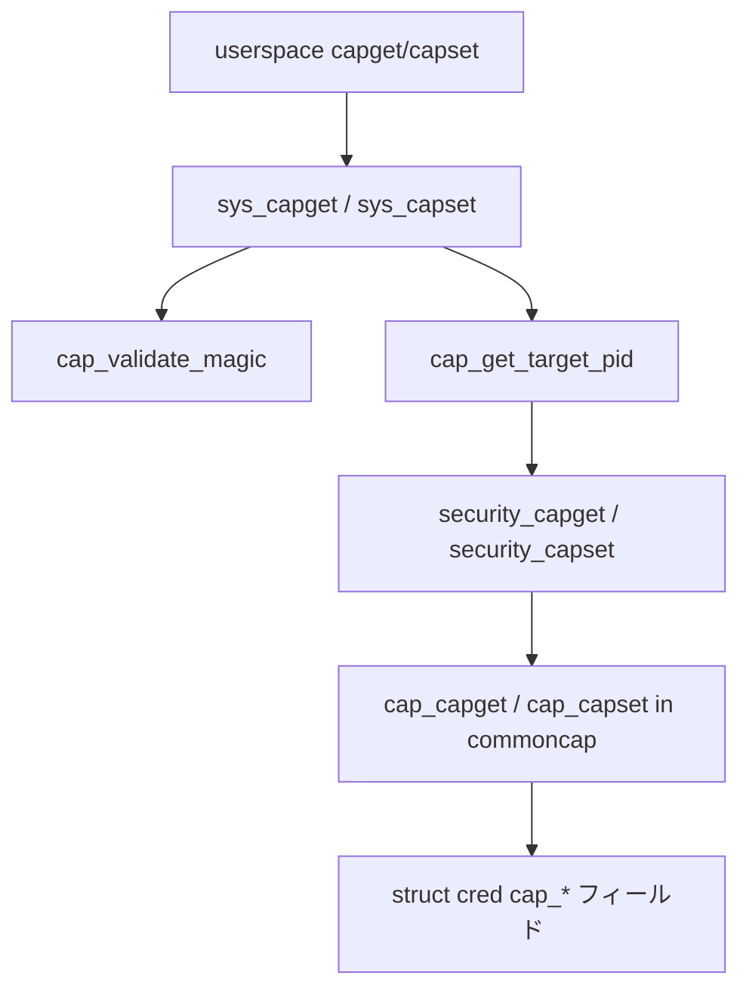

# 第8章 capability ビットマップと `capget`/`capset`

> **本章で読むソース**
>
> - [`include/linux/capability.h` L24](https://github.com/gregkh/linux/blob/v6.18.38/include/linux/capability.h#L24)
> - [`include/linux/capability.h` L66-L75](https://github.com/gregkh/linux/blob/v6.18.38/include/linux/capability.h#L66-L75)
> - [`include/linux/capability.h` L112-L115](https://github.com/gregkh/linux/blob/v6.18.38/include/linux/capability.h#L112-L115)
> - [`include/uapi/linux/capability.h` L40-L49](https://github.com/gregkh/linux/blob/v6.18.38/include/uapi/linux/capability.h#L40-L49)
> - [`kernel/capability.c` L71-L96](https://github.com/gregkh/linux/blob/v6.18.38/kernel/capability.c#L71-L96)
> - [`kernel/capability.c` L105-L126](https://github.com/gregkh/linux/blob/v6.18.38/kernel/capability.c#L105-L126)
> - [`kernel/capability.c` L137-L191](https://github.com/gregkh/linux/blob/v6.18.38/kernel/capability.c#L137-L191)
> - [`kernel/capability.c` L216-L263](https://github.com/gregkh/linux/blob/v6.18.38/kernel/capability.c#L216-L263)
> - [`security/security.c` L1166-L1172](https://github.com/gregkh/linux/blob/v6.18.38/security/security.c#L1166-L1172)
> - [`security/security.c` L1187-L1194](https://github.com/gregkh/linux/blob/v6.18.38/security/security.c#L1187-L1194)
> - [`security/commoncap.c` L230-L243](https://github.com/gregkh/linux/blob/v6.18.38/security/commoncap.c#L230-L243)
> - [`security/commoncap.c` L272-L313](https://github.com/gregkh/linux/blob/v6.18.38/security/commoncap.c#L272-L313)
> - [`security/commoncap.c` L1298-L1301](https://github.com/gregkh/linux/blob/v6.18.38/security/commoncap.c#L1298-L1301)
> - [`security/commoncap.c` L1389-L1424](https://github.com/gregkh/linux/blob/v6.18.38/security/commoncap.c#L1389-L1424)
> - [`include/linux/cred.h` L166-L171](https://github.com/gregkh/linux/blob/v6.18.38/include/linux/cred.h#L166-L171)

## この章の狙い

`kernel_cap_t` による 64 ビット capability ビットマップと、ユーザー空間向け `capget`/`capset` システムコールの経路を読む。
`cap_bset`（bounding set）と `cap_ambient` の更新規則も `commoncap` 側の LSM フックから追う。

## 前提

- [第2章：`cred` と権限判定の入口](../part00-foundation/02-cred-capable-entry.md)
- [第7章：主要 LSM の概観と SELinux カーネル接続点](../part01-lsm/07-lsm-implementations-selinux-bridge.md)

## kernel_cap_t：カーネル内ビットマップ

カーネルは capability セットを `u64` 一つで表す `kernel_cap_t` を使う。
ユーザー空間の v1/v2/v3 形式とは別レイヤである。

[`include/linux/capability.h` L24](https://github.com/gregkh/linux/blob/v6.18.38/include/linux/capability.h#L24)

```c
typedef struct { u64 val; } kernel_cap_t;
```

ビット操作マクロと集合演算はすべて `.val` に対するインライン関数として定義される。

[`include/linux/capability.h` L66-L75](https://github.com/gregkh/linux/blob/v6.18.38/include/linux/capability.h#L66-L75)

```c
# define CAP_EMPTY_SET    ((kernel_cap_t) { 0 })
# define CAP_FULL_SET     ((kernel_cap_t) { CAP_VALID_MASK })
# define CAP_FS_SET       ((kernel_cap_t) { CAP_FS_MASK | BIT_ULL(CAP_LINUX_IMMUTABLE) })
# define CAP_NFSD_SET     ((kernel_cap_t) { CAP_FS_MASK | BIT_ULL(CAP_SYS_RESOURCE) })

# define cap_clear(c)         do { (c).val = 0; } while (0)

#define cap_raise(c, flag)  ((c).val |= BIT_ULL(flag))
#define cap_lower(c, flag)  ((c).val &= ~BIT_ULL(flag))
#define cap_raised(c, flag) (((c).val & BIT_ULL(flag)) != 0)
```

部分集合判定は `cap_issubset` で行い、`capset` の検証にも使われる。

[`include/linux/capability.h` L112-L115](https://github.com/gregkh/linux/blob/v6.18.38/include/linux/capability.h#L112-L115)

```c
static inline bool cap_issubset(const kernel_cap_t a, const kernel_cap_t set)
{
	return !(a.val & ~set.val);
}
```

## ユーザー空間 ABI

`capget`/`capset` はヘッダ（version と pid）とデータ（effective/permitted/inheritable の 32 ビット×2 配列）を受け取る。
v3 が現行で、v1/v2 は互換のため残る。

[`include/uapi/linux/capability.h` L40-L49](https://github.com/gregkh/linux/blob/v6.18.38/include/uapi/linux/capability.h#L40-L49)

```c
typedef struct __user_cap_header_struct {
	__u32 version;
	int pid;
} __user *cap_user_header_t;

struct __user_cap_data_struct {
        __u32 effective;
        __u32 permitted;
        __u32 inheritable;
};
```

## cap_validate_magic：バージョン検査

システムコール入口ではまずヘッダの `version` を検査し、コピーする u32 個数 `tocopy` を決める。
未知のバージョンにはカーネル側バージョンを書き戻して `-EINVAL` を返す。

[`kernel/capability.c` L71-L96](https://github.com/gregkh/linux/blob/v6.18.38/kernel/capability.c#L71-L96)

```c
static int cap_validate_magic(cap_user_header_t header, unsigned *tocopy)
{
	__u32 version;

	if (get_user(version, &header->version))
		return -EFAULT;

	switch (version) {
	case _LINUX_CAPABILITY_VERSION_1:
		warn_legacy_capability_use();
		*tocopy = _LINUX_CAPABILITY_U32S_1;
		break;
	case _LINUX_CAPABILITY_VERSION_2:
		warn_deprecated_v2();
		fallthrough;	/* v3 is otherwise equivalent to v2 */
	case _LINUX_CAPABILITY_VERSION_3:
		*tocopy = _LINUX_CAPABILITY_U32S_3;
		break;
	default:
		if (put_user((u32)_KERNEL_CAPABILITY_VERSION, &header->version))
			return -EFAULT;
		return -EINVAL;
	}

	return 0;
}
```

## cap_get_target_pid と security_capget

`cap_get_target_pid` は他プロセス参照時だけ外側で `rcu_read_lock` し `find_task_by_vpid` で `task_struct` を固定する。
自プロセス（pid 0 または自 pid）はその RCU 区間を省略して `security_capget(current, ...)` を直呼びする。

[`kernel/capability.c` L105-L126](https://github.com/gregkh/linux/blob/v6.18.38/kernel/capability.c#L105-L126)

```c
static inline int cap_get_target_pid(pid_t pid, kernel_cap_t *pEp,
				     kernel_cap_t *pIp, kernel_cap_t *pPp)
{
	int ret;

	if (pid && (pid != task_pid_vnr(current))) {
		const struct task_struct *target;

		rcu_read_lock();

		target = find_task_by_vpid(pid);
		if (!target)
			ret = -ESRCH;
		else
			ret = security_capget(target, pEp, pIp, pPp);

		rcu_read_unlock();
	} else
		ret = security_capget(current, pEp, pIp, pPp);

	return ret;
}
```

## sys_capget：カーネルセットからユーザー形式へ

`security_capget` で得た `kernel_cap_t` 三種を、レガシー互換の 32 ビット×2 配列へ分割して `copy_to_user` する。
`tocopy` が小さい古い libcap では上位ビットを黙って落とす（意図的なフェイルセーフ）。

[`kernel/capability.c` L137-L191](https://github.com/gregkh/linux/blob/v6.18.38/kernel/capability.c#L137-L191)

```c
SYSCALL_DEFINE2(capget, cap_user_header_t, header, cap_user_data_t, dataptr)
{
	int ret = 0;
	pid_t pid;
	unsigned tocopy;
	kernel_cap_t pE, pI, pP;
	struct __user_cap_data_struct kdata[2];

	ret = cap_validate_magic(header, &tocopy);
	if ((dataptr == NULL) || (ret != 0))
		return ((dataptr == NULL) && (ret == -EINVAL)) ? 0 : ret;

	if (get_user(pid, &header->pid))
		return -EFAULT;

	if (pid < 0)
		return -EINVAL;

	ret = cap_get_target_pid(pid, &pE, &pI, &pP);
	if (ret)
		return ret;

	/*
	 * Annoying legacy format with 64-bit capabilities exposed
	 * as two sets of 32-bit fields, so we need to split the
	 * capability values up.
	 */
	kdata[0].effective   = pE.val; kdata[1].effective   = pE.val >> 32;
	kdata[0].permitted   = pP.val; kdata[1].permitted   = pP.val >> 32;
	kdata[0].inheritable = pI.val; kdata[1].inheritable = pI.val >> 32;

	/*
	 * Note, in the case, tocopy < _KERNEL_CAPABILITY_U32S,
	 * we silently drop the upper capabilities here. This
	 * has the effect of making older libcap
	 * implementations implicitly drop upper capability
	 * bits when they perform a: capget/modify/capset
	 * sequence.
	 *
	 * This behavior is considered fail-safe
	 * behavior. Upgrading the application to a newer
	 * version of libcap will enable access to the newer
	 * capabilities.
	 *
	 * An alternative would be to return an error here
	 * (-ERANGE), but that causes legacy applications to
	 * unexpectedly fail; the capget/modify/capset aborts
	 * before modification is attempted and the application
	 * fails.
	 */
	if (copy_to_user(dataptr, kdata, tocopy * sizeof(kdata[0])))
		return -EFAULT;

	return 0;
}
```

## sys_capset：自プロセスのみ変更可能

`capset` は pid が 0 または自 pid のときだけ受理する（他プロセスへの一括変更は廃止済み）。
`prepare_creds` で新 `cred` を組み、`security_capset` が検証に通れば `commit_creds` で公開する。

[`kernel/capability.c` L216-L263](https://github.com/gregkh/linux/blob/v6.18.38/kernel/capability.c#L216-L263)

```c
SYSCALL_DEFINE2(capset, cap_user_header_t, header, const cap_user_data_t, data)
{
	struct __user_cap_data_struct kdata[2] = { { 0, }, };
	unsigned tocopy, copybytes;
	kernel_cap_t inheritable, permitted, effective;
	struct cred *new;
	int ret;
	pid_t pid;

	ret = cap_validate_magic(header, &tocopy);
	if (ret != 0)
		return ret;

	if (get_user(pid, &header->pid))
		return -EFAULT;

	/* may only affect current now */
	if (pid != 0 && pid != task_pid_vnr(current))
		return -EPERM;

	copybytes = tocopy * sizeof(struct __user_cap_data_struct);
	if (copybytes > sizeof(kdata))
		return -EFAULT;

	if (copy_from_user(&kdata, data, copybytes))
		return -EFAULT;

	effective   = mk_kernel_cap(kdata[0].effective,   kdata[1].effective);
	permitted   = mk_kernel_cap(kdata[0].permitted,   kdata[1].permitted);
	inheritable = mk_kernel_cap(kdata[0].inheritable, kdata[1].inheritable);

	new = prepare_creds();
	if (!new)
		return -ENOMEM;

	ret = security_capset(new, current_cred(),
			      &effective, &inheritable, &permitted);
	if (ret < 0)
		goto error;

	audit_log_capset(new, current_cred());

	return commit_creds(new);

error:
	abort_creds(new);
	return ret;
}
```

## security_capget / security_capset ラッパ

LSM フレームワークは `call_int_hook` で登録済み `capget`/`capset` フックを順に呼ぶ。
capability LSM（commoncap）が実体を提供する。

[`security/security.c` L1166-L1172](https://github.com/gregkh/linux/blob/v6.18.38/security/security.c#L1166-L1172)

```c
int security_capget(const struct task_struct *target,
		    kernel_cap_t *effective,
		    kernel_cap_t *inheritable,
		    kernel_cap_t *permitted)
{
	return call_int_hook(capget, target, effective, inheritable, permitted);
}
```

[`security/security.c` L1187-L1194](https://github.com/gregkh/linux/blob/v6.18.38/security/security.c#L1187-L1194)

```c
int security_capset(struct cred *new, const struct cred *old,
		    const kernel_cap_t *effective,
		    const kernel_cap_t *inheritable,
		    const kernel_cap_t *permitted)
{
	return call_int_hook(capset, new, old, effective, inheritable,
			     permitted);
}
```

## cap_capget：cred からの読み出し

commoncap の `cap_capget` は対象が current か他タスクかに関わらず `rcu_read_lock` を取り、`__task_cred` から三集合をコピーする。
他タスク閲覧の可否は将来の LSM 拡張余地としてフックに残されている。

[`security/commoncap.c` L230-L243](https://github.com/gregkh/linux/blob/v6.18.38/security/commoncap.c#L230-L243)

```c
int cap_capget(const struct task_struct *target, kernel_cap_t *effective,
	       kernel_cap_t *inheritable, kernel_cap_t *permitted)
{
	const struct cred *cred;

	/* Derived from kernel/capability.c:sys_capget. */
	rcu_read_lock();
	cred = __task_cred(target);
	*effective   = cred->cap_effective;
	*inheritable = cred->cap_inheritable;
	*permitted   = cred->cap_permitted;
	rcu_read_unlock();
	return 0;
}
```

## cap_capset：bounding set と ambient の整合

`cap_capset` は I/P/E の包含関係を検証し、成功時は `new->cap_*` へ書き込む。
`cap_bset` は inheritable の上限として働き、ambient は permitted と inheritable の交差に切り詰められる。

[`security/commoncap.c` L272-L313](https://github.com/gregkh/linux/blob/v6.18.38/security/commoncap.c#L272-L313)

```c
int cap_capset(struct cred *new,
	       const struct cred *old,
	       const kernel_cap_t *effective,
	       const kernel_cap_t *inheritable,
	       const kernel_cap_t *permitted)
{
	if (cap_inh_is_capped() &&
	    !cap_issubset(*inheritable,
			  cap_combine(old->cap_inheritable,
				      old->cap_permitted)))
		/* incapable of using this inheritable set */
		return -EPERM;

	if (!cap_issubset(*inheritable,
			  cap_combine(old->cap_inheritable,
				      old->cap_bset)))
		/* no new pI capabilities outside bounding set */
		return -EPERM;

	/* verify restrictions on target's new Permitted set */
	if (!cap_issubset(*permitted, old->cap_permitted))
		return -EPERM;

	/* verify the _new_Effective_ is a subset of the _new_Permitted_ */
	if (!cap_issubset(*effective, *permitted))
		return -EPERM;

	new->cap_effective   = *effective;
	new->cap_inheritable = *inheritable;
	new->cap_permitted   = *permitted;

	/*
	 * Mask off ambient bits that are no longer both permitted and
	 * inheritable.
	 */
	new->cap_ambient = cap_intersect(new->cap_ambient,
					 cap_intersect(*permitted,
						       *inheritable));
	if (WARN_ON(!cap_ambient_invariant_ok(new)))
		return -EINVAL;
	return 0;
}
```

ambient の不変条件は `cap_ambient_invariant_ok` で表される。

[`include/linux/cred.h` L166-L171](https://github.com/gregkh/linux/blob/v6.18.38/include/linux/cred.h#L166-L171)

```c
static inline bool cap_ambient_invariant_ok(const struct cred *cred)
{
	return cap_issubset(cred->cap_ambient,
			    cap_intersect(cred->cap_permitted,
					  cred->cap_inheritable));
}
```

## cap_bset と prctl

bounding set の読み書きは `cap_task_prctl` が担う。
`PR_CAPBSET_READ` はビットの有無を返し、`PR_CAPBSET_DROP` は `cap_prctl_drop` で `cap_bset` からビットを落とす。

[`security/commoncap.c` L1298-L1301](https://github.com/gregkh/linux/blob/v6.18.38/security/commoncap.c#L1298-L1301)

```c
	case PR_CAPBSET_READ:
		if (!cap_valid(arg2))
			return -EINVAL;
		return !!cap_raised(old->cap_bset, arg2);
```

ambient capability は `PR_CAP_AMBIENT` で raise/lower/clear する。
raise には permitted と inheritable の両方にビットがあり、`SECURE_NO_CAP_AMBIENT_RAISE` が立っていないことが条件である。

[`security/commoncap.c` L1389-L1424](https://github.com/gregkh/linux/blob/v6.18.38/security/commoncap.c#L1389-L1424)

```c
	case PR_CAP_AMBIENT:
		if (arg2 == PR_CAP_AMBIENT_CLEAR_ALL) {
			if (arg3 | arg4 | arg5)
				return -EINVAL;

			new = prepare_creds();
			if (!new)
				return -ENOMEM;
			cap_clear(new->cap_ambient);
			return commit_creds(new);
		}

		if (((!cap_valid(arg3)) | arg4 | arg5))
			return -EINVAL;

		if (arg2 == PR_CAP_AMBIENT_IS_SET) {
			return !!cap_raised(current_cred()->cap_ambient, arg3);
		} else if (arg2 != PR_CAP_AMBIENT_RAISE &&
			   arg2 != PR_CAP_AMBIENT_LOWER) {
			return -EINVAL;
		} else {
			if (arg2 == PR_CAP_AMBIENT_RAISE &&
			    (!cap_raised(current_cred()->cap_permitted, arg3) ||
			     !cap_raised(current_cred()->cap_inheritable,
					 arg3) ||
			     issecure(SECURE_NO_CAP_AMBIENT_RAISE)))
				return -EPERM;

			new = prepare_creds();
			if (!new)
				return -ENOMEM;
			if (arg2 == PR_CAP_AMBIENT_RAISE)
				cap_raise(new->cap_ambient, arg3);
			else
				cap_lower(new->cap_ambient, arg3);
			return commit_creds(new);
		}
```

## capget/capset 経路



## 高速化と最適化の工夫

`kernel_cap_t` を単一 `u64` にまとめることで、集合演算がワード単位のビット演算に収まる。
`cap_get_target_pid` の最適化は自プロセス経路で外側の RCU 区間を省略する点に限定される（`cap_capget` 内の RCU は省略しない）。
`cap_capable_helper` 側の `likely(ns == cred_ns)`（第2章）は user namespace 階層を辿るコストを典型ケースで抑える。

## まとめ

カーネル内では `kernel_cap_t` の三集合（permitted/inheritable/effective）に bounding set と ambient が加わる。
`capget`/`capset` はユーザー ABI と `kernel_cap_t` の橋渡しを `kernel/capability.c` が担い、実体の読み書きと検証は commoncap の LSM フックへ委ねる。
`cap_bset` は inheritable の上限、`cap_ambient` は exec 後も残す補助集合として別経路（prctl）で管理される。

## 関連する章

- [`commoncap` と VFS file capabilities](09-commoncap-file-caps.md)
- [第2章：`cred` と権限判定の入口](../part00-foundation/02-cred-capable-entry.md)
