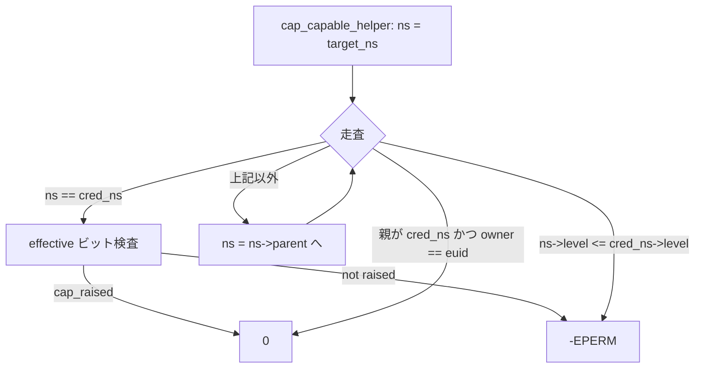
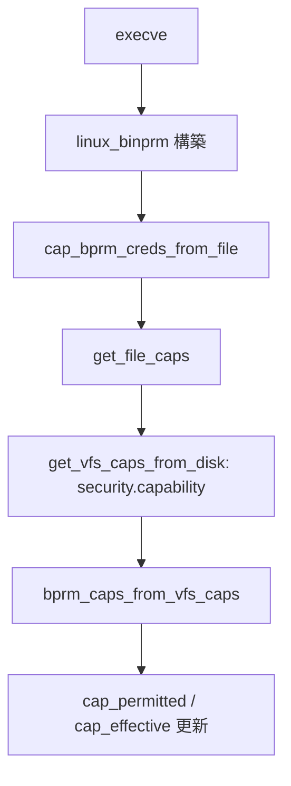

# 第10章 `commoncap` と VFS file capabilities

> **本章で読むソース**
>
> - [`include/linux/capability.h` L27-L32](https://github.com/gregkh/linux/blob/v6.18.38/include/linux/capability.h#L27-L32)
> - [`include/uapi/linux/xattr.h` L83-L84](https://github.com/gregkh/linux/blob/v6.18.38/include/uapi/linux/xattr.h#L83-L84)
> - [`security/commoncap.c` L68-L106](https://github.com/gregkh/linux/blob/v6.18.38/security/commoncap.c#L68-L106)
> - [`security/commoncap.c` L124-L132](https://github.com/gregkh/linux/blob/v6.18.38/security/commoncap.c#L124-L132)
> - [`security/commoncap.c` L616-L648](https://github.com/gregkh/linux/blob/v6.18.38/security/commoncap.c#L616-L648)
> - [`security/commoncap.c` L753-L793](https://github.com/gregkh/linux/blob/v6.18.38/security/commoncap.c#L753-L793)
> - [`security/commoncap.c` L665-L688](https://github.com/gregkh/linux/blob/v6.18.38/security/commoncap.c#L665-L688)
> - [`security/commoncap.c` L909-L974](https://github.com/gregkh/linux/blob/v6.18.38/security/commoncap.c#L909-L974)
> - [`security/commoncap.c` L410-L436](https://github.com/gregkh/linux/blob/v6.18.38/security/commoncap.c#L410-L436)
> - [`security/commoncap.c` L1480-L1491](https://github.com/gregkh/linux/blob/v6.18.38/security/commoncap.c#L1480-L1491)

## この章の狙い

`security/commoncap.c` が capability LSM として担う **file capabilities** と **`cap_capable`** の実装を読む。
実行ファイルの `security.capability` xattr から `execve` 時の `cred` 更新まで、VFS と LSM フックの接続を追う。

## 前提

- [第9章：capability ビットマップと `capget`/`capset`](09-capability-bitmap-syscalls.md)
- [第2章：`cred` と権限判定の入口](../part00-foundation/02-cred-capable-entry.md)

## cpu_vfs_cap_data と xattr 名

ディスク上の xattr は endian 付き `vfs_cap_data` だが、カーネル内部では CPU endian の `cpu_vfs_cap_data` に正規化する。
xattr 名は `security.capability` である。

[`include/linux/capability.h` L27-L32](https://github.com/gregkh/linux/blob/v6.18.38/include/linux/capability.h#L27-L32)

```c
struct cpu_vfs_cap_data {
	__u32 magic_etc;
	kuid_t rootid;
	kernel_cap_t permitted;
	kernel_cap_t inheritable;
};
```

[`include/uapi/linux/xattr.h` L83-L84](https://github.com/gregkh/linux/blob/v6.18.38/include/uapi/linux/xattr.h#L83-L84)

```c
#define XATTR_CAPS_SUFFIX "capability"
#define XATTR_NAME_CAPS XATTR_SECURITY_PREFIX XATTR_CAPS_SUFFIX
```

## cap_capable：effective セットの判定

`cap_capable` は `cap_capable_helper` で target user namespace から親へ辿り、各段階で capability を判定する。
`cred_ns` に到達したら effective ビットを検査し、階層が到達不能なら `-EPERM`、子 namespace の owner なら effective 検査なしで許可する。

[`security/commoncap.c` L68-L106](https://github.com/gregkh/linux/blob/v6.18.38/security/commoncap.c#L68-L106)

```c
static inline int cap_capable_helper(const struct cred *cred,
				     struct user_namespace *target_ns,
				     const struct user_namespace *cred_ns,
				     int cap)
{
	struct user_namespace *ns = target_ns;

	/* See if cred has the capability in the target user namespace
	 * by examining the target user namespace and all of the target
	 * user namespace's parents.
	 */
	for (;;) {
		/* Do we have the necessary capabilities? */
		if (likely(ns == cred_ns))
			return cap_raised(cred->cap_effective, cap) ? 0 : -EPERM;

		/*
		 * If we're already at a lower level than we're looking for,
		 * we're done searching.
		 */
		if (ns->level <= cred_ns->level)
			return -EPERM;

		/* 
		 * The owner of the user namespace in the parent of the
		 * user namespace has all caps.
		 */
		if ((ns->parent == cred_ns) && uid_eq(ns->owner, cred->euid))
			return 0;

		/*
		 * If you have a capability in a parent user ns, then you have
		 * it over all children user namespaces as well.
		 */
		ns = ns->parent;
	}

	/* We never get here */
}
```

[`security/commoncap.c` L124-L132](https://github.com/gregkh/linux/blob/v6.18.38/security/commoncap.c#L124-L132)

```c
int cap_capable(const struct cred *cred, struct user_namespace *target_ns,
		int cap, unsigned int opts)
{
	const struct user_namespace *cred_ns = cred->user_ns;
	int ret = cap_capable_helper(cred, target_ns, cred_ns, cap);

	trace_cap_capable(cred, target_ns, cred_ns, cap, ret);
	return ret;
}
```



## ディスクから xattr を読む

`get_vfs_caps_from_disk` は dentry 経由で `XATTR_NAME_CAPS` を取得し、`cpu_vfs_cap_data` へ展開する。
データが無ければ `-ENODATA` で呼び出し元が「file cap なし」として続行する。

[`security/commoncap.c` L665-L688](https://github.com/gregkh/linux/blob/v6.18.38/security/commoncap.c#L665-L688)

```c
int get_vfs_caps_from_disk(struct mnt_idmap *idmap,
			   const struct dentry *dentry,
			   struct cpu_vfs_cap_data *cpu_caps)
{
	struct inode *inode = d_backing_inode(dentry);
	__u32 magic_etc;
	int size;
	struct vfs_ns_cap_data data, *nscaps = &data;
	struct vfs_cap_data *caps = (struct vfs_cap_data *) &data;
	kuid_t rootkuid;
	vfsuid_t rootvfsuid;
	struct user_namespace *fs_ns;

	memset(cpu_caps, 0, sizeof(struct cpu_vfs_cap_data));

	if (!inode)
		return -ENODATA;

	fs_ns = inode->i_sb->s_user_ns;
	size = __vfs_getxattr((struct dentry *)dentry, inode,
			      XATTR_NAME_CAPS, &data, XATTR_CAPS_SZ);
	if (size == -ENODATA || size == -EOPNOTSUPP)
		/* no data, that's ok */
		return -ENODATA;
```

## get_file_caps：exec 前の取得と制限

`get_file_caps` は `mnt_may_suid` と user namespace 所属を確認したうえでディスクから cap を読む。
`file_caps_enabled`（`no_file_caps` ブートオプションで無効化可）が 0 なら即 return する。

[`security/commoncap.c` L753-L793](https://github.com/gregkh/linux/blob/v6.18.38/security/commoncap.c#L753-L793)

```c
static int get_file_caps(struct linux_binprm *bprm, const struct file *file,
			 bool *effective, bool *has_fcap)
{
	int rc = 0;
	struct cpu_vfs_cap_data vcaps;

	cap_clear(bprm->cred->cap_permitted);

	if (!file_caps_enabled)
		return 0;

	if (!mnt_may_suid(file->f_path.mnt))
		return 0;

	/*
	 * This check is redundant with mnt_may_suid() but is kept to make
	 * explicit that capability bits are limited to s_user_ns and its
	 * descendants.
	 */
	if (!current_in_userns(file->f_path.mnt->mnt_sb->s_user_ns))
		return 0;

	rc = get_vfs_caps_from_disk(file_mnt_idmap(file),
				    file->f_path.dentry, &vcaps);
	if (rc < 0) {
		if (rc == -EINVAL)
			printk(KERN_NOTICE "Invalid argument reading file caps for %s\n",
					bprm->filename);
		else if (rc == -ENODATA)
			rc = 0;
		goto out;
	}

	rc = bprm_caps_from_vfs_caps(&vcaps, bprm, effective, has_fcap);

out:
	if (rc)
		cap_clear(bprm->cred->cap_permitted);

	return rc;
}
```

## bprm_caps_from_vfs_caps：pP' の計算

file cap の permitted/inheritable を、プロセスの bounding set と inheritable へマージする。
`VFS_CAP_FLAGS_EFFECTIVE` が立っていれば実行後 effective へ昇格する。

[`security/commoncap.c` L616-L648](https://github.com/gregkh/linux/blob/v6.18.38/security/commoncap.c#L616-L648)

```c
static inline int bprm_caps_from_vfs_caps(struct cpu_vfs_cap_data *caps,
					  struct linux_binprm *bprm,
					  bool *effective,
					  bool *has_fcap)
{
	struct cred *new = bprm->cred;
	int ret = 0;

	if (caps->magic_etc & VFS_CAP_FLAGS_EFFECTIVE)
		*effective = true;

	if (caps->magic_etc & VFS_CAP_REVISION_MASK)
		*has_fcap = true;

	/*
	 * pP' = (X & fP) | (pI & fI)
	 * The addition of pA' is handled later.
	 */
	new->cap_permitted.val =
		(new->cap_bset.val & caps->permitted.val) |
		(new->cap_inheritable.val & caps->inheritable.val);

	if (caps->permitted.val & ~new->cap_permitted.val)
		/* insufficient to execute correctly */
		ret = -EPERM;

	/*
	 * For legacy apps, with no internal support for recognizing they
	 * do not have enough capabilities, we return an error if they are
	 * missing some "forced" (aka file-permitted) capabilities.
	 */
	return *effective ? ret : 0;
}
```

## cap_bprm_creds_from_file：execve 時の cred 更新

`bprm_creds_from_file` フックの実体が `cap_bprm_creds_from_file` である。
file cap または setid 変化時は ambient をクリアし、effective セットを再計算する。

[`security/commoncap.c` L909-L974](https://github.com/gregkh/linux/blob/v6.18.38/security/commoncap.c#L909-L974)

```c
int cap_bprm_creds_from_file(struct linux_binprm *bprm, const struct file *file)
{
	/* Process setpcap binaries and capabilities for uid 0 */
	const struct cred *old = current_cred();
	struct cred *new = bprm->cred;
	bool effective = false, has_fcap = false, id_changed;
	int ret;
	kuid_t root_uid;

	if (WARN_ON(!cap_ambient_invariant_ok(old)))
		return -EPERM;

	ret = get_file_caps(bprm, file, &effective, &has_fcap);
	if (ret < 0)
		return ret;

	root_uid = make_kuid(new->user_ns, 0);

	handle_privileged_root(bprm, has_fcap, &effective, root_uid);

	/* if we have fs caps, clear dangerous personality flags */
	if (__cap_gained(permitted, new, old))
		bprm->per_clear |= PER_CLEAR_ON_SETID;

	/* Don't let someone trace a set[ug]id/setpcap binary with the revised
	 * credentials unless they have the appropriate permit.
	 *
	 * In addition, if NO_NEW_PRIVS, then ensure we get no new privs.
	 */
	id_changed = !uid_eq(new->euid, old->euid) || !in_group_p(new->egid);

	if ((id_changed || __cap_gained(permitted, new, old)) &&
	    ((bprm->unsafe & ~LSM_UNSAFE_PTRACE) ||
	     !ptracer_capable(current, new->user_ns))) {
		/* downgrade; they get no more than they had, and maybe less */
		if (!ns_capable(new->user_ns, CAP_SETUID) ||
		    (bprm->unsafe & LSM_UNSAFE_NO_NEW_PRIVS)) {
			new->euid = new->uid;
			new->egid = new->gid;
		}
		new->cap_permitted = cap_intersect(new->cap_permitted,
						   old->cap_permitted);
	}

	new->suid = new->fsuid = new->euid;
	new->sgid = new->fsgid = new->egid;

	/* File caps or setid cancels ambient. */
	if (has_fcap || id_changed)
		cap_clear(new->cap_ambient);

	/*
	 * Now that we've computed pA', update pP' to give:
	 *   pP' = (X & fP) | (pI & fI) | pA'
	 */
	new->cap_permitted = cap_combine(new->cap_permitted, new->cap_ambient);

	/*
	 * Set pE' = (fE ? pP' : pA').  Because pA' is zero if fE is set,
	 * this is the same as pE' = (fE ? pP' : 0) | pA'.
	 */
	if (effective)
		new->cap_effective = new->cap_permitted;
	else
		new->cap_effective = new->cap_ambient;
```

## cap_inode_getsecurity：LSM 経由の xattr 読み出し

`security_inode_getsecurity` は LSM の `inode_getsecurity` フックを呼び、SELinux の `security.selinux` とは別に `capability` 名を commoncap が処理する。
v2/v3 形式の判定と user namespace 向けの rootid 変換をここで行う。

[`security/commoncap.c` L410-L436](https://github.com/gregkh/linux/blob/v6.18.38/security/commoncap.c#L410-L436)

```c
int cap_inode_getsecurity(struct mnt_idmap *idmap,
			  struct inode *inode, const char *name, void **buffer,
			  bool alloc)
{
	int size;
	kuid_t kroot;
	vfsuid_t vfsroot;
	u32 nsmagic, magic;
	uid_t root, mappedroot;
	char *tmpbuf = NULL;
	struct vfs_cap_data *cap;
	struct vfs_ns_cap_data *nscap = NULL;
	struct dentry *dentry;
	struct user_namespace *fs_ns;

	if (strcmp(name, "capability") != 0)
		return -EOPNOTSUPP;

	dentry = d_find_any_alias(inode);
	if (!dentry)
		return -EINVAL;
	size = vfs_getxattr_alloc(idmap, dentry, XATTR_NAME_CAPS, &tmpbuf,
				  sizeof(struct vfs_ns_cap_data), GFP_NOFS);
	dput(dentry);
	/* gcc11 complains if we don't check for !tmpbuf */
	if (size < 0 || !tmpbuf)
		goto out_free;
```

## capability_hooks：フック一覧

file cap 関連は `bprm_creds_from_file` と `inode_getsecurity` が担い、`capable` は全経路の基盤となる。

[`security/commoncap.c` L1480-L1491](https://github.com/gregkh/linux/blob/v6.18.38/security/commoncap.c#L1480-L1491)

```c
static struct security_hook_list capability_hooks[] __ro_after_init = {
	LSM_HOOK_INIT(capable, cap_capable),
	LSM_HOOK_INIT(settime, cap_settime),
	LSM_HOOK_INIT(ptrace_access_check, cap_ptrace_access_check),
	LSM_HOOK_INIT(ptrace_traceme, cap_ptrace_traceme),
	LSM_HOOK_INIT(capget, cap_capget),
	LSM_HOOK_INIT(capset, cap_capset),
	LSM_HOOK_INIT(bprm_creds_from_file, cap_bprm_creds_from_file),
	LSM_HOOK_INIT(inode_need_killpriv, cap_inode_need_killpriv),
	LSM_HOOK_INIT(inode_killpriv, cap_inode_killpriv),
	LSM_HOOK_INIT(inode_getsecurity, cap_inode_getsecurity),
	LSM_HOOK_INIT(mmap_addr, cap_mmap_addr),
```

## file capability 適用の流れ



## 高速化と最適化の工夫

`cap_capable_helper` の `likely(ns == cred_ns)` は、同一 user namespace 内の capability 照会（最頻）で親 ns 走査を省略する。
`get_file_caps` は `mnt_may_suid` で nosuid マウントを早期に弾き、不要な xattr I/O を避ける。
`capability_hooks[]` を `__ro_after_init` に置くことで、登録後のフック表を読み取り専用化する。

## まとめ

file capabilities は `security.capability` xattr に格納され、exec 時に `get_file_caps` 経由で `cred` へ反映される。
bounding set は file permitted の上限、ambient は file cap または setid 変化時にクリアされる。
`cap_capable` は effective ビットと user namespace 階層で POSIX capability 判定の本体を提供する。

## 関連する章

- [第9章：capability ビットマップと `capget`/`capset`](09-capability-bitmap-syscalls.md)
- [seccomp モードとフィルタチェーン](../part03-seccomp/11-seccomp-modes-filter-chain.md)
