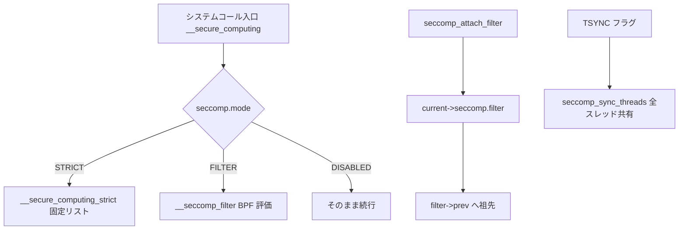

# 第10章 seccomp モードとフィルタチェーン

> **本章で読むソース**
>
> - [`include/uapi/linux/seccomp.h` L9-L12](https://github.com/gregkh/linux/blob/v6.18.38/include/uapi/linux/seccomp.h#L9-L12)
> - [`include/uapi/linux/seccomp.h` L15-L18](https://github.com/gregkh/linux/blob/v6.18.38/include/uapi/linux/seccomp.h#L15-L18)
> - [`include/uapi/linux/seccomp.h` L21-L27](https://github.com/gregkh/linux/blob/v6.18.38/include/uapi/linux/seccomp.h#L21-L27)
> - [`kernel/seccomp.c` L214-L235](https://github.com/gregkh/linux/blob/v6.18.38/kernel/seccomp.c#L214-L235)
> - [`kernel/seccomp.c` L488-L521](https://github.com/gregkh/linux/blob/v6.18.38/kernel/seccomp.c#L488-L521)
> - [`kernel/seccomp.c` L598-L640](https://github.com/gregkh/linux/blob/v6.18.38/kernel/seccomp.c#L598-L640)
> - [`kernel/seccomp.c` L921-L970](https://github.com/gregkh/linux/blob/v6.18.38/kernel/seccomp.c#L921-L970)
> - [`kernel/seccomp.c` L1067-L1085](https://github.com/gregkh/linux/blob/v6.18.38/kernel/seccomp.c#L1067-L1085)
> - [`kernel/seccomp.c` L1388-L1413](https://github.com/gregkh/linux/blob/v6.18.38/kernel/seccomp.c#L1388-L1413)
> - [`kernel/seccomp.c` L2101-L2129](https://github.com/gregkh/linux/blob/v6.18.38/kernel/seccomp.c#L2101-L2129)
> - [`kernel/seccomp.c` L2139-L2163](https://github.com/gregkh/linux/blob/v6.18.38/kernel/seccomp.c#L2139-L2163)

## この章の狙い

`task_struct->seccomp` の **mode**（DISABLED / STRICT / FILTER）と、BPF フィルタが `prev` ポインタで鎖なる **チェーン** を読む。
`prctl(PR_SET_SECCOMP)` と `seccomp(2)` の入口、`SECCOMP_FILTER_FLAG_TSYNC` によるスレッド同期も押さえる。

## 前提

- [第1章：カーネルセキュリティの層構造と判定経路](../part00-foundation/01-security-layers-overview.md)
- [BPF とトレーシング](../../bpf/README.md) の BPF プログラム基礎（命令セットの一般論は委譲）

## seccomp モード

ユーザー空間から見える mode は三種類である。
DISABLED は無効、STRICT は固定 syscall ホワイトリスト、FILTER はユーザー供給 BPF である。

[`include/uapi/linux/seccomp.h` L9-L12](https://github.com/gregkh/linux/blob/v6.18.38/include/uapi/linux/seccomp.h#L9-L12)

```c
#define SECCOMP_MODE_DISABLED	0 /* seccomp is not in use. */
#define SECCOMP_MODE_STRICT	1 /* uses hard-coded filter. */
#define SECCOMP_MODE_FILTER	2 /* uses user-supplied filter. */
```

`seccomp(2)` は `SECCOMP_SET_MODE_STRICT` と `SECCOMP_SET_MODE_FILTER` を提供する。
`prctl_set_seccomp` は内部で同じ `do_seccomp` へ委譲する。

[`include/uapi/linux/seccomp.h` L15-L18](https://github.com/gregkh/linux/blob/v6.18.38/include/uapi/linux/seccomp.h#L15-L18)

```c
#define SECCOMP_SET_MODE_STRICT		0
#define SECCOMP_SET_MODE_FILTER		1
#define SECCOMP_GET_ACTION_AVAIL	2
#define SECCOMP_GET_NOTIF_SIZES		3
```

## prctl と seccomp システムコール

`do_seccomp` が mode 設定の本体である。
`SYSCALL_DEFINE3(seccomp)` はその薄いラッパである。

[`kernel/seccomp.c` L2101-L2129](https://github.com/gregkh/linux/blob/v6.18.38/kernel/seccomp.c#L2101-L2129)

```c
static long do_seccomp(unsigned int op, unsigned int flags,
		       void __user *uargs)
{
	switch (op) {
	case SECCOMP_SET_MODE_STRICT:
		if (flags != 0 || uargs != NULL)
			return -EINVAL;
		return seccomp_set_mode_strict();
	case SECCOMP_SET_MODE_FILTER:
		return seccomp_set_mode_filter(flags, uargs);
	case SECCOMP_GET_ACTION_AVAIL:
		if (flags != 0)
			return -EINVAL;

		return seccomp_get_action_avail(uargs);
	case SECCOMP_GET_NOTIF_SIZES:
		if (flags != 0)
			return -EINVAL;

		return seccomp_get_notif_sizes(uargs);
	default:
		return -EINVAL;
	}
}

SYSCALL_DEFINE3(seccomp, unsigned int, op, unsigned int, flags,
			 void __user *, uargs)
{
	return do_seccomp(op, flags, uargs);
}
```

`prctl(PR_SET_SECCOMP)` は flags なしで `do_seccomp` を呼ぶ互換経路である。

[`kernel/seccomp.c` L2139-L2163](https://github.com/gregkh/linux/blob/v6.18.38/kernel/seccomp.c#L2139-L2163)

```c
long prctl_set_seccomp(unsigned long seccomp_mode, void __user *filter)
{
	unsigned int op;
	void __user *uargs;

	switch (seccomp_mode) {
	case SECCOMP_MODE_STRICT:
		op = SECCOMP_SET_MODE_STRICT;
		/*
		 * Setting strict mode through prctl always ignored filter,
		 * so make sure it is always NULL here to pass the internal
		 * check in do_seccomp().
		 */
		uargs = NULL;
		break;
	case SECCOMP_MODE_FILTER:
		op = SECCOMP_SET_MODE_FILTER;
		uargs = filter;
		break;
	default:
		return -EINVAL;
	}

	/* prctl interface doesn't have flags, so they are always zero. */
	return do_seccomp(op, 0, uargs);
}
```

一度 mode が非ゼロになると `seccomp_may_assign_mode` により別 mode へ切り替えできない。

## SECCOMP_MODE_STRICT

STRICT モードは `mode1_syscalls` 配列に列挙された syscall だけを許可する。
許可外 syscall では `SECCOMP_MODE_DEAD` に遷移し `SIGKILL` で終了する。

[`kernel/seccomp.c` L1067-L1085](https://github.com/gregkh/linux/blob/v6.18.38/kernel/seccomp.c#L1067-L1085)

```c
static void __secure_computing_strict(int this_syscall)
{
	const int *allowed_syscalls = mode1_syscalls;
#ifdef CONFIG_COMPAT
	if (in_compat_syscall())
		allowed_syscalls = get_compat_mode1_syscalls();
#endif
	do {
		if (*allowed_syscalls == this_syscall)
			return;
	} while (*++allowed_syscalls != -1);

#ifdef SECCOMP_DEBUG
	dump_stack();
#endif
	current->seccomp.mode = SECCOMP_MODE_DEAD;
	seccomp_log(this_syscall, SIGKILL, SECCOMP_RET_KILL_THREAD, true);
	do_exit(SIGKILL);
}
```

システムコール入口の `__secure_computing` は mode に応じて STRICT か FILTER へ分岐する。

[`kernel/seccomp.c` L1388-L1413](https://github.com/gregkh/linux/blob/v6.18.38/kernel/seccomp.c#L1388-L1413)

```c
int __secure_computing(void)
{
	int mode = current->seccomp.mode;
	int this_syscall;

	if (IS_ENABLED(CONFIG_CHECKPOINT_RESTORE) &&
	    unlikely(current->ptrace & PT_SUSPEND_SECCOMP))
		return 0;

	this_syscall = syscall_get_nr(current, current_pt_regs());

	switch (mode) {
	case SECCOMP_MODE_STRICT:
		__secure_computing_strict(this_syscall);  /* may call do_exit */
		return 0;
	case SECCOMP_MODE_FILTER:
		return __seccomp_filter(this_syscall, false);
	/* Surviving SECCOMP_RET_KILL_* must be proactively impossible. */
	case SECCOMP_MODE_DEAD:
		WARN_ON_ONCE(1);
		do_exit(SIGKILL);
		return -1;
	default:
		BUG();
	}
}
```

## struct seccomp_filter と prev チェーン

FILTER モードでは `current->seccomp.filter` がチェーン先頭（最新フィルタ）を指す。
`prev` で親フィルタへ辿り、fork によりツリー状に共有される。

[`kernel/seccomp.c` L214-L235](https://github.com/gregkh/linux/blob/v6.18.38/kernel/seccomp.c#L214-L235)

```c
 * seccomp_filter objects are organized in a tree linked via the @prev
 * pointer.  For any task, it appears to be a singly-linked list starting
 * with current->seccomp.filter, the most recently attached or inherited filter.
 * However, multiple filters may share a @prev node, by way of fork(), which
 * results in a unidirectional tree existing in memory.  This is similar to
 * how namespaces work.
 *
 * seccomp_filter objects should never be modified after being attached
 * to a task_struct (other than @refs).
 */
struct seccomp_filter {
	refcount_t refs;
	refcount_t users;
	bool log;
	bool wait_killable_recv;
	struct action_cache cache;
	struct seccomp_filter *prev;
	struct bpf_prog *prog;
	struct notification *notif;
	struct mutex notify_lock;
	wait_queue_head_t wqh;
};
```

新フィルタ追加時、既存フィルタは `filter->prev` へ繋がれ、参照は落とさない。

[`kernel/seccomp.c` L957-L970](https://github.com/gregkh/linux/blob/v6.18.38/kernel/seccomp.c#L957-L970)

```c
	/*
	 * If there is an existing filter, make it the prev and don't drop its
	 * task reference.
	 */
	filter->prev = current->seccomp.filter;
	seccomp_cache_prepare(filter);
	current->seccomp.filter = filter;
	atomic_inc(&current->seccomp.filter_count);

	/* Now that the new filter is in place, synchronize to all threads. */
	if (flags & SECCOMP_FILTER_FLAG_TSYNC)
		seccomp_sync_threads(flags);

	return 0;
```

## TSYNC：スレッド間フィルタ同期

`SECCOMP_FILTER_FLAG_TSYNC` は同一プロセス内の他スレッドへフィルタツリーを共有する。
事前に `seccomp_can_sync_threads` で全スレッドが同期可能か検証する。

[`include/uapi/linux/seccomp.h` L21-L27](https://github.com/gregkh/linux/blob/v6.18.38/include/uapi/linux/seccomp.h#L21-L27)

```c
#define SECCOMP_FILTER_FLAG_TSYNC		(1UL << 0)
#define SECCOMP_FILTER_FLAG_LOG			(1UL << 1)
#define SECCOMP_FILTER_FLAG_SPEC_ALLOW		(1UL << 2)
#define SECCOMP_FILTER_FLAG_NEW_LISTENER	(1UL << 3)
#define SECCOMP_FILTER_FLAG_TSYNC_ESRCH		(1UL << 4)
/* Received notifications wait in killable state (only respond to fatal signals) */
#define SECCOMP_FILTER_FLAG_WAIT_KILLABLE_RECV	(1UL << 5)
```

同期不能なスレッドがいればその pid を返す（`TSYNC_ESRCH` 指定時は `-ESRCH` に変換）。

[`kernel/seccomp.c` L488-L521](https://github.com/gregkh/linux/blob/v6.18.38/kernel/seccomp.c#L488-L521)

```c
static inline pid_t seccomp_can_sync_threads(void)
{
	struct task_struct *thread, *caller;

	BUG_ON(!mutex_is_locked(&current->signal->cred_guard_mutex));
	assert_spin_locked(&current->sighand->siglock);

	/* Validate all threads being eligible for synchronization. */
	caller = current;
	for_each_thread(caller, thread) {
		pid_t failed;

		/* Skip current, since it is initiating the sync. */
		if (thread == caller)
			continue;
		/* Skip exited threads. */
		if (thread->flags & PF_EXITING)
			continue;

		if (thread->seccomp.mode == SECCOMP_MODE_DISABLED ||
		    (thread->seccomp.mode == SECCOMP_MODE_FILTER &&
		     is_ancestor(thread->seccomp.filter,
				 caller->seccomp.filter)))
			continue;

		/* Return the first thread that cannot be synchronized. */
		failed = task_pid_vnr(thread);
		/* If the pid cannot be resolved, then return -ESRCH */
		if (WARN_ON(failed == 0))
			failed = -ESRCH;
		return failed;
	}

	return 0;
}
```

`seccomp_sync_threads` は各スレッドの `seccomp.filter` を `smp_store_release` で差し替える。

[`kernel/seccomp.c` L626-L640](https://github.com/gregkh/linux/blob/v6.18.38/kernel/seccomp.c#L626-L640)

```c
		/* Get a task reference for the new leaf node. */
		get_seccomp_filter(caller);

		/*
		 * Drop the task reference to the shared ancestor since
		 * current's path will hold a reference.  (This also
		 * allows a put before the assignment.)
		 */
		__seccomp_filter_release(thread->seccomp.filter);

		/* Make our new filter tree visible. */
		smp_store_release(&thread->seccomp.filter,
				  caller->seccomp.filter);
		atomic_set(&thread->seccomp.filter_count,
			   atomic_read(&caller->seccomp.filter_count));
```

## モードとフィルタチェーン



## 高速化と最適化の工夫

`seccomp_assign_mode` は `smp_mb__before_atomic` のあと `SECCOMP` syscall work bit を立て、mode と filter 公開の順序を保証する。
`__secure_computing` 側は `smp_rmb` で mode 変更の可視性を確認してからフィルタ評価へ入る（第11章の `__seccomp_filter`）。
TSYNC 時の `smp_store_release` は他スレッドが古い filter ポインタを読まないための公開順序付けである。

## まとめ

seccomp は DISABLED / STRICT / FILTER の三モードで、入口は `prctl` と `seccomp(2)` の双方から `do_seccomp` へ集約される。
FILTER モードでは `seccomp_filter` が `prev` で鎖なり、新規 attach は先頭に積み上がる。
`TSYNC` はプロセス内スレッドへ同一フィルタツリーを配布する仕組みである。

## 関連する章

- [BPF フィルタ検証、`seccomp_run_filters`、キャッシュ](11-seccomp-bpf-verify-run-cache.md)
- [`SECCOMP_RET_USER_NOTIF` と supervisor API](12-seccomp-user-notif-supervisor.md)
