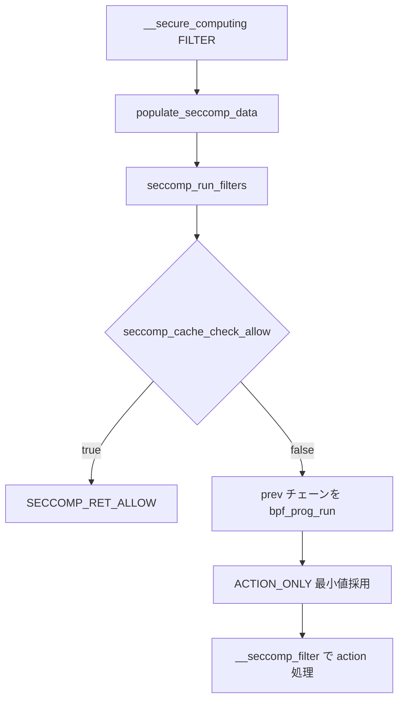

# 第12章 BPF フィルタ検証と実行、キャッシュ

> **本章で読むソース**
>
> - [`include/uapi/linux/seccomp.h` L38-L46](https://github.com/gregkh/linux/blob/v6.18.38/include/uapi/linux/seccomp.h#L38-L46)
> - [`include/uapi/linux/seccomp.h` L62-L67](https://github.com/gregkh/linux/blob/v6.18.38/include/uapi/linux/seccomp.h#L62-L67)
> - [`kernel/seccomp.c` L244-L264](https://github.com/gregkh/linux/blob/v6.18.38/kernel/seccomp.c#L244-L264)
> - [`kernel/seccomp.c` L278-L346](https://github.com/gregkh/linux/blob/v6.18.38/kernel/seccomp.c#L278-L346)
> - [`kernel/seccomp.c` L669-L712](https://github.com/gregkh/linux/blob/v6.18.38/kernel/seccomp.c#L669-L712)
> - [`kernel/seccomp.c` L394-L432](https://github.com/gregkh/linux/blob/v6.18.38/kernel/seccomp.c#L394-L432)
> - [`kernel/seccomp.c` L367-L391](https://github.com/gregkh/linux/blob/v6.18.38/kernel/seccomp.c#L367-L391)
> - [`kernel/seccomp.c` L847-L880](https://github.com/gregkh/linux/blob/v6.18.38/kernel/seccomp.c#L847-L880)
> - [`kernel/seccomp.c` L889-L906](https://github.com/gregkh/linux/blob/v6.18.38/kernel/seccomp.c#L889-L906)
> - [`kernel/seccomp.c` L1259-L1285](https://github.com/gregkh/linux/blob/v6.18.38/kernel/seccomp.c#L1259-L1285)
> - [`kernel/seccomp.c` L1337-L1353](https://github.com/gregkh/linux/blob/v6.18.38/kernel/seccomp.c#L1337-L1353)

## この章の狙い

ユーザー空間から渡された sock_fprog が `seccomp_prepare_filter` でどう検証と JIT 化され、`seccomp_run_filters` で評価されるかを読む。
`action_cache` による syscall 単位の fast path も押さえる。

## 前提

- [第11章：seccomp モードとフィルタチェーン](11-seccomp-modes-filter-chain.md)
- [BPF とトレーシング](../../bpf/README.md) の verifier と `bpf_prog_run`（一般論は委譲）

## seccomp_data と BPF 戻り値

BPF プログラムは `struct seccomp_data` を読み、32 ビットの戻り値を返す。
上位 16 ビットが action、下位 16 ビットが付随データである。

[`include/uapi/linux/seccomp.h` L38-L46](https://github.com/gregkh/linux/blob/v6.18.38/include/uapi/linux/seccomp.h#L38-L46)

```c
#define SECCOMP_RET_KILL_PROCESS 0x80000000U /* kill the process */
#define SECCOMP_RET_KILL_THREAD	 0x00000000U /* kill the thread */
#define SECCOMP_RET_KILL	 SECCOMP_RET_KILL_THREAD
#define SECCOMP_RET_TRAP	 0x00030000U /* disallow and force a SIGSYS */
#define SECCOMP_RET_ERRNO	 0x00050000U /* returns an errno */
#define SECCOMP_RET_USER_NOTIF	 0x7fc00000U /* notifies userspace */
#define SECCOMP_RET_TRACE	 0x7ff00000U /* pass to a tracer or disallow */
#define SECCOMP_RET_LOG		 0x7ffc0000U /* allow after logging */
#define SECCOMP_RET_ALLOW	 0x7fff0000U /* allow */
```

[`include/uapi/linux/seccomp.h` L62-L67](https://github.com/gregkh/linux/blob/v6.18.38/include/uapi/linux/seccomp.h#L62-L67)

```c
struct seccomp_data {
	int nr;
	__u32 arch;
	__u64 instruction_pointer;
	__u64 args[6];
};
```

## populate_seccomp_data

システムコール入口では `populate_seccomp_data` がレジスタから `seccomp_data` を組み立てる。

[`kernel/seccomp.c` L244-L264](https://github.com/gregkh/linux/blob/v6.18.38/kernel/seccomp.c#L244-L264)

```c
static void populate_seccomp_data(struct seccomp_data *sd)
{
	/*
	 * Instead of using current_pt_reg(), we're already doing the work
	 * to safely fetch "current", so just use "task" everywhere below.
	 */
	struct task_struct *task = current;
	struct pt_regs *regs = task_pt_regs(task);
	unsigned long args[6];

	sd->nr = syscall_get_nr(task, regs);
	sd->arch = syscall_get_arch(task);
	syscall_get_arguments(task, regs, args);
	sd->args[0] = args[0];
	sd->args[1] = args[1];
	sd->args[2] = args[2];
	sd->args[3] = args[3];
	sd->args[4] = args[4];
	sd->args[5] = args[5];
	sd->instruction_pointer = KSTK_EIP(task);
}
```

## seccomp_check_filter：許可命令のホワイトリスト

`seccomp_prepare_filter` は `bpf_prog_create_from_user` に `seccomp_check_filter` を渡す。
許可外の BPF 命令は attach 前に `-EINVAL` で拒否される。

[`kernel/seccomp.c` L278-L346](https://github.com/gregkh/linux/blob/v6.18.38/kernel/seccomp.c#L278-L346)

```c
static int seccomp_check_filter(struct sock_filter *filter, unsigned int flen)
{
	int pc;
	for (pc = 0; pc < flen; pc++) {
		struct sock_filter *ftest = &filter[pc];
		u16 code = ftest->code;
		u32 k = ftest->k;

		switch (code) {
		case BPF_LD | BPF_W | BPF_ABS:
			ftest->code = BPF_LDX | BPF_W | BPF_ABS;
			/* 32-bit aligned and not out of bounds. */
			if (k >= sizeof(struct seccomp_data) || k & 3)
				return -EINVAL;
			continue;
		case BPF_LD | BPF_W | BPF_LEN:
			ftest->code = BPF_LD | BPF_IMM;
			ftest->k = sizeof(struct seccomp_data);
			continue;
		case BPF_LDX | BPF_W | BPF_LEN:
			ftest->code = BPF_LDX | BPF_IMM;
			ftest->k = sizeof(struct seccomp_data);
			continue;
		/* Explicitly include allowed calls. */
		case BPF_RET | BPF_K:
		case BPF_RET | BPF_A:
		case BPF_ALU | BPF_ADD | BPF_K:
		case BPF_ALU | BPF_ADD | BPF_X:
		case BPF_ALU | BPF_SUB | BPF_K:
		case BPF_ALU | BPF_SUB | BPF_X:
		case BPF_ALU | BPF_MUL | BPF_K:
		case BPF_ALU | BPF_MUL | BPF_X:
		case BPF_ALU | BPF_DIV | BPF_K:
		case BPF_ALU | BPF_DIV | BPF_X:
		case BPF_ALU | BPF_AND | BPF_K:
		case BPF_ALU | BPF_AND | BPF_X:
		case BPF_ALU | BPF_OR | BPF_K:
		case BPF_ALU | BPF_OR | BPF_X:
		case BPF_ALU | BPF_XOR | BPF_K:
		case BPF_ALU | BPF_XOR | BPF_X:
		case BPF_ALU | BPF_LSH | BPF_K:
		case BPF_ALU | BPF_LSH | BPF_X:
		case BPF_ALU | BPF_RSH | BPF_K:
		case BPF_ALU | BPF_RSH | BPF_X:
		case BPF_ALU | BPF_NEG:
		case BPF_LD | BPF_IMM:
		case BPF_LDX | BPF_IMM:
		case BPF_MISC | BPF_TAX:
		case BPF_MISC | BPF_TXA:
		case BPF_LD | BPF_MEM:
		case BPF_LDX | BPF_MEM:
		case BPF_ST:
		case BPF_STX:
		case BPF_JMP | BPF_JA:
		case BPF_JMP | BPF_JEQ | BPF_K:
		case BPF_JMP | BPF_JEQ | BPF_X:
		case BPF_JMP | BPF_JGE | BPF_K:
		case BPF_JMP | BPF_JGE | BPF_X:
		case BPF_JMP | BPF_JGT | BPF_K:
		case BPF_JMP | BPF_JGT | BPF_X:
		case BPF_JMP | BPF_JSET | BPF_K:
		case BPF_JMP | BPF_JSET | BPF_X:
			continue;
		default:
			return -EINVAL;
		}
	}
	return 0;
}
```

## seccomp_prepare_filter

attach 前に `seccomp_filter` を確保し、`bpf_prog_create_from_user` で `struct bpf_prog` を生成する。
`CAP_SYS_ADMIN` または `no_new_privs` が無いと `-EACCES` となる。

[`kernel/seccomp.c` L669-L712](https://github.com/gregkh/linux/blob/v6.18.38/kernel/seccomp.c#L669-L712)

```c
static struct seccomp_filter *seccomp_prepare_filter(struct sock_fprog *fprog)
{
	struct seccomp_filter *sfilter;
	int ret;
	const bool save_orig =
#if defined(CONFIG_CHECKPOINT_RESTORE) || defined(SECCOMP_ARCH_NATIVE)
		true;
#else
		false;
#endif

	if (fprog->len == 0 || fprog->len > BPF_MAXINSNS)
		return ERR_PTR(-EINVAL);

	BUG_ON(INT_MAX / fprog->len < sizeof(struct sock_filter));

	/*
	 * Installing a seccomp filter requires that the task has
	 * CAP_SYS_ADMIN in its namespace or be running with no_new_privs.
	 * This avoids scenarios where unprivileged tasks can affect the
	 * behavior of privileged children.
	 */
	if (!task_no_new_privs(current) &&
			!ns_capable_noaudit(current_user_ns(), CAP_SYS_ADMIN))
		return ERR_PTR(-EACCES);

	/* Allocate a new seccomp_filter */
	sfilter = kzalloc(sizeof(*sfilter), GFP_KERNEL | __GFP_NOWARN);
	if (!sfilter)
		return ERR_PTR(-ENOMEM);

	mutex_init(&sfilter->notify_lock);
	ret = bpf_prog_create_from_user(&sfilter->prog, fprog,
					seccomp_check_filter, save_orig);
	if (ret < 0) {
		kfree(sfilter);
		return ERR_PTR(ret);
	}

	refcount_set(&sfilter->refs, 1);
	refcount_set(&sfilter->users, 1);
	init_waitqueue_head(&sfilter->wqh);

	return sfilter;
}
```

## seccomp_run_filters：チェーン評価

チェーン先頭から `prev` へ辿り、各 `bpf_prog` を実行する。
`ACTION_ONLY` で action 部分だけを比較し、より制限的（数値が小さい）戻り値が優先される。

[`kernel/seccomp.c` L394-L432](https://github.com/gregkh/linux/blob/v6.18.38/kernel/seccomp.c#L394-L432)

```c
#define ACTION_ONLY(ret) ((s32)((ret) & (SECCOMP_RET_ACTION_FULL)))
/**
 * seccomp_run_filters - evaluates all seccomp filters against @sd
 * @sd: optional seccomp data to be passed to filters
 * @match: stores struct seccomp_filter that resulted in the return value,
 *         unless filter returned SECCOMP_RET_ALLOW, in which case it will
 *         be unchanged.
 *
 * Returns valid seccomp BPF response codes.
 */
static u32 seccomp_run_filters(const struct seccomp_data *sd,
			       struct seccomp_filter **match)
{
	u32 ret = SECCOMP_RET_ALLOW;
	/* Make sure cross-thread synced filter points somewhere sane. */
	struct seccomp_filter *f =
			READ_ONCE(current->seccomp.filter);

	/* Ensure unexpected behavior doesn't result in failing open. */
	if (WARN_ON(f == NULL))
		return SECCOMP_RET_KILL_PROCESS;

	if (seccomp_cache_check_allow(f, sd))
		return SECCOMP_RET_ALLOW;

	/*
	 * All filters in the list are evaluated and the lowest BPF return
	 * value always takes priority (ignoring the DATA).
	 */
	for (; f; f = f->prev) {
		u32 cur_ret = bpf_prog_run_pin_on_cpu(f->prog, sd);

		if (ACTION_ONLY(cur_ret) < ACTION_ONLY(ret)) {
			ret = cur_ret;
			*match = f;
		}
	}
	return ret;
}
```

## action_cache：bitmap による fast path

attach 時に `seccomp_cache_prepare` が各 syscall 番号について「常に ALLOW か」を静的解析し、bitmap に記録する。
実行時 `seccomp_cache_check_allow` がヒットすれば BPF 実行を省略する。

[`kernel/seccomp.c` L847-L880](https://github.com/gregkh/linux/blob/v6.18.38/kernel/seccomp.c#L847-L880)

```c
static void seccomp_cache_prepare_bitmap(struct seccomp_filter *sfilter,
					 void *bitmap, const void *bitmap_prev,
					 size_t bitmap_size, int arch)
{
	struct sock_fprog_kern *fprog = sfilter->prog->orig_prog;
	struct seccomp_data sd;
	int nr;

	if (bitmap_prev) {
		/* The new filter must be as restrictive as the last. */
		bitmap_copy(bitmap, bitmap_prev, bitmap_size);
	} else {
		/* Before any filters, all syscalls are always allowed. */
		bitmap_fill(bitmap, bitmap_size);
	}

	for (nr = 0; nr < bitmap_size; nr++) {
		/* No bitmap change: not a cacheable action. */
		if (!test_bit(nr, bitmap))
			continue;

		sd.nr = nr;
		sd.arch = arch;

		/* No bitmap change: continue to always allow. */
		if (seccomp_is_const_allow(fprog, &sd))
			continue;

		/*
		 * Not a cacheable action: always run filters.
		 * atomic clear_bit() not needed, filter not visible yet.
		 */
		__clear_bit(nr, bitmap);
	}
}
```

[`kernel/seccomp.c` L889-L906](https://github.com/gregkh/linux/blob/v6.18.38/kernel/seccomp.c#L889-L906)

```c
static void seccomp_cache_prepare(struct seccomp_filter *sfilter)
{
	struct action_cache *cache = &sfilter->cache;
	const struct action_cache *cache_prev =
		sfilter->prev ? &sfilter->prev->cache : NULL;

	seccomp_cache_prepare_bitmap(sfilter, cache->allow_native,
				     cache_prev ? cache_prev->allow_native : NULL,
				     SECCOMP_ARCH_NATIVE_NR,
				     SECCOMP_ARCH_NATIVE);

#ifdef SECCOMP_ARCH_COMPAT
	seccomp_cache_prepare_bitmap(sfilter, cache->allow_compat,
				     cache_prev ? cache_prev->allow_compat : NULL,
				     SECCOMP_ARCH_COMPAT_NR,
				     SECCOMP_ARCH_COMPAT);
#endif /* SECCOMP_ARCH_COMPAT */
}
```

実行時の lookup は arch と syscall 番号で bitmap を参照する。

[`kernel/seccomp.c` L367-L391](https://github.com/gregkh/linux/blob/v6.18.38/kernel/seccomp.c#L367-L391)

```c
static inline bool seccomp_cache_check_allow(const struct seccomp_filter *sfilter,
					     const struct seccomp_data *sd)
{
	int syscall_nr = sd->nr;
	const struct action_cache *cache = &sfilter->cache;

#ifndef SECCOMP_ARCH_COMPAT
	/* A native-only architecture doesn't need to check sd->arch. */
	return seccomp_cache_check_allow_bitmap(cache->allow_native,
						SECCOMP_ARCH_NATIVE_NR,
						syscall_nr);
#else
	if (likely(sd->arch == SECCOMP_ARCH_NATIVE))
		return seccomp_cache_check_allow_bitmap(cache->allow_native,
							SECCOMP_ARCH_NATIVE_NR,
							syscall_nr);
	if (likely(sd->arch == SECCOMP_ARCH_COMPAT))
		return seccomp_cache_check_allow_bitmap(cache->allow_compat,
							SECCOMP_ARCH_COMPAT_NR,
							syscall_nr);
#endif /* SECCOMP_ARCH_COMPAT */

	WARN_ON_ONCE(true);
	return false;
}
```

## __seccomp_filter：戻り値の解釈

`seccomp_run_filters` の結果を action ごとに処理する。
`SECCOMP_RET_ALLOW` は syscall 続行、`SECCOMP_RET_ERRNO` は負 errno を返すなどである。

[`kernel/seccomp.c` L1259-L1285](https://github.com/gregkh/linux/blob/v6.18.38/kernel/seccomp.c#L1259-L1285)

```c
static int __seccomp_filter(int this_syscall, const bool recheck_after_trace)
{
	u32 filter_ret, action;
	struct seccomp_data sd;
	struct seccomp_filter *match = NULL;
	int data;

	/*
	 * Make sure that any changes to mode from another thread have
	 * been seen after SYSCALL_WORK_SECCOMP was seen.
	 */
	smp_rmb();

	populate_seccomp_data(&sd);

	filter_ret = seccomp_run_filters(&sd, &match);
	data = filter_ret & SECCOMP_RET_DATA;
	action = filter_ret & SECCOMP_RET_ACTION_FULL;

	switch (action) {
	case SECCOMP_RET_ERRNO:
		/* Set low-order bits as an errno, capped at MAX_ERRNO. */
		if (data > MAX_ERRNO)
			data = MAX_ERRNO;
		syscall_set_return_value(current, current_pt_regs(),
					 -data, 0);
		goto skip;
```

[`kernel/seccomp.c` L1337-L1353](https://github.com/gregkh/linux/blob/v6.18.38/kernel/seccomp.c#L1337-L1353)

```c
	case SECCOMP_RET_USER_NOTIF:
		if (seccomp_do_user_notification(this_syscall, match, &sd))
			goto skip;

		return 0;

	case SECCOMP_RET_LOG:
		seccomp_log(this_syscall, 0, action, true);
		return 0;

	case SECCOMP_RET_ALLOW:
		/*
		 * Note that the "match" filter will always be NULL for
		 * this action since SECCOMP_RET_ALLOW is the starting
		 * state in seccomp_run_filters().
		 */
		return 0;
```

## 評価とキャッシュの流れ



## 高速化と最適化の工夫

`seccomp_cache_check_allow` は attach 時に構築した bitmap で「常に ALLOW」の syscall を BPF 実行前に弾く。
`bpf_prog_run_pin_on_cpu` は seccomp 専用ではなく、`migrate_disable` で CPU を固定して `bpf_prog_run` する汎用ヘルパーである（パケットフィルタ等でも共用）。
seccomp の命令制約は実行時ではなく attach 前の `seccomp_check_filter` と `bpf_prog_create_from_user` が担う。
`ACTION_ONLY` 比較は DATA ビットを無視し、action 部分だけで最小値（最制限）を選ぶ。

## まとめ

seccomp BPF は `seccomp_check_filter` で命令を限定し、`bpf_prog_create_from_user` でカーネル `bpf_prog` へ変換される。
実行時は `prev` チェーンを走査し、最も制限的な action が採用される。
`action_cache` bitmap は attach 時の静的解析で構築され、ホット syscall の BPF 実行を省略する。

## 関連する章

- [第11章：seccomp モードとフィルタチェーン](11-seccomp-modes-filter-chain.md)
- [`SECCOMP_RET_USER_NOTIF` と supervisor API](13-seccomp-user-notif-supervisor.md)
