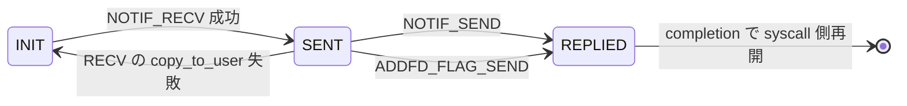
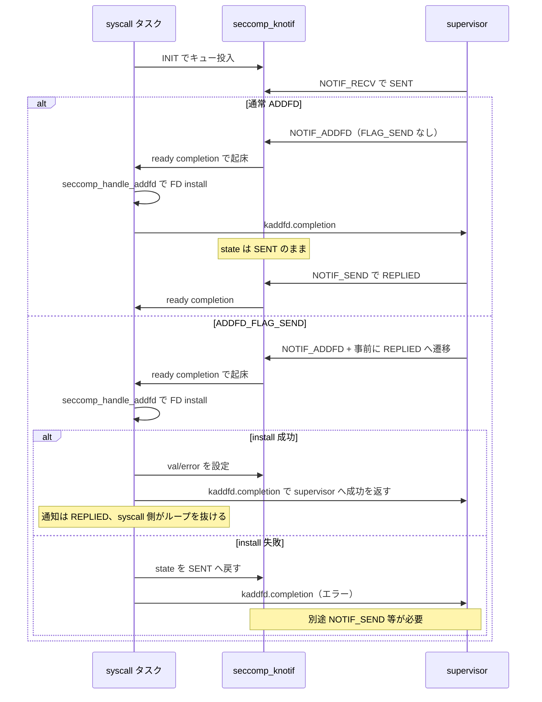

# 第12章 `SECCOMP_RET_USER_NOTIF` と supervisor API

> **本章で読むソース**
>
> - [`include/uapi/linux/seccomp.h` L43](https://github.com/gregkh/linux/blob/v6.18.38/include/uapi/linux/seccomp.h#L43)
> - [`include/uapi/linux/seccomp.h` L75-L80](https://github.com/gregkh/linux/blob/v6.18.38/include/uapi/linux/seccomp.h#L75-L80)
> - [`include/uapi/linux/seccomp.h` L111-L116](https://github.com/gregkh/linux/blob/v6.18.38/include/uapi/linux/seccomp.h#L111-L116)
> - [`include/uapi/linux/seccomp.h` L147-L153](https://github.com/gregkh/linux/blob/v6.18.38/include/uapi/linux/seccomp.h#L147-L153)
> - [`kernel/seccomp.c` L55-L67](https://github.com/gregkh/linux/blob/v6.18.38/kernel/seccomp.c#L55-L67)
> - [`kernel/seccomp.c` L83-L99](https://github.com/gregkh/linux/blob/v6.18.38/kernel/seccomp.c#L83-L99)
> - [`kernel/seccomp.c` L1123-L1154](https://github.com/gregkh/linux/blob/v6.18.38/kernel/seccomp.c#L1123-L1154)
> - [`kernel/seccomp.c` L1600-L1619](https://github.com/gregkh/linux/blob/v6.18.38/kernel/seccomp.c#L1600-L1619)
> - [`kernel/seccomp.c` L1712-L1803](https://github.com/gregkh/linux/blob/v6.18.38/kernel/seccomp.c#L1712-L1803)
> - [`kernel/seccomp.c` L1847-L1849](https://github.com/gregkh/linux/blob/v6.18.38/kernel/seccomp.c#L1847-L1849)
> - [`include/uapi/linux/seccomp.h` L122](https://github.com/gregkh/linux/blob/v6.18.38/include/uapi/linux/seccomp.h#L122)
> - [`kernel/seccomp.c` L1163-L1220](https://github.com/gregkh/linux/blob/v6.18.38/kernel/seccomp.c#L1163-L1220)
> - [`kernel/seccomp.c` L1590-L1594](https://github.com/gregkh/linux/blob/v6.18.38/kernel/seccomp.c#L1590-L1594)
> - [`kernel/seccomp.c` L1652-L1666](https://github.com/gregkh/linux/blob/v6.18.38/kernel/seccomp.c#L1652-L1666)
> - [`kernel/seccomp.c` L1833-L1843](https://github.com/gregkh/linux/blob/v6.18.38/kernel/seccomp.c#L1833-L1843)
> - [`kernel/seccomp.c` L1891-L1909](https://github.com/gregkh/linux/blob/v6.18.38/kernel/seccomp.c#L1891-L1909)

## この章の狙い

BPF が `SECCOMP_RET_USER_NOTIF` を返したとき、カーネル内 `seccomp_knotif` とユーザー空間 **supervisor**（listener FD）がどう往復するかを読む。
`SECCOMP_IOCTL_NOTIF_RECV` / `SEND` / `ADDFD` と通知 id、状態遷移を押さえる。

## 前提

- [第11章：BPF フィルタ検証と実行、キャッシュ](11-seccomp-bpf-verify-run-cache.md)
- [第10章：seccomp モードとフィルタチェーン](10-seccomp-modes-filter-chain.md)

## SECCOMP_RET_USER_NOTIF

BPF 戻り値の action として `SECCOMP_RET_USER_NOTIF` が定義される。
これは syscall を即拒否せず、supervisor へ通知して応答を待つ。

[`include/uapi/linux/seccomp.h` L43](https://github.com/gregkh/linux/blob/v6.18.38/include/uapi/linux/seccomp.h#L43)

```c
#define SECCOMP_RET_USER_NOTIF	 0x7fc00000U /* notifies userspace */
```

listener FD は `SECCOMP_FILTER_FLAG_NEW_LISTENER` 付きの filter attach で得る（第10章）。
`init_listener` が anon_inode ファイルを生成し、`seccomp_notify_ops` を束ねる。

[`kernel/seccomp.c` L1891-L1909](https://github.com/gregkh/linux/blob/v6.18.38/kernel/seccomp.c#L1891-L1909)

```c
static struct file *init_listener(struct seccomp_filter *filter)
{
	struct file *ret;

	ret = ERR_PTR(-ENOMEM);
	filter->notif = kzalloc(sizeof(*(filter->notif)), GFP_KERNEL);
	if (!filter->notif)
		goto out;

	filter->notif->next_id = get_random_u64();
	INIT_LIST_HEAD(&filter->notif->notifications);

	ret = anon_inode_getfile("seccomp notify", &seccomp_notify_ops,
				 filter, O_RDWR);
	if (IS_ERR(ret))
		goto out_notif;

	/* The file has a reference to it now */
	__get_seccomp_filter(filter);
```

## 通知状態と seccomp_knotif

カーネル内通知は `seccomp_knotif` で表され、状態は INIT → SENT → REPLIED と遷移する。
`id` はフィルタごとに単調増加する cookie である。

[`kernel/seccomp.c` L55-L67](https://github.com/gregkh/linux/blob/v6.18.38/kernel/seccomp.c#L55-L67)

```c
enum notify_state {
	SECCOMP_NOTIFY_INIT,
	SECCOMP_NOTIFY_SENT,
	SECCOMP_NOTIFY_REPLIED,
};

struct seccomp_knotif {
	/* The struct pid of the task whose filter triggered the notification */
	struct task_struct *task;

	/* The "cookie" for this request; this is unique for this filter. */
	u64 id;
```

[`kernel/seccomp.c` L83-L99](https://github.com/gregkh/linux/blob/v6.18.38/kernel/seccomp.c#L83-L99)

```c
	enum notify_state state;

	/* The return values, only valid when in SECCOMP_NOTIFY_REPLIED */
	int error;
	long val;
	u32 flags;

	/*
	 * Signals when this has changed states, such as the listener
	 * dying, a new seccomp addfd message, or changing to REPLIED
	 */
	struct completion ready;

	struct list_head list;

	/* outstanding addfd requests */
	struct list_head addfd;
```

ユーザー空間へ渡る `seccomp_notif` は id、pid、`seccomp_data` を含む。

[`include/uapi/linux/seccomp.h` L75-L80](https://github.com/gregkh/linux/blob/v6.18.38/include/uapi/linux/seccomp.h#L75-L80)

```c
struct seccomp_notif {
	__u64 id;
	__u32 pid;
	__u32 flags;
	struct seccomp_data data;
};
```

応答は `seccomp_notif_resp` で id と error/val/flags を返す。

[`include/uapi/linux/seccomp.h` L111-L116](https://github.com/gregkh/linux/blob/v6.18.38/include/uapi/linux/seccomp.h#L111-L116)

```c
struct seccomp_notif_resp {
	__u64 id;
	__s64 val;
	__s32 error;
	__u32 flags;
};
```

## seccomp_do_user_notification：syscall 側の待機

`__seccomp_filter` が `SECCOMP_RET_USER_NOTIF` を受けると `seccomp_do_user_notification` へ入る。
通知をキューに積み、supervisor の応答まで `completion` で待つ。

[`kernel/seccomp.c` L1163-L1220](https://github.com/gregkh/linux/blob/v6.18.38/kernel/seccomp.c#L1163-L1220)

```c
static int seccomp_do_user_notification(int this_syscall,
					struct seccomp_filter *match,
					const struct seccomp_data *sd)
{
	int err;
	u32 flags = 0;
	long ret = 0;
	struct seccomp_knotif n = {};
	struct seccomp_kaddfd *addfd, *tmp;

	mutex_lock(&match->notify_lock);
	err = -ENOSYS;
	if (!match->notif)
		goto out;

	n.task = current;
	n.state = SECCOMP_NOTIFY_INIT;
	n.data = sd;
	n.id = seccomp_next_notify_id(match);
	init_completion(&n.ready);
	list_add_tail(&n.list, &match->notif->notifications);
	INIT_LIST_HEAD(&n.addfd);

	atomic_inc(&match->notif->requests);
	if (match->notif->flags & SECCOMP_USER_NOTIF_FD_SYNC_WAKE_UP)
		wake_up_poll_on_current_cpu(&match->wqh, EPOLLIN | EPOLLRDNORM);
	else
		wake_up_poll(&match->wqh, EPOLLIN | EPOLLRDNORM);

	/*
	 * This is where we wait for a reply from userspace.
	 */
	do {
		bool wait_killable = should_sleep_killable(match, &n);

		mutex_unlock(&match->notify_lock);
		if (wait_killable)
			err = wait_for_completion_killable(&n.ready);
		else
			err = wait_for_completion_interruptible(&n.ready);
		mutex_lock(&match->notify_lock);

		if (err != 0) {
			/*
			 * Check to see whether we should switch to wait
			 * killable. Only return the interrupted error if not.
			 */
			if (!(!wait_killable && should_sleep_killable(match, &n)))
				goto interrupted;
		}

		addfd = list_first_entry_or_null(&n.addfd,
						 struct seccomp_kaddfd, list);
		/* Check if we were woken up by a addfd message */
		if (addfd)
			seccomp_handle_addfd(addfd, &n);

	}  while (n.state != SECCOMP_NOTIFY_REPLIED);
```

`SECCOMP_USER_NOTIF_FLAG_CONTINUE` が立っていれば syscall をそのまま続行する。

## SECCOMP_IOCTL_NOTIF_RECV と SENT から INIT への巻き戻し

supervisor は `SECCOMP_IOCTL_NOTIF_RECV` で INIT 状態の通知を取り出す。
取得成功で状態は SENT へ遷移する。

[`kernel/seccomp.c` L1590-L1594](https://github.com/gregkh/linux/blob/v6.18.38/kernel/seccomp.c#L1590-L1594)

```c
	unotif.id = knotif->id;
	unotif.pid = task_pid_vnr(knotif->task);
	unotif.data = *(knotif->data);

	knotif->state = SECCOMP_NOTIFY_SENT;
```

`copy_to_user` が失敗した場合だけ、通知を再取得できるよう SENT から INIT へ戻す。
待機中のシグナルは通知をリストから外して syscall を中断する別経路であり、通常の SENT から INIT への遷移ではない。

[`kernel/seccomp.c` L1600-L1619](https://github.com/gregkh/linux/blob/v6.18.38/kernel/seccomp.c#L1600-L1619)

```c
	if (ret == 0 && copy_to_user(buf, &unotif, sizeof(unotif))) {
		ret = -EFAULT;

		/*
		 * Userspace screwed up. To make sure that we keep this
		 * notification alive, let's reset it back to INIT. It
		 * may have died when we released the lock, so we need to make
		 * sure it's still around.
		 */
		mutex_lock(&filter->notify_lock);
		knotif = find_notification(filter, unotif.id);
		if (knotif) {
			/* Reset the process to make sure it's not stuck */
			if (should_sleep_killable(filter, knotif))
				complete(&knotif->ready);
			knotif->state = SECCOMP_NOTIFY_INIT;
			atomic_inc(&filter->notif->requests);
			wake_up_poll(&filter->wqh, EPOLLIN | EPOLLRDNORM);
		}
		mutex_unlock(&filter->notify_lock);
	}
```

## ioctl ディスパッチ

listener FD の `unlocked_ioctl` は固定サイズ ioctl を振り分け、`ADDFD` は拡張引数 ioctl として別 switch へ入る。

[`kernel/seccomp.c` L1833-L1843](https://github.com/gregkh/linux/blob/v6.18.38/kernel/seccomp.c#L1833-L1843)

```c
	switch (cmd) {
	case SECCOMP_IOCTL_NOTIF_RECV:
		return seccomp_notify_recv(filter, buf);
	case SECCOMP_IOCTL_NOTIF_SEND:
		return seccomp_notify_send(filter, buf);
	case SECCOMP_IOCTL_NOTIF_ID_VALID_WRONG_DIR:
	case SECCOMP_IOCTL_NOTIF_ID_VALID:
		return seccomp_notify_id_valid(filter, buf);
	case SECCOMP_IOCTL_NOTIF_SET_FLAGS:
		return seccomp_notify_set_flags(filter, arg);
	}
```

[`kernel/seccomp.c` L1847-L1849](https://github.com/gregkh/linux/blob/v6.18.38/kernel/seccomp.c#L1847-L1849)

```c
	case EA_IOCTL(SECCOMP_IOCTL_NOTIF_ADDFD):
		return seccomp_notify_addfd(filter, buf, _IOC_SIZE(cmd));
```

## SECCOMP_IOCTL_NOTIF_ADDFD

`SECCOMP_IOCTL_NOTIF_ADDFD` は supervisor が対象タスクへ fd を注入する経路である。
`seccomp_notify_addfd` が `srcfd` を `fget` し、対象通知が SENT であることを検証してから `seccomp_kaddfd` を `knotif->addfd` リストへ積む。
syscall 側の `seccomp_do_user_notification` が `complete` で起き、`seccomp_handle_addfd` が対象タスク自身のコンテキストで fd を install する。
supervisor は `kaddfd.completion` で結果を待つ。

[`include/uapi/linux/seccomp.h` L122](https://github.com/gregkh/linux/blob/v6.18.38/include/uapi/linux/seccomp.h#L122)

```c
#define SECCOMP_ADDFD_FLAG_SEND		(1UL << 1) /* Addfd and return it, atomically */
```

[`kernel/seccomp.c` L1740-L1788](https://github.com/gregkh/linux/blob/v6.18.38/kernel/seccomp.c#L1740-L1788)

```c
	kaddfd.file = fget(addfd.srcfd);
	if (!kaddfd.file)
		return -EBADF;

	kaddfd.ioctl_flags = addfd.flags;
	kaddfd.flags = addfd.newfd_flags;
	kaddfd.setfd = addfd.flags & SECCOMP_ADDFD_FLAG_SETFD;
	kaddfd.fd = addfd.newfd;
	init_completion(&kaddfd.completion);

	ret = mutex_lock_interruptible(&filter->notify_lock);
	if (ret < 0)
		goto out;

	knotif = find_notification(filter, addfd.id);
	if (!knotif) {
		ret = -ENOENT;
		goto out_unlock;
	}

	/*
	 * We do not want to allow for FD injection to occur before the
	 * notification has been picked up by a userspace handler, or after
	 * the notification has been replied to.
	 */
	if (knotif->state != SECCOMP_NOTIFY_SENT) {
		ret = -EINPROGRESS;
		goto out_unlock;
	}

	if (addfd.flags & SECCOMP_ADDFD_FLAG_SEND) {
		/*
		 * Disallow queuing an atomic addfd + send reply while there are
		 * some addfd requests still to process.
		 *
		 * There is no clear reason to support it and allows us to keep
		 * the loop on the other side straight-forward.
		 */
		if (!list_empty(&knotif->addfd)) {
			ret = -EBUSY;
			goto out_unlock;
		}

		/* Allow exactly only one reply */
		knotif->state = SECCOMP_NOTIFY_REPLIED;
	}

	list_add(&kaddfd.list, &knotif->addfd);
	complete(&knotif->ready);
```

[`kernel/seccomp.c` L1123-L1154](https://github.com/gregkh/linux/blob/v6.18.38/kernel/seccomp.c#L1123-L1154)

```c
static void seccomp_handle_addfd(struct seccomp_kaddfd *addfd, struct seccomp_knotif *n)
{
	int fd;

	/*
	 * Remove the notification, and reset the list pointers, indicating
	 * that it has been handled.
	 */
	list_del_init(&addfd->list);
	if (!addfd->setfd)
		fd = receive_fd(addfd->file, NULL, addfd->flags);
	else
		fd = receive_fd_replace(addfd->fd, addfd->file, addfd->flags);
	addfd->ret = fd;

	if (addfd->ioctl_flags & SECCOMP_ADDFD_FLAG_SEND) {
		/* If we fail reset and return an error to the notifier */
		if (fd < 0) {
			n->state = SECCOMP_NOTIFY_SENT;
		} else {
			/* Return the FD we just added */
			n->flags = 0;
			n->error = 0;
			n->val = fd;
		}
	}

	/*
	 * Mark the notification as completed. From this point, addfd mem
	 * might be invalidated and we can't safely read it anymore.
	 */
	complete(&addfd->completion);
}
```

`SECCOMP_ADDFD_FLAG_SEND` 指定時は fd 追加と応答を原子的に扱い、事前に `knotif->state` を REPLIED へ遷移させる。
install 失敗時だけ SENT へ戻して supervisor へエラーを返す。

[`kernel/seccomp.c` L1791-L1803](https://github.com/gregkh/linux/blob/v6.18.38/kernel/seccomp.c#L1791-L1803)

```c
	/* Now we wait for it to be processed or be interrupted */
	ret = wait_for_completion_interruptible(&kaddfd.completion);
	if (ret == 0) {
		/*
		 * We had a successful completion. The other side has already
		 * removed us from the addfd queue, and
		 * wait_for_completion_interruptible has a memory barrier upon
		 * success that lets us read this value directly without
		 * locking.
		 */
		ret = kaddfd.ret;
		goto out;
	}
```

`SECCOMP_IOCTL_NOTIF_ID_VALID` は SENT 状態の id がまだ有効かを確認する。

## SECCOMP_IOCTL_NOTIF_SEND

`SECCOMP_IOCTL_NOTIF_SEND` は SENT 状態の通知に一度だけ応答する。
`resp.id` で対象を特定し、error/val/flags を `seccomp_knotif` へ書き込んで REPLIED へ遷移する。

[`kernel/seccomp.c` L1652-L1666](https://github.com/gregkh/linux/blob/v6.18.38/kernel/seccomp.c#L1652-L1666)

```c
	/* Allow exactly one reply. */
	if (knotif->state != SECCOMP_NOTIFY_SENT) {
		ret = -EINPROGRESS;
		goto out;
	}

	ret = 0;
	knotif->state = SECCOMP_NOTIFY_REPLIED;
	knotif->error = resp.error;
	knotif->val = resp.val;
	knotif->flags = resp.flags;
	if (filter->notif->flags & SECCOMP_USER_NOTIF_FD_SYNC_WAKE_UP)
		complete_on_current_cpu(&knotif->ready);
	else
		complete(&knotif->ready);
```

## 通知の状態遷移



## ADDFD と supervisor の往復

通常の `ADDFD` は FD install 後も通知は SENT のまま残り、別途 `NOTIF_SEND` で REPLIED へ遷移させる。
`ADDFD_FLAG_SEND` は FD 追加と応答を一体化し、ioctl 側で事前に REPLIED へ遷移するため `NOTIF_SEND` は不要である。
install 失敗時だけ syscall 側が SENT へ戻し、supervisor は別途応答を送れる。



## 高速化と最適化の工夫

`recv_wait_event` は `atomic_dec_if_positive` で待機キューへの投入を調整し、通知が無い supervisor の無駄な wake を抑える。
`SECCOMP_USER_NOTIF_FD_SYNC_WAKE_UP` 指定時は `wake_up_poll_on_current_cpu` と `complete_on_current_cpu` で同一 CPU 上の待ち合わせコストを下げる。
`has_duplicate_listener` は祖先チェーン上の重複 listener を attach 前に拒否し、通知ルーティングの曖昧さを防ぐ。

## まとめ

`SECCOMP_RET_USER_NOTIF` は BPF から supervisor への委譲点であり、`seccomp_knotif` の id と state で往復を管理する。
supervisor は listener FD へ `RECV` で通知を取得し、通常は `SEND` で応答する。
`ADDFD_FLAG_SEND` 指定時は FD 追加と応答が一体化し、別途 `SEND` は不要である。

## 関連する章

- [第11章：BPF フィルタ検証と実行、キャッシュ](11-seccomp-bpf-verify-run-cache.md)
- [Landlock ruleset と domain](../part04-landlock/13-landlock-ruleset-domain.md)
