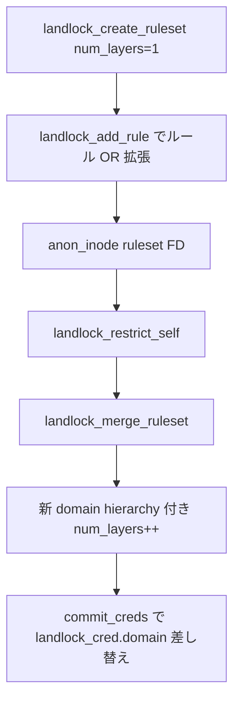

# 第13章 Landlock ruleset と domain

> **本章で読むソース**
>
> - [`security/landlock/ruleset.h` L28-L38](https://github.com/gregkh/linux/blob/v6.18.38/security/landlock/ruleset.h#L28-L38)
> - [`security/landlock/ruleset.h` L119-L142](https://github.com/gregkh/linux/blob/v6.18.38/security/landlock/ruleset.h#L119-L142)
> - [`security/landlock/ruleset.h` L167-L174](https://github.com/gregkh/linux/blob/v6.18.38/security/landlock/ruleset.h#L167-L174)
> - [`security/landlock/ruleset.c` L58-L78](https://github.com/gregkh/linux/blob/v6.18.38/security/landlock/ruleset.c#L58-L78)
> - [`security/landlock/ruleset.c` L243-L255](https://github.com/gregkh/linux/blob/v6.18.38/security/landlock/ruleset.c#L243-L255)
> - [`security/landlock/ruleset.c` L530-L577](https://github.com/gregkh/linux/blob/v6.18.38/security/landlock/ruleset.c#L530-L577)
> - [`security/landlock/domain.h` L75-L85](https://github.com/gregkh/linux/blob/v6.18.38/security/landlock/domain.h#L75-L85)
> - [`security/landlock/domain.c` L119-L134](https://github.com/gregkh/linux/blob/v6.18.38/security/landlock/domain.c#L119-L134)

## この章の狙い

Landlock の **ruleset**（編集中のルール集合）と **domain**（プロセスに適用済みの積層ポリシー）の違いを読む。
`landlock_layer` のスタック、`landlock_merge_ruleset` による親 domain との合成、および `landlock_hierarchy` の親子関係を押さえる。

## 前提

- [第6章：blob 割り当てと `lsm_*_alloc`](../part01-lsm/06-lsm-blob-alloc.md) の `landlock_cred`
- [第5章：`security_*` ラッパとフック実行規約](../part01-lsm/05-security-wrappers-call-convention.md)

## landlock_layer と landlock_ruleset

各ルールは複数の **layer** を持ち、layer はスタック上の位置 `level` と許可ビット `access` を表す。

[`security/landlock/ruleset.h` L28-L38](https://github.com/gregkh/linux/blob/v6.18.38/security/landlock/ruleset.h#L28-L38)

```c
struct landlock_layer {
	/**
	 * @level: Position of this layer in the layer stack.
	 */
	u16 level;
	/**
	 * @access: Bitfield of allowed actions on the kernel object.  They are
	 * relative to the object type (e.g. %LANDLOCK_ACTION_FS_READ).
	 */
	access_mask_t access;
};
```

`landlock_ruleset` は inode と TCP ポートをキーにした赤黒木 `root_inode` / `root_net_port` を持つ。
`hierarchy` が非 NULL のとき、この ruleset は **domain** としてプロセスに束ねられている。

[`security/landlock/ruleset.h` L119-L142](https://github.com/gregkh/linux/blob/v6.18.38/security/landlock/ruleset.h#L119-L142)

```c
struct landlock_ruleset {
	/**
	 * @root_inode: Root of a red-black tree containing &struct
	 * landlock_rule nodes with inode object.  Once a ruleset is tied to a
	 * process (i.e. as a domain), this tree is immutable until @usage
	 * reaches zero.
	 */
	struct rb_root root_inode;

#if IS_ENABLED(CONFIG_INET)
	/**
	 * @root_net_port: Root of a red-black tree containing &struct
	 * landlock_rule nodes with network port. Once a ruleset is tied to a
	 * process (i.e. as a domain), this tree is immutable until @usage
	 * reaches zero.
	 */
	struct rb_root root_net_port;
#endif /* IS_ENABLED(CONFIG_INET) */

	/**
	 * @hierarchy: Enables hierarchy identification even when a parent
	 * domain vanishes.  This is needed for the ptrace protection.
	 */
	struct landlock_hierarchy *hierarchy;
```

`num_layers` が 0 なら未マージの ruleset（domain ではない）である。

[`security/landlock/ruleset.h` L167-L174](https://github.com/gregkh/linux/blob/v6.18.38/security/landlock/ruleset.h#L167-L174)

```c
			/**
			 * @num_layers: Number of layers that are used in this
			 * ruleset.  This enables to check that all the layers
			 * allow an access request.  A value of 0 identifies a
			 * non-merged ruleset (i.e. not a domain).
			 */
			u32 num_layers;
```

## landlock_create_ruleset

ユーザー空間が ruleset FD を作る前段で、カーネルは 1 layer の空 ruleset を確保し、扱う access mask を `access_masks[0]` へ記録する。

[`security/landlock/ruleset.c` L58-L78](https://github.com/gregkh/linux/blob/v6.18.38/security/landlock/ruleset.c#L58-L78)

```c
struct landlock_ruleset *
landlock_create_ruleset(const access_mask_t fs_access_mask,
			const access_mask_t net_access_mask,
			const access_mask_t scope_mask)
{
	struct landlock_ruleset *new_ruleset;

	/* Informs about useless ruleset. */
	if (!fs_access_mask && !net_access_mask && !scope_mask)
		return ERR_PTR(-ENOMSG);
	new_ruleset = create_ruleset(1);
	if (IS_ERR(new_ruleset))
		return new_ruleset;
	if (fs_access_mask)
		landlock_add_fs_access_mask(new_ruleset, fs_access_mask, 0);
	if (net_access_mask)
		landlock_add_net_access_mask(new_ruleset, net_access_mask, 0);
	if (scope_mask)
		landlock_add_scope_mask(new_ruleset, scope_mask, 0);
	return new_ruleset;
}
```

## ルール追加時の OR とマージ時の AND

`landlock_add_rule` 経路では layer `level == 0` の単一 layer だけが渡される。
同一オブジェクトへの再追加は許可ビットの **OR**（拡張）である。

[`security/landlock/ruleset.c` L243-L255](https://github.com/gregkh/linux/blob/v6.18.38/security/landlock/ruleset.c#L243-L255)

```c
		/* If there is a matching rule, updates it. */
		if ((*layers)[0].level == 0) {
			/*
			 * Extends access rights when the request comes from
			 * landlock_add_rule(2), i.e. @ruleset is not a domain.
			 */
			if (WARN_ON_ONCE(this->num_layers != 1))
				return -EINVAL;
			if (WARN_ON_ONCE(this->layers[0].level != 0))
				return -EINVAL;
			this->layers[0].access |= (*layers)[0].access;
			return 0;
		}
```

domain へのマージ時は新 layer を積み、既存ルールと **AND**（交差）する（`create_rule` で layer スタックを延長）。

## landlock_merge_ruleset

`landlock_restrict_self` は現在の domain（親）と新 ruleset を `landlock_merge_ruleset` で合成する。
子 domain は親の木を `inherit_ruleset` で複製し、新 ruleset を `merge_ruleset` で積み上げる。
`landlock_init_hierarchy_log` が監査用の `landlock_hierarchy` を初期化する。

[`security/landlock/ruleset.c` L530-L577](https://github.com/gregkh/linux/blob/v6.18.38/security/landlock/ruleset.c#L530-L577)

```c
struct landlock_ruleset *
landlock_merge_ruleset(struct landlock_ruleset *const parent,
		       struct landlock_ruleset *const ruleset)
{
	struct landlock_ruleset *new_dom __free(landlock_put_ruleset) = NULL;
	u32 num_layers;
	int err;

	might_sleep();
	if (WARN_ON_ONCE(!ruleset || parent == ruleset))
		return ERR_PTR(-EINVAL);

	if (parent) {
		if (parent->num_layers >= LANDLOCK_MAX_NUM_LAYERS)
			return ERR_PTR(-E2BIG);
		num_layers = parent->num_layers + 1;
	} else {
		num_layers = 1;
	}

	/* Creates a new domain... */
	new_dom = create_ruleset(num_layers);
	if (IS_ERR(new_dom))
		return new_dom;

	new_dom->hierarchy =
		kzalloc(sizeof(*new_dom->hierarchy), GFP_KERNEL_ACCOUNT);
	if (!new_dom->hierarchy)
		return ERR_PTR(-ENOMEM);

	refcount_set(&new_dom->hierarchy->usage, 1);

	/* ...as a child of @parent... */
	err = inherit_ruleset(parent, new_dom);
	if (err)
		return ERR_PTR(err);

	/* ...and including @ruleset. */
	err = merge_ruleset(new_dom, ruleset);
	if (err)
		return ERR_PTR(err);

	err = landlock_init_hierarchy_log(new_dom->hierarchy);
	if (err)
		return ERR_PTR(err);

	return no_free_ptr(new_dom);
}
```

## landlock_hierarchy

domain は `landlock_hierarchy` ノードで親子を辿れる。
親 domain が解放されても ptrace 保護などで階層 ID を保持する。

[`security/landlock/domain.h` L75-L85](https://github.com/gregkh/linux/blob/v6.18.38/security/landlock/domain.h#L75-L85)

```c
struct landlock_hierarchy {
	/**
	 * @parent: Pointer to the parent node, or NULL if it is a root
	 * Landlock domain.
	 */
	struct landlock_hierarchy *parent;
	/**
	 * @usage: Number of potential children domains plus their parent
	 * domain.
	 */
	refcount_t usage;
```

`landlock_init_hierarchy_log` は制限を掛けたタスクの実行ファイルパス等を `landlock_details` へ記録する。

[`security/landlock/domain.c` L119-L134](https://github.com/gregkh/linux/blob/v6.18.38/security/landlock/domain.c#L119-L134)

```c
int landlock_init_hierarchy_log(struct landlock_hierarchy *const hierarchy)
{
	struct landlock_details *details;

	details = get_current_details();
	if (IS_ERR(details))
		return PTR_ERR(details);

	hierarchy->details = details;
	hierarchy->id = landlock_get_id_range(1);
	hierarchy->log_status = LANDLOCK_LOG_PENDING;
	hierarchy->log_same_exec = true;
	hierarchy->log_new_exec = false;
	atomic64_set(&hierarchy->num_denials, 0);
	return 0;
}
```

## ruleset から domain への流れ



## 高速化と最適化の工夫

ルール検索は `landlock_find_rule` が赤黒木を辿るため、オブジェクト数に対して対数時間である。
domain 解放は `landlock_put_ruleset_deferred` が workqueue へ逃がし、LSM フックのロックレス区間での解放を避ける。
`access_masks` の FAM により layer ごとの handled access をマージ時に一度だけ確定し、実行時のマスク計算を単純化する。

## まとめ

ruleset は編集中の 1 layer ルール集合であり、domain は `landlock_merge_ruleset` 後の多 layer 積層ポリシーである。
ルール追加は OR、domain マージは AND で制約が厳しくなる。
`landlock_hierarchy` が親子 domain の寿命と監査メタデータを繋ぐ。

## 関連する章

- [第12章：`SECCOMP_RET_USER_NOTIF` と supervisor API](../part03-seccomp/12-seccomp-user-notif-supervisor.md)
- [Landlock FS アクセス制御](14-landlock-fs-access.md)
