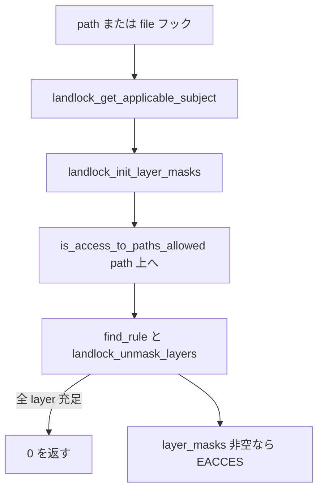

# 第15章 Landlock FS アクセス制御

> **本章で読むソース**
>
> - [`security/landlock/syscalls.c` L314-L350](https://github.com/gregkh/linux/blob/v6.18.38/security/landlock/syscalls.c#L314-L350)
> - [`security/landlock/fs.c` L323-L347](https://github.com/gregkh/linux/blob/v6.18.38/security/landlock/fs.c#L323-L347)
> - [`security/landlock/fs.c` L363-L383](https://github.com/gregkh/linux/blob/v6.18.38/security/landlock/fs.c#L363-L383)
> - [`security/landlock/ruleset.c` L628-L659](https://github.com/gregkh/linux/blob/v6.18.38/security/landlock/ruleset.c#L628-L659)
> - [`security/landlock/ruleset.c` L716-L731](https://github.com/gregkh/linux/blob/v6.18.38/security/landlock/ruleset.c#L716-L731)
> - [`security/landlock/fs.c` L962-L986](https://github.com/gregkh/linux/blob/v6.18.38/security/landlock/fs.c#L962-L986)
> - [`security/landlock/fs.c` L1631-L1690](https://github.com/gregkh/linux/blob/v6.18.38/security/landlock/fs.c#L1631-L1690)
> - [`security/landlock/fs.c` L1847-L1864](https://github.com/gregkh/linux/blob/v6.18.38/security/landlock/fs.c#L1847-L1864)

## この章の狙い

`landlock_add_rule` の path beneath ルールが inode 木へ入る経路と、VFS フックでの **path ウォーク** による layer 評価を読む。
`landlock_init_layer_masks` と `landlock_unmask_layers` が各 layer の拒否をどう合成するかを押さえる。

## 前提

- [第14章：Landlock ruleset と domain](14-landlock-ruleset-domain.md)
- [第1章：カーネルセキュリティの層構造と判定経路](../part00-foundation/01-security-layers-overview.md)

## landlock_add_rule の path beneath

`LANDLOCK_RULE_PATH_BENEATH` は `parent_fd` でディレクトリを指し、`allowed_access` を ruleset の handled mask 内に収める。

[`security/landlock/syscalls.c` L314-L350](https://github.com/gregkh/linux/blob/v6.18.38/security/landlock/syscalls.c#L314-L350)

```c
static int add_rule_path_beneath(struct landlock_ruleset *const ruleset,
				 const void __user *const rule_attr)
{
	struct landlock_path_beneath_attr path_beneath_attr;
	struct path path;
	int res, err;
	access_mask_t mask;

	/* Copies raw user space buffer. */
	res = copy_from_user(&path_beneath_attr, rule_attr,
			     sizeof(path_beneath_attr));
	if (res)
		return -EFAULT;

	/*
	 * Informs about useless rule: empty allowed_access (i.e. deny rules)
	 * are ignored in path walks.
	 */
	if (!path_beneath_attr.allowed_access)
		return -ENOMSG;

	/* Checks that allowed_access matches the @ruleset constraints. */
	mask = ruleset->access_masks[0].fs;
	if ((path_beneath_attr.allowed_access | mask) != mask)
		return -EINVAL;

	/* Gets and checks the new rule. */
	err = get_path_from_fd(path_beneath_attr.parent_fd, &path);
	if (err)
		return err;

	/* Imports the new rule. */
	err = landlock_append_fs_rule(ruleset, &path,
				      path_beneath_attr.allowed_access);
	path_put(&path);
	return err;
}
```

## landlock_append_fs_rule

path の backing inode から `landlock_object` を得て、相対 access を ruleset の絶対 mask へ変換して `landlock_insert_rule` する。
ruleset 編集中は `num_layers == 1` が前提である。

[`security/landlock/fs.c` L323-L347](https://github.com/gregkh/linux/blob/v6.18.38/security/landlock/fs.c#L323-L347)

```c
int landlock_append_fs_rule(struct landlock_ruleset *const ruleset,
			    const struct path *const path,
			    access_mask_t access_rights)
{
	int err;
	struct landlock_id id = {
		.type = LANDLOCK_KEY_INODE,
	};

	/* Files only get access rights that make sense. */
	if (!d_is_dir(path->dentry) &&
	    (access_rights | ACCESS_FILE) != ACCESS_FILE)
		return -EINVAL;
	if (WARN_ON_ONCE(ruleset->num_layers != 1))
		return -EINVAL;

	/* Transforms relative access rights to absolute ones. */
	access_rights |= LANDLOCK_MASK_ACCESS_FS &
			 ~landlock_get_fs_access_mask(ruleset, 0);
	id.key.object = get_inode_object(d_backing_inode(path->dentry));
	if (IS_ERR(id.key.object))
		return PTR_ERR(id.key.object);
	mutex_lock(&ruleset->lock);
	err = landlock_insert_rule(ruleset, id, access_rights);
	mutex_unlock(&ruleset->lock);
```

## path ウォークとルール検索

実行時は dentry から inode の `landlock_object` を辿り、domain の赤黒木で `landlock_rule` を引く。

[`security/landlock/fs.c` L363-L383](https://github.com/gregkh/linux/blob/v6.18.38/security/landlock/fs.c#L363-L383)

```c
static const struct landlock_rule *
find_rule(const struct landlock_ruleset *const domain,
	  const struct dentry *const dentry)
{
	const struct landlock_rule *rule;
	const struct inode *inode;
	struct landlock_id id = {
		.type = LANDLOCK_KEY_INODE,
	};

	/* Ignores nonexistent leafs. */
	if (d_is_negative(dentry))
		return NULL;

	inode = d_backing_inode(dentry);
	rcu_read_lock();
	id.key.object = rcu_dereference(landlock_inode(inode)->object);
	rule = landlock_find_rule(domain, id);
	rcu_read_unlock();
	return rule;
}
```

Landlock の FS 制御は `inode_permission` ではなく `path_*` と `file_*` フックが本体である。
`hook_inode_free_security_rcu` は inode blob の RCU 解放のみ担う。

[`security/landlock/fs.c` L1847-L1864](https://github.com/gregkh/linux/blob/v6.18.38/security/landlock/fs.c#L1847-L1864)

```c
static struct security_hook_list landlock_hooks[] __ro_after_init = {
	LSM_HOOK_INIT(inode_free_security_rcu, hook_inode_free_security_rcu),

	LSM_HOOK_INIT(sb_delete, hook_sb_delete),
	LSM_HOOK_INIT(sb_mount, hook_sb_mount),
	LSM_HOOK_INIT(move_mount, hook_move_mount),
	LSM_HOOK_INIT(sb_umount, hook_sb_umount),
	LSM_HOOK_INIT(sb_remount, hook_sb_remount),
	LSM_HOOK_INIT(sb_pivotroot, hook_sb_pivotroot),

	LSM_HOOK_INIT(path_link, hook_path_link),
	LSM_HOOK_INIT(path_rename, hook_path_rename),
	LSM_HOOK_INIT(path_mkdir, hook_path_mkdir),
	LSM_HOOK_INIT(path_mknod, hook_path_mknod),
	LSM_HOOK_INIT(path_symlink, hook_path_symlink),
	LSM_HOOK_INIT(path_unlink, hook_path_unlink),
	LSM_HOOK_INIT(path_rmdir, hook_path_rmdir),
	LSM_HOOK_INIT(path_truncate, hook_path_truncate),
```

## layer マスクの初期化と評価

`landlock_init_layer_masks` は要求 access ごとに「まだ満たされていない layer」をビットマスクで初期化する。

[`security/landlock/ruleset.c` L716-L731](https://github.com/gregkh/linux/blob/v6.18.38/security/landlock/ruleset.c#L716-L731)

```c
	/* Saves all handled accesses per layer. */
	for (layer_level = 0; layer_level < domain->num_layers; layer_level++) {
		const unsigned long access_req = access_request;
		const access_mask_t access_mask =
			get_access_mask(domain, layer_level);
		unsigned long access_bit;

		for_each_set_bit(access_bit, &access_req, num_access) {
			if (BIT_ULL(access_bit) & access_mask) {
				(*layer_masks)[access_bit] |=
					BIT_ULL(layer_level);
				handled_accesses |= BIT_ULL(access_bit);
			}
		}
	}
	return handled_accesses;
```

path 上の各 dentry で `landlock_unmask_layers` が layer ごとに許可ビットを消し、全 layer が満たされれば許可となる。

[`security/landlock/ruleset.c` L628-L659](https://github.com/gregkh/linux/blob/v6.18.38/security/landlock/ruleset.c#L628-L659)

```c
	/*
	 * An access is granted if, for each policy layer, at least one rule
	 * encountered on the pathwalk grants the requested access,
	 * regardless of its position in the layer stack.  We must then check
	 * the remaining layers for each inode, from the first added layer to
	 * the last one.  When there is multiple requested accesses, for each
	 * policy layer, the full set of requested accesses may not be granted
	 * by only one rule, but by the union (binary OR) of multiple rules.
	 * E.g. /a/b <execute> + /a <read> => /a/b <execute + read>
	 */
	for (layer_level = 0; layer_level < rule->num_layers; layer_level++) {
		const struct landlock_layer *const layer =
			&rule->layers[layer_level];
		const layer_mask_t layer_bit = BIT_ULL(layer->level - 1);
		const unsigned long access_req = access_request;
		unsigned long access_bit;
		bool is_empty;

		/*
		 * Records in @layer_masks which layer grants access to each
		 * requested access.
		 */
		is_empty = true;
		for_each_set_bit(access_bit, &access_req, masks_array_size) {
			if (layer->access & BIT_ULL(access_bit))
				(*layer_masks)[access_bit] &= ~layer_bit;
			is_empty = is_empty && !(*layer_masks)[access_bit];
		}
		if (is_empty)
			return true;
	}
	return false;
```

## current_check_access_path と hook_file_open

`path_unlink` 等のフックは `current_check_access_path` へ集約される。

[`security/landlock/fs.c` L962-L986](https://github.com/gregkh/linux/blob/v6.18.38/security/landlock/fs.c#L962-L986)

```c
static int current_check_access_path(const struct path *const path,
				     access_mask_t access_request)
{
	const struct access_masks masks = {
		.fs = access_request,
	};
	const struct landlock_cred_security *const subject =
		landlock_get_applicable_subject(current_cred(), masks, NULL);
	layer_mask_t layer_masks[LANDLOCK_NUM_ACCESS_FS] = {};
	struct landlock_request request = {};

	if (!subject)
		return 0;

	access_request = landlock_init_layer_masks(subject->domain,
						   access_request, &layer_masks,
						   LANDLOCK_KEY_INODE);
	if (is_access_to_paths_allowed(subject->domain, path, access_request,
				       &layer_masks, &request, NULL, 0, NULL,
				       NULL, NULL))
		return 0;

	landlock_log_denial(subject, &request);
	return -EACCES;
}
```

`hook_file_open` は open 時に path ウォークし、許可された access を `landlock_file(file)->allowed_access` に記録する。
以降の `ftruncate` や `ioctl` は open 時点の rights で判定される。

[`security/landlock/fs.c` L1631-L1690](https://github.com/gregkh/linux/blob/v6.18.38/security/landlock/fs.c#L1631-L1690)

```c
static int hook_file_open(struct file *const file)
{
	layer_mask_t layer_masks[LANDLOCK_NUM_ACCESS_FS] = {};
	access_mask_t open_access_request, full_access_request, allowed_access,
		optional_access;
	const struct landlock_cred_security *const subject =
		landlock_get_applicable_subject(file->f_cred, any_fs, NULL);
	struct landlock_request request = {};

	if (!subject)
		return 0;

	/*
	 * Because a file may be opened with O_PATH, get_required_file_open_access()
	 * may return 0.  This case will be handled with a future Landlock
	 * evolution.
	 */
	open_access_request = get_required_file_open_access(file);

	/*
	 * We look up more access than what we immediately need for open(), so
	 * that we can later authorize operations on opened files.
	 */
	optional_access = LANDLOCK_ACCESS_FS_TRUNCATE;
	if (is_device(file))
		optional_access |= LANDLOCK_ACCESS_FS_IOCTL_DEV;

	full_access_request = open_access_request | optional_access;

	if (is_access_to_paths_allowed(
		    subject->domain, &file->f_path,
		    landlock_init_layer_masks(subject->domain,
					      full_access_request, &layer_masks,
					      LANDLOCK_KEY_INODE),
		    &layer_masks, &request, NULL, 0, NULL, NULL, NULL)) {
		allowed_access = full_access_request;
	} else {
		unsigned long access_bit;
		const unsigned long access_req = full_access_request;

		/*
		 * Calculate the actual allowed access rights from layer_masks.
		 * Add each access right to allowed_access which has not been
		 * vetoed by any layer.
		 */
		allowed_access = 0;
		for_each_set_bit(access_bit, &access_req,
				 ARRAY_SIZE(layer_masks)) {
			if (!layer_masks[access_bit])
				allowed_access |= BIT_ULL(access_bit);
		}
	}

	/*
	 * For operations on already opened files (i.e. ftruncate()), it is the
	 * access rights at the time of open() which decide whether the
	 * operation is permitted. Therefore, we record the relevant subset of
	 * file access rights in the opened struct file.
	 */
	landlock_file(file)->allowed_access = allowed_access;
```

## FS アクセス判定の流れ



## 高速化と最適化の工夫

`layer_masks` はスタック上の固定長配列であり、layer 数上限（16）でウォーク中の行列サイズが定まる。
`is_nouser_or_private` で sockfs 等の擬似 FS を早期許可し、不要な path ウォークを省略する。
open 時に truncate や device ioctl までまとめて評価し、以降の file 操作では `allowed_access` のビット検査だけで済ませる。

## まとめ

FS ルールは path beneath の inode をキーに赤黒木へ入り、実行時は leaf から root へ path ウォークする。
各 layer は独立に充足されなければならず、`landlock_unmask_layers` が layer ビットを消していく。
`hook_file_open` が open 時 rights をキャッシュするため、後続操作のホットパスが軽い。

## 関連する章

- [第14章：Landlock ruleset と domain](14-landlock-ruleset-domain.md)
- [Landlock ネットワーク制御と `landlock_*` syscalls](16-landlock-net-syscalls.md)
