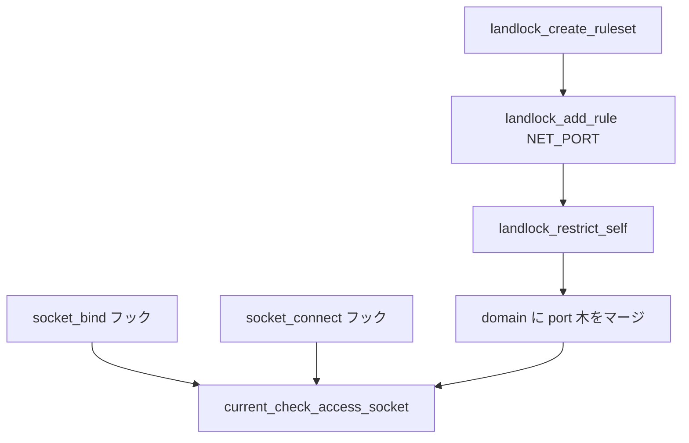

# 第16章 Landlock ネットワーク制御と `landlock_*` syscalls

> **本章で読むソース**
>
> - [`security/landlock/syscalls.c` L145-L155](https://github.com/gregkh/linux/blob/v6.18.38/security/landlock/syscalls.c#L145-L155)
> - [`security/landlock/syscalls.c` L195-L256](https://github.com/gregkh/linux/blob/v6.18.38/security/landlock/syscalls.c#L195-L256)
> - [`security/landlock/syscalls.c` L418-L443](https://github.com/gregkh/linux/blob/v6.18.38/security/landlock/syscalls.c#L418-L443)
> - [`security/landlock/syscalls.c` L495-L569](https://github.com/gregkh/linux/blob/v6.18.38/security/landlock/syscalls.c#L495-L569)
> - [`security/landlock/net.c` L22-L42](https://github.com/gregkh/linux/blob/v6.18.38/security/landlock/net.c#L22-L42)
> - [`security/landlock/net.c` L190-L199](https://github.com/gregkh/linux/blob/v6.18.38/security/landlock/net.c#L190-L199)
> - [`security/landlock/net.c` L214-L227](https://github.com/gregkh/linux/blob/v6.18.38/security/landlock/net.c#L214-L227)

## この章の狙い

Landlock の三 syscall（`landlock_create_ruleset` / `landlock_add_rule` / `landlock_restrict_self`）と、TCP **bind** / **connect** を制御する `net.c` フックを読む。
ruleset FD の設計と `no_new_privs` 前提の自己制限モデルを押さえる。

## 前提

- [第14章：Landlock ruleset と domain](14-landlock-ruleset-domain.md)
- [第15章：Landlock FS アクセス制御](15-landlock-fs-access.md)
- [namespace と cgroup のネットワーク](../../ns-cgroup/README.md)（network namespace の一般論は委譲）

## ruleset ファイルディスクリプタ

ruleset FD はタスク文脈に依存せずルールを積み上げ、読み取り側では `landlock_restrict_self` が同じ FD を参照する再入設計である。

[`security/landlock/syscalls.c` L145-L155](https://github.com/gregkh/linux/blob/v6.18.38/security/landlock/syscalls.c#L145-L155)

```c
/*
 * A ruleset file descriptor enables to build a ruleset by adding (i.e.
 * writing) rule after rule, without relying on the task's context.  This
 * reentrant design is also used in a read way to enforce the ruleset on the
 * current task.
 */
static const struct file_operations ruleset_fops = {
	.release = fop_ruleset_release,
	.read = fop_dummy_read,
	.write = fop_dummy_write,
};
```

## landlock_create_ruleset

`landlock_ruleset_attr` で handled access（FS / net / scope）を宣言し、空 ruleset を anon_inode FD として返す。
`LANDLOCK_CREATE_RULESET_VERSION` 指定時は ABI バージョン番号だけを返す。

[`security/landlock/syscalls.c` L195-L256](https://github.com/gregkh/linux/blob/v6.18.38/security/landlock/syscalls.c#L195-L256)

```c
SYSCALL_DEFINE3(landlock_create_ruleset,
		const struct landlock_ruleset_attr __user *const, attr,
		const size_t, size, const __u32, flags)
{
	struct landlock_ruleset_attr ruleset_attr;
	struct landlock_ruleset *ruleset;
	int err, ruleset_fd;

	/* Build-time checks. */
	build_check_abi();

	if (!is_initialized())
		return -EOPNOTSUPP;

	if (flags) {
		if (attr || size)
			return -EINVAL;

		if (flags == LANDLOCK_CREATE_RULESET_VERSION)
			return landlock_abi_version;

		if (flags == LANDLOCK_CREATE_RULESET_ERRATA)
			return landlock_errata;

		return -EINVAL;
	}

	/* Copies raw user space buffer. */
	err = copy_min_struct_from_user(&ruleset_attr, sizeof(ruleset_attr),
					offsetofend(typeof(ruleset_attr),
						    handled_access_fs),
					attr, size);
	if (err)
		return err;

	/* Checks content (and 32-bits cast). */
	if ((ruleset_attr.handled_access_fs | LANDLOCK_MASK_ACCESS_FS) !=
	    LANDLOCK_MASK_ACCESS_FS)
		return -EINVAL;

	/* Checks network content (and 32-bits cast). */
	if ((ruleset_attr.handled_access_net | LANDLOCK_MASK_ACCESS_NET) !=
	    LANDLOCK_MASK_ACCESS_NET)
		return -EINVAL;

	/* Checks IPC scoping content (and 32-bits cast). */
	if ((ruleset_attr.scoped | LANDLOCK_MASK_SCOPE) != LANDLOCK_MASK_SCOPE)
		return -EINVAL;

	/* Checks arguments and transforms to kernel struct. */
	ruleset = landlock_create_ruleset(ruleset_attr.handled_access_fs,
					  ruleset_attr.handled_access_net,
					  ruleset_attr.scoped);
	if (IS_ERR(ruleset))
		return PTR_ERR(ruleset);

	/* Creates anonymous FD referring to the ruleset. */
	ruleset_fd = anon_inode_getfd("[landlock-ruleset]", &ruleset_fops,
				      ruleset, O_RDWR | O_CLOEXEC);
	if (ruleset_fd < 0)
		landlock_put_ruleset(ruleset);
	return ruleset_fd;
}
```

## landlock_add_rule

`rule_type` で path beneath と net port を切り替え、いずれも対象 ruleset FD へルールを追加する。

[`security/landlock/syscalls.c` L418-L443](https://github.com/gregkh/linux/blob/v6.18.38/security/landlock/syscalls.c#L418-L443)

```c
SYSCALL_DEFINE4(landlock_add_rule, const int, ruleset_fd,
		const enum landlock_rule_type, rule_type,
		const void __user *const, rule_attr, const __u32, flags)
{
	struct landlock_ruleset *ruleset __free(landlock_put_ruleset) = NULL;

	if (!is_initialized())
		return -EOPNOTSUPP;

	/* No flag for now. */
	if (flags)
		return -EINVAL;

	/* Gets and checks the ruleset. */
	ruleset = get_ruleset_from_fd(ruleset_fd, FMODE_CAN_WRITE);
	if (IS_ERR(ruleset))
		return PTR_ERR(ruleset);

	switch (rule_type) {
	case LANDLOCK_RULE_PATH_BENEATH:
		return add_rule_path_beneath(ruleset, rule_attr);
	case LANDLOCK_RULE_NET_PORT:
		return add_rule_net_port(ruleset, rule_attr);
	default:
		return -EINVAL;
	}
}
```

## landlock_restrict_self

`landlock_restrict_self` を呼べるかは認可条件である。
seccomp と同様、呼び出しスレッドが `no_new_privs` でない場合は user namespace の `CAP_SYS_ADMIN` が必要で、どちらも無ければ `-EPERM` になる。
これは exec 後に特権を広げたプロセスが自ら制限を敷き直す入口を絞るためのチェックである。

既存制限の巻き戻し防止は別の機構である。
`landlock_merge_ruleset` は現 domain に新 ruleset を layer として積み上げ、親 domain のルールを継承したうえで制限を追加する方向にしか更新できない。
`commit_creds` で差し替えた domain は credential 経由で子プロセスへ継承される。

[`security/landlock/syscalls.c` L495-L569](https://github.com/gregkh/linux/blob/v6.18.38/security/landlock/syscalls.c#L495-L569)

```c
	if (!task_no_new_privs(current) &&
	    !ns_capable_noaudit(current_user_ns(), CAP_SYS_ADMIN))
		return -EPERM;

	if ((flags | LANDLOCK_MASK_RESTRICT_SELF) !=
	    LANDLOCK_MASK_RESTRICT_SELF)
		return -EINVAL;

	/* Translates "off" flag to boolean. */
	log_same_exec = !(flags & LANDLOCK_RESTRICT_SELF_LOG_SAME_EXEC_OFF);
	/* Translates "on" flag to boolean. */
	log_new_exec = !!(flags & LANDLOCK_RESTRICT_SELF_LOG_NEW_EXEC_ON);
	/* Translates "off" flag to boolean. */
	log_subdomains = !(flags & LANDLOCK_RESTRICT_SELF_LOG_SUBDOMAINS_OFF);

	/*
	 * It is allowed to set LANDLOCK_RESTRICT_SELF_LOG_SUBDOMAINS_OFF with
	 * -1 as ruleset_fd, but no other flag must be set.
	 */
	if (!(ruleset_fd == -1 &&
	      flags == LANDLOCK_RESTRICT_SELF_LOG_SUBDOMAINS_OFF)) {
		/* Gets and checks the ruleset. */
		ruleset = get_ruleset_from_fd(ruleset_fd, FMODE_CAN_READ);
		if (IS_ERR(ruleset))
			return PTR_ERR(ruleset);
	}

	/* Prepares new credentials. */
	new_cred = prepare_creds();
	if (!new_cred)
		return -ENOMEM;

	new_llcred = landlock_cred(new_cred);

#ifdef CONFIG_AUDIT
	prev_log_subdomains = !new_llcred->log_subdomains_off;
	new_llcred->log_subdomains_off = !prev_log_subdomains ||
					 !log_subdomains;
#endif /* CONFIG_AUDIT */

	/*
	 * The only case when a ruleset may not be set is if
	 * LANDLOCK_RESTRICT_SELF_LOG_SUBDOMAINS_OFF is set and ruleset_fd is -1.
	 * We could optimize this case by not calling commit_creds() if this flag
	 * was already set, but it is not worth the complexity.
	 */
	if (!ruleset)
		return commit_creds(new_cred);

	/*
	 * There is no possible race condition while copying and manipulating
	 * the current credentials because they are dedicated per thread.
	 */
	new_dom = landlock_merge_ruleset(new_llcred->domain, ruleset);
	if (IS_ERR(new_dom)) {
		abort_creds(new_cred);
		return PTR_ERR(new_dom);
	}

#ifdef CONFIG_AUDIT
	new_dom->hierarchy->log_same_exec = log_same_exec;
	new_dom->hierarchy->log_new_exec = log_new_exec;
	if ((!log_same_exec && !log_new_exec) || !prev_log_subdomains)
		new_dom->hierarchy->log_status = LANDLOCK_LOG_DISABLED;
#endif /* CONFIG_AUDIT */

	/* Replaces the old (prepared) domain. */
	landlock_put_ruleset(new_llcred->domain);
	new_llcred->domain = new_dom;

#ifdef CONFIG_AUDIT
	new_llcred->domain_exec |= BIT(new_dom->num_layers - 1);
#endif /* CONFIG_AUDIT */

	return commit_creds(new_cred);
}
```

## TCP ポートルール

`landlock_append_net_rule` はポート番号を `htons(port)` でキー化し、inode 木と対になる `root_net_port` へ挿入する。

[`security/landlock/net.c` L22-L42](https://github.com/gregkh/linux/blob/v6.18.38/security/landlock/net.c#L22-L42)

```c
int landlock_append_net_rule(struct landlock_ruleset *const ruleset,
			     const u16 port, access_mask_t access_rights)
{
	int err;
	const struct landlock_id id = {
		.key.data = (__force uintptr_t)htons(port),
		.type = LANDLOCK_KEY_NET_PORT,
	};

	BUILD_BUG_ON(sizeof(port) > sizeof(id.key.data));

	/* Transforms relative access rights to absolute ones. */
	access_rights |= LANDLOCK_MASK_ACCESS_NET &
			 ~landlock_get_net_access_mask(ruleset, 0);

	mutex_lock(&ruleset->lock);
	err = landlock_insert_rule(ruleset, id, access_rights);
	mutex_unlock(&ruleset->lock);

	return err;
}
```

## bind と connect フック

`current_check_access_socket` は TCP ソケットだけを対象に、アドレスからポートを取り出して FS と同様に layer 評価する。

[`security/landlock/net.c` L190-L199](https://github.com/gregkh/linux/blob/v6.18.38/security/landlock/net.c#L190-L199)

```c
	id.key.data = (__force uintptr_t)port;
	BUILD_BUG_ON(sizeof(port) > sizeof(id.key.data));

	rule = landlock_find_rule(subject->domain, id);
	access_request = landlock_init_layer_masks(subject->domain,
						   access_request, &layer_masks,
						   LANDLOCK_KEY_NET_PORT);
	if (landlock_unmask_layers(rule, access_request, &layer_masks,
				   ARRAY_SIZE(layer_masks)))
		return 0;
```

`socket_bind` と `socket_connect` フックがそれぞれ `LANDLOCK_ACCESS_NET_BIND_TCP` と `LANDLOCK_ACCESS_NET_CONNECT_TCP` を要求する。

[`security/landlock/net.c` L214-L227](https://github.com/gregkh/linux/blob/v6.18.38/security/landlock/net.c#L214-L227)

```c
static int hook_socket_bind(struct socket *const sock,
			    struct sockaddr *const address, const int addrlen)
{
	return current_check_access_socket(sock, address, addrlen,
					   LANDLOCK_ACCESS_NET_BIND_TCP);
}

static int hook_socket_connect(struct socket *const sock,
			       struct sockaddr *const address,
			       const int addrlen)
{
	return current_check_access_socket(sock, address, addrlen,
					   LANDLOCK_ACCESS_NET_CONNECT_TCP);
}
```

AF_UNSPEC への connect は TCP 切断相当として常に許可し、bind の IPv4 INADDR_ANY だけは特別扱いする（詳細は `net.c` 内コメント参照）。

## syscall からネットワーク強制まで



## 高速化と最適化の工夫

`copy_min_struct_from_user` は将来の構造体拡張に備え、最小サイズだけ検証してからゼロ埋めコピーする。
net ルールのキーは 16 ビットポートの network byte order 整数であり、inode ポインタ木より比較が軽い。
TCP 以外のソケットは `sk_is_tcp` で即 return し、UDP 等への誤適用を避ける。

## まとめ

Landlock は三 syscall で ruleset を組み立て、restrict で cred に domain を載せる。
ネットワークはポート単位のルールと `socket_bind` / `socket_connect` フックで TCP を制限する。
`landlock_restrict_self` の認可は `no_new_privs` または `CAP_SYS_ADMIN` により入口を絞る。
巻き戻し防止は `landlock_merge_ruleset` の単調な制限追加と、domain の credential 継承で担保する。

## 関連する章

- [第15章：Landlock FS アクセス制御](15-landlock-fs-access.md)
- [`struct key` と keyring 階層](../part05-keys/17-key-keyring-hierarchy.md)
