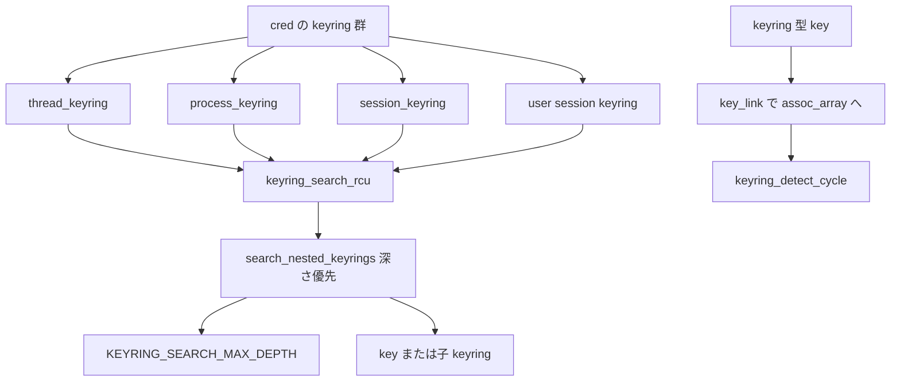

# 第17章 `struct key` と keyring 階層

> **本章で読むソース**
>
> - [`include/linux/key.h` L153-L169](https://github.com/gregkh/linux/blob/v6.18.38/include/linux/key.h#L153-L169)
> - [`include/linux/key.h` L195-L221](https://github.com/gregkh/linux/blob/v6.18.38/include/linux/key.h#L195-L221)
> - [`include/linux/key-type.h` L64-L95](https://github.com/gregkh/linux/blob/v6.18.38/include/linux/key-type.h#L64-L95)
> - [`security/keys/keyring.c` L84-L94](https://github.com/gregkh/linux/blob/v6.18.38/security/keys/keyring.c#L84-L94)
> - [`security/keys/keyring.c` L1439-L1469](https://github.com/gregkh/linux/blob/v6.18.38/security/keys/keyring.c#L1439-L1469)
> - [`security/keys/permission.c` L43-L90](https://github.com/gregkh/linux/blob/v6.18.38/security/keys/permission.c#L43-L90)
> - [`security/keys/keyring.c` L25-L28](https://github.com/gregkh/linux/blob/v6.18.38/security/keys/keyring.c#L25-L28)
> - [`security/keys/keyring.c` L663-L670](https://github.com/gregkh/linux/blob/v6.18.38/security/keys/keyring.c#L663-L670)
> - [`security/keys/keyring.c` L786-L792](https://github.com/gregkh/linux/blob/v6.18.38/security/keys/keyring.c#L786-L792)
> - [`security/keys/keyring.c` L902-L927](https://github.com/gregkh/linux/blob/v6.18.38/security/keys/keyring.c#L902-L927)
> - [`security/keys/keyring.c` L1217-L1235](https://github.com/gregkh/linux/blob/v6.18.38/security/keys/keyring.c#L1217-L1235)
> - [`security/keys/process_keys.c` L422-L462](https://github.com/gregkh/linux/blob/v6.18.38/security/keys/process_keys.c#L422-L462)

## この章の狙い

カーネル keys サブシステムの中心である `struct key` と `key_type`、keyring の階層検索、`key_ref` による所有（possession）表現を読む。
`key_link` と `key_task_permission` がリンクとアクセス判定をどう担うかを押さえる。

## 前提

- [第2章：`cred` と権限判定の入口](../part00-foundation/02-cred-capable-entry.md) の `struct cred` と keyring フィールド
- [第5章：`security_*` ラッパとフック実行規約](../part01-lsm/05-security-wrappers-call-convention.md) の `security_key_permission`

## key_ref と possession

`key_ref_t` は `struct key` ポインタの最下位ビットに possession フラグを載せた参照である。
プロセスが keyring 経由で鍵を「所持」しているかを、追加の lookup なしで判定できる。

[`include/linux/key.h` L153-L169](https://github.com/gregkh/linux/blob/v6.18.38/include/linux/key.h#L153-L169)

```c
typedef struct __key_reference_with_attributes *key_ref_t;

static inline key_ref_t make_key_ref(const struct key *key,
				     bool possession)
{
	return (key_ref_t) ((unsigned long) key | possession);
}

static inline struct key *key_ref_to_ptr(const key_ref_t key_ref)
{
	return (struct key *) ((unsigned long) key_ref & ~1UL);
}

static inline bool is_key_possessed(const key_ref_t key_ref)
{
	return (unsigned long) key_ref & 1UL;
}
```

## struct key

各 key は serial、`perm`、payload、および type 固有データを持つ。
keyring 型の key は `assoc_array keys` で子 key へのリンクを保持する。

[`include/linux/key.h` L195-L221](https://github.com/gregkh/linux/blob/v6.18.38/include/linux/key.h#L195-L221)

```c
struct key {
	refcount_t		usage;		/* number of references */
	key_serial_t		serial;		/* key serial number */
	union {
		struct list_head graveyard_link;
		struct rb_node	serial_node;
	};
#ifdef CONFIG_KEY_NOTIFICATIONS
	struct watch_list	*watchers;	/* Entities watching this key for changes */
#endif
	struct rw_semaphore	sem;		/* change vs change sem */
	struct key_user		*user;		/* owner of this key */
	void			*security;	/* security data for this key */
	union {
		time64_t	expiry;		/* time at which key expires (or 0) */
		time64_t	revoked_at;	/* time at which key was revoked */
	};
	time64_t		last_used_at;	/* last time used for LRU keyring discard */
	kuid_t			uid;
	kgid_t			gid;
	key_perm_t		perm;		/* access permissions */
	unsigned short		quotalen;	/* length added to quota */
	unsigned short		datalen;	/* payload data length
						 * - may not match RCU dereferenced payload
						 * - payload should contain own length
						 */
	short			state;		/* Key state (+) or rejection error (-) */
```

## key_type

`key_type` は preparse、instantiate、update、read 等のコールバック集合である。
keyring 自身も `key_type_keyring` として一つの type として登録される。

[`include/linux/key-type.h` L64-L95](https://github.com/gregkh/linux/blob/v6.18.38/include/linux/key-type.h#L64-L95)

```c
struct key_type {
	/* name of the type */
	const char *name;

	/* default payload length for quota precalculation (optional)
	 * - this can be used instead of calling key_payload_reserve(), that
	 *   function only needs to be called if the real datalen is different
	 */
	size_t def_datalen;

	unsigned int flags;
#define KEY_TYPE_NET_DOMAIN	0x00000001 /* Keys of this type have a net namespace domain */
#define KEY_TYPE_INSTANT_REAP	0x00000002 /* Keys of this type don't have a delay after expiring */

	/* vet a description */
	int (*vet_description)(const char *description);

	/* Preparse the data blob from userspace that is to be the payload,
	 * generating a proposed description and payload that will be handed to
	 * the instantiate() and update() ops.
	 */
	int (*preparse)(struct key_preparsed_payload *prep);

	/* Free a preparse data structure.
	 */
	void (*free_preparse)(struct key_preparsed_payload *prep);

	/* instantiate a key of this type
	 * - this method should call key_payload_reserve() to determine if the
	 *   user's quota will hold the payload
	 */
	int (*instantiate)(struct key *key, struct key_preparsed_payload *prep);
```

[`security/keys/keyring.c` L84-L94](https://github.com/gregkh/linux/blob/v6.18.38/security/keys/keyring.c#L84-L94)

```c
struct key_type key_type_keyring = {
	.name		= "keyring",
	.def_datalen	= 0,
	.preparse	= keyring_preparse,
	.free_preparse	= keyring_free_preparse,
	.instantiate	= keyring_instantiate,
	.revoke		= keyring_revoke,
	.destroy	= keyring_destroy,
	.describe	= keyring_describe,
	.read		= keyring_read,
};
```

## keyring 階層の検索

`search_cred_keyrings_rcu` は thread、process、session、user session の順に keyring を辿る。
見つかった key には possession ビット付き `key_ref` が返る。

[`security/keys/process_keys.c` L422-L462](https://github.com/gregkh/linux/blob/v6.18.38/security/keys/process_keys.c#L422-L462)

```c
key_ref_t search_cred_keyrings_rcu(struct keyring_search_context *ctx)
{
	struct key *user_session;
	key_ref_t key_ref, ret, err;
	const struct cred *cred = ctx->cred;

	/* we want to return -EAGAIN or -ENOKEY if any of the keyrings were
	 * searchable, but we failed to find a key or we found a negative key;
	 * otherwise we want to return a sample error (probably -EACCES) if
	 * none of the keyrings were searchable
	 *
	 * in terms of priority: success > -ENOKEY > -EAGAIN > other error
	 */
	key_ref = NULL;
	ret = NULL;
	err = ERR_PTR(-EAGAIN);

	/* search the thread keyring first */
	if (cred->thread_keyring) {
		key_ref = keyring_search_rcu(
			make_key_ref(cred->thread_keyring, 1), ctx);
		if (!IS_ERR(key_ref))
			goto found;

		switch (PTR_ERR(key_ref)) {
		case -EAGAIN: /* no key */
		case -ENOKEY: /* negative key */
			ret = key_ref;
			break;
		default:
			err = key_ref;
			break;
		}
	}

	/* search the process keyring second */
	if (cred->process_keyring) {
		key_ref = keyring_search_rcu(
			make_key_ref(cred->process_keyring, 1), ctx);
		if (!IS_ERR(key_ref))
			goto found;
```

`search_cred_keyrings_rcu` は cred 内の thread / process / session / user session keyring を順に選び、各 keyring で `keyring_search_rcu` を呼ぶ入口である。
階層探索の本体は `keyring_search_rcu` が `search_nested_keyrings` に委譲し、`assoc_array` を深さ優先で辿って子 keyring を再帰する。
深さは `KEYRING_SEARCH_MAX_DEPTH` で打ち切り、リンク時は `keyring_detect_cycle` で循環を拒否する。

[`security/keys/keyring.c` L25-L28](https://github.com/gregkh/linux/blob/v6.18.38/security/keys/keyring.c#L25-L28)

```c
 * When plumbing the depths of the key tree, this sets a hard limit
 * set on how deep we're willing to go.
 */
#define KEYRING_SEARCH_MAX_DEPTH 6
```

[`security/keys/keyring.c` L663-L670](https://github.com/gregkh/linux/blob/v6.18.38/security/keys/keyring.c#L663-L670)

```c
static bool search_nested_keyrings(struct key *keyring,
				   struct keyring_search_context *ctx)
{
	struct {
		struct key *keyring;
		struct assoc_array_node *node;
		int slot;
	} stack[KEYRING_SEARCH_MAX_DEPTH];
```

[`security/keys/keyring.c` L786-L792](https://github.com/gregkh/linux/blob/v6.18.38/security/keys/keyring.c#L786-L792)

```c
		if (sp >= KEYRING_SEARCH_MAX_DEPTH) {
			if (ctx->flags & KEYRING_SEARCH_DETECT_TOO_DEEP) {
				ctx->result = ERR_PTR(-ELOOP);
				return false;
			}
			goto not_this_keyring;
		}
```

[`security/keys/keyring.c` L902-L927](https://github.com/gregkh/linux/blob/v6.18.38/security/keys/keyring.c#L902-L927)

```c
key_ref_t keyring_search_rcu(key_ref_t keyring_ref,
			     struct keyring_search_context *ctx)
{
	struct key *keyring;
	long err;

	ctx->iterator = keyring_search_iterator;
	ctx->possessed = is_key_possessed(keyring_ref);
	ctx->result = ERR_PTR(-EAGAIN);

	keyring = key_ref_to_ptr(keyring_ref);
	key_check(keyring);

	if (keyring->type != &key_type_keyring)
		return ERR_PTR(-ENOTDIR);

	if (!(ctx->flags & KEYRING_SEARCH_NO_CHECK_PERM)) {
		err = key_task_permission(keyring_ref, ctx->cred, KEY_NEED_SEARCH);
		if (err < 0)
			return ERR_PTR(err);
	}

	ctx->now = ktime_get_real_seconds();
	if (search_nested_keyrings(keyring, ctx))
		__key_get(key_ref_to_ptr(ctx->result));
	return ctx->result;
}
```

[`security/keys/keyring.c` L1217-L1235](https://github.com/gregkh/linux/blob/v6.18.38/security/keys/keyring.c#L1217-L1235)

```c
static int keyring_detect_cycle(struct key *A, struct key *B)
{
	struct keyring_search_context ctx = {
		.index_key		= A->index_key,
		.match_data.raw_data	= A,
		.match_data.lookup_type = KEYRING_SEARCH_LOOKUP_DIRECT,
		.iterator		= keyring_detect_cycle_iterator,
		.flags			= (KEYRING_SEARCH_NO_STATE_CHECK |
					   KEYRING_SEARCH_NO_UPDATE_TIME |
					   KEYRING_SEARCH_NO_CHECK_PERM |
					   KEYRING_SEARCH_DETECT_TOO_DEEP |
					   KEYRING_SEARCH_RECURSE),
	};

	rcu_read_lock();
	search_nested_keyrings(B, &ctx);
	rcu_read_unlock();
	return PTR_ERR(ctx.result) == -EAGAIN ? 0 : PTR_ERR(ctx.result);
}
```

## key_link

keyring へのリンクは `assoc_array` 編集 API で行われる。
restriction チェックと live key 検証を通過した後、`__key_link` が子 key を挿入する。

[`security/keys/keyring.c` L1439-L1469](https://github.com/gregkh/linux/blob/v6.18.38/security/keys/keyring.c#L1439-L1469)

```c
int key_link(struct key *keyring, struct key *key)
{
	struct assoc_array_edit *edit = NULL;
	int ret;

	kenter("{%d,%d}", keyring->serial, refcount_read(&keyring->usage));

	key_check(keyring);
	key_check(key);

	ret = __key_link_lock(keyring, &key->index_key);
	if (ret < 0)
		goto error;

	ret = __key_link_begin(keyring, &key->index_key, &edit);
	if (ret < 0)
		goto error_end;

	kdebug("begun {%d,%d}", keyring->serial, refcount_read(&keyring->usage));
	ret = __key_link_check_restriction(keyring, key);
	if (ret == 0)
		ret = __key_link_check_live_key(keyring, key);
	if (ret == 0)
		__key_link(keyring, key, &edit);

error_end:
	__key_link_end(keyring, &key->index_key, edit);
error:
	kleave(" = %d {%d,%d}", ret, keyring->serial, refcount_read(&keyring->usage));
	return ret;
}
```

## key_task_permission

権限は `perm` の 8 ビット単位（user / group / other / possessor）で評価される。
possessor ビットが立つ `key_ref` では上位 8 ビットが加算的に適用され、最後に `security_key_permission` へ委譲する。

[`security/keys/permission.c` L43-L90](https://github.com/gregkh/linux/blob/v6.18.38/security/keys/permission.c#L43-L90)

```c
	case KEY_NEED_VIEW:	mask = KEY_OTH_VIEW;	break;
	case KEY_NEED_READ:	mask = KEY_OTH_READ;	break;
	case KEY_NEED_WRITE:	mask = KEY_OTH_WRITE;	break;
	case KEY_NEED_SEARCH:	mask = KEY_OTH_SEARCH;	break;
	case KEY_NEED_LINK:	mask = KEY_OTH_LINK;	break;
	case KEY_NEED_SETATTR:	mask = KEY_OTH_SETATTR;	break;
	}

	key = key_ref_to_ptr(key_ref);

	/* use the second 8-bits of permissions for keys the caller owns */
	if (uid_eq(key->uid, cred->fsuid)) {
		kperm = key->perm >> 16;
		goto use_these_perms;
	}

	/* use the third 8-bits of permissions for keys the caller has a group
	 * membership in common with */
	if (gid_valid(key->gid) && key->perm & KEY_GRP_ALL) {
		if (gid_eq(key->gid, cred->fsgid)) {
			kperm = key->perm >> 8;
			goto use_these_perms;
		}

		ret = groups_search(cred->group_info, key->gid);
		if (ret) {
			kperm = key->perm >> 8;
			goto use_these_perms;
		}
	}

	/* otherwise use the least-significant 8-bits */
	kperm = key->perm;

use_these_perms:

	/* use the top 8-bits of permissions for keys the caller possesses
	 * - possessor permissions are additive with other permissions
	 */
	if (is_key_possessed(key_ref))
		kperm |= key->perm >> 24;

	if ((kperm & mask) != mask)
		return -EACCES;

	/* let LSM be the final arbiter */
lsm:
	return security_key_permission(key_ref, cred, need_perm);
```

## keyring 階層とリンク



## 高速化と最適化の工夫

keyring の子集合は `assoc_array` で保持され、名前付き検索を効率化する。
`search_cred_keyrings_rcu` は RCU 読み取り中に keyring を辿り、シリアル木ロックを避ける。
`search_nested_keyrings` はスタック配列で深さ優先探索し、`KEYRING_SEARCH_MAX_DEPTH` で打ち切る。
`keyring_detect_cycle` はリンク前に `search_nested_keyrings` を再利用し、循環参照を拒否する。
`key_ref` の LSB possession フラグは、permission 判定で追加の keyring 走査を省略する。

## まとめ

`struct key` は serial と `perm` を持つ汎用オブジェクトであり、keyring 型は `assoc_array` で階層を形成する。
検索は cred に束ねられた複数 keyring を優先順に走査し、`keyring_search_rcu` が `search_nested_keyrings` で階層を深さ優先探索する。
`key_link` と `key_task_permission` がリンク操作とアクセス制御の本体である。

## 関連する章

- [第16章：Landlock ネットワーク制御と `landlock_*` syscalls](../part04-landlock/16-landlock-net-syscalls.md)
- [`keyctl` システムコール群](18-keyctl-syscalls.md)
