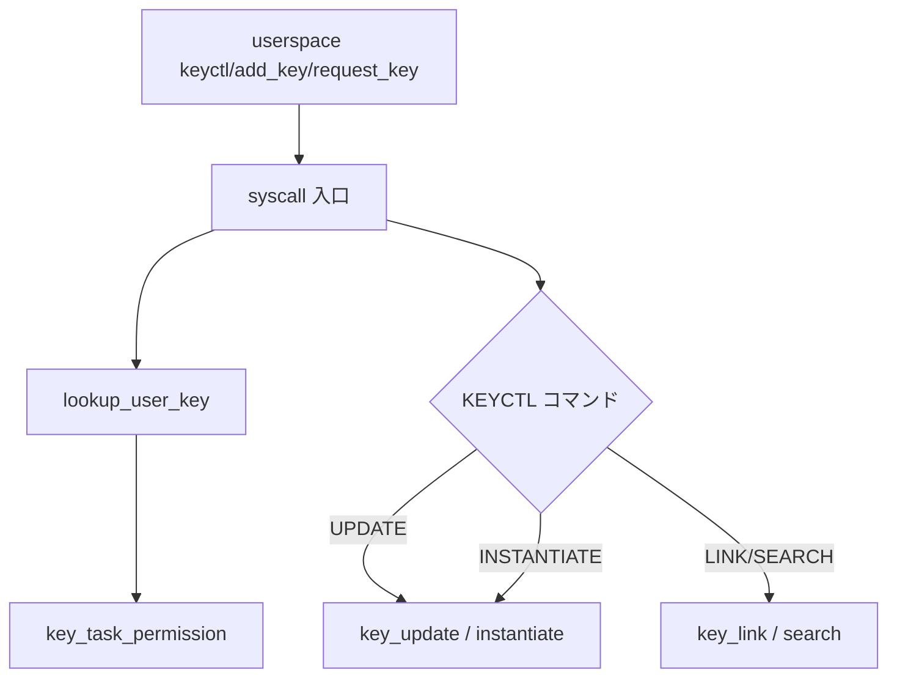

# 第18章 `keyctl` システムコール群

> **本章で読むソース**
>
> - [`security/keys/keyctl.c` L74-L92](https://github.com/gregkh/linux/blob/v6.18.38/security/keys/keyctl.c#L74-L92)
> - [`security/keys/keyctl.c` L167-L177](https://github.com/gregkh/linux/blob/v6.18.38/security/keys/keyctl.c#L167-L177)
> - [`security/keys/keyctl.c` L1886-L1945](https://github.com/gregkh/linux/blob/v6.18.38/security/keys/keyctl.c#L1886-L1945)
> - [`security/keys/keyctl.c` L515-L536](https://github.com/gregkh/linux/blob/v6.18.38/security/keys/keyctl.c#L515-L536)
> - [`security/keys/key.c` L224-L245](https://github.com/gregkh/linux/blob/v6.18.38/security/keys/key.c#L224-L245)
> - [`security/keys/key.c` L1013-L1025](https://github.com/gregkh/linux/blob/v6.18.38/security/keys/key.c#L1013-L1025)
> - [`security/keys/keyctl.c` L325-L364](https://github.com/gregkh/linux/blob/v6.18.38/security/keys/keyctl.c#L325-L364)
> - [`security/keys/keyctl.c` L716-L771](https://github.com/gregkh/linux/blob/v6.18.38/security/keys/keyctl.c#L716-L771)
> - [`security/keys/keyctl.c` L825-L849](https://github.com/gregkh/linux/blob/v6.18.38/security/keys/keyctl.c#L825-L849)
> - [`security/keys/keyctl.c` L1173-L1230](https://github.com/gregkh/linux/blob/v6.18.38/security/keys/keyctl.c#L1173-L1230)
> - [`security/keys/keyctl.c` L1321-L1324](https://github.com/gregkh/linux/blob/v6.18.38/security/keys/keyctl.c#L1321-L1324)
> - [`security/keys/process_keys.c` L744-L805](https://github.com/gregkh/linux/blob/v6.18.38/security/keys/process_keys.c#L744-L805)

## この章の狙い

ユーザー空間から keys を操作する `add_key`、`request_key`、`keyctl` の入口と、`KEYCTL_*` コマンドのディスパッチを読む。
key の生成、更新、検索、リンク、権限変更がどのヘルパへ委譲されるかを押さえる。

## 前提

- [第17章：`struct key` と keyring 階層](17-key-keyring-hierarchy.md)
- [第2章：`cred` と権限判定の入口](../part00-foundation/02-cred-capable-entry.md)

## add_key

`add_key` は type、description、payload をユーザー空間から取り込み、指定 keyring へ key を作成または更新する。
payload 長は 1MiB 未満に制限される。

[`security/keys/keyctl.c` L74-L92](https://github.com/gregkh/linux/blob/v6.18.38/security/keys/keyctl.c#L74-L92)

```c
SYSCALL_DEFINE5(add_key, const char __user *, _type,
		const char __user *, _description,
		const void __user *, _payload,
		size_t, plen,
		key_serial_t, ringid)
{
	key_ref_t keyring_ref, key_ref;
	char type[32], *description;
	void *payload;
	long ret;

	ret = -EINVAL;
	if (plen > 1024 * 1024 - 1)
		goto error;

	/* draw all the data into kernel space */
	ret = key_get_type_from_user(type, _type, sizeof(type));
	if (ret < 0)
		goto error;
```

## request_key システムコール

`request_key` は既存 key を検索し、見つからなければ callout 情報付きで userspace 構築を起動する。
`keyctl.c` の syscall 実装は内部で `request_key_and_link` へ委譲する（第19章）。

[`security/keys/keyctl.c` L167-L177](https://github.com/gregkh/linux/blob/v6.18.38/security/keys/keyctl.c#L167-L177)

```c
SYSCALL_DEFINE4(request_key, const char __user *, _type,
		const char __user *, _description,
		const char __user *, _callout_info,
		key_serial_t, destringid)
{
	struct key_type *ktype;
	struct key *key;
	key_ref_t dest_ref;
	size_t callout_len;
	char type[32], *description, *callout_info;
	long ret;
```

## keyctl ディスパッチ

`keyctl(2)` は `option` で `KEYCTL_*` コマンドを振り分ける。
以下は代表コマンドの実処理である。

[`security/keys/keyctl.c` L1886-L1945](https://github.com/gregkh/linux/blob/v6.18.38/security/keys/keyctl.c#L1886-L1945)

```c
SYSCALL_DEFINE5(keyctl, int, option, unsigned long, arg2, unsigned long, arg3,
		unsigned long, arg4, unsigned long, arg5)
{
	switch (option) {
	case KEYCTL_GET_KEYRING_ID:
		return keyctl_get_keyring_ID((key_serial_t) arg2,
					     (int) arg3);

	case KEYCTL_JOIN_SESSION_KEYRING:
		return keyctl_join_session_keyring((const char __user *) arg2);

	case KEYCTL_UPDATE:
		return keyctl_update_key((key_serial_t) arg2,
					 (const void __user *) arg3,
					 (size_t) arg4);

	case KEYCTL_REVOKE:
		return keyctl_revoke_key((key_serial_t) arg2);

	case KEYCTL_DESCRIBE:
		return keyctl_describe_key((key_serial_t) arg2,
					   (char __user *) arg3,
					   (unsigned) arg4);

	case KEYCTL_CLEAR:
		return keyctl_keyring_clear((key_serial_t) arg2);

	case KEYCTL_LINK:
		return keyctl_keyring_link((key_serial_t) arg2,
					   (key_serial_t) arg3);

	case KEYCTL_UNLINK:
		return keyctl_keyring_unlink((key_serial_t) arg2,
					     (key_serial_t) arg3);

	case KEYCTL_SEARCH:
		return keyctl_keyring_search((key_serial_t) arg2,
					     (const char __user *) arg3,
					     (const char __user *) arg4,
					     (key_serial_t) arg5);

	case KEYCTL_READ:
		return keyctl_read_key((key_serial_t) arg2,
				       (char __user *) arg3,
				       (size_t) arg4);

	case KEYCTL_CHOWN:
		return keyctl_chown_key((key_serial_t) arg2,
					(uid_t) arg3,
					(gid_t) arg4);

	case KEYCTL_SETPERM:
		return keyctl_setperm_key((key_serial_t) arg2,
					  (key_perm_t) arg3);

	case KEYCTL_INSTANTIATE:
		return keyctl_instantiate_key((key_serial_t) arg2,
					      (const void __user *) arg3,
					      (size_t) arg4,
					      (key_serial_t) arg5);
```

## KEYCTL_UPDATE

`KEYCTL_UPDATE` は `lookup_user_key` で書き込み権限を確認したうえで `key_update` へ委譲する。
`key_update` は type 固有の `update` コールバックを呼ぶ。

[`security/keys/keyctl.c` L325-L364](https://github.com/gregkh/linux/blob/v6.18.38/security/keys/keyctl.c#L325-L364)

```c
long keyctl_update_key(key_serial_t id,
		       const void __user *_payload,
		       size_t plen)
{
	key_ref_t key_ref;
	void *payload;
	long ret;

	ret = -EINVAL;
	if (plen > PAGE_SIZE)
		goto error;

	/* pull the payload in if one was supplied */
	payload = NULL;
	if (plen) {
		ret = -ENOMEM;
		payload = kvmalloc(plen, GFP_KERNEL);
		if (!payload)
			goto error;

		ret = -EFAULT;
		if (copy_from_user(payload, _payload, plen) != 0)
			goto error2;
	}

	/* find the target key (which must be writable) */
	key_ref = lookup_user_key(id, 0, KEY_NEED_WRITE);
	if (IS_ERR(key_ref)) {
		ret = PTR_ERR(key_ref);
		goto error2;
	}

	/* update the key */
	ret = key_update(key_ref, payload, plen);

	key_ref_put(key_ref);
error2:
	kvfree_sensitive(payload, plen);
error:
	return ret;
}
```

## KEYCTL_READ

`KEYCTL_READ` は `lookup_user_key` で key を解決し、Read 権限または Search 経由の読み取り可否を判定する。
許可されれば type 固有の `read` コールバックが payload を返す。

[`security/keys/keyctl.c` L825-L849](https://github.com/gregkh/linux/blob/v6.18.38/security/keys/keyctl.c#L825-L849)

```c
long keyctl_read_key(key_serial_t keyid, char __user *buffer, size_t buflen)
{
	struct key *key;
	key_ref_t key_ref;
	long ret;
	char *key_data = NULL;
	size_t key_data_len;

	/* find the key first */
	key_ref = lookup_user_key(keyid, 0, KEY_DEFER_PERM_CHECK);
	if (IS_ERR(key_ref)) {
		ret = -ENOKEY;
		goto out;
	}

	key = key_ref_to_ptr(key_ref);

	ret = key_read_state(key);
	if (ret < 0)
		goto key_put_out; /* Negatively instantiated */

	/* see if we can read it directly */
	ret = key_permission(key_ref, KEY_NEED_READ);
	if (ret == 0)
		goto can_read_key;
```

## KEYCTL_SEARCH

`KEYCTL_SEARCH` は起点 keyring から `keyring_search` で階層検索し、見つかった key を任意の dest keyring へ `key_link` する。

[`security/keys/keyctl.c` L716-L771](https://github.com/gregkh/linux/blob/v6.18.38/security/keys/keyctl.c#L716-L771)

```c
long keyctl_keyring_search(key_serial_t ringid,
			   const char __user *_type,
			   const char __user *_description,
			   key_serial_t destringid)
{
	struct key_type *ktype;
	key_ref_t keyring_ref, key_ref, dest_ref;
	char type[32], *description;
	long ret;

	/* pull the type and description into kernel space */
	ret = key_get_type_from_user(type, _type, sizeof(type));
	if (ret < 0)
		goto error;

	description = strndup_user(_description, KEY_MAX_DESC_SIZE);
	if (IS_ERR(description)) {
		ret = PTR_ERR(description);
		goto error;
	}

	/* get the keyring at which to begin the search */
	keyring_ref = lookup_user_key(ringid, 0, KEY_NEED_SEARCH);
	if (IS_ERR(keyring_ref)) {
		ret = PTR_ERR(keyring_ref);
		goto error2;
	}

	/* get the destination keyring if specified */
	dest_ref = NULL;
	if (destringid) {
		dest_ref = lookup_user_key(destringid, KEY_LOOKUP_CREATE,
					   KEY_NEED_WRITE);
		if (IS_ERR(dest_ref)) {
			ret = PTR_ERR(dest_ref);
			goto error3;
		}
	}

	/* find the key type */
	ktype = key_type_lookup(type);
	if (IS_ERR(ktype)) {
		ret = PTR_ERR(ktype);
		goto error4;
	}

	/* do the search */
	key_ref = keyring_search(keyring_ref, ktype, description, true);
	if (IS_ERR(key_ref)) {
		ret = PTR_ERR(key_ref);

		/* treat lack or presence of a negative key the same */
		if (ret == -EAGAIN)
			ret = -ENOKEY;
		goto error5;
	}
```

## KEYCTL_INSTANTIATE と KEYCTL_NEGATE

`KEYCTL_INSTANTIATE` は `request_key_auth` による構築権限を前提に `key_instantiate_and_link` で key を完成させる。
`KEYCTL_NEGATE` は同じ権限で negative key を作成し、一定時間 `request_key` の再試行を抑止する。

[`security/keys/keyctl.c` L1173-L1230](https://github.com/gregkh/linux/blob/v6.18.38/security/keys/keyctl.c#L1173-L1230)

```c
static long keyctl_instantiate_key_common(key_serial_t id,
				   struct iov_iter *from,
				   key_serial_t ringid)
{
	const struct cred *cred = current_cred();
	struct request_key_auth *rka;
	struct key *instkey, *dest_keyring;
	size_t plen = from ? iov_iter_count(from) : 0;
	void *payload;
	long ret;

	kenter("%d,,%zu,%d", id, plen, ringid);

	if (!plen)
		from = NULL;

	ret = -EINVAL;
	if (plen > 1024 * 1024 - 1)
		goto error;

	/* the appropriate instantiation authorisation key must have been
	 * assumed before calling this */
	ret = -EPERM;
	instkey = cred->request_key_auth;
	if (!instkey)
		goto error;

	rka = request_key_auth_get(instkey);
	if (!rka) {
		ret = -EKEYREVOKED;
		goto error;
	}
	if (rka->target_key->serial != id)
		goto error_put_rka;

	/* pull the payload in if one was supplied */
	payload = NULL;

	if (from) {
		ret = -ENOMEM;
		payload = kvmalloc(plen, GFP_KERNEL);
		if (!payload)
			goto error_put_rka;

		ret = -EFAULT;
		if (!copy_from_iter_full(payload, plen, from))
			goto error2;
	}

	/* find the destination keyring amongst those belonging to the
	 * requesting task */
	ret = get_instantiation_keyring(ringid, rka, &dest_keyring);
	if (ret < 0)
		goto error2;

	/* instantiate the key and link it into a keyring */
	ret = key_instantiate_and_link(rka->target_key, payload, plen,
				       dest_keyring, instkey);
```

[`security/keys/keyctl.c` L1321-L1324](https://github.com/gregkh/linux/blob/v6.18.38/security/keys/keyctl.c#L1321-L1324)

```c
long keyctl_negate_key(key_serial_t id, unsigned timeout, key_serial_t ringid)
{
	return keyctl_reject_key(id, timeout, ENOKEY, ringid);
}
```

## KEYCTL_LINK

`KEYCTL_LINK` は serial で key と keyring を解決し、`key_link` で関連付ける。
双方に対して `lookup_user_key` が権限チェックを行う。

[`security/keys/keyctl.c` L515-L539](https://github.com/gregkh/linux/blob/v6.18.38/security/keys/keyctl.c#L515-L539)

```c
long keyctl_keyring_link(key_serial_t id, key_serial_t ringid)
{
	key_ref_t keyring_ref, key_ref;
	long ret;

	keyring_ref = lookup_user_key(ringid, KEY_LOOKUP_CREATE, KEY_NEED_WRITE);
	if (IS_ERR(keyring_ref)) {
		ret = PTR_ERR(keyring_ref);
		goto error;
	}

	key_ref = lookup_user_key(id, KEY_LOOKUP_CREATE, KEY_NEED_LINK);
	if (IS_ERR(key_ref)) {
		ret = PTR_ERR(key_ref);
		goto error2;
	}

	ret = key_link(key_ref_to_ptr(keyring_ref), key_ref_to_ptr(key_ref));

	key_ref_put(key_ref);
error2:
	key_ref_put(keyring_ref);
error:
	return ret;
}
```

## key_alloc と key_create_or_update

カーネル内部の key 生成は `key_alloc` で quota と description を検証してから `struct key` を確保する。
`key_create_or_update` は既存 key があれば update、なければ instantiate へ進む。

[`security/keys/key.c` L224-L245](https://github.com/gregkh/linux/blob/v6.18.38/security/keys/key.c#L224-L245)

```c
struct key *key_alloc(struct key_type *type, const char *desc,
		      kuid_t uid, kgid_t gid, const struct cred *cred,
		      key_perm_t perm, unsigned long flags,
		      struct key_restriction *restrict_link)
{
	struct key_user *user = NULL;
	struct key *key;
	size_t desclen, quotalen;
	int ret;
	unsigned long irqflags;

	key = ERR_PTR(-EINVAL);
	if (!desc || !*desc)
		goto error;

	if (type->vet_description) {
		ret = type->vet_description(desc);
		if (ret < 0) {
			key = ERR_PTR(ret);
			goto error;
		}
	}
```

[`security/keys/key.c` L1013-L1023](https://github.com/gregkh/linux/blob/v6.18.38/security/keys/key.c#L1013-L1023)

```c
key_ref_t key_create_or_update(key_ref_t keyring_ref,
			       const char *type,
			       const char *description,
			       const void *payload,
			       size_t plen,
			       key_perm_t perm,
			       unsigned long flags)
{
	return __key_create_or_update(keyring_ref, type, description, payload,
				      plen, perm, flags, true);
}
```

## lookup_user_key

`lookup_user_key` は serial の符号で解決経路を分ける。
正の serial は `key_lookup` で serial 木から直接引き、所持確認のため `search_process_keyrings_rcu` を追加で走る。
負の `KEY_SPEC_*` は cred 内の keyring を直接参照する。
どちらの経路も最後に `key_task_permission` へ合流する。

[`security/keys/process_keys.c` L611-L646](https://github.com/gregkh/linux/blob/v6.18.38/security/keys/process_keys.c#L611-L646)

```c
key_ref_t lookup_user_key(key_serial_t id, unsigned long lflags,
			  enum key_need_perm need_perm)
{
	struct keyring_search_context ctx = {
		.match_data.cmp		= lookup_user_key_possessed,
		.match_data.lookup_type	= KEYRING_SEARCH_LOOKUP_DIRECT,
		.flags			= (KEYRING_SEARCH_NO_STATE_CHECK |
					   KEYRING_SEARCH_RECURSE),
	};
	struct request_key_auth *rka;
	struct key *key, *user_session;
	key_ref_t key_ref, skey_ref;
	int ret;

try_again:
	ctx.cred = get_current_cred();
	key_ref = ERR_PTR(-ENOKEY);

	switch (id) {
	case KEY_SPEC_THREAD_KEYRING:
		if (!ctx.cred->thread_keyring) {
			if (!(lflags & KEY_LOOKUP_CREATE))
				goto error;

			ret = install_thread_keyring();
			if (ret < 0) {
				key_ref = ERR_PTR(ret);
				goto error;
			}
			goto reget_creds;
		}

		key = ctx.cred->thread_keyring;
		__key_get(key);
		key_ref = make_key_ref(key, 1);
		break;
```

[`security/keys/process_keys.c` L744-L805](https://github.com/gregkh/linux/blob/v6.18.38/security/keys/process_keys.c#L744-L805)

```c
	default:
		key_ref = ERR_PTR(-EINVAL);
		if (id < 1)
			goto error;

		key = key_lookup(id);
		if (IS_ERR(key)) {
			key_ref = ERR_CAST(key);
			goto error;
		}

		key_ref = make_key_ref(key, 0);

		/* check to see if we possess the key */
		ctx.index_key			= key->index_key;
		ctx.match_data.raw_data		= key;
		kdebug("check possessed");
		rcu_read_lock();
		skey_ref = search_process_keyrings_rcu(&ctx);
		rcu_read_unlock();
		kdebug("possessed=%p", skey_ref);

		if (!IS_ERR(skey_ref)) {
			key_put(key);
			key_ref = skey_ref;
		}

		break;
	}

	/* unlink does not use the nominated key in any way, so can skip all
	 * the permission checks as it is only concerned with the keyring */
	if (need_perm != KEY_NEED_UNLINK) {
		if (!(lflags & KEY_LOOKUP_PARTIAL)) {
			ret = wait_for_key_construction(key, true);
			switch (ret) {
			case -ERESTARTSYS:
				goto invalid_key;
			default:
				if (need_perm != KEY_AUTHTOKEN_OVERRIDE &&
				    need_perm != KEY_DEFER_PERM_CHECK)
					goto invalid_key;
				break;
			case 0:
				break;
			}
		} else if (need_perm != KEY_DEFER_PERM_CHECK) {
			ret = key_validate(key);
			if (ret < 0)
				goto invalid_key;
		}

		ret = -EIO;
		if (!(lflags & KEY_LOOKUP_PARTIAL) &&
		    key_read_state(key) == KEY_IS_UNINSTANTIATED)
			goto invalid_key;
	}

	/* check the permissions */
	ret = key_task_permission(key_ref, ctx.cred, need_perm);
	if (ret < 0)
		goto invalid_key;
```

## keyctl コマンドの流れ



## 高速化と最適化の工夫

`keyctl_capabilities` はビルド時機能をビットマップで公開し、userspace が未サポート ioctl を避けられる。
`lookup_user_key` の `KEY_SPEC_*` 定数は cred 内 keyring への直接参照を提供し、正の serial 木探索を省略する。
`key_create_or_update` は同一 description の既存 key を update 経路へ寄せ、重複 instantiate を避ける。

## まとめ

`add_key` と `keyctl` は userspace から keyring 操作への syscall 入口である。
`keyctl` の `switch` が `KEYCTL_*` を細分化し、内部では `lookup_user_key` と type コールバックが実処理を担う。
正の serial は `key_lookup`、負の `KEY_SPEC_*` は cred keyring 参照と経路が異なる。
`request_key` syscall は第19章の upcall 機構へ接続する。

## 関連する章

- [第17章：`struct key` と keyring 階層](17-key-keyring-hierarchy.md)
- [`request_key` と key type の概観](19-request-key-types-overview.md)
