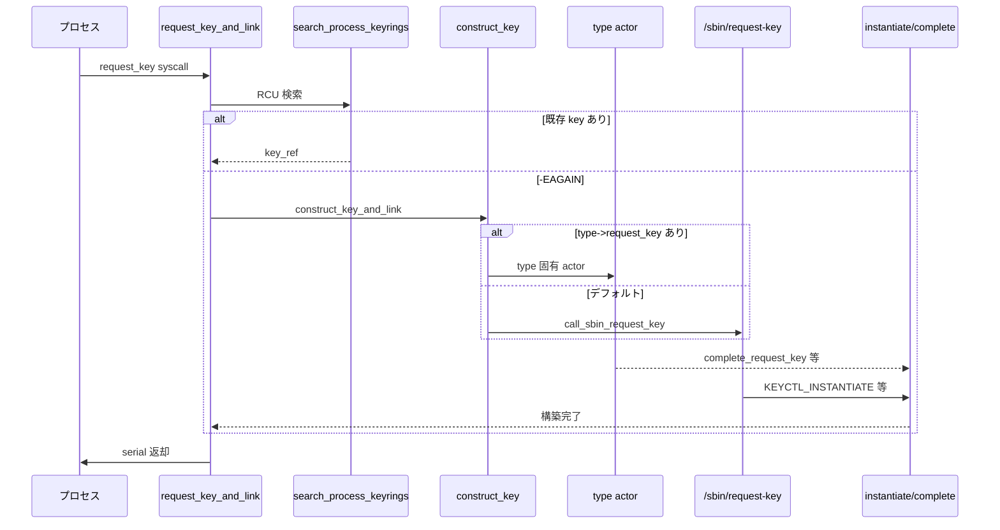

# 第19章 `request_key` と key type の概観

> **本章で読むソース**
>
> - [`security/keys/request_key.c` L118-L121](https://github.com/gregkh/linux/blob/v6.18.38/security/keys/request_key.c#L118-L121)
> - [`security/keys/request_key.c` L185-L197](https://github.com/gregkh/linux/blob/v6.18.38/security/keys/request_key.c#L185-L197)
> - [`security/keys/request_key.c` L226-L257](https://github.com/gregkh/linux/blob/v6.18.38/security/keys/request_key.c#L226-L257)
> - [`security/keys/request_key.c` L574-L620](https://github.com/gregkh/linux/blob/v6.18.38/security/keys/request_key.c#L574-L620)
> - [`security/keys/user_defined.c` L23-L33](https://github.com/gregkh/linux/blob/v6.18.38/security/keys/user_defined.c#L23-L33)
> - [`security/keys/key.c` L1224-L1249](https://github.com/gregkh/linux/blob/v6.18.38/security/keys/key.c#L1224-L1249)
> - [`security/keys/gc.c` L51-L65](https://github.com/gregkh/linux/blob/v6.18.38/security/keys/gc.c#L51-L65)
> - [`security/keys/gc.c` L178-L205](https://github.com/gregkh/linux/blob/v6.18.38/security/keys/gc.c#L178-L205)

## この章の狙い

キーが未構築のとき userspace へ委譲する `request_key` 経路と、`/sbin/request-key` upcall を読む。
`user` / `keyring` / `asymmetric` 等の key type 登録と、key GC の遅延回収を押さえる。

## 前提

- [第18章：`keyctl` システムコール群](18-keyctl-syscalls.md)
- [第17章：`struct key` と keyring 階層](17-key-keyring-hierarchy.md)

## /sbin/request-key upcall

デフォルトの構築 actor は `call_sbin_request_key` で、`call_usermodehelper_keys` 経由で `/sbin/request-key` を起動する。
引数には operation、key serial、uid/gid、各 keyring serial が渡される。

[`security/keys/request_key.c` L118-L121](https://github.com/gregkh/linux/blob/v6.18.38/security/keys/request_key.c#L118-L121)

```c
static int call_sbin_request_key(struct key *authkey, void *aux)
{
	static char const request_key[] = "/sbin/request-key";
	struct request_key_auth *rka = get_request_key_auth(authkey);
```

[`security/keys/request_key.c` L185-L197](https://github.com/gregkh/linux/blob/v6.18.38/security/keys/request_key.c#L185-L197)

```c
	argv[i++] = (char *)request_key;
	argv[i++] = (char *)rka->op;
	argv[i++] = key_str;
	argv[i++] = uid_str;
	argv[i++] = gid_str;
	argv[i++] = keyring_str[0];
	argv[i++] = keyring_str[1];
	argv[i++] = keyring_str[2];
	argv[i] = NULL;

	/* do it */
	ret = call_usermodehelper_keys(request_key, argv, envp, keyring,
				       UMH_WAIT_PROC);
```

## construct_key と type 固有 actor

`construct_key` は authority key を発行し、構築 actor を選ぶ。
type が `request_key` コールバックを持てばそれを優先し、無ければ `call_sbin_request_key` がデフォルト actor になる。
完了は `complete_request_key` で通知される。

[`security/keys/request_key.c` L226-L257](https://github.com/gregkh/linux/blob/v6.18.38/security/keys/request_key.c#L226-L257)

```c
static int construct_key(struct key *key, const void *callout_info,
			 size_t callout_len, void *aux,
			 struct key *dest_keyring)
{
	request_key_actor_t actor;
	struct key *authkey;
	int ret;

	kenter("%d,%p,%zu,%p", key->serial, callout_info, callout_len, aux);

	/* allocate an authorisation key */
	authkey = request_key_auth_new(key, "create", callout_info, callout_len,
				       dest_keyring);
	if (IS_ERR(authkey))
		return PTR_ERR(authkey);

	/* Make the call */
	actor = call_sbin_request_key;
	if (key->type->request_key)
		actor = key->type->request_key;

	ret = actor(authkey, aux);

	/* check that the actor called complete_request_key() prior to
	 * returning an error */
	WARN_ON(ret < 0 &&
		!test_bit(KEY_FLAG_INVALIDATED, &authkey->flags));

	key_put(authkey);
	kleave(" = %d", ret);
	return ret;
}
```

## request_key_and_link

`request_key_and_link` はまず `search_process_keyrings_rcu` で既存 key を探す。
`-EAGAIN` のとき `construct_key_and_link` が新規 key を確保し、`construct_key` で構築 actor を呼ぶ。
actor は type 固有コールバックを優先し、無ければ `call_sbin_request_key` が `/sbin/request-key` を起動する。
成功時は dest keyring へ `key_link` する。

[`security/keys/request_key.c` L574-L620](https://github.com/gregkh/linux/blob/v6.18.38/security/keys/request_key.c#L574-L620)

```c
struct key *request_key_and_link(struct key_type *type,
				 const char *description,
				 struct key_tag *domain_tag,
				 const void *callout_info,
				 size_t callout_len,
				 void *aux,
				 struct key *dest_keyring,
				 unsigned long flags)
{
	struct keyring_search_context ctx = {
		.index_key.type		= type,
		.index_key.domain_tag	= domain_tag,
		.index_key.description	= description,
		.index_key.desc_len	= strlen(description),
		.cred			= current_cred(),
		.match_data.cmp		= key_default_cmp,
		.match_data.raw_data	= description,
		.match_data.lookup_type	= KEYRING_SEARCH_LOOKUP_DIRECT,
		.flags			= (KEYRING_SEARCH_DO_STATE_CHECK |
					   KEYRING_SEARCH_SKIP_EXPIRED |
					   KEYRING_SEARCH_RECURSE),
	};
	struct key *key;
	key_ref_t key_ref;
	int ret;

	kenter("%s,%s,%p,%zu,%p,%p,%lx",
	       ctx.index_key.type->name, ctx.index_key.description,
	       callout_info, callout_len, aux, dest_keyring, flags);

	if (type->match_preparse) {
		ret = type->match_preparse(&ctx.match_data);
		if (ret < 0) {
			key = ERR_PTR(ret);
			goto error;
		}
	}

	key = check_cached_key(&ctx);
	if (key)
		goto error_free;

	/* search all the process keyrings for a key */
	rcu_read_lock();
	key_ref = search_process_keyrings_rcu(&ctx);
	rcu_read_unlock();
```

## user 型 key type

`user` 型は任意の description とバイナリ payload を保持する基本 type である。
`logon` 型は `.read` を持たず、パスワード等の読み出しを userspace から遮断する。

[`security/keys/user_defined.c` L23-L33](https://github.com/gregkh/linux/blob/v6.18.38/security/keys/user_defined.c#L23-L33)

```c
struct key_type key_type_user = {
	.name			= "user",
	.preparse		= user_preparse,
	.free_preparse		= user_free_preparse,
	.instantiate		= generic_key_instantiate,
	.update			= user_update,
	.revoke			= user_revoke,
	.destroy		= user_destroy,
	.describe		= user_describe,
	.read			= user_read,
};
```

`asymmetric` 型は `CONFIG_ASYMMETRIC_KEY_TYPE` 有効時に別モジュールから登録され、公開鍵操作の土台になる（詳細は本分冊の委譲境界参照）。
`encrypted` / `trusted` 等の hardware backend は key type 概観に留め、個別ドライバは深掘りしない。

## register_key_type と GC 連携

新しい type は `register_key_type` で名前重複を検査してからリストへ載る。
`unregister_key_type` は `key_gc_keytype` で既存 key を dead マークし GC へ回す。

[`security/keys/key.c` L1224-L1249](https://github.com/gregkh/linux/blob/v6.18.38/security/keys/key.c#L1224-L1249)

```c
int register_key_type(struct key_type *ktype)
{
	struct key_type *p;
	int ret;

	memset(&ktype->lock_class, 0, sizeof(ktype->lock_class));

	ret = -EEXIST;
	down_write(&key_types_sem);

	/* disallow key types with the same name */
	list_for_each_entry(p, &key_types_list, link) {
		if (strcmp(p->name, ktype->name) == 0)
			goto out;
	}

	/* store the type */
	list_add(&ktype->link, &key_types_list);

	pr_notice("Key type %s registered\n", ktype->name);
	ret = 0;

out:
	up_write(&key_types_sem);
	return ret;
}
```

## key GC

`key_put` は参照カウントを下げ、不要 key の掃除は workqueue 上の `key_garbage_collector` が担う。
`key_schedule_gc` は期限切れやリンク削除をトリガとしてタイマーまたは即時 GC を予約する。

[`security/keys/gc.c` L51-L67](https://github.com/gregkh/linux/blob/v6.18.38/security/keys/gc.c#L51-L67)

```c
void key_schedule_gc(time64_t gc_at)
{
	unsigned long expires;
	time64_t now = ktime_get_real_seconds();

	kenter("%lld", gc_at - now);

	if (gc_at <= now || test_bit(KEY_GC_REAP_KEYTYPE, &key_gc_flags)) {
		kdebug("IMMEDIATE");
		schedule_work(&key_gc_work);
	} else if (gc_at < key_gc_next_run) {
		kdebug("DEFERRED");
		key_gc_next_run = gc_at;
		expires = jiffies + (gc_at - now) * HZ;
		mod_timer(&key_gc_timer, expires);
	}
}
```

[`security/keys/gc.c` L178-L205](https://github.com/gregkh/linux/blob/v6.18.38/security/keys/gc.c#L178-L205)

```c
static void key_garbage_collector(struct work_struct *work)
{
	static LIST_HEAD(graveyard);
	static u8 gc_state;		/* Internal persistent state */
#define KEY_GC_REAP_AGAIN	0x01	/* - Need another cycle */
#define KEY_GC_REAPING_LINKS	0x02	/* - We need to reap links */
#define KEY_GC_REAPING_DEAD_1	0x10	/* - We need to mark dead keys */
#define KEY_GC_REAPING_DEAD_2	0x20	/* - We need to reap dead key links */
#define KEY_GC_REAPING_DEAD_3	0x40	/* - We need to reap dead keys */
#define KEY_GC_FOUND_DEAD_KEY	0x80	/* - We found at least one dead key */

	struct rb_node *cursor;
	struct key *key;
	time64_t new_timer, limit, expiry;

	kenter("[%lx,%x]", key_gc_flags, gc_state);

	limit = ktime_get_real_seconds();

	/* Work out what we're going to be doing in this pass */
	gc_state &= KEY_GC_REAPING_DEAD_1 | KEY_GC_REAPING_DEAD_2;
	gc_state <<= 1;
	if (test_and_clear_bit(KEY_GC_KEY_EXPIRED, &key_gc_flags))
		gc_state |= KEY_GC_REAPING_LINKS;

	if (test_and_clear_bit(KEY_GC_REAP_KEYTYPE, &key_gc_flags))
		gc_state |= KEY_GC_REAPING_DEAD_1;
	kdebug("new pass %x", gc_state);
```

## request_key の流れ



## 高速化と最適化の工夫

`check_cached_key` は直近の request 結果をキャッシュし、同一 description の再検索を省略する。
GC は `key_put` から同期的に重い処理を切り離し、serial 木の走査を workqueue に集約する。
type ごとの `request_key` コールバックにより、カーネル内完結の構築経路で usermodehelper コストを避けられる。

## まとめ

`request_key` は keyring 検索のあと、必要なら `construct_key` で構築 actor を呼ぶ。
type が `request_key` コールバックを持てばカーネル内 actor を優先し、無ければ `/sbin/request-key` がデフォルトである。
key type の登録解除と GC は連動し、dead key とリンクを遅延回収する。

## 関連する章

- [第18章：`keyctl` システムコール群](18-keyctl-syscalls.md)
- [SELinux userspace 分冊](../../../selinux/README.md)（ポリシー運用は委譲）
