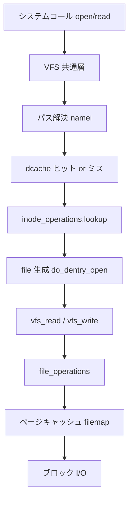

# 第1章 VFS 層の位置づけとシステムコール入口

> **本章で読むソース**
>
> - [`include/linux/fs.h` L793-L808](https://github.com/gregkh/linux/blob/v6.18.38/include/linux/fs.h#L793-L808)
> - [`include/linux/fs.h` L1446-L1463](https://github.com/gregkh/linux/blob/v6.18.38/include/linux/fs.h#L1446-L1463)
> - [`include/linux/dcache.h` L92-L111](https://github.com/gregkh/linux/blob/v6.18.38/include/linux/dcache.h#L92-L111)
> - [`include/linux/fs.h` L1211-L1226](https://github.com/gregkh/linux/blob/v6.18.38/include/linux/fs.h#L1211-L1226)
> - [`fs/namei.c` L4153-L4167](https://github.com/gregkh/linux/blob/v6.18.38/fs/namei.c#L4153-L4167)
> - [`fs/read_write.c` L552-L580](https://github.com/gregkh/linux/blob/v6.18.38/fs/read_write.c#L552-L580)

## この章の狙い

**VFS**（Virtual File System）がカーネル内で担う役割と、ユーザー空間のシステムコールがどの層を経由して個別ファイルシステムへ到達するかを概観する。
後続章で各オブジェクトと経路を深掘りするための地図を置く。

## 前提

- [全体像と横断基盤](../../foundation/README.md) でシステムコール入口の一般論を読んでいること。

## VFS が解く問題

Linux は ext4、btrfs、procfs、tmpfs など多数のファイルシステムを同時にマウントする。
各実装の内部形式は異なるが、open、read、write、stat といった操作は共通のシステムコールで提供される。
VFS はこの差異を **super_block**、**inode**、**dentry**、**file** の4種オブジェクトと、それにぶら下がる操作テーブルで吸収する。

個別ファイルシステムは `struct super_operations`、`inode_operations`、`file_operations` を登録し、VFS がパス解決と権限チェックを済ませたうえでコールバックを呼ぶ。
ページキャッシュは `address_space` を介して mm サブシステムと接続し、ディスク I/O の回数を減らす。

## 4大オブジェクトの役割分担

| オブジェクト | 主な役割 |
|---|---|
| **super_block** | マウントされたファイルシステムインスタンス全体のメタデータと操作 |
| **inode** | ファイルやディレクトリのメタデータ（モード、サイズ、ブロックマップへのポインタ） |
| **dentry** | パス上の名前と inode の対応、dcache の単位 |
| **file** | オープン済みファイルの状態（オフセット、フラグ、操作テーブル） |

`inode` はディスク上の実体、`dentry` は名前解決のキャッシュ、`file` はプロセスごとのオープン文脈、という分離が後続の最適化（特に RCU-walk）の前提になる。

## super_block の入口

`super_block` はマウント単位のルートを保持する。
`s_op` がファイルシステム固有の同期や inode 割り当てを、`s_root` がそのマウントのルート dentry を指す。

[`include/linux/fs.h` L1446-L1463](https://github.com/gregkh/linux/blob/v6.18.38/include/linux/fs.h#L1446-L1463)

```c
struct super_block {
	struct list_head	s_list;		/* Keep this first */
	dev_t			s_dev;		/* search index; _not_ kdev_t */
	unsigned char		s_blocksize_bits;
	unsigned long		s_blocksize;
	loff_t			s_maxbytes;	/* Max file size */
	struct file_system_type	*s_type;
	const struct super_operations	*s_op;
	const struct dquot_operations	*dq_op;
	const struct quotactl_ops	*s_qcop;
	const struct export_operations *s_export_op;
	unsigned long		s_flags;
	unsigned long		s_iflags;	/* internal SB_I_* flags */
	unsigned long		s_magic;
	struct dentry		*s_root;
	struct rw_semaphore	s_umount;
	int			s_count;
	atomic_t		s_active;
```

`s_bdi`（backing device info）は後の章で扱うライトバックの起点であり、ブロックデバイスを持つファイルシステムでは super_block から辿れる。

## inode と dentry の分離

`inode` はパスウォーク中に stat 系で触れるフィールドと、名前解決で触れないフィールドが意図的に分かれている。
`i_op` と `i_mapping` がファイルシステム操作とページキャッシュへの入口になる。

[`include/linux/fs.h` L793-L808](https://github.com/gregkh/linux/blob/v6.18.38/include/linux/fs.h#L793-L808)

```c
struct inode {
	umode_t			i_mode;
	unsigned short		i_opflags;
	kuid_t			i_uid;
	kgid_t			i_gid;
	unsigned int		i_flags;

#ifdef CONFIG_FS_POSIX_ACL
	struct posix_acl	*i_acl;
	struct posix_acl	*i_default_acl;
#endif

	const struct inode_operations	*i_op;
	struct super_block	*i_sb;
	struct address_space	*i_mapping;

```

`dentry` は名前（`d_name`）と `d_inode` の対応をキャッシュする。
`d_inode` が NULL の **negative dentry** は「その名前のファイルは存在しない」という否定結果も記憶し、繰り返しのディスクアクセスを避ける。

[`include/linux/dcache.h` L92-L111](https://github.com/gregkh/linux/blob/v6.18.38/include/linux/dcache.h#L92-L111)

```c
struct dentry {
	/* RCU lookup touched fields */
	unsigned int d_flags;		/* protected by d_lock */
	seqcount_spinlock_t d_seq;	/* per dentry seqlock */
	struct hlist_bl_node d_hash;	/* lookup hash list */
	struct dentry *d_parent;	/* parent directory */
	union {
	struct qstr __d_name;		/* for use ONLY in fs/dcache.c */
	const struct qstr d_name;
	};
	struct inode *d_inode;		/* Where the name belongs to - NULL is
					 * negative */
	union shortname_store d_shortname;
	/* --- cacheline 1 boundary (64 bytes) was 32 bytes ago --- */

	/* Ref lookup also touches following */
	const struct dentry_operations *d_op;
	struct super_block *d_sb;	/* The root of the dentry tree */
	unsigned long d_time;		/* used by d_revalidate */
	void *d_fsdata;			/* fs-specific data */
```

## file とオープン文脈

`file` はプロセスが `open` した結果として fd テーブルに載るオブジェクトである。
`f_path` が解決済みの `path`（mnt + dentry）、`f_pos` が読み書きオフセット、`f_op` が実際の read/write 実装を指す。

[`include/linux/fs.h` L1211-L1226](https://github.com/gregkh/linux/blob/v6.18.38/include/linux/fs.h#L1211-L1226)

```c
struct file {
	spinlock_t			f_lock;
	fmode_t				f_mode;
	const struct file_operations	*f_op;
	struct address_space		*f_mapping;
	void				*private_data;
	struct inode			*f_inode;
	unsigned int			f_flags;
	unsigned int			f_iocb_flags;
	const struct cred		*f_cred;
	struct fown_struct		*f_owner;
	/* --- cacheline 1 boundary (64 bytes) --- */
	union {
		const struct path	f_path;
		struct path		__f_path;
	};
```

通常ファイルでは `f_ra`（readahead 状態）が union メンバとして同居し、シーケンシャル読み出しの最適化に使われる。

## システムコールから VFS への流れ

open 系はパス解決のあと `do_filp_open` で `file` を生成する。
最初は RCU-walk で試し、失敗時だけ ref-walk に落とす二段構えが頻出経路の最適化になっている。

[`fs/namei.c` L4153-L4167](https://github.com/gregkh/linux/blob/v6.18.38/fs/namei.c#L4153-L4167)

```c
struct file *do_filp_open(int dfd, struct filename *pathname,
		const struct open_flags *op)
{
	struct nameidata nd;
	int flags = op->lookup_flags;
	struct file *filp;

	set_nameidata(&nd, dfd, pathname, NULL);
	filp = path_openat(&nd, op, flags | LOOKUP_RCU);
	if (unlikely(filp == ERR_PTR(-ECHILD)))
		filp = path_openat(&nd, op, flags);
	if (unlikely(filp == ERR_PTR(-ESTALE)))
		filp = path_openat(&nd, op, flags | LOOKUP_REVAL);
	restore_nameidata();
	return filp;
```

read/write 系は `vfs_read` / `vfs_write` が権限とアドレス検証を済ませ、`file->f_op` へ委譲する。
レガシーの `->read` が無ければ `read_iter` 経由の `iov_iter` API に落ちる。

[`fs/read_write.c` L552-L580](https://github.com/gregkh/linux/blob/v6.18.38/fs/read_write.c#L552-L580)

```c
ssize_t vfs_read(struct file *file, char __user *buf, size_t count, loff_t *pos)
{
	ssize_t ret;

	if (!(file->f_mode & FMODE_READ))
		return -EBADF;
	if (!(file->f_mode & FMODE_CAN_READ))
		return -EINVAL;
	if (unlikely(!access_ok(buf, count)))
		return -EFAULT;

	ret = rw_verify_area(READ, file, pos, count);
	if (ret)
		return ret;
	if (count > MAX_RW_COUNT)
		count =  MAX_RW_COUNT;

	if (file->f_op->read)
		ret = file->f_op->read(file, buf, count, pos);
	else if (file->f_op->read_iter)
		ret = new_sync_read(file, buf, count, pos);
	else
		ret = -EINVAL;
	if (ret > 0) {
		fsnotify_access(file);
		add_rchar(current, ret);
	}
	inc_syscr(current);
	return ret;
```

## 処理の流れ（open から read まで）



open はパス解決と `file` 生成が主で、read は解決済み `file` から `f_op` とページキャッシュへ進む。
write は dirty マーキングを経て、後の章で扱うライトバックへ非同期に接続する。

## 高速化と最適化の工夫

VFS の頻出経路では、パス解決を **RCU-walk** でロックレスに進め、 dentry ハッシュを RCU で読む。
`do_filp_open` が最初に `LOOKUP_RCU` を付けるのは、この fast path を常に試すためである。
RCU 下で dentry の正当性を失ったときだけ `try_to_unlazy` で ref-walk に切り替え、失敗時は `-ECHILD` で全体をやり直す（第7章で詳述）。

negative dentry キャッシュは存在しないファイルへの繰り返し lookup をディスクまで降ろさない。
inode/dentry の LRU はメモリ圧力時に縮小され、キャッシュサイズとヒット率のトレードオフを動的に取る。

> **7.x 系での変化**
> `vfs_read` / `vfs_write` の `f_op` 委譲構造は v7.1.3 でも同型である（[`fs/read_write.c` L554-L583](https://github.com/gregkh/linux/blob/v7.1.3/fs/read_write.c#L554-L583)、[`L668-L698`](https://github.com/gregkh/linux/blob/v7.1.3/fs/read_write.c#L668-L698)）。
> open の syscall 入口は [`fs/open.c` L1355-L1365](https://github.com/gregkh/linux/blob/v7.1.3/fs/open.c#L1355-L1365) で `FD_ADD` と `do_file_open` に整理されたが、本章の層分け説明は有効である。

## まとめ

VFS は super_block、inode、dentry、file の4層でファイルシステム差異を隠蔽し、システムコール入口から共通の検証とディスパッチを行う。
パス解決とキャッシュが性能の中心であり、I/O 本体はページキャッシュとライトバックに委ねられる。
次章から各オブジェクトのフィールドと相互参照を具体的に読む。

## 関連する章

- 次章：[super_block、inode、dentry、file の関係](02-vfs-core-objects.md)
- [path lookup と link_path_walk](../part01-path-lookup/06-path-lookup-walk.md)
- [open 経路と do_filp_open](../part03-file-io/10-open-path.md)
