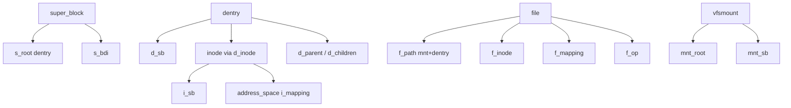
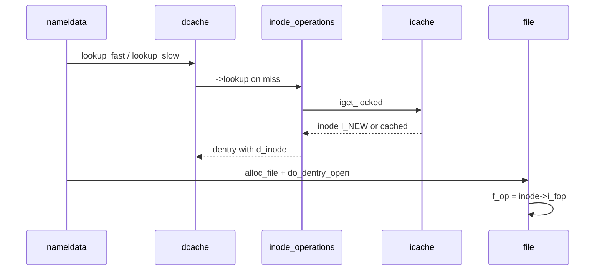

# 第2章 super_block、inode、dentry、file の関係

> **本章で読むソース**
>
> - [`include/linux/fs.h` L506-L519](https://github.com/gregkh/linux/blob/v6.18.38/include/linux/fs.h#L506-L519)
> - [`include/linux/fs.h` L850-L869](https://github.com/gregkh/linux/blob/v6.18.38/include/linux/fs.h#L850-L869)
> - [`include/linux/dcache.h` L118-L131](https://github.com/gregkh/linux/blob/v6.18.38/include/linux/dcache.h#L118-L131)
> - [`include/linux/fs.h` L1483-L1484](https://github.com/gregkh/linux/blob/v6.18.38/include/linux/fs.h#L1483-L1484)
> - [`include/linux/path.h` L8-L12](https://github.com/gregkh/linux/blob/v6.18.38/include/linux/path.h#L8-L12)
> - [`fs/inode.c` L1425-L1456](https://github.com/gregkh/linux/blob/v6.18.38/fs/inode.c#L1425-L1456)

## この章の狙い

VFS の4大オブジェクトがどのポインタで結ばれ、パス解決と I/O のどの段階でどれが主役になるかを構造体レベルで押さえる。
`path` と `address_space` を含め、後続章の参照関係を固定する。

## 前提

- [VFS 層の位置づけとシステムコール入口](01-vfs-layer-overview.md) を読んでいること。

## オブジェクト間の参照グラフ



1つの inode に複数 dentry（ハードリンク）がぶら下がり、1つの dentry に複数 file（同一パスを別 fd で open）が対応しうる。
マウントは `path` の `mnt` と `dentry` の組で表現される。

## address_space とページキャッシュ

`address_space` は inode のデータページを XArray（`i_pages`）で保持する。
`host` が所有者 inode、`a_ops` が readpage、writepage 等のページキャッシュ操作を提供する。

[`include/linux/fs.h` L506-L519](https://github.com/gregkh/linux/blob/v6.18.38/include/linux/fs.h#L506-L519)

```c
struct address_space {
	struct inode		*host;
	struct xarray		i_pages;
	struct rw_semaphore	invalidate_lock;
	gfp_t			gfp_mask;
	atomic_t		i_mmap_writable;
#ifdef CONFIG_READ_ONLY_THP_FOR_FS
	/* number of thp, only for non-shmem files */
	atomic_t		nr_thps;
#endif
	struct rb_root_cached	i_mmap;
	unsigned long		nrpages;
	pgoff_t			writeback_index;
	const struct address_space_operations *a_ops;
```

通常ファイルでは `inode->i_mapping` がデータ、`i_data` がメタデータ用 address_space として使われることが多い。
`PAGECACHE_TAG_DIRTY` 等の XArray タグが dirty と writeback 状態をページ単位で追跡する（第13章）。

## inode のハッシュと LRU

inode は `i_hash` で super_block 内の inode 番号ごとにハッシュされ、`i_lru` で未使用 inode の LRU に載る。
`i_io_list` と `i_wb_list` はライトバックキューへの接続に使われる。

[`include/linux/fs.h` L850-L869](https://github.com/gregkh/linux/blob/v6.18.38/include/linux/fs.h#L850-L869)

```c
	unsigned long		dirtied_when;	/* jiffies of first dirtying */
	unsigned long		dirtied_time_when;

	struct hlist_node	i_hash;
	struct list_head	i_io_list;	/* backing dev IO list */
#ifdef CONFIG_CGROUP_WRITEBACK
	struct bdi_writeback	*i_wb;		/* the associated cgroup wb */

	/* foreign inode detection, see wbc_detach_inode() */
	int			i_wb_frn_winner;
	u16			i_wb_frn_avg_time;
	u16			i_wb_frn_history;
#endif
	struct list_head	i_lru;		/* inode LRU list */
	struct list_head	i_sb_list;
	struct list_head	i_wb_list;	/* backing dev writeback list */
	union {
		struct hlist_head	i_dentry;
		struct rcu_head		i_rcu;
	};
```

`i_dentry` はこの inode を指す dentry のリスト（エイリアス）である。
evict 時は dentry との結合を外してからページキャッシュを truncate する（第9章）。

## dentry の木構造とエイリアス

`d_parent` と `d_children` でディレクトリ木を形成する。
`d_alias` は同一 inode への別名 dentry を inode 側 `i_dentry` リストで結ぶ。

[`include/linux/dcache.h` L118-L131](https://github.com/gregkh/linux/blob/v6.18.38/include/linux/dcache.h#L118-L131)

```c
	union {
		struct list_head d_lru;		/* LRU list */
		wait_queue_head_t *d_wait;	/* in-lookup ones only */
	};
	struct hlist_node d_sib;	/* child of parent list */
	struct hlist_head d_children;	/* our children */
	/*
	 * d_alias and d_rcu can share memory
	 */
	union {
		struct hlist_node d_alias;	/* inode alias list */
		struct hlist_bl_node d_in_lookup_hash;	/* only for in-lookup ones */
	 	struct rcu_head d_rcu;
	} d_u;
```

`d_lockref` は dentry ごとの参照カウントとスピンロックを一体化している。
RCU-walk では `d_lockref` を触らずハッシュだけを読み、ref-walk で初めて refcount を上げる。

## super_block と backing_dev_info

ブロックデバイスを持つファイルシステムは `s_bdi` で I/O スケジューラとライトバックの文脈を共有する。

[`include/linux/fs.h` L1483-L1484](https://github.com/gregkh/linux/blob/v6.18.38/include/linux/fs.h#L1483-L1484)

```c
	struct backing_dev_info *s_bdi;
	struct mtd_info		*s_mtd;
```

`s_dentry_lru`（super_block 内、dcache.c コメント参照）は dentry LRU の per-sb リストである。
メモリ回収は super_block 単位で dentry を縮小できる。

## path 構造体

パス解決の結果は `struct path` に格納される。
`mnt` はどのマウント文脈か、`dentry` はそのマウント上のどのノードかを示す。

[`include/linux/path.h` L8-L12](https://github.com/gregkh/linux/blob/v6.18.38/include/linux/path.h#L8-L12)

```c
struct path {
	struct vfsmount *mnt;
	struct dentry *dentry;
} __randomize_layout;

```

マウントポイントを跨ぐと同一 dentry でも `mnt` が変わる。
`follow_down`、`follow_up` がこの切り替えを担当する（第8章）。

## iget_locked による inode 取得

ディスクから inode を読む前に、icache で既存 inode を探す。
見つからなければ `I_NEW` 付きで新規割り当てし、呼び出し側が中身を埋める。

[`fs/inode.c` L1425-L1456](https://github.com/gregkh/linux/blob/v6.18.38/fs/inode.c#L1425-L1456)

```c
struct inode *iget_locked(struct super_block *sb, unsigned long ino)
{
	struct hlist_head *head = inode_hashtable + hash(sb, ino);
	struct inode *inode;

	might_sleep();

again:
	inode = find_inode_fast(sb, head, ino, false);
	if (inode) {
		if (IS_ERR(inode))
			return NULL;
		wait_on_inode(inode);
		if (unlikely(inode_unhashed(inode))) {
			iput(inode);
			goto again;
		}
		return inode;
	}

	inode = alloc_inode(sb);
	if (inode) {
		struct inode *old;

		spin_lock(&inode_hash_lock);
		/* We released the lock, so.. */
		old = find_inode_fast(sb, head, ino, true);
		if (!old) {
			inode->i_ino = ino;
			spin_lock(&inode->i_lock);
			inode->i_state = I_NEW;
			hlist_add_head_rcu(&inode->i_hash, head);
```

競合で二重割り当てが起きた場合は古い inode を採用し、新規分を破棄する。
このパターンは dentry の `lookup` でも同様に現れる。

## 処理の流れ（lookup から open まで）



パス解決は dentry 中心、メタデータ本体は inode、オープン後の操作は file 経由、データページは address_space、という段階分担が固定される。

## 高速化と最適化の工夫

dentry のフィールド配置は RCU lookup が触る領域（ハッシュ、親、名前、inode）を先頭キャッシュラインに集約している。
`d_seq` seqlock は親 dentry の `d_move` と子の lookup を並行させ、RCU 読者が古い親子関係を検出したら `-ECHILD` でやり直す。

inode の `i_rwsem` はデータ I/O と truncate の排他に使われ、パスウォークでは触らない設計が RCU-walk と両立する。
icache ヒット時の `wait_on_inode` は `I_NEW` 完了待ちに限定され、通常の hot path では sleep しない。

> **7.x 系での変化**
> `include/linux/fs.h` は v7.1.3 で行数が減っているが、[`struct inode` L767](https://github.com/gregkh/linux/blob/v7.1.3/include/linux/fs.h#L767)、[`struct file` L1260](https://github.com/gregkh/linux/blob/v7.1.3/include/linux/fs.h#L1260)、[`struct dentry` L93](https://github.com/gregkh/linux/blob/v7.1.3/include/linux/dcache.h#L93)、[`struct super_block` L132](https://github.com/gregkh/linux/blob/v7.1.3/include/linux/fs/super_types.h#L132) の役割分担は本章と同型である。
> フィールドの移動やマクロ化はあるが、パス解決と I/O の接続関係は変わらない。

## まとめ

super_block がマウント単位、dentry が名前木、inode がメタデータとページキャッシュの宿主、file がプロセス文脈、address_space がデータページ、という層がポインタで結ばれる。
次章ではこれらにぶら下がる操作テーブル `file_operations` と `inode_operations` を読む。

## 関連する章

- 前章：[VFS 層の位置づけとシステムコール入口](01-vfs-layer-overview.md)
- 次章：[file_operations とファイルシステム抽象化](03-file-operations.md)
- [inode のライフサイクルと icache](../part02-mount-inode/09-inode-lifecycle.md)
- [address_space と XArray](../part04-page-cache/13-address-space-xarray.md)
