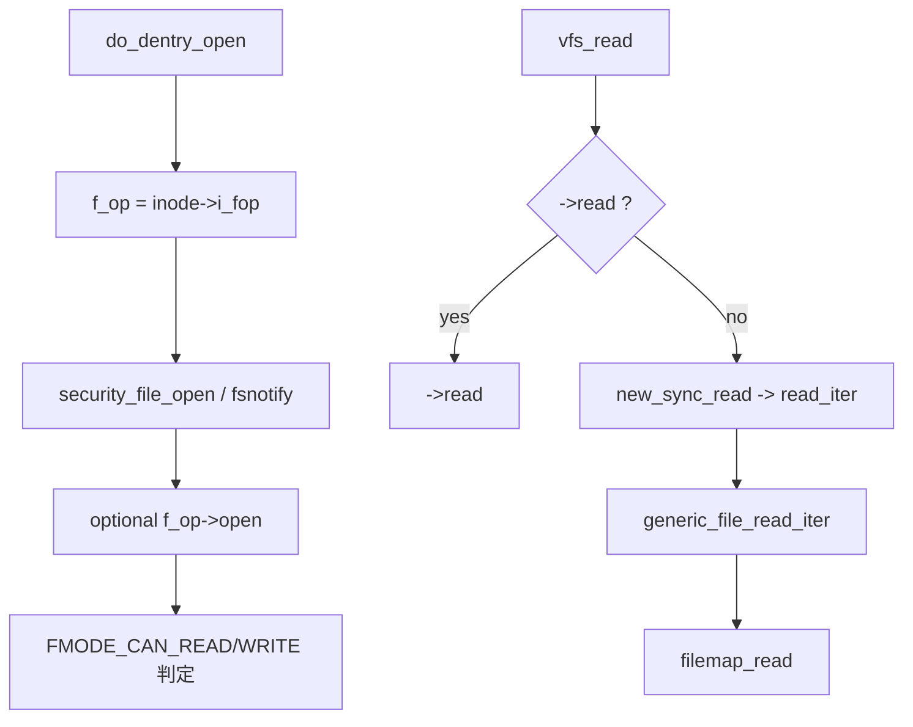

# 第3章 file_operations とファイルシステム抽象化

> **本章で読むソース**
>
> - [`include/linux/fs.h` L2271-L2295](https://github.com/gregkh/linux/blob/v6.18.38/include/linux/fs.h#L2271-L2295)
> - [`include/linux/fs.h` L2341-L2350](https://github.com/gregkh/linux/blob/v6.18.38/include/linux/fs.h#L2341-L2350)
> - [`fs/open.c` L903-L975](https://github.com/gregkh/linux/blob/v6.18.38/fs/open.c#L903-L975)
> - [`fs/read_write.c` L583-L597](https://github.com/gregkh/linux/blob/v6.18.38/fs/read_write.c#L583-L597)
> - [`mm/filemap.c` L3920-L3926](https://github.com/gregkh/linux/blob/v6.18.38/mm/filemap.c#L3920-L3926)
> - [`mm/filemap.c` L4400-L4414](https://github.com/gregkh/linux/blob/v6.18.38/mm/filemap.c#L4400-L4414)

## この章の狙い

個別ファイルシステムが VFS に登録する **file_operations** と **inode_operations** の役割分担を押さえる。
`do_dentry_open` が inode から `f_op` を引き継ぐ流れと、汎用実装 `generic_file_*` への接続を読む。

## 前提

- [super_block、inode、dentry、file の関係](02-vfs-core-objects.md) を読んでいること。

## file_operations の主要メンバ

`file_operations` はオープン済みファイルに対する操作のvtableである。
新しいコードは `read_iter` / `write_iter` を実装し、レガシーの `read` / `write` は互換用に残る。

[`include/linux/fs.h` L2271-L2295](https://github.com/gregkh/linux/blob/v6.18.38/include/linux/fs.h#L2271-L2295)

```c
struct file_operations {
	struct module *owner;
	fop_flags_t fop_flags;
	loff_t (*llseek) (struct file *, loff_t, int);
	ssize_t (*read) (struct file *, char __user *, size_t, loff_t *);
	ssize_t (*write) (struct file *, const char __user *, size_t, loff_t *);
	ssize_t (*read_iter) (struct kiocb *, struct iov_iter *);
	ssize_t (*write_iter) (struct kiocb *, struct iov_iter *);
	int (*iopoll)(struct kiocb *kiocb, struct io_comp_batch *,
			unsigned int flags);
	int (*iterate_shared) (struct file *, struct dir_context *);
	__poll_t (*poll) (struct file *, struct poll_table_struct *);
	long (*unlocked_ioctl) (struct file *, unsigned int, unsigned long);
	long (*compat_ioctl) (struct file *, unsigned int, unsigned long);
	int (*mmap) (struct file *, struct vm_area_struct *);
	int (*open) (struct inode *, struct file *);
	int (*flush) (struct file *, fl_owner_t id);
	int (*release) (struct inode *, struct file *);
	int (*fsync) (struct file *, loff_t, loff_t, int datasync);
	int (*fasync) (int, struct file *, int);
	int (*lock) (struct file *, int, struct file_lock *);
	unsigned long (*get_unmapped_area)(struct file *, unsigned long, unsigned long, unsigned long, unsigned long);
	int (*check_flags)(int);
	int (*flock) (struct file *, int, struct file_lock *);
	ssize_t (*splice_write)(struct pipe_inode_info *, struct file *, loff_t *, size_t, unsigned int);
```

`fop_flags` は非同期バッファ I/O や mmap 同期フォールトの能力をビットで宣言する（`FOP_BUFFER_RASYNC` 等）。
io_uring 経路は `uring_cmd` でファイル種別ごとに拡張される。

## inode_operations と名前解決

ディレクトリに対する `lookup` はパス解決のミス時にファイルシステムへ降りる入口である。
`create`、`mkdir`、`rename` 等も inode_operations に集約される。

[`include/linux/fs.h` L2341-L2350](https://github.com/gregkh/linux/blob/v6.18.38/include/linux/fs.h#L2341-L2350)

```c
struct inode_operations {
	struct dentry * (*lookup) (struct inode *,struct dentry *, unsigned int);
	const char * (*get_link) (struct dentry *, struct inode *, struct delayed_call *);
	int (*permission) (struct mnt_idmap *, struct inode *, int);
	struct posix_acl * (*get_inode_acl)(struct inode *, int, bool);

	int (*readlink) (struct dentry *, char __user *,int);

	int (*create) (struct mnt_idmap *, struct inode *,struct dentry *,
		       umode_t, bool);
```

`permission` は `may_lookup` から呼ばれ、マウントの idmapped mount では `mnt_idmap` が UID/GID 変換の文脈を渡す。

## do_dentry_open による f_op 設定

`path_openat` が `alloc_file` したあと `do_dentry_open` が inode から操作テーブルをコピーする。
`O_PATH` fd は実 I/O を行わず空の `f_op` を当てる特殊経路がある。

[`fs/open.c` L903-L975](https://github.com/gregkh/linux/blob/v6.18.38/fs/open.c#L903-L975)

```c
static int do_dentry_open(struct file *f,
			  int (*open)(struct inode *, struct file *))
{
	static const struct file_operations empty_fops = {};
	struct inode *inode = f->f_path.dentry->d_inode;
	int error;

	path_get(&f->f_path);
	f->f_inode = inode;
	f->f_mapping = inode->i_mapping;
	f->f_wb_err = filemap_sample_wb_err(f->f_mapping);
	f->f_sb_err = file_sample_sb_err(f);

	if (unlikely(f->f_flags & O_PATH)) {
		f->f_mode = FMODE_PATH | FMODE_OPENED;
		file_set_fsnotify_mode(f, FMODE_NONOTIFY);
		f->f_op = &empty_fops;
		return 0;
	}

	if ((f->f_mode & (FMODE_READ | FMODE_WRITE)) == FMODE_READ) {
		i_readcount_inc(inode);
	} else if (f->f_mode & FMODE_WRITE && !special_file(inode->i_mode)) {
		error = file_get_write_access(f);
		if (unlikely(error))
			goto cleanup_file;
		f->f_mode |= FMODE_WRITER;
	}

	/* POSIX.1-2008/SUSv4 Section XSI 2.9.7 */
	if (S_ISREG(inode->i_mode) || S_ISDIR(inode->i_mode))
		f->f_mode |= FMODE_ATOMIC_POS;

	f->f_op = fops_get(inode->i_fop);
	if (WARN_ON(!f->f_op)) {
		error = -ENODEV;
		goto cleanup_all;
	}

	error = security_file_open(f);
	if (error)
		goto cleanup_all;

	/*
	 * Call fsnotify open permission hook and set FMODE_NONOTIFY_* bits
	 * according to existing permission watches.
	 * If FMODE_NONOTIFY mode was already set for an fanotify fd or for a
	 * pseudo file, this call will not change the mode.
	 */
	error = fsnotify_open_perm_and_set_mode(f);
	if (error)
		goto cleanup_all;

	error = break_lease(file_inode(f), f->f_flags);
	if (error)
		goto cleanup_all;

	/* normally all 3 are set; ->open() can clear them if needed */
	f->f_mode |= FMODE_LSEEK | FMODE_PREAD | FMODE_PWRITE;
	if (!open)
		open = f->f_op->open;
	if (open) {
		error = open(inode, f);
		if (error)
			goto cleanup_all;
	}
	f->f_mode |= FMODE_OPENED;
	if ((f->f_mode & FMODE_READ) &&
	     likely(f->f_op->read || f->f_op->read_iter))
		f->f_mode |= FMODE_CAN_READ;
	if ((f->f_mode & FMODE_WRITE) &&
	     likely(f->f_op->write || f->f_op->write_iter))
		f->f_mode |= FMODE_CAN_WRITE;
```

`FMODE_CAN_READ` / `FMODE_CAN_WRITE` は `vfs_read` の事前チェックに使われ、未実装なら `-EINVAL` で早く落とす。

## read_iter へのブリッジ

`vfs_read` は `->read` が無い場合 `new_sync_read` で `kiocb` と `iov_iter` を組み立て、`read_iter` を同期呼び出しする。

[`fs/read_write.c` L583-L597](https://github.com/gregkh/linux/blob/v6.18.38/fs/read_write.c#L583-L597)

```c
static ssize_t new_sync_write(struct file *filp, const char __user *buf, size_t len, loff_t *ppos)
{
	struct kiocb kiocb;
	struct iov_iter iter;
	ssize_t ret;

	init_sync_kiocb(&kiocb, filp);
	kiocb.ki_pos = (ppos ? *ppos : 0);
	iov_iter_ubuf(&iter, ITER_SOURCE, (void __user *)buf, len);

	ret = filp->f_op->write_iter(&kiocb, &iter);
	BUG_ON(ret == -EIOCBQUEUED);
	if (ret > 0 && ppos)
		*ppos = kiocb.ki_pos;
	return ret;
```

`iov_iter` はユーザー空間バッファ、カーネルバッファ、bvec など複数バッファ種別を統一し、sendfile や io_uring と同じ下層 API を共有する。

## 汎用ファイル mmap と read_iter

通常のバッファリングファイルは `generic_file_read_iter` と `generic_file_write_iter` を共有する。
mmap のフォールトハンドラは `filemap_fault` に接続される。

[`mm/filemap.c` L3920-L3926](https://github.com/gregkh/linux/blob/v6.18.38/mm/filemap.c#L3920-L3926)

```c
	return ret;
}

const struct vm_operations_struct generic_file_vm_ops = {
	.fault		= filemap_fault,
	.map_pages	= filemap_map_pages,
	.page_mkwrite	= filemap_page_mkwrite,
```

[`mm/filemap.c` L4400-L4414](https://github.com/gregkh/linux/blob/v6.18.38/mm/filemap.c#L4400-L4414)

```c
ssize_t generic_file_write_iter(struct kiocb *iocb, struct iov_iter *from)
{
	struct file *file = iocb->ki_filp;
	struct inode *inode = file->f_mapping->host;
	ssize_t ret;

	inode_lock(inode);
	ret = generic_write_checks(iocb, from);
	if (ret > 0)
		ret = __generic_file_write_iter(iocb, from);
	inode_unlock(inode);

	if (ret > 0)
		ret = generic_write_sync(iocb, ret);
	return ret;
```

個別ファイルシステムは `address_space_operations` の `read_folio` / `writepages` を実装すれば、file_operations は汎用のままページキャッシュ経由でディスクに届く。

## 処理の流れ（操作テーブルの選択）



ファイルシステム固有ののは主に inode 読み込みと address_space のページ I/O で、read/write システムコール自体は大半が共通実装に収束する。

## 高速化と最適化の工夫

`read_iter` / `write_iter` は `kiocb` による非同期 I/O（`-EIOCBQUEUED`）と io_uring の完了経路を共通化する。
`generic_file_read_iter` は `IOCB_DIRECT` のときページキャッシュをバイパスし、それ以外は `filemap_read` でキャッシュヒットを優先する。

`fops_get` はモジュール参照カウントを取り、unload 中のファイルシステムへの dangling pointer を防ぐ。
`FMODE_ATOMIC_POS` は規則ファイルとディレクトリに付与され、並行 read/write の位置更新を mutex で守る POSIX 要件を満たす。

> **7.x 系での変化**
> `generic_file_read_iter` / `generic_file_write_iter` の分岐（`IOCB_DIRECT` と page cache 委譲）は v7.1.3 でも同型である（[`mm/filemap.c` L2957-L2999](https://github.com/gregkh/linux/blob/v7.1.3/mm/filemap.c#L2957-L2999)、[`L4459-L4474`](https://github.com/gregkh/linux/blob/v7.1.3/mm/filemap.c#L4459-L4474)）。
> `file_operations` テーブル自体の構造変更は本章の読解に影響しない。

## まとめ

VFS は inode_operations で名前とメタデータ、file_operations でオープン文脈の操作、address_space_operations でページ単位 I/O を分離する。
通常ファイルは汎用 file_operations に載せ、差分はページキャッシュ下の read_folio 実装に閉じ込める設計が徹底されている。

## 関連する章

- [read 経路と iov_iter](../part03-file-io/11-read-path.md)
- [write 経路と generic_file_write_iter](../part03-file-io/12-write-path.md)
- [filemap_read とページ取得](../part04-page-cache/14-filemap-read.md)
