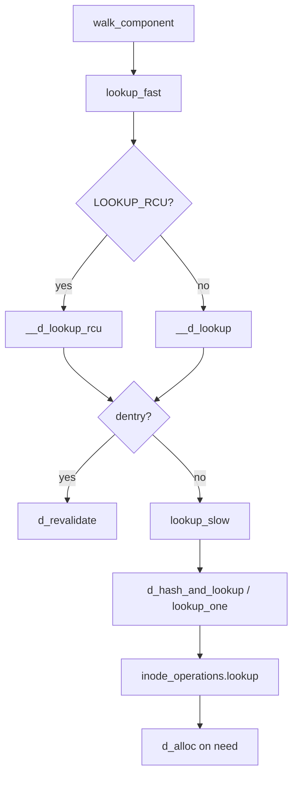

# 第4章 dcache のハッシュと名前検索

> **本章で読むソース**
>
> - [`fs/dcache.c` L2332-L2344](https://github.com/gregkh/linux/blob/v6.18.38/fs/dcache.c#L2332-L2344)
> - [`fs/dcache.c` L2362-L2390](https://github.com/gregkh/linux/blob/v6.18.38/fs/dcache.c#L2362-L2390)
> - [`fs/dcache.c` L2390-L2415](https://github.com/gregkh/linux/blob/v6.18.38/fs/dcache.c#L2390-L2415)
> - [`fs/dcache.c` L2425-L2438](https://github.com/gregkh/linux/blob/v6.18.38/fs/dcache.c#L2425-L2438)
> - [`fs/dcache.c` L1767-L1781](https://github.com/gregkh/linux/blob/v6.18.38/fs/dcache.c#L1767-L1781)
> - [`fs/namei.c` L1739-L1776](https://github.com/gregkh/linux/blob/v6.18.38/fs/namei.c#L1739-L1776)

## この章の狙い

**dcache**（dentry cache）がパス成分の名前をどのハッシュ表で管理し、ヒット時とミス時にどの関数が呼ばれるかを読む。
`d_lookup` と `__d_lookup` の違い、RCU 読み取り経路の入口を押さえる。

## 前提

- [super_block、inode、dentry、file の関係](../part00-overview/02-vfs-core-objects.md) を読んでいること。

## qstr とハッシュ値

パス成分は `struct qstr`（ポインタ、長さ、ハッシュ）として扱われる。
`full_name_hash` が親 dentry と名前バイト列からハッシュを計算し、衝突時は `d_same_name` で完全一致を確認する。

ファイルシステムが `d_op->d_hash` を提供する場合、標準ハッシュのあとに追加変換が入る（大文字小文字非区別など）。

## d_lookup と rename_lock

`d_lookup` は `rename_lock` seqlock で並行 rename を検出して再試行する楽観読み取り API である。
ループ内で seq を読み、`__d_lookup` が NULL なら rename が挟まった可能性を考慮して再試行する。

[`fs/dcache.c` L2332-L2344](https://github.com/gregkh/linux/blob/v6.18.38/fs/dcache.c#L2332-L2344)

```c
struct dentry *d_lookup(const struct dentry *parent, const struct qstr *name)
{
	struct dentry *dentry;
	unsigned seq;

	do {
		seq = read_seqbegin(&rename_lock);
		dentry = __d_lookup(parent, name);
		if (dentry)
			break;
	} while (read_seqretry(&rename_lock, seq));
	return dentry;
}
```

`__d_lookup` は rename_lock を取らない分速いが、並行 rename による偽陰性がありうる。
コメントが要求するように、失敗時は `d_lookup` で再確認する二段構えが正しい使い方である。

## __d_lookup の RCU 走査

ハッシュバケットは `hlist_bl_head` で、RCU 読者は `rcu_read_lock` 下でチェーンを辿る。
候補 dentry は `d_lock` を取ってから親、ハッシュ状態、名前一致を検証する。

[`fs/dcache.c` L2362-L2390](https://github.com/gregkh/linux/blob/v6.18.38/fs/dcache.c#L2362-L2390)

```c
struct dentry *__d_lookup(const struct dentry *parent, const struct qstr *name)
{
	unsigned int hash = name->hash;
	struct hlist_bl_head *b = d_hash(hash);
	struct hlist_bl_node *node;
	struct dentry *found = NULL;
	struct dentry *dentry;

	/*
	 * Note: There is significant duplication with __d_lookup_rcu which is
	 * required to prevent single threaded performance regressions
	 * especially on architectures where smp_rmb (in seqcounts) are costly.
	 * Keep the two functions in sync.
	 */

	/*
	 * The hash list is protected using RCU.
	 *
	 * Take d_lock when comparing a candidate dentry, to avoid races
	 * with d_move().
	 *
	 * It is possible that concurrent renames can mess up our list
	 * walk here and result in missing our dentry, resulting in the
	 * false-negative result. d_lookup() protects against concurrent
	 * renames using rename_lock seqlock.
	 *
	 * See Documentation/filesystems/path-lookup.txt for more details.
	 */
	rcu_read_lock();
```

[`fs/dcache.c` L2390-L2415](https://github.com/gregkh/linux/blob/v6.18.38/fs/dcache.c#L2390-L2415)

```c
	rcu_read_lock();
	
	hlist_bl_for_each_entry_rcu(dentry, node, b, d_hash) {

		if (dentry->d_name.hash != hash)
			continue;

		spin_lock(&dentry->d_lock);
		if (dentry->d_parent != parent)
			goto next;
		if (d_unhashed(dentry))
			goto next;

		if (!d_same_name(dentry, parent, name))
			goto next;

		dentry->d_lockref.count++;
		found = dentry;
		spin_unlock(&dentry->d_lock);
		break;
next:
		spin_unlock(&dentry->d_lock);
 	}
 	rcu_read_unlock();

 	return found;
```

ヒット時に `d_lockref.count++` で ref-walk 用の参照を取る。
RCU-walk 経路では `__d_lookup_rcu` が refcount を上げずに dentry ポインタだけ返す（第7章）。

## d_hash_and_lookup

lookup_slow 入口ではハッシュ計算と `d_lookup` をまとめて呼ぶ。
`DCACHE_OP_HASH` が付いた親ではファイルシステム固有のハッシュ変換が入る。

[`fs/dcache.c` L2425-L2438](https://github.com/gregkh/linux/blob/v6.18.38/fs/dcache.c#L2425-L2438)

```c
struct dentry *d_hash_and_lookup(struct dentry *dir, struct qstr *name)
{
	/*
	 * Check for a fs-specific hash function. Note that we must
	 * calculate the standard hash first, as the d_op->d_hash()
	 * routine may choose to leave the hash value unchanged.
	 */
	name->hash = full_name_hash(dir, name->name, name->len);
	if (dir->d_flags & DCACHE_OP_HASH) {
		int err = dir->d_op->d_hash(dir, name);
		if (unlikely(err < 0))
			return ERR_PTR(err);
	}
	return d_lookup(dir, name);
```

## ミス時の d_alloc

キャッシュに無い名前は `d_alloc` で dentry 骨格を作り、`lookup` で inode を結び付ける。
この時点では negative dentry としてハッシュに載ることもある。

[`fs/dcache.c` L1767-L1781](https://github.com/gregkh/linux/blob/v6.18.38/fs/dcache.c#L1767-L1781)

```c
struct dentry *d_alloc(struct dentry * parent, const struct qstr *name)
{
	struct dentry *dentry = __d_alloc(parent->d_sb, name);
	if (!dentry)
		return NULL;
	spin_lock(&parent->d_lock);
	/*
	 * don't need child lock because it is not subject
	 * to concurrency here
	 */
	dentry->d_parent = dget_dlock(parent);
	hlist_add_head(&dentry->d_sib, &parent->d_children);
	spin_unlock(&parent->d_lock);

	return dentry;
```

## lookup_fast との接続

パスウォークの fast path は `lookup_fast` が `LOOKUP_RCU` の有無で `__d_lookup_rcu` と `__d_lookup` を切り替える。

[`fs/namei.c` L1739-L1776](https://github.com/gregkh/linux/blob/v6.18.38/fs/namei.c#L1739-L1776)

```c
static struct dentry *lookup_fast(struct nameidata *nd)
{
	struct dentry *dentry, *parent = nd->path.dentry;
	int status = 1;

	/*
	 * Rename seqlock is not required here because in the off chance
	 * of a false negative due to a concurrent rename, the caller is
	 * going to fall back to non-racy lookup.
	 */
	if (nd->flags & LOOKUP_RCU) {
		dentry = __d_lookup_rcu(parent, &nd->last, &nd->next_seq);
		if (unlikely(!dentry)) {
			if (!try_to_unlazy(nd))
				return ERR_PTR(-ECHILD);
			return NULL;
		}

		/*
		 * This sequence count validates that the parent had no
		 * changes while we did the lookup of the dentry above.
		 */
		if (read_seqcount_retry(&parent->d_seq, nd->seq))
			return ERR_PTR(-ECHILD);

		status = d_revalidate(nd->inode, &nd->last, dentry, nd->flags);
		if (likely(status > 0))
			return dentry;
		if (!try_to_unlazy_next(nd, dentry))
			return ERR_PTR(-ECHILD);
		if (status == -ECHILD)
			/* we'd been told to redo it in non-rcu mode */
			status = d_revalidate(nd->inode, &nd->last,
					      dentry, nd->flags);
	} else {
		dentry = __d_lookup(parent, &nd->last);
		if (unlikely(!dentry))
			return NULL;
```

RCU で見つからない場合は `try_to_unlazy` で ref-walk に落とし、それでもダメなら slow path へ NULL を返す。

## 処理の流れ（1パス成分の lookup）



## 高速化と最適化の工夫

`CONFIG_DCACHE_WORD_ACCESS` が有効なアーキテクチャでは `hash_name` がワード単位で名前をハッシュし、バイト単位ループを削る（`namei.c` の `CONFIG_DCACHE_WORD_ACCESS` 節参照）。
`hlist_bl`（ブロック付きハッシュリスト）はキャッシュライン共有を抑え、並行 lookup のスケーラビリティを上げる。

`__d_lookup` と `__d_lookup_rcu` の重複は意図的であり、seqcount コストの高い CPU では RCU 専用版が hot path を軽くする。
negative dentry はディスク lookup を省略するため、存在しないパスへの繰り返しアクセスで効く。

> **7.x 系での変化**
> `d_lookup` の `read_seqbegin` / `read_seqretry` パターンは v7.1.3 でも同型である（[`fs/dcache.c` L2454-L2466](https://github.com/gregkh/linux/blob/v7.1.3/fs/dcache.c#L2454-L2466)）。
> dcache 内部の shrink API 改名は第5章を参照する。
> ハッシュ lookup の読解はそのまま有効である。

## まとめ

dcache はグローバルハッシュと per-parent 子リストの二重構造で名前を索引する。
ref-walk は `d_lookup`、RCU-walk は `__d_lookup_rcu` が入口で、ミス時だけファイルシステム `lookup` へ降りる。

## 関連する章

- [dentry の LRU と縮小](05-dentry-lru-shrink.md)
- [RCU-walk と ref-walk の切り替え](07-rcu-walk-ref-walk.md)
- [path lookup と link_path_walk](06-path-lookup-walk.md)
