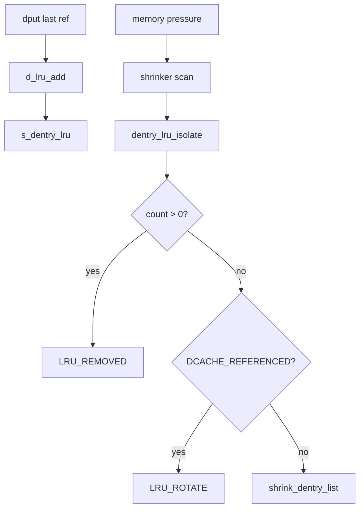

# 第5章 dentry の LRU と縮小

> **本章で読むソース**
>
> - [`fs/dcache.c` L489-L509](https://github.com/gregkh/linux/blob/v6.18.38/fs/dcache.c#L489-L509)
> - [`fs/dcache.c` L1145-L1194](https://github.com/gregkh/linux/blob/v6.18.38/fs/dcache.c#L1145-L1194)
> - [`fs/dcache.c` L1220-L1264](https://github.com/gregkh/linux/blob/v6.18.38/fs/dcache.c#L1220-L1264)
> - [`fs/dcache.c` L1547-L1578](https://github.com/gregkh/linux/blob/v6.18.38/fs/dcache.c#L1547-L1578)
> - [`fs/dcache.c` L48-L63](https://github.com/gregkh/linux/blob/v6.18.38/fs/dcache.c#L48-L63)
> - [`include/linux/shrinker.h` L15-L24](https://github.com/gregkh/linux/blob/v6.18.38/include/linux/shrinker.h#L15-L24)

## この章の狙い

未使用 **dentry** が `s_dentry_lru` にどう載り、メモリ圧力時に `shrinker` API 経由でどう解放されるかを読む。
`DCACHE_REFERENCED` による二次チャンスと、参照カウントによる保護を押さえる。

## 前提

- [dcache のハッシュと名前検索](04-dcache-hash-lookup.md) を読んでいること。

## per-super_block の dentry LRU

dcache.c 先頭コメントは、各 super_block が `s_dentry_lru` を持ち、`d_lru` で dentry を LRU 連結することを説明する。
`d_lock` と `s_dentry_lru_lock` の役割分担がここに書かれている。

[`fs/dcache.c` L48-L63](https://github.com/gregkh/linux/blob/v6.18.38/fs/dcache.c#L48-L63)

```c
 * dentry->d_sb->s_dentry_lru_lock protects:
 *   - the dcache lru lists and counters
 * d_lock protects:
 *   - d_flags
 *   - d_name
 *   - d_lru
 *   - d_count
 *   - d_unhashed()
 *   - d_parent and d_chilren
 *   - childrens' d_sib and d_parent
 *   - d_u.d_alias, d_inode
 *
 * Ordering:
 * dentry->d_inode->i_lock
 *   dentry->d_lock
 *     dentry->d_sb->s_dentry_lru_lock
```

`nr_dentry_unused` は per-CPU カウンタで未使用 dentry 数を追跡し、shrinker の判断材料になる。

## d_lru_add と d_lru_del

参照カウントがゼロになった dentry は `DCACHE_LRU_LIST` を立てて LRU に載る。
positive と negative は同じ `list_lru` に載り、`nr_dentry_negative` は統計用カウンタである。
優先回収の別キューはなく、縮小時は同じ回収対象になる。

[`fs/dcache.c` L489-L509](https://github.com/gregkh/linux/blob/v6.18.38/fs/dcache.c#L489-L509)

```c
static void d_lru_add(struct dentry *dentry)
{
	D_FLAG_VERIFY(dentry, 0);
	dentry->d_flags |= DCACHE_LRU_LIST;
	this_cpu_inc(nr_dentry_unused);
	if (d_is_negative(dentry))
		this_cpu_inc(nr_dentry_negative);
	WARN_ON_ONCE(!list_lru_add_obj(
			&dentry->d_sb->s_dentry_lru, &dentry->d_lru));
}

static void d_lru_del(struct dentry *dentry)
{
	D_FLAG_VERIFY(dentry, DCACHE_LRU_LIST);
	dentry->d_flags &= ~DCACHE_LRU_LIST;
	this_cpu_dec(nr_dentry_unused);
	if (d_is_negative(dentry))
		this_cpu_dec(nr_dentry_negative);
	WARN_ON_ONCE(!list_lru_del_obj(
			&dentry->d_sb->s_dentry_lru, &dentry->d_lru));
}
```

`dput` が最後の参照を落とすと `d_lru_add` が呼ばれ、再度 `dget` されれば `d_lru_del` で LRU から外れる。

## dentry_lru_isolate の二次チャンス

shrinker が LRU から dentry を切り離すとき、`d_lockref.count` が非ゼロなら単に LRU から外すだけである。
カウントゼロでも `DCACHE_REFERENCED` が立っていればフラグを消して `LRU_ROTATE` で尾部へ回す。

[`fs/dcache.c` L1145-L1194](https://github.com/gregkh/linux/blob/v6.18.38/fs/dcache.c#L1145-L1194)

```c
static enum lru_status dentry_lru_isolate(struct list_head *item,
		struct list_lru_one *lru, void *arg)
{
	struct list_head *freeable = arg;
	struct dentry	*dentry = container_of(item, struct dentry, d_lru);


	/*
	 * we are inverting the lru lock/dentry->d_lock here,
	 * so use a trylock. If we fail to get the lock, just skip
	 * it
	 */
	if (!spin_trylock(&dentry->d_lock))
		return LRU_SKIP;

	/*
	 * Referenced dentries are still in use. If they have active
	 * counts, just remove them from the LRU. Otherwise give them
	 * another pass through the LRU.
	 */
	if (dentry->d_lockref.count) {
		d_lru_isolate(lru, dentry);
		spin_unlock(&dentry->d_lock);
		return LRU_REMOVED;
	}

	if (dentry->d_flags & DCACHE_REFERENCED) {
		dentry->d_flags &= ~DCACHE_REFERENCED;
		spin_unlock(&dentry->d_lock);

		/*
		 * The list move itself will be made by the common LRU code. At
		 * this point, we've dropped the dentry->d_lock but keep the
		 * lru lock. This is safe to do, since every list movement is
		 * protected by the lru lock even if both locks are held.
		 *
		 * This is guaranteed by the fact that all LRU management
		 * functions are intermediated by the LRU API calls like
		 * list_lru_add_obj and list_lru_del_obj. List movement in this file
		 * only ever occur through this functions or through callbacks
		 * like this one, that are called from the LRU API.
		 *
		 * The only exceptions to this are functions like
		 * shrink_dentry_list, and code that first checks for the
		 * DCACHE_SHRINK_LIST flag.  Those are guaranteed to be
		 * operating only with stack provided lists after they are
		 * properly isolated from the main list.  It is thus, always a
		 * local access.
		 */
		return LRU_ROTATE;
```

`spin_trylock` 失敗時は `LRU_SKIP` でその dentry を飛ばし、デッドロックを避ける。
参照ゼロかつ REFERENCED も無い dentry は解放リストへ進む。

## shrink_dcache_sb

super_block 単位で LRU を走査し、isolate コールバックで切り出した dentry を `shrink_dentry_list` で実解放する。

[`fs/dcache.c` L1220-L1264](https://github.com/gregkh/linux/blob/v6.18.38/fs/dcache.c#L1220-L1264)

```c
	freed = list_lru_shrink_walk(&sb->s_dentry_lru, sc,
				     dentry_lru_isolate, &dispose);
	shrink_dentry_list(&dispose);
	return freed;
}

static enum lru_status dentry_lru_isolate_shrink(struct list_head *item,
		struct list_lru_one *lru, void *arg)
{
	struct list_head *freeable = arg;
	struct dentry	*dentry = container_of(item, struct dentry, d_lru);

	/*
	 * we are inverting the lru lock/dentry->d_lock here,
	 * so use a trylock. If we fail to get the lock, just skip
	 * it
	 */
	if (!spin_trylock(&dentry->d_lock))
		return LRU_SKIP;

	d_lru_shrink_move(lru, dentry, freeable);
	spin_unlock(&dentry->d_lock);

	return LRU_REMOVED;
}


/**
 * shrink_dcache_sb - shrink dcache for a superblock
 * @sb: superblock
 *
 * Shrink the dcache for the specified super block. This is used to free
 * the dcache before unmounting a file system.
 */
void shrink_dcache_sb(struct super_block *sb)
{
	do {
		LIST_HEAD(dispose);

		list_lru_walk(&sb->s_dentry_lru,
			dentry_lru_isolate_shrink, &dispose, 1024);
		shrink_dentry_list(&dispose);
	} while (list_lru_count(&sb->s_dentry_lru) > 0);
}
EXPORT_SYMBOL(shrink_dcache_sb);
```

アンマウント時は `shrink_dcache_for_umount` が親子関係を辿って強制的に木を解体する。

## shrink_dcache_parent

特定ディレクトリ以下の dentry を選択的に縮小する API である。
rename や rmdir の前後で、不要になった子 dentry を掃除する用途がある。

[`fs/dcache.c` L1547-L1578](https://github.com/gregkh/linux/blob/v6.18.38/fs/dcache.c#L1547-L1578)

```c
void shrink_dcache_parent(struct dentry *parent)
{
	for (;;) {
		struct select_data data = {.start = parent};

		INIT_LIST_HEAD(&data.dispose);
		d_walk(parent, &data, select_collect);

		if (!list_empty(&data.dispose)) {
			shrink_dentry_list(&data.dispose);
			continue;
		}

		cond_resched();
		if (!data.found)
			break;
		data.victim = NULL;
		d_walk(parent, &data, select_collect2);
		if (data.victim) {
			spin_lock(&data.victim->d_lock);
			if (!lock_for_kill(data.victim)) {
				spin_unlock(&data.victim->d_lock);
				rcu_read_unlock();
			} else {
				shrink_kill(data.victim);
			}
		}
		if (!list_empty(&data.dispose))
			shrink_dentry_list(&data.dispose);
	}
}
EXPORT_SYMBOL(shrink_dcache_parent);
```

## shrinker との接続

dcache は `register_shrinker` でメモリ回収フックに登録され、vmscan から `count_objects` / `scan_objects` が呼ばれる。
`shrink_control` の `nr_to_scan` が今回解放を試みるオブジェクト数の上限になる。

[`include/linux/shrinker.h` L15-L24](https://github.com/gregkh/linux/blob/v6.18.38/include/linux/shrinker.h#L15-L24)

```c
 */
struct shrinker_info_unit {
	atomic_long_t nr_deferred[SHRINKER_UNIT_BITS];
	DECLARE_BITMAP(map, SHRINKER_UNIT_BITS);
};

struct shrinker_info {
	struct rcu_head rcu;
	int map_nr_max;
	struct shrinker_info_unit *unit[];
```

dentry shrink と inode LRU、folio LRU は別 shrinker として協調し、ページキャッシュ回収と dentry 回収のバランスは vmscan ポリシーに従う。

## 処理の流れ（dput から解放まで）



## 高速化と最適化の工夫

`DCACHE_REFERENCED` は最近アクセスされた dentry に二次チャンスを与え、シーケンシャルなパスウォークで同じ dentry を繰り返し触るワークロードのヒット率を守る。
per-CPU の `nr_dentry_unused` はグローバルロックなしで dentry 圧力の概算を shrinker に渡す。

`spin_trylock` による `LRU_SKIP` は、lookup が `d_lock` を保持している dentry を shrink が待たずに飛ばす。
アンマウント専用経路は trylock ではなく強い整合性を取り、通常の hot path との分離が取れている。

> **7.x 系での変化**
> v7.1.3 では本体が [`shrink_dcache_tree` L1643-L1689](https://github.com/gregkh/linux/blob/v7.1.3/fs/dcache.c#L1643-L1689) に整理され、[`shrink_dcache_parent` L1691-L1694](https://github.com/gregkh/linux/blob/v7.1.3/fs/dcache.c#L1691-L1694) はそのラッパーになった。
> LRU 走査と `DCACHE_REFERENCED` の二次チャンスという本章の要点は変わらない。

## まとめ

dentry LRU は super_block 単位の `list_lru` で管理され、参照ゼロの dentry が載る。
shrinker は REFERENCED フラグと trylock で解放コストとヒット率のバランスを取る。

## 関連する章

- [dcache のハッシュと名前検索](04-dcache-hash-lookup.md)
- [inode のライフサイクルと icache](../part02-mount-inode/09-inode-lifecycle.md)
- [メモリ管理の writeback とページキャッシュ回収](../../mm/part04-reclaim/24-folio-reclaim-decision.md)
