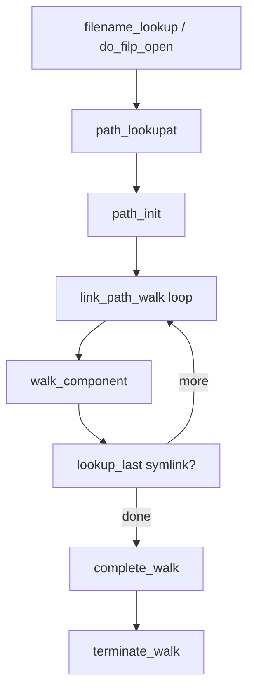

# 第6章 path lookup と link_path_walk

> **本章で読むソース**
>
> - [`fs/namei.c` L2664-L2694](https://github.com/gregkh/linux/blob/v6.18.38/fs/namei.c#L2664-L2694)
> - [`fs/namei.c` L2697-L2709](https://github.com/gregkh/linux/blob/v6.18.38/fs/namei.c#L2697-L2709)
> - [`fs/namei.c` L2441-L2520](https://github.com/gregkh/linux/blob/v6.18.38/fs/namei.c#L2441-L2520)
> - [`fs/namei.c` L2134-L2157](https://github.com/gregkh/linux/blob/v6.18.38/fs/namei.c#L2134-L2157)
> - [`fs/namei.c` L747-L765](https://github.com/gregkh/linux/blob/v6.18.38/fs/namei.c#L747-L765)
> - [`fs/namei.c` L4153-L4167](https://github.com/gregkh/linux/blob/v6.18.38/fs/namei.c#L4153-L4167)

## この章の狙い

パス文字列を `struct nameidata` に載せて dentry 木を辿る **`link_path_walk`** と、その呼び出し元 **`path_lookupat`** の制御フローを読む。
シンボリックリンクの再帰、末尾成分の扱い、RCU 失敗時の再試行を追う。

## 前提

- [dcache のハッシュと名前検索](04-dcache-hash-lookup.md) を読んでいること。

## path_lookupat の骨格

`path_init` で開始 dentry と root を設定したあと、`link_path_walk` をループで呼ぶ。
シンボリックリンクが残っていれば `lookup_last` が非 NULL を返し、ループが続く。

[`fs/namei.c` L2664-L2694](https://github.com/gregkh/linux/blob/v6.18.38/fs/namei.c#L2664-L2694)

```c
static int path_lookupat(struct nameidata *nd, unsigned flags, struct path *path)
{
	const char *s = path_init(nd, flags);
	int err;

	if (unlikely(flags & LOOKUP_DOWN) && !IS_ERR(s)) {
		err = handle_lookup_down(nd);
		if (unlikely(err < 0))
			s = ERR_PTR(err);
	}

	while (!(err = link_path_walk(s, nd)) &&
	       (s = lookup_last(nd)) != NULL)
		;
	if (!err && unlikely(nd->flags & LOOKUP_MOUNTPOINT)) {
		err = handle_lookup_down(nd);
		nd->state &= ~ND_JUMPED; // no d_weak_revalidate(), please...
	}
	if (!err)
		err = complete_walk(nd);

	if (!err && nd->flags & LOOKUP_DIRECTORY)
		if (!d_can_lookup(nd->path.dentry))
			err = -ENOTDIR;
	if (!err) {
		*path = nd->path;
		nd->path.mnt = NULL;
		nd->path.dentry = NULL;
	}
	terminate_walk(nd);
	return err;
```

成功時は `nd->path` を呼び出し側 `path` に移し、`terminate_walk` で参照を片付ける。
`LOOKUP_DIRECTORY` は最終 dentry がディレクトリでなければ `-ENOTDIR` にする。

## filename_lookup の RCU 再試行

公開 API `filename_lookup` はまず `LOOKUP_RCU` 付きで `path_lookupat` を呼ぶ。
`-ECHILD` は RCU 検証失敗、`-ESTALE` はネットワークファイルシステムの再検証要求を表す。

[`fs/namei.c` L2697-L2709](https://github.com/gregkh/linux/blob/v6.18.38/fs/namei.c#L2697-L2709)

```c
int filename_lookup(int dfd, struct filename *name, unsigned flags,
		    struct path *path, const struct path *root)
{
	int retval;
	struct nameidata nd;
	if (IS_ERR(name))
		return PTR_ERR(name);
	set_nameidata(&nd, dfd, name, root);
	retval = path_lookupat(&nd, flags | LOOKUP_RCU, path);
	if (unlikely(retval == -ECHILD))
		retval = path_lookupat(&nd, flags, path);
	if (unlikely(retval == -ESTALE))
		retval = path_lookupat(&nd, flags | LOOKUP_REVAL, path);
```

3段階の再試行は open 経路の `do_filp_open` と同型である。

## link_path_walk の成分ループ

各パス成分について `hash_name` で区切り、`LAST_DOT` / `LAST_DOTDOT` / `LAST_NORM` を判定する。
通常成分は `walk_component` に進み、末尾に達すると `LOOKUP_PARENT` を外して終了する。

[`fs/namei.c` L2441-L2520](https://github.com/gregkh/linux/blob/v6.18.38/fs/namei.c#L2441-L2520)

```c
static int link_path_walk(const char *name, struct nameidata *nd)
{
	int depth = 0; // depth <= nd->depth
	int err;

	nd->last_type = LAST_ROOT;
	nd->flags |= LOOKUP_PARENT;
	if (IS_ERR(name))
		return PTR_ERR(name);
	if (*name == '/') {
		do {
			name++;
		} while (unlikely(*name == '/'));
	}
	if (unlikely(!*name)) {
		nd->dir_mode = 0; // short-circuit the 'hardening' idiocy
		return 0;
	}

	/* At this point we know we have a real path component. */
	for(;;) {
		struct mnt_idmap *idmap;
		const char *link;
		unsigned long lastword;

		idmap = mnt_idmap(nd->path.mnt);
		err = may_lookup(idmap, nd);
		if (unlikely(err))
			return err;

		nd->last.name = name;
		name = hash_name(nd, name, &lastword);

		switch(lastword) {
		case LAST_WORD_IS_DOTDOT:
			nd->last_type = LAST_DOTDOT;
			nd->state |= ND_JUMPED;
			break;

		case LAST_WORD_IS_DOT:
			nd->last_type = LAST_DOT;
			break;

		default:
			nd->last_type = LAST_NORM;
			nd->state &= ~ND_JUMPED;

			struct dentry *parent = nd->path.dentry;
			if (unlikely(parent->d_flags & DCACHE_OP_HASH)) {
				err = parent->d_op->d_hash(parent, &nd->last);
				if (err < 0)
					return err;
			}
		}

		if (!*name)
			goto OK;
		/*
		 * If it wasn't NUL, we know it was '/'. Skip that
		 * slash, and continue until no more slashes.
		 */
		do {
			name++;
		} while (unlikely(*name == '/'));
		if (unlikely(!*name)) {
OK:
			/* pathname or trailing symlink, done */
			if (!depth) {
				nd->dir_vfsuid = i_uid_into_vfsuid(idmap, nd->inode);
				nd->dir_mode = nd->inode->i_mode;
				nd->flags &= ~LOOKUP_PARENT;
				return 0;
			}
			/* last component of nested symlink */
			name = nd->stack[--depth].name;
			link = walk_component(nd, 0);
		} else {
			/* not the last component */
			link = walk_component(nd, WALK_MORE);
		}
```

`may_lookup` はディレクトリ実行権限を検査し、idmapped mount では UID 変換済みの cred を使う。
`ND_JUMPED` は `..` やマウント跨ぎで親が通常と異なる可能性があることを後段に伝える。

## walk_component

`.` / `..` は `handle_dots`、通常名は `lookup_fast` → `lookup_slow` → `step_into` の順である。

[`fs/namei.c` L2134-L2157](https://github.com/gregkh/linux/blob/v6.18.38/fs/namei.c#L2134-L2157)

```c
static const char *walk_component(struct nameidata *nd, int flags)
{
	struct dentry *dentry;
	/*
	 * "." and ".." are special - ".." especially so because it has
	 * to be able to know about the current root directory and
	 * parent relationships.
	 */
	if (unlikely(nd->last_type != LAST_NORM)) {
		if (!(flags & WALK_MORE) && nd->depth)
			put_link(nd);
		return handle_dots(nd, nd->last_type);
	}
	dentry = lookup_fast(nd);
	if (IS_ERR(dentry))
		return ERR_CAST(dentry);
	if (unlikely(!dentry)) {
		dentry = lookup_slow(&nd->last, nd->path.dentry, nd->flags);
		if (IS_ERR(dentry))
			return ERR_CAST(dentry);
	}
	if (!(flags & WALK_MORE) && nd->depth)
		put_link(nd);
	return step_into(nd, flags, dentry);
```

`step_into` はマウントポイントで `follow_managed` を呼び、シンボリックリンクならリンク先文字列を返す。

## terminate_walk

パスウォーク終了時、ref-walk なら `path_put` で mnt/dentry 参照を落とし、RCU-walk なら `leave_rcu` で読者側を解除する。

[`fs/namei.c` L747-L765](https://github.com/gregkh/linux/blob/v6.18.38/fs/namei.c#L747-L765)

```c
static void terminate_walk(struct nameidata *nd)
{
	drop_links(nd);
	if (!(nd->flags & LOOKUP_RCU)) {
		int i;
		path_put(&nd->path);
		for (i = 0; i < nd->depth; i++)
			path_put(&nd->stack[i].link);
		if (nd->state & ND_ROOT_GRABBED) {
			path_put(&nd->root);
			nd->state &= ~ND_ROOT_GRABBED;
		}
	} else {
		leave_rcu(nd);
	}
	nd->depth = 0;
	nd->path.mnt = NULL;
	nd->path.dentry = NULL;
}
```

## open への接続

`do_filp_open` は `path_openat` 内で同じ `path_lookupat` 系列を使い、解決後に `vfs_open` へ進む。

[`fs/namei.c` L4153-L4167](https://github.com/gregkh/linux/blob/v6.18.38/fs/namei.c#L4153-L4167)

```c
struct file *do_filp_open(int dfd, struct filename *pathname,
		const struct open_flags *op)
{
	struct nameidata nd;
	int flags = op->lookup_flags;
	struct file *filp;

	set_nameidata(&nd, dfd, pathname, NULL);
	filp = path_openat(&nd, op, flags | LOOKUP_RCU);
	if (unlikely(filp == ERR_PTR(-ECHILD)))
		filp = path_openat(&nd, op, flags);
	if (unlikely(filp == ERR_PTR(-ESTALE)))
		filp = path_openat(&nd, op, flags | LOOKUP_REVAL);
	restore_nameidata();
	return filp;
```

## 処理の流れ



## 高速化と最適化の工夫

先頭の連続 `/` をスキップするループや `hash_name` によるインライン成分切り出しは、パースコストを定数時間に近づける。
`lookup_fast` が dentry キャッシュに当たれば `inode_operations.lookup` まで降りず、ディスク I/O を避ける。

RCU モードを第一選択にすることで、成功パスでは refcount と `rename_lock` の取得回数を最小化する。
失敗時の `-ECHILD` 再試行は rare path に閉じ込め、正しさと性能を分離している。

> **7.x 系での変化**
> `link_path_walk` の制御構造は v6.18.38 と v7.1.3 で実質同型である（v7.1.3 は [`fs/namei.c` L2574-L2670](https://github.com/gregkh/linux/blob/v7.1.3/fs/namei.c#L2574-L2670)、6.18.38 は L2441 付近）。
> `fs/namei.c` 全体は 5623 行から 6437 行へ増えているが、本章が追う `path_lookupat` と `link_path_walk` の再試行パターンは維持されている。

## まとめ

`path_lookupat` がパス解決の司令塔であり、`link_path_walk` が成分ごとの権限検査と dentry 遷移を担う。
RCU 失敗と ESTALE は呼び出し側で明示的に再試行され、頻出経路はキャッシュヒットと RCU-walk に寄せられる。

## 関連する章

- [RCU-walk と ref-walk の切り替え](07-rcu-walk-ref-walk.md)
- [open 経路と do_filp_open](../part03-file-io/10-open-path.md)
- [vfsmount と mount namespace](../part02-mount-inode/08-mount-namespace.md)
