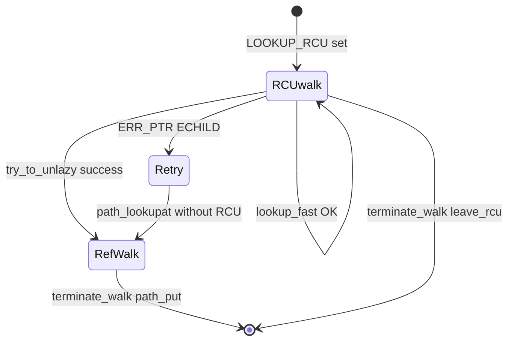

# 第7章 RCU-walk と ref-walk の切り替え

> **本章で読むソース**
>
> - [`fs/namei.c` L830-L861](https://github.com/gregkh/linux/blob/v6.18.38/fs/namei.c#L830-L861)
> - [`fs/namei.c` L876-L910](https://github.com/gregkh/linux/blob/v6.18.38/fs/namei.c#L876-L910)
> - [`fs/namei.c` L768-L781](https://github.com/gregkh/linux/blob/v6.18.38/fs/namei.c#L768-L781)
> - [`fs/namei.c` L1739-L1768](https://github.com/gregkh/linux/blob/v6.18.38/fs/namei.c#L1739-L1768)
> - [`include/linux/dcache.h` L94-L96](https://github.com/gregkh/linux/blob/v6.18.38/include/linux/dcache.h#L94-L96)
> - [`fs/namei.c` L747-L761](https://github.com/gregkh/linux/blob/v6.18.38/fs/namei.c#L747-L761)

## この章の狙い

パス解決の **RCU-walk**（ロックレス読み取り）と **ref-walk**（参照カウント付き）の境界を、ソース上の `LOOKUP_RCU`、`try_to_unlazy`、`legitimize_path` から読み解く。
本分冊で最重要の最適化機構として、成立条件と失敗時の巻き戻しを機構レベルで押さえる。

## 前提

- [path lookup と link_path_walk](06-path-lookup-walk.md) を読んでいること。
- [Tree RCU の基礎](../../locking/part04-rcu/13-tree-rcu-gp.md) で grace period の概念を知っていること。

## 二つの walk モード

| モード | フラグ | dentry 参照 | 典型用途 |
|---|---|---|---|
| RCU-walk | `LOOKUP_RCU` | RCU 読者のみ。refcount を上げない | 最初の試行、hot path |
| ref-walk | フラグなし | `d_lockref` を increment | RCU 失敗後、sleep が必要な操作 |

RCU-walk 中は `spin_lock` や `mutex` でブロックできない（`MAY_NOT_BLOCK` 相当の制約）。
 dentry の内容が並行変更された痕跡を見つけたら `-ECHILD` か `try_to_unlazy` でモードを切り替える。

## dentry 先頭フィールドの配置理由

`dcache.h` は RCU lookup が触るフィールドを構造体先頭に集める。
`d_seq` は親 dentry の `d_move` と lookup の並行を seqcount で検証する。

[`include/linux/dcache.h` L94-L96](https://github.com/gregkh/linux/blob/v6.18.38/include/linux/dcache.h#L94-L96)

```c
	unsigned int d_flags;		/* protected by d_lock */
	seqcount_spinlock_t d_seq;	/* per dentry seqlock */
	struct hlist_bl_node d_hash;	/* lookup hash list */
```

`read_seqcount_retry(&parent->d_seq, nd->seq)` が真なら、lookup 中に親子関係が変わったとみなす。

## try_to_unlazy

RCU-walk から ref-walk へ「合法化」する関数である。
`legitimize_links`、`legitimize_path`、`legitimize_root` が成功したあと `leave_rcu` で RCU 読者を外す。

[`fs/namei.c` L830-L861](https://github.com/gregkh/linux/blob/v6.18.38/fs/namei.c#L830-L861)

```c
 * try_to_unlazy - try to switch to ref-walk mode.
 * @nd: nameidata pathwalk data
 * Returns: true on success, false on failure
 *
 * try_to_unlazy attempts to legitimize the current nd->path and nd->root
 * for ref-walk mode.
 * Must be called from rcu-walk context.
 * Nothing should touch nameidata between try_to_unlazy() failure and
 * terminate_walk().
 */
static bool try_to_unlazy(struct nameidata *nd)
{
	struct dentry *parent = nd->path.dentry;

	BUG_ON(!(nd->flags & LOOKUP_RCU));

	if (unlikely(!legitimize_links(nd)))
		goto out1;
	if (unlikely(!legitimize_path(nd, &nd->path, nd->seq)))
		goto out;
	if (unlikely(!legitimize_root(nd)))
		goto out;
	leave_rcu(nd);
	BUG_ON(nd->inode != parent->d_inode);
	return true;

out1:
	nd->path.mnt = NULL;
	nd->path.dentry = NULL;
out:
	leave_rcu(nd);
	return false;
```

失敗時は `path` を NULL にして RCU を抜け、呼び出し側が全体を ref-walk でやり直す。
コメントが強調するように、`try_to_unlazy` 失敗から `terminate_walk` まで nameidata を触らない。

## try_to_unlazy_next

次の dentry へ `step_into` する直前に、子 dentry も含めて合法化する。
子の `d_seq` と親の seq を組み合わせて検証するのがポイントである。

[`fs/namei.c` L876-L910](https://github.com/gregkh/linux/blob/v6.18.38/fs/namei.c#L876-L910)

```c
static bool try_to_unlazy_next(struct nameidata *nd, struct dentry *dentry)
{
	int res;
	BUG_ON(!(nd->flags & LOOKUP_RCU));

	if (unlikely(!legitimize_links(nd)))
		goto out2;
	res = __legitimize_mnt(nd->path.mnt, nd->m_seq);
	if (unlikely(res)) {
		if (res > 0)
			goto out2;
		goto out1;
	}
	if (unlikely(!lockref_get_not_dead(&nd->path.dentry->d_lockref)))
		goto out1;

	/*
	 * We need to move both the parent and the dentry from the RCU domain
	 * to be properly refcounted. And the sequence number in the dentry
	 * validates *both* dentry counters, since we checked the sequence
	 * number of the parent after we got the child sequence number. So we
	 * know the parent must still be valid if the child sequence number is
	 */
	if (unlikely(!lockref_get_not_dead(&dentry->d_lockref)))
		goto out;
	if (read_seqcount_retry(&dentry->d_seq, nd->next_seq))
		goto out_dput;
	/*
	 * Sequence counts matched. Now make sure that the root is
	 * still valid and get it if required.
	 */
	if (unlikely(!legitimize_root(nd)))
		goto out_dput;
	leave_rcu(nd);
	return true;
```

`lockref_get_not_dead` は dentry が解放途中でないことを確認しながら refcount を上げる。

## legitimize_path

mnt の seq と dentry の `d_seq` を検証したうえで refcount を取る。
いずれかが失敗すると `path` を無効化する。

[`fs/namei.c` L768-L781](https://github.com/gregkh/linux/blob/v6.18.38/fs/namei.c#L768-L781)

```c
static bool __legitimize_path(struct path *path, unsigned seq, unsigned mseq)
{
	int res = __legitimize_mnt(path->mnt, mseq);
	if (unlikely(res)) {
		if (res > 0)
			path->mnt = NULL;
		path->dentry = NULL;
		return false;
	}
	if (unlikely(!lockref_get_not_dead(&path->dentry->d_lockref))) {
		path->dentry = NULL;
		return false;
	}
	return !read_seqcount_retry(&path->dentry->d_seq, seq);
```

マウントも `mnt` の seq で検証され、並行アンマウントと競合しない。

## lookup_fast での分岐

RCU モードでは `__d_lookup_rcu` が dentry を返すが、見つからない場合は unlazy して slow path へ落とす。
`d_revalidate` が `-ECHILD` を返した場合も ref-walk で再実行する。

[`fs/namei.c` L1739-L1768](https://github.com/gregkh/linux/blob/v6.18.38/fs/namei.c#L1739-L1768)

```c
static struct dentry *lookup_fast(struct nameidata *nd)
{
	struct dentry *dentry, *parent = nd->path.dentry;
	int status = 1;

	/*
	 * Rename seqlock is not required here because in the off chance
	 * of a false negative due to a concurrent rename, the caller is
	 * going to fall back to non-racy lookup.
	 */
	if (nd->flags & LOOKUP_RCU) {
		dentry = __d_lookup_rcu(parent, &nd->last, &nd->next_seq);
		if (unlikely(!dentry)) {
			if (!try_to_unlazy(nd))
				return ERR_PTR(-ECHILD);
			return NULL;
		}

		/*
		 * This sequence count validates that the parent had no
		 * changes while we did the lookup of the dentry above.
		 */
		if (read_seqcount_retry(&parent->d_seq, nd->seq))
			return ERR_PTR(-ECHILD);

		status = d_revalidate(nd->inode, &nd->last, dentry, nd->flags);
		if (likely(status > 0))
			return dentry;
		if (!try_to_unlazy_next(nd, dentry))
			return ERR_PTR(-ECHILD);
```

`__d_lookup_rcu` 成功でも revalidate 失敗なら unlazy か全体再試行が必要になる。

## terminate_walk と RCU 解除

RCU-walk 終了時は `path_put` ではなく `leave_rcu` のみである。
refcount を上げていないため、put 相当の処理は不要である。

[`fs/namei.c` L747-L761](https://github.com/gregkh/linux/blob/v6.18.38/fs/namei.c#L747-L761)

```c
static void terminate_walk(struct nameidata *nd)
{
	drop_links(nd);
	if (!(nd->flags & LOOKUP_RCU)) {
		int i;
		path_put(&nd->path);
		for (i = 0; i < nd->depth; i++)
			path_put(&nd->stack[i].link);
		if (nd->state & ND_ROOT_GRABBED) {
			path_put(&nd->root);
			nd->state &= ~ND_ROOT_GRABBED;
		}
	} else {
		leave_rcu(nd);
	}
```

## 状態遷移



## 高速化と最適化の工夫

RCU-walk の本質は、パス成分ごとの `spin_lock` と `mnt`/`dentry` refcount 更新を happy path から除くことである。
seqcount と `d_seq` による軽量検証は、変更が無い限り O(1) で済み、変更検出時だけ高コストな ref-walk に落とす。

`__d_lookup` と `__d_lookup_rcu` のコード重複は、RCU 版が refcount を触らない分岐を分離し、単スレッド性能退行を防ぐためである（`dcache.c` コメント）。
ネットワークファイルシステムは `d_revalidate` で `-ECHILD` を返し、クライアントキャッシュの整合を RCU 高速パスと切り離す。

並行 rename は RCU ハッシュ走査の偽陰性を許容し、`d_lookup` 側の `rename_lock` か全体再試行で正しさを回収する。
この「楽観的読み取り + 稀な再試行」が VFS パス解決のスループットを支える。

> **7.x 系での変化**
> `LOOKUP_RCU` と `try_to_unlazy` / `try_to_unlazy_next` による RCU-walk から ref-walk への降格パターンは v7.1.3 でも同型である（[`fs/namei.c` L930-L957](https://github.com/gregkh/linux/blob/v7.1.3/fs/namei.c#L930-L957)、[`L971-L1024`](https://github.com/gregkh/linux/blob/v7.1.3/fs/namei.c#L971-L1024)）。
> namei.c の行数増加は本章の切り替え機構の意味を変えない。

## まとめ

RCU-walk は dentry 木を RCU と seqcount だけで辿り、ref-walk は sleep 可能な操作と正しい refcount 管理のための fallback である。
`try_to_unlazy` 系は両者の橋渡しであり、失敗時は `-ECHILD` でトランザクション全体をやり直す。

## 関連する章

- [同期と RCU の Tree RCU](../../locking/part04-rcu/13-tree-rcu-gp.md)
- [path lookup と link_path_walk](06-path-lookup-walk.md)
- [open 経路と do_filp_open](../part03-file-io/10-open-path.md)
