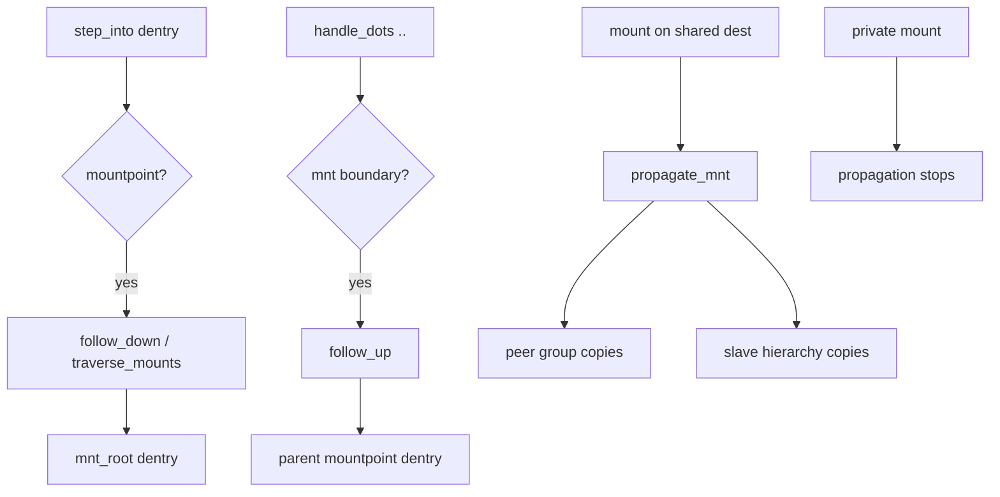

# 第8章 vfsmount と mount namespace

> **本章で読むソース**
>
> - [`include/linux/mount.h` L58-L63](https://github.com/gregkh/linux/blob/v6.18.38/include/linux/mount.h#L58-L63)
> - [`include/linux/mount.h` L25-L52](https://github.com/gregkh/linux/blob/v6.18.38/include/linux/mount.h#L25-L52)
> - [`fs/namespace.c` L1056-L1061](https://github.com/gregkh/linux/blob/v6.18.38/fs/namespace.c#L1056-L1061)
> - [`fs/namespace.c` L1081-L1107](https://github.com/gregkh/linux/blob/v6.18.38/fs/namespace.c#L1081-L1107)
> - [`fs/pnode.c` L93-L124](https://github.com/gregkh/linux/blob/v6.18.38/fs/pnode.c#L93-L124)
> - [`fs/pnode.c` L311-L355](https://github.com/gregkh/linux/blob/v6.18.38/fs/pnode.c#L311-L355)
> - [`fs/namespace.c` L2856-L2886](https://github.com/gregkh/linux/blob/v6.18.38/fs/namespace.c#L2856-L2886)
> - [`fs/namei.c` L1544-L1556](https://github.com/gregkh/linux/blob/v6.18.38/fs/namei.c#L1544-L1556)
> - [`fs/namei.c` L1359-L1378](https://github.com/gregkh/linux/blob/v6.18.38/fs/namei.c#L1359-L1378)

## この章の狙い

**vfsmount** と内部の `mount` 構造がパス解決にどう介入し、**mount namespace** がプロセスごとのマウント木を分離するかを読む。
`follow_down` / `follow_up` によるマウントポイント跨ぎを押さえる。

## 前提

- [path lookup と link_path_walk](../part01-path-lookup/06-path-lookup-walk.md) を読んでいること。

## vfsmount の公開面

ユーザー空間と大部分の VFS API が見るのは `struct vfsmount` である。
ルート dentry、super_block、マウントフラグ、idmapped mount 用の `mnt_idmap` を保持する。

[`include/linux/mount.h` L58-L63](https://github.com/gregkh/linux/blob/v6.18.38/include/linux/mount.h#L58-L63)

```c
struct vfsmount {
	struct dentry *mnt_root;	/* root of the mounted tree */
	struct super_block *mnt_sb;	/* pointer to superblock */
	int mnt_flags;
	struct mnt_idmap *mnt_idmap;
} __randomize_layout;
```

`mnt_idmap` は `READ_ONCE` で読み、`do_idmap_mount` との並行を安全にする（同ファイル inline 関数参照）。

## マウントフラグ

`MNT_READONLY`、`MNT_NOSUID` 等はマウントポイント単位の挙動を制御する。
`path_mount` が `mount(2)` フラグをこれらに変換する。

[`include/linux/mount.h` L25-L52](https://github.com/gregkh/linux/blob/v6.18.38/include/linux/mount.h#L25-L52)

```c
enum mount_flags {
	MNT_NOSUID	= 0x01,
	MNT_NODEV	= 0x02,
	MNT_NOEXEC	= 0x04,
	MNT_NOATIME	= 0x08,
	MNT_NODIRATIME	= 0x10,
	MNT_RELATIME	= 0x20,
	MNT_READONLY	= 0x40, /* does the user want this to be r/o? */
	MNT_NOSYMFOLLOW	= 0x80,

	MNT_SHRINKABLE	= 0x100,

	MNT_INTERNAL	= 0x4000,

	MNT_LOCK_ATIME		= 0x040000,
	MNT_LOCK_NOEXEC		= 0x080000,
	MNT_LOCK_NOSUID		= 0x100000,
	MNT_LOCK_NODEV		= 0x200000,
	MNT_LOCK_READONLY	= 0x400000,
	MNT_LOCKED		= 0x800000,
	MNT_DOOMED		= 0x1000000,
	MNT_SYNC_UMOUNT		= 0x2000000,
	MNT_UMOUNT		= 0x8000000,

	MNT_USER_SETTABLE_MASK  = MNT_NOSUID | MNT_NODEV | MNT_NOEXEC
				  | MNT_NOATIME | MNT_NODIRATIME | MNT_RELATIME
				  | MNT_READONLY | MNT_NOSYMFOLLOW,
	MNT_ATIME_MASK = MNT_NOATIME | MNT_NODIRATIME | MNT_RELATIME,
```

## attach_mnt とマウント木

`namespace.c` 内部の `mount` は親子リストと mountpoint を結ぶ。
`attach_mnt` は親の mountpoint に子マウントを接続し、可視化する。

[`fs/namespace.c` L1056-L1061](https://github.com/gregkh/linux/blob/v6.18.38/fs/namespace.c#L1056-L1061)

```c
static void attach_mnt(struct mount *mnt, struct mount *parent,
		       struct mountpoint *mp)
{
	mnt_set_mountpoint(parent, mp, mnt);
	make_visible(mnt);
}
```

## mount namespace への登録

新しいマウントは `mnt_namespace` の赤黒木 `mounts` に `mnt_id_unique` 順で挿入される。
`mnt_notify_add` がユーザー空間の mount イベント通知へ繋がる。

[`fs/namespace.c` L1081-L1107](https://github.com/gregkh/linux/blob/v6.18.38/fs/namespace.c#L1081-L1107)

```c
static void mnt_add_to_ns(struct mnt_namespace *ns, struct mount *mnt)
{
	struct rb_node **link = &ns->mounts.rb_node;
	struct rb_node *parent = NULL;
	bool mnt_first_node = true, mnt_last_node = true;

	WARN_ON(mnt_ns_attached(mnt));
	WRITE_ONCE(mnt->mnt_ns, ns);
	while (*link) {
		parent = *link;
		if (mnt->mnt_id_unique < node_to_mount(parent)->mnt_id_unique) {
			link = &parent->rb_left;
			mnt_last_node = false;
		} else {
			link = &parent->rb_right;
			mnt_first_node = false;
		}
	}

	if (mnt_last_node)
		ns->mnt_last_node = &mnt->mnt_node;
	if (mnt_first_node)
		ns->mnt_first_node = &mnt->mnt_node;
	rb_link_node(&mnt->mnt_node, parent, link);
	rb_insert_color(&mnt->mnt_node, &ns->mounts);

	mnt_notify_add(mnt);
```

`copy_mnt_ns` はコンテナ生成時にマウント木を複製し、プロセス隔離を実現する（`mnt_namespace.h` 宣言）。

## mount propagation の型

`MS_SHARED` は peer group を形成し、同一グループ内のマウント変更が互いに複製される。
`MS_SLAVE` は master の変更を受け取るが、slave 側の変更は master へ逆流しない。
`MS_PRIVATE` と `MS_UNBINDABLE` は伝播を止める。

`mount(2)` の `MS_SHARED` / `MS_SLAVE` 等は `do_change_type` が `change_mnt_propagation` を再帰適用する入口である。

[`fs/namespace.c` L2856-L2886](https://github.com/gregkh/linux/blob/v6.18.38/fs/namespace.c#L2856-L2886)

```c
static int do_change_type(const struct path *path, int ms_flags)
{
	struct mount *m;
	struct mount *mnt = real_mount(path->mnt);
	int recurse = ms_flags & MS_REC;
	int type;
	int err;

	if (!path_mounted(path))
		return -EINVAL;

	type = flags_to_propagation_type(ms_flags);
	if (!type)
		return -EINVAL;

	guard(namespace_excl)();

	err = may_change_propagation(mnt);
	if (err)
		return err;

	if (type == MS_SHARED) {
		err = invent_group_ids(mnt, recurse);
		if (err)
			return err;
	}

	for (m = mnt; m; m = (recurse ? next_mnt(m, mnt) : NULL))
		change_mnt_propagation(m, type);

	return 0;
}
```

## change_mnt_propagation

マウント1つ分の伝播型を切り替える。
`MS_SHARED` は `set_mnt_shared`、slave 解除時は `transfer_propagation` で master へ子を移し、`MS_SLAVE` は `mnt_master` と `mnt_slave_list` を張る。

[`fs/pnode.c` L93-L124](https://github.com/gregkh/linux/blob/v6.18.38/fs/pnode.c#L93-L124)

```c
void change_mnt_propagation(struct mount *mnt, int type)
{
	struct mount *m = mnt->mnt_master;

	if (type == MS_SHARED) {
		set_mnt_shared(mnt);
		return;
	}
	if (IS_MNT_SHARED(mnt)) {
		if (list_empty(&mnt->mnt_share)) {
			mnt_release_group_id(mnt);
		} else {
			m = next_peer(mnt);
			list_del_init(&mnt->mnt_share);
			mnt->mnt_group_id = 0;
		}
		CLEAR_MNT_SHARED(mnt);
		transfer_propagation(mnt, m);
	}
	hlist_del_init(&mnt->mnt_slave);
	if (type == MS_SLAVE) {
		mnt->mnt_master = m;
		if (m)
			hlist_add_head(&mnt->mnt_slave, &m->mnt_slave_list);
	} else {
		mnt->mnt_master = NULL;
		if (type == MS_UNBINDABLE)
			mnt->mnt_t_flags |= T_UNBINDABLE;
		else
			mnt->mnt_t_flags &= ~T_UNBINDABLE;
	}
}
```

## propagate_mnt

共有マウントへ新しい木を載せるとき、peer group と slave 階層へ `copy_tree` で複製を配る。
`CL_SLAVE` と `CL_MAKE_SHARED` の組み合わせで、どの複製が slave か peer かを決める。

[`fs/pnode.c` L311-L355](https://github.com/gregkh/linux/blob/v6.18.38/fs/pnode.c#L311-L355)

```c
int propagate_mnt(struct mount *dest_mnt, struct mountpoint *dest_mp,
		  struct mount *source_mnt, struct hlist_head *tree_list)
{
	struct mount *m, *n, *copy, *this;
	int err = 0, type;

	if (dest_mnt->mnt_master)
		SET_MNT_MARK(dest_mnt->mnt_master);

	/* iterate over peer groups, depth first */
	for (m = dest_mnt; m && !err; m = next_group(m, dest_mnt)) {
		if (m == dest_mnt) { // have one for dest_mnt itself
			copy = source_mnt;
			type = CL_MAKE_SHARED;
			n = next_peer(m);
			if (n == m)
				continue;
		} else {
			type = CL_SLAVE;
			/* beginning of peer group among the slaves? */
			if (IS_MNT_SHARED(m))
				type |= CL_MAKE_SHARED;
			n = m;
		}
		do {
			if (!need_secondary(n, dest_mp))
				continue;
			if (type & CL_SLAVE) // first in this peer group
				copy = find_master(n, copy, source_mnt);
			this = copy_tree(copy, copy->mnt.mnt_root, type);
			if (IS_ERR(this)) {
				err = PTR_ERR(this);
				break;
			}
			scoped_guard(mount_locked_reader)
				mnt_set_mountpoint(n, dest_mp, this);
			if (n->mnt_master)
				SET_MNT_MARK(n->mnt_master);
			copy = this;
			hlist_add_head(&this->mnt_hash, tree_list);
			err = count_mounts(n->mnt_ns, this);
			if (err)
				break;
			type = CL_MAKE_SHARED;
		} while ((n = next_peer(n)) != m);
	}
```

`namespace.c` の `attach_recursive_mnt` 等が共有先 `dest_mnt` に対し `propagate_mnt` を呼び、マウントイベントを peer と slave へ届ける。
プライベート木では `propagate_mnt` 自体が呼ばれず、そこで伝播が止まる。

## follow_down_one

パスウォークでマウントポイントに到達すると、`lookup_mnt` で覆いかぶさるマウントを見つけ、ルート dentry へ降りる。

[`fs/namei.c` L1544-L1556](https://github.com/gregkh/linux/blob/v6.18.38/fs/namei.c#L1544-L1556)

```c
int follow_down_one(struct path *path)
{
	struct vfsmount *mounted;

	mounted = lookup_mnt(path);
	if (mounted) {
		dput(path->dentry);
		mntput(path->mnt);
		path->mnt = mounted;
		path->dentry = dget(mounted->mnt_root);
		return 1;
	}
	return 0;
```

`traverse_mounts` は連鎖マウント（bind mount 等）をループで処理する。

## follow_up

`..` 処理でマウント境界を越えるとき、子マウントから親の mountpoint dentry へ戻る。

[`fs/namei.c` L1359-L1378](https://github.com/gregkh/linux/blob/v6.18.38/fs/namei.c#L1359-L1378)

```c
int follow_up(struct path *path)
{
	struct mount *mnt = real_mount(path->mnt);
	struct mount *parent;
	struct dentry *mountpoint;

	read_seqlock_excl(&mount_lock);
	parent = mnt->mnt_parent;
	if (parent == mnt) {
		read_sequnlock_excl(&mount_lock);
		return 0;
	}
	mntget(&parent->mnt);
	mountpoint = dget(mnt->mnt_mountpoint);
	read_sequnlock_excl(&mount_lock);
	dput(path->dentry);
	path->dentry = mountpoint;
	mntput(path->mnt);
	path->mnt = &parent->mnt;
	return 1;
```

`mount_lock` seqlock はマウント木の変更と RCU-walk の `choose_mountpoint_rcu` を直列化する。

## 処理の流れ（マウント跨ぎ）



## 高速化と最適化の工夫

RCU-walk では `lookup_mnt` の代わりに RCU 安全なマウント探索を使い、`mount_lock` の取得を避ける。
`mnt` と `mountpoint` の seq は dentry の `d_seq` と同様、並行変更を検出して `-ECHILD` に落とす。

マウント木の赤黒木索引は ID 順走査を O(log n) にし、`/proc/self/mountinfo` 生成など namespace 全体の列挙を効率化する。
shared peer group と master-slave 関係は `propagate_mnt` でマウントイベントを複製し、private 木では伝播が止まる。
bind mount は別 API で既存木を別マウントポイントへ再掲示する。

> **7.x 系での変化**
> [`fs/pnode.c`](https://github.com/gregkh/linux/blob/v7.1.3/fs/pnode.c) の [`propagate_mnt` L311-L366](https://github.com/gregkh/linux/blob/v7.1.3/fs/pnode.c#L311-L366) と [`change_mnt_propagation` L93-L124](https://github.com/gregkh/linux/blob/v7.1.3/fs/pnode.c#L93-L124) は v6.18.38 と diff 0 行で同一実装である。
> `fs/namespace.c` はマウントロック周辺で整理されているが、本章が追う伝播型（shared / slave / private）の意味は変わらない。

## まとめ

`path` は dentry だけでなく `vfsmount` 文脈を含み、同一 dentry でもマウントにより異なるファイルシステムインスタンスを指しうる。
mount namespace はプロセスごとに独立したマウント木を持ち、コンテナのファイルシステム隔離の基盤になる。

## 関連する章

- [RCU-walk と ref-walk の切り替え](../part01-path-lookup/07-rcu-walk-ref-walk.md)
- [path lookup と link_path_walk](../part01-path-lookup/06-path-lookup-walk.md)
