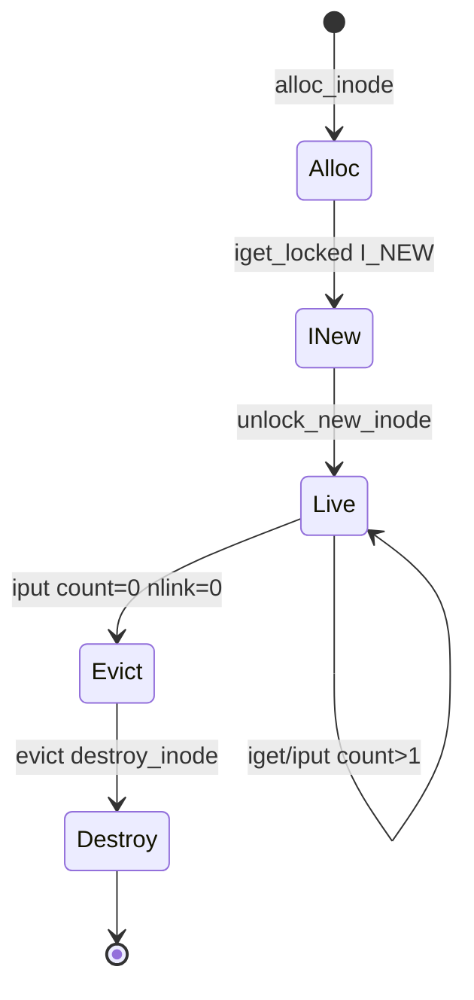

# 第9章 inode のライフサイクルと icache

> **本章で読むソース**
>
> - [`fs/inode.c` L1425-L1464](https://github.com/gregkh/linux/blob/v6.18.38/fs/inode.c#L1425-L1464)
> - [`fs/inode.c` L1874-L1915](https://github.com/gregkh/linux/blob/v6.18.38/fs/inode.c#L1874-L1915)
> - [`fs/inode.c` L785-L834](https://github.com/gregkh/linux/blob/v6.18.38/fs/inode.c#L785-L834)
> - [`fs/inode.c` L1926-L1967](https://github.com/gregkh/linux/blob/v6.18.38/fs/inode.c#L1926-L1967)
> - [`include/linux/fs.h` L870-L874](https://github.com/gregkh/linux/blob/v6.18.38/include/linux/fs.h#L870-L874)
> - [`include/linux/fs.h` L853-L869](https://github.com/gregkh/linux/blob/v6.18.38/include/linux/fs.h#L853-L869)

## この章の狙い

**icache**（inode cache）での `iget_locked`、参照解放の `iput`、最終解放の `evict` までを一連のライフサイクルとして読む。
dentry キャッシュとの関係と、ライトバック完了待ちの順序を押さえる。

## 前提

- [super_block、inode、dentry、file の関係](../part00-overview/02-vfs-core-objects.md) を読んでいること。

## iget_locked

inode 番号と super_block の組でハッシュ検索し、ヒットなら既存 inode を返す。
ミス時は `I_NEW` を立ててハッシュに載せ、呼び出し側がディスクから中身を読み込む。

[`fs/inode.c` L1425-L1464](https://github.com/gregkh/linux/blob/v6.18.38/fs/inode.c#L1425-L1464)

```c
struct inode *iget_locked(struct super_block *sb, unsigned long ino)
{
	struct hlist_head *head = inode_hashtable + hash(sb, ino);
	struct inode *inode;

	might_sleep();

again:
	inode = find_inode_fast(sb, head, ino, false);
	if (inode) {
		if (IS_ERR(inode))
			return NULL;
		wait_on_inode(inode);
		if (unlikely(inode_unhashed(inode))) {
			iput(inode);
			goto again;
		}
		return inode;
	}

	inode = alloc_inode(sb);
	if (inode) {
		struct inode *old;

		spin_lock(&inode_hash_lock);
		/* We released the lock, so.. */
		old = find_inode_fast(sb, head, ino, true);
		if (!old) {
			inode->i_ino = ino;
			spin_lock(&inode->i_lock);
			inode->i_state = I_NEW;
			hlist_add_head_rcu(&inode->i_hash, head);
			spin_unlock(&inode->i_lock);
			spin_unlock(&inode_hash_lock);
			inode_sb_list_add(inode);

			/* Return the locked inode with I_NEW set, the
			 * caller is responsible for filling in the contents
			 */
			return inode;
```

`wait_on_inode` は他 CPU が同じ inode を `I_NEW` で構築中の場合に待つ。
`inode_unhashed` の再試行は evict 競合への防御である。

## i_count と参照カウント

VFS が inode を共有する根拠は `atomic_t i_count` である。
`iget` 系はこれを増やし、`iput` は減らす。

[`include/linux/fs.h` L870-L874](https://github.com/gregkh/linux/blob/v6.18.38/include/linux/fs.h#L870-L874)

```c
	atomic64_t		i_version;
	atomic64_t		i_sequence; /* see futex */
	atomic_t		i_count;
	atomic_t		i_dio_count;
	atomic_t		i_writecount;
```

`i_writecount` は書き込みオープン数を別途追跡し、`i_count` だけでは表せない排他と組み合わせて使われる。

## iput と最終解放

参照カウントが 1 から 0 に落ちると `iput_final` へ進み、evict がスケジュールされる。
`I_DIRTY_TIME` の lazy time 更新は iput 経路で同期 dirty に昇格しうる。

[`fs/inode.c` L1926-L1967](https://github.com/gregkh/linux/blob/v6.18.38/fs/inode.c#L1926-L1967)

```c
void iput(struct inode *inode)
{
	might_sleep();
	if (unlikely(!inode))
		return;

retry:
	lockdep_assert_not_held(&inode->i_lock);
	VFS_BUG_ON_INODE(inode->i_state & I_CLEAR, inode);
	/*
	 * Note this assert is technically racy as if the count is bogusly
	 * equal to one, then two CPUs racing to further drop it can both
	 * conclude it's fine.
	 */
	VFS_BUG_ON_INODE(atomic_read(&inode->i_count) < 1, inode);

	if (atomic_add_unless(&inode->i_count, -1, 1))
		return;

	if ((inode->i_state & I_DIRTY_TIME) && inode->i_nlink) {
		trace_writeback_lazytime_iput(inode);
		mark_inode_dirty_sync(inode);
		goto retry;
	}

	spin_lock(&inode->i_lock);
	if (unlikely((inode->i_state & I_DIRTY_TIME) && inode->i_nlink)) {
		spin_unlock(&inode->i_lock);
		goto retry;
	}

	if (!atomic_dec_and_test(&inode->i_count)) {
		spin_unlock(&inode->i_lock);
		return;
	}

	/*
	 * iput_final() drops ->i_lock, we can't assert on it as the inode may
	 * be deallocated by the time the call returns.
	 */
	iput_final(inode);
}
```

## iput_final から evict へ

`i_count` がゼロに落ちたあと `iput_final` が LRU 退避か解放を決める。
`I_FREEING` を立ててから `evict` を同期的に呼ぶ。

[`fs/inode.c` L1874-L1915](https://github.com/gregkh/linux/blob/v6.18.38/fs/inode.c#L1874-L1915)

```c
static void iput_final(struct inode *inode)
{
	struct super_block *sb = inode->i_sb;
	const struct super_operations *op = inode->i_sb->s_op;
	unsigned long state;
	int drop;

	WARN_ON(inode->i_state & I_NEW);

	if (op->drop_inode)
		drop = op->drop_inode(inode);
	else
		drop = inode_generic_drop(inode);

	if (!drop &&
	    !(inode->i_state & I_DONTCACHE) &&
	    (sb->s_flags & SB_ACTIVE)) {
		__inode_add_lru(inode, true);
		spin_unlock(&inode->i_lock);
		return;
	}

	state = inode->i_state;
	if (!drop) {
		WRITE_ONCE(inode->i_state, state | I_WILL_FREE);
		spin_unlock(&inode->i_lock);

		write_inode_now(inode, 1);

		spin_lock(&inode->i_lock);
		state = inode->i_state;
		WARN_ON(state & I_NEW);
		state &= ~I_WILL_FREE;
	}

	WRITE_ONCE(inode->i_state, state | I_FREEING);
	if (!list_empty(&inode->i_lru))
		inode_lru_list_del(inode);
	spin_unlock(&inode->i_lock);

	evict(inode);
}
```

`drop_inode` が偽を返せば inode は LRU に載り、メモリ圧力まで生き延びる。
真なら `write_inode_now` のあと `evict` へ進む。

## evict

`I_FREEING` 状態の inode からページキャッシュを truncate し、ファイルシステムの `evict_inode` を呼ぶ。
進行中の writeback は `inode_wait_for_writeback` で完了を待つ。

[`fs/inode.c` L785-L834](https://github.com/gregkh/linux/blob/v6.18.38/fs/inode.c#L785-L834)

```c
static void evict(struct inode *inode)
{
	const struct super_operations *op = inode->i_sb->s_op;

	BUG_ON(!(inode->i_state & I_FREEING));
	BUG_ON(!list_empty(&inode->i_lru));

	if (!list_empty(&inode->i_io_list))
		inode_io_list_del(inode);

	inode_sb_list_del(inode);

	spin_lock(&inode->i_lock);
	inode_wait_for_lru_isolating(inode);

	/*
	 * Wait for flusher thread to be done with the inode so that filesystem
	 * does not start destroying it while writeback is still running. Since
	 * the inode has I_FREEING set, flusher thread won't start new work on
	 * the inode.  We just have to wait for running writeback to finish.
	 */
	inode_wait_for_writeback(inode);
	spin_unlock(&inode->i_lock);

	if (op->evict_inode) {
		op->evict_inode(inode);
	} else {
		truncate_inode_pages_final(&inode->i_data);
		clear_inode(inode);
	}
	if (S_ISCHR(inode->i_mode) && inode->i_cdev)
		cd_forget(inode);

	remove_inode_hash(inode);

	/*
	 * Wake up waiters in __wait_on_freeing_inode().
	 *
	 * It is an invariant that any thread we need to wake up is already
	 * accounted for before remove_inode_hash() acquires ->i_lock -- both
	 * sides take the lock and sleep is aborted if the inode is found
	 * unhashed. Thus either the sleeper wins and goes off CPU, or removal
	 * wins and the sleeper aborts after testing with the lock.
	 *
	 * This also means we don't need any fences for the call below.
	 */
	inode_wake_up_bit(inode, __I_NEW);
	BUG_ON(inode->i_state != (I_FREEING | I_CLEAR));

	destroy_inode(inode);
```

## dentry との結合

inode は `i_dentry` リストで参照する dentry を保持する。
リンク数ゼロかつ参照ゼロで evict 可能になるが、dentry が残っている間は inode は生きる。

[`include/linux/fs.h` L853-L869](https://github.com/gregkh/linux/blob/v6.18.38/include/linux/fs.h#L853-L869)

```c
	struct hlist_node	i_hash;
	struct list_head	i_io_list;	/* backing dev IO list */
#ifdef CONFIG_CGROUP_WRITEBACK
	struct bdi_writeback	*i_wb;		/* the associated cgroup wb */

	/* foreign inode detection, see wbc_detach_inode() */
	int			i_wb_frn_winner;
	u16			i_wb_frn_avg_time;
	u16			i_wb_frn_history;
#endif
	struct list_head	i_lru;		/* inode LRU list */
	struct list_head	i_sb_list;
	struct list_head	i_wb_list;	/* backing dev writeback list */
	union {
		struct hlist_head	i_dentry;
		struct rcu_head		i_rcu;
	};
```

## 処理の流れ



## 高速化と最適化の工夫

`find_inode_fast` は super_block と inode 番号のハッシュで O(1) 平均の icache ヒットを実現する。
`atomic_add_unless` による fast path iput は、count>1 の大半の呼び出しで `i_lock` を取らない。

inode LRU（`i_lru`）はメモリ圧力時に未使用 inode を回収し、 dentry LRU と独立に動く。
`I_DIRTY_TIME` と lazytime は atime 更新のディスク書き込みを遅延し、iput や sync 境界でまとめて dirty に昇格させる。

> **7.x 系での変化**
> `iget` / `iput` / `evict_inode` の三段階は v7.1.3 でも同型である（[`iget5_locked` L1375-L1391](https://github.com/gregkh/linux/blob/v7.1.3/fs/inode.c#L1375-L1391)、[`iput` L1972-L2010](https://github.com/gregkh/linux/blob/v7.1.3/fs/inode.c#L1972-L2010)、[`evict` L818-L866](https://github.com/gregkh/linux/blob/v7.1.3/fs/inode.c#L818-L866)）。
> 行数は 2969 から 3061 へ微増するが、本章が追う参照カウントと LRU 回収の読解は有効である。

## まとめ

inode は iget でキャッシュ共有し、iput で参照を落とし、evict でページキャッシュとファイルシステム固有資源を解放する。
writeback との順序制約が evict に明示されており、データ消失を防ぐ。

## 関連する章

- [dentry の LRU と縮小](../part01-path-lookup/05-dentry-lru-shrink.md)
- [bdi、writeback kthread、wb_writeback](../part05-writeback/17-writeback-bdi-kthread.md)
