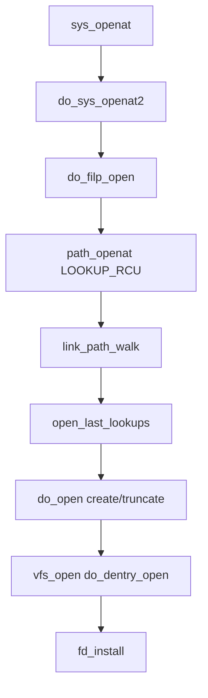

# 第10章 open 経路と do_filp_open

> **本章で読むソース**
>
> - [`fs/namei.c` L4114-L4150](https://github.com/gregkh/linux/blob/v6.18.38/fs/namei.c#L4114-L4150)
> - [`fs/namei.c` L3931-L3986](https://github.com/gregkh/linux/blob/v6.18.38/fs/namei.c#L3931-L3986)
> - [`fs/namei.c` L4153-L4167](https://github.com/gregkh/linux/blob/v6.18.38/fs/namei.c#L4153-L4167)
> - [`fs/open.c` L1092-L1107](https://github.com/gregkh/linux/blob/v6.18.38/fs/open.c#L1092-L1107)
> - [`fs/open.c` L1420-L1446](https://github.com/gregkh/linux/blob/v6.18.38/fs/open.c#L1420-L1446)
> - [`fs/open.c` L903-L975](https://github.com/gregkh/linux/blob/v6.18.38/fs/open.c#L903-L975)
> - [`include/linux/fs.h` L1211-L1226](https://github.com/gregkh/linux/blob/v6.18.38/include/linux/fs.h#L1211-L1226)

## この章の狙い

`open` システムコールが **`do_filp_open`** を経て `struct file` を生成し、fd テーブルに載るまでの経路を読む。
パス解決、末尾成分の処理、`do_dentry_open` との接続を追う。

## 前提

- [path lookup と link_path_walk](../part01-path-lookup/06-path-lookup-walk.md) を読んでいること。
- [file_operations とファイルシステム抽象化](../part00-overview/03-file-operations.md) を読んでいること。

## path_openat の制御

`alloc_empty_file` で空の `file` を確保したあと、`link_path_walk` と `open_last_lookups` をループする。
通常 open は `do_open` で create/truncate 等を処理し、`terminate_walk` でパスウォーク状態を片付ける。

[`fs/namei.c` L4114-L4150](https://github.com/gregkh/linux/blob/v6.18.38/fs/namei.c#L4114-L4150)

```c
static struct file *path_openat(struct nameidata *nd,
			const struct open_flags *op, unsigned flags)
{
	struct file *file;
	int error;

	file = alloc_empty_file(op->open_flag, current_cred());
	if (IS_ERR(file))
		return file;

	if (unlikely(file->f_flags & __O_TMPFILE)) {
		error = do_tmpfile(nd, flags, op, file);
	} else if (unlikely(file->f_flags & O_PATH)) {
		error = do_o_path(nd, flags, file);
	} else {
		const char *s = path_init(nd, flags);
		while (!(error = link_path_walk(s, nd)) &&
		       (s = open_last_lookups(nd, file, op)) != NULL)
			;
		if (!error)
			error = do_open(nd, file, op);
		terminate_walk(nd);
	}
	if (likely(!error)) {
		if (likely(file->f_mode & FMODE_OPENED))
			return file;
		WARN_ON(1);
		error = -EINVAL;
	}
	fput_close(file);
	if (error == -EOPENSTALE) {
		if (flags & LOOKUP_RCU)
			error = -ECHILD;
		else
			error = -ESTALE;
	}
	return ERR_PTR(error);
```

`O_TMPFILE` と `O_PATH` は通常経路をバイパスする特殊 open である。
`-EOPENSTALE` は RCU モードでは `-ECHILD` に変換され、呼び出し側の再試行へ委ねる。

## do_open と vfs_open

`path_openat` の通常経路は `do_open` で create 権限、`O_TRUNC`、最終的な `vfs_open` を順に処理する。

[`fs/namei.c` L3931-L3986](https://github.com/gregkh/linux/blob/v6.18.38/fs/namei.c#L3931-L3986)

```c
static int do_open(struct nameidata *nd,
		   struct file *file, const struct open_flags *op)
{
	struct mnt_idmap *idmap;
	int open_flag = op->open_flag;
	bool do_truncate;
	int acc_mode;
	int error;

	if (!(file->f_mode & (FMODE_OPENED | FMODE_CREATED))) {
		error = complete_walk(nd);
		if (error)
			return error;
	}
	if (!(file->f_mode & FMODE_CREATED))
		audit_inode(nd->name, nd->path.dentry, 0);
	idmap = mnt_idmap(nd->path.mnt);
	if (open_flag & O_CREAT) {
		if ((open_flag & O_EXCL) && !(file->f_mode & FMODE_CREATED))
			return -EEXIST;
		if (d_is_dir(nd->path.dentry))
			return -EISDIR;
		error = may_create_in_sticky(idmap, nd,
					     d_backing_inode(nd->path.dentry));
		if (unlikely(error))
			return error;
	}
	if ((nd->flags & LOOKUP_DIRECTORY) && !d_can_lookup(nd->path.dentry))
		return -ENOTDIR;

	do_truncate = false;
	acc_mode = op->acc_mode;
	if (file->f_mode & FMODE_CREATED) {
		/* Don't check for write permission, don't truncate */
		open_flag &= ~O_TRUNC;
		acc_mode = 0;
	} else if (d_is_reg(nd->path.dentry) && open_flag & O_TRUNC) {
		error = mnt_want_write(nd->path.mnt);
		if (error)
			return error;
		do_truncate = true;
	}
	error = may_open(idmap, &nd->path, acc_mode, open_flag);
	if (!error && !(file->f_mode & FMODE_OPENED))
		error = vfs_open(&nd->path, file);
	if (!error)
		error = security_file_post_open(file, op->acc_mode);
	if (!error && do_truncate)
		error = handle_truncate(idmap, file);
	if (unlikely(error > 0)) {
		WARN_ON(1);
		error = -EINVAL;
	}
	if (do_truncate)
		mnt_drop_write(nd->path.mnt);
	return error;
}
```

`vfs_open` は `path` を `file` に写し、`do_dentry_open` へ進む薄いラッパーである。

[`fs/open.c` L1092-L1107](https://github.com/gregkh/linux/blob/v6.18.38/fs/open.c#L1092-L1107)

```c
int vfs_open(const struct path *path, struct file *file)
{
	int ret;

	file->__f_path = *path;
	ret = do_dentry_open(file, NULL);
	if (!ret) {
		/*
		 * Once we return a file with FMODE_OPENED, __fput() will call
		 * fsnotify_close(), so we need fsnotify_open() here for
		 * symmetry.
		 */
		fsnotify_open(file);
	}
	return ret;
}
```

## do_filp_open の RCU 三段試行

[`fs/namei.c` L4153-L4167](https://github.com/gregkh/linux/blob/v6.18.38/fs/namei.c#L4153-L4167)

```c
struct file *do_filp_open(int dfd, struct filename *pathname,
		const struct open_flags *op)
{
	struct nameidata nd;
	int flags = op->lookup_flags;
	struct file *filp;

	set_nameidata(&nd, dfd, pathname, NULL);
	filp = path_openat(&nd, op, flags | LOOKUP_RCU);
	if (unlikely(filp == ERR_PTR(-ECHILD)))
		filp = path_openat(&nd, op, flags);
	if (unlikely(filp == ERR_PTR(-ESTALE)))
		filp = path_openat(&nd, op, flags | LOOKUP_REVAL);
	restore_nameidata();
	return filp;
```

`set_nameidata` は nested open（プロセスの cwd 解決中に別 open）向けのスタック管理を行う。

## do_dentry_open

パス解決後、`do_open` 内で `vfs_open` → `do_dentry_open` が呼ばれる。
inode から `f_mapping` と `f_op` を設定し、セキュリティと fsnotify を通す。

[`fs/open.c` L903-L921](https://github.com/gregkh/linux/blob/v6.18.38/fs/open.c#L903-L921)

```c
static int do_dentry_open(struct file *f,
			  int (*open)(struct inode *, struct file *))
{
	static const struct file_operations empty_fops = {};
	struct inode *inode = f->f_path.dentry->d_inode;
	int error;

	path_get(&f->f_path);
	f->f_inode = inode;
	f->f_mapping = inode->i_mapping;
	f->f_wb_err = filemap_sample_wb_err(f->f_mapping);
	f->f_sb_err = file_sample_sb_err(f);

	if (unlikely(f->f_flags & O_PATH)) {
		f->f_mode = FMODE_PATH | FMODE_OPENED;
		file_set_fsnotify_mode(f, FMODE_NONOTIFY);
		f->f_op = &empty_fops;
		return 0;
	}
```

[`fs/open.c` L960-L975](https://github.com/gregkh/linux/blob/v6.18.38/fs/open.c#L960-L975)

```c
	/* normally all 3 are set; ->open() can clear them if needed */
	f->f_mode |= FMODE_LSEEK | FMODE_PREAD | FMODE_PWRITE;
	if (!open)
		open = f->f_op->open;
	if (open) {
		error = open(inode, f);
		if (error)
			goto cleanup_all;
	}
	f->f_mode |= FMODE_OPENED;
	if ((f->f_mode & FMODE_READ) &&
	     likely(f->f_op->read || f->f_op->read_iter))
		f->f_mode |= FMODE_CAN_READ;
	if ((f->f_mode & FMODE_WRITE) &&
	     likely(f->f_op->write || f->f_op->write_iter))
		f->f_mode |= FMODE_CAN_WRITE;
```

## file 構造体への初期値

[`include/linux/fs.h` L1211-L1226](https://github.com/gregkh/linux/blob/v6.18.38/include/linux/fs.h#L1211-L1226)

```c
struct file {
	spinlock_t			f_lock;
	fmode_t				f_mode;
	const struct file_operations	*f_op;
	struct address_space		*f_mapping;
	void				*private_data;
	struct inode			*f_inode;
	unsigned int			f_flags;
	unsigned int			f_iocb_flags;
	const struct cred		*f_cred;
	struct fown_struct		*f_owner;
	/* --- cacheline 1 boundary (64 bytes) --- */
	union {
		const struct path	f_path;
		struct path		__f_path;
	};
```

`f_ra` は同一 union 内にあり、open 直後から readahead 状態を保持できる。

## do_sys_openat2 と fd_install

`open` / `openat` システムコールは `do_sys_openat2` に集約される。
`getname` でパス名を内核オブジェクト化したあと、未使用 fd を確保し、`do_filp_open` で得た `struct file` を `fd_install` でプロセスの fd テーブルへ載せる。

[`fs/open.c` L1420-L1446](https://github.com/gregkh/linux/blob/v6.18.38/fs/open.c#L1420-L1446)

```c
static int do_sys_openat2(int dfd, const char __user *filename,
			  struct open_how *how)
{
	struct open_flags op;
	struct filename *tmp;
	int err, fd;

	err = build_open_flags(how, &op);
	if (unlikely(err))
		return err;

	tmp = getname(filename);
	if (IS_ERR(tmp))
		return PTR_ERR(tmp);

	fd = get_unused_fd_flags(how->flags);
	if (likely(fd >= 0)) {
		struct file *f = do_filp_open(dfd, tmp, &op);
		if (IS_ERR(f)) {
			put_unused_fd(fd);
			fd = PTR_ERR(f);
		} else {
			fd_install(fd, f);
		}
	}
	putname(tmp);
	return fd;
}
```

`do_filp_open` が失敗したときは `put_unused_fd` で fd 番号を返却し、成功時だけ `fd_install` が `__fput` 経路と対になる所有権を確立する。

## 処理の流れ



## 高速化と最適化の工夫

open も lookup と同様に RCU-walk を第一選択とし、成功時の refcount と lock 取得を削る。
`FMODE_CAN_*` の事前判定は `vfs_read` / `vfs_write` での無駄な検証を避ける。

`O_PATH` と `empty_fops` はメタデータのみ必要な fd（fd passing 等）から I/O 能力を外し、後続チェックを単純化する。
`break_lease` は open 時に一度だけ実行され、デッドロックしやすい lease 処理を read/write hot path から遠ざける。

> **7.x 系での変化**
> v7.1.3 では [`do_sys_openat2` L1355-L1365](https://github.com/gregkh/linux/blob/v7.1.3/fs/open.c#L1355-L1365) が `FD_ADD` と [`do_file_open` L4877-L4894](https://github.com/gregkh/linux/blob/v7.1.3/fs/namei.c#L4877-L4894) に整理され、本章の `get_unused_fd_flags` + `do_filp_open` + `fd_install` 列はマクロ内に畳まれている。
> `do_filp_open` の RCU 三段試行（[`fs/namei.c` L4153-L4167](https://github.com/gregkh/linux/blob/v6.18.38/fs/namei.c#L4153-L4167)）の意味は変わらない。

## まとめ

`do_filp_open` はパス解決と open 固有処理を `path_openat` に集約し、RCU 失敗時の再試行を外側で行う。
`do_dentry_open` が inode から file 文脈を構築し、以降の read/write は `file` ポインタだけで進む。

## 関連する章

- [RCU-walk と ref-walk の切り替え](../part01-path-lookup/07-rcu-walk-ref-walk.md)
- [read 経路と iov_iter](11-read-path.md)
