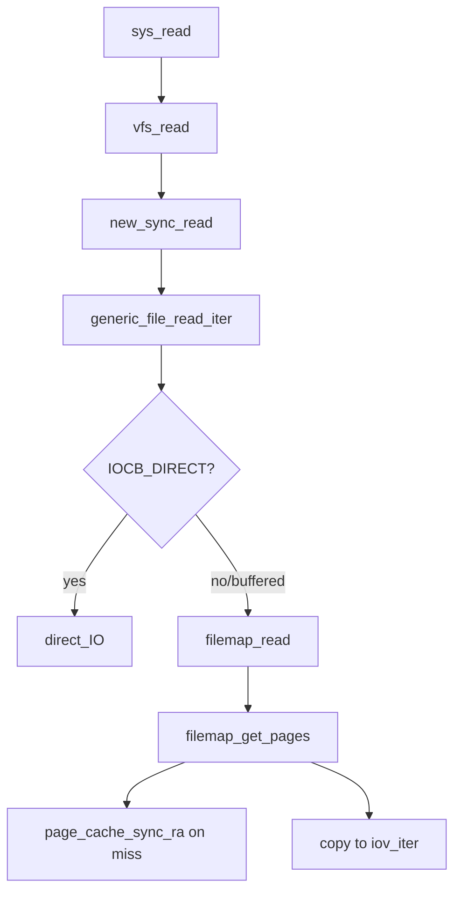

# 第11章 read 経路と iov_iter

> **本章で読むソース**
>
> - [`fs/read_write.c` L552-L580](https://github.com/gregkh/linux/blob/v6.18.38/fs/read_write.c#L552-L580)
> - [`fs/read_write.c` L481-L496](https://github.com/gregkh/linux/blob/v6.18.38/fs/read_write.c#L481-L496)
> - [`mm/filemap.c` L2905-L2946](https://github.com/gregkh/linux/blob/v6.18.38/mm/filemap.c#L2905-L2946)
> - [`mm/filemap.c` L2717-L2756](https://github.com/gregkh/linux/blob/v6.18.38/mm/filemap.c#L2717-L2756)
> - [`mm/filemap.c` L2616-L2648](https://github.com/gregkh/linux/blob/v6.18.38/mm/filemap.c#L2616-L2648)
> - [`include/linux/fs.h` L2275-L2278](https://github.com/gregkh/linux/blob/v6.18.38/include/linux/fs.h#L2275-L2278)

## この章の狙い

`read` システムコールから **`vfs_read`**、**`generic_file_read_iter`**、**`filemap_read`** までのバッファリング読み出し経路を読む。
`iov_iter` による散在バッファ表現と `IOCB_DIRECT` 分岐を押さえる。

## 前提

- [file_operations とファイルシステム抽象化](../part00-overview/03-file-operations.md) を読んでいること。

## vfs_read

権限、`access_ok`、`rw_verify_area` のあと `f_op` へ委譲する。
成功時は `fsnotify_access` と読み込みバイト数の統計を更新する。

[`fs/read_write.c` L552-L580](https://github.com/gregkh/linux/blob/v6.18.38/fs/read_write.c#L552-L580)

```c
ssize_t vfs_read(struct file *file, char __user *buf, size_t count, loff_t *pos)
{
	ssize_t ret;

	if (!(file->f_mode & FMODE_READ))
		return -EBADF;
	if (!(file->f_mode & FMODE_CAN_READ))
		return -EINVAL;
	if (unlikely(!access_ok(buf, count)))
		return -EFAULT;

	ret = rw_verify_area(READ, file, pos, count);
	if (ret)
		return ret;
	if (count > MAX_RW_COUNT)
		count =  MAX_RW_COUNT;

	if (file->f_op->read)
		ret = file->f_op->read(file, buf, count, pos);
	else if (file->f_op->read_iter)
		ret = new_sync_read(file, buf, count, pos);
	else
		ret = -EINVAL;
	if (ret > 0) {
		fsnotify_access(file);
		add_rchar(current, ret);
	}
	inc_syscr(current);
	return ret;
```

## new_sync_read と iov_iter

ユーザー空間バッファは `iov_iter_ubuf` で `ITER_DEST` として包み、`read_iter` に渡す。

[`fs/read_write.c` L481-L496](https://github.com/gregkh/linux/blob/v6.18.38/fs/read_write.c#L481-L496)

```c
static ssize_t new_sync_read(struct file *filp, char __user *buf, size_t len, loff_t *ppos)
{
	struct kiocb kiocb;
	struct iov_iter iter;
	ssize_t ret;

	init_sync_kiocb(&kiocb, filp);
	kiocb.ki_pos = (ppos ? *ppos : 0);
	iov_iter_ubuf(&iter, ITER_DEST, buf, len);

	ret = filp->f_op->read_iter(&kiocb, &iter);
	BUG_ON(ret == -EIOCBQUEUED);
	if (ppos)
		*ppos = kiocb.ki_pos;
	return ret;
```

`kiocb` は位置、フラグ、完了コールバックを非同期 I/O と共有する。

## generic_file_read_iter

`IOCB_DIRECT` 時は `direct_IO` を試し、残りまたは通常読みは `filemap_read` へ落ちる。

[`mm/filemap.c` L2905-L2946](https://github.com/gregkh/linux/blob/v6.18.38/mm/filemap.c#L2905-L2946)

```c
generic_file_read_iter(struct kiocb *iocb, struct iov_iter *iter)
{
	size_t count = iov_iter_count(iter);
	ssize_t retval = 0;

	if (!count)
		return 0; /* skip atime */

	if (iocb->ki_flags & IOCB_DIRECT) {
		struct file *file = iocb->ki_filp;
		struct address_space *mapping = file->f_mapping;
		struct inode *inode = mapping->host;

		retval = kiocb_write_and_wait(iocb, count);
		if (retval < 0)
			return retval;
		file_accessed(file);

		retval = mapping->a_ops->direct_IO(iocb, iter);
		if (retval >= 0) {
			iocb->ki_pos += retval;
			count -= retval;
		}
		if (retval != -EIOCBQUEUED)
			iov_iter_revert(iter, count - iov_iter_count(iter));

		/*
		 * Btrfs can have a short DIO read if we encounter
		 * compressed extents, so if there was an error, or if
		 * we've already read everything we wanted to, or if
		 * there was a short read because we hit EOF, go ahead
		 * and return.  Otherwise fallthrough to buffered io for
		 * the rest of the read.  Buffered reads will not work for
		 * DAX files, so don't bother trying.
		 */
		if (retval < 0 || !count || IS_DAX(inode))
			return retval;
		if (iocb->ki_pos >= i_size_read(inode))
			return retval;
	}

	return filemap_read(iocb, iter, retval);
```

DIO とバッファリングのハイブリッド読み出しは、部分的成功後にページキャッシュ経路へフォールバックしうる。

## filemap_read

folio バッチを取得し、ユーザー空間へコピーするループである。
`cond_resched` で長い読み出し中のスケジューラ公平性を保つ。

[`mm/filemap.c` L2717-L2756](https://github.com/gregkh/linux/blob/v6.18.38/mm/filemap.c#L2717-L2756)

```c
ssize_t filemap_read(struct kiocb *iocb, struct iov_iter *iter,
		ssize_t already_read)
{
	struct file *filp = iocb->ki_filp;
	struct file_ra_state *ra = &filp->f_ra;
	struct address_space *mapping = filp->f_mapping;
	struct inode *inode = mapping->host;
	struct folio_batch fbatch;
	int i, error = 0;
	bool writably_mapped;
	loff_t isize, end_offset;
	loff_t last_pos = ra->prev_pos;

	if (unlikely(iocb->ki_pos < 0))
		return -EINVAL;
	if (unlikely(iocb->ki_pos >= inode->i_sb->s_maxbytes))
		return 0;
	if (unlikely(!iov_iter_count(iter)))
		return 0;

	iov_iter_truncate(iter, inode->i_sb->s_maxbytes - iocb->ki_pos);
	folio_batch_init(&fbatch);

	do {
		cond_resched();

		/*
		 * If we've already successfully copied some data, then we
		 * can no longer safely return -EIOCBQUEUED. Hence mark
		 * an async read NOWAIT at that point.
		 */
		if ((iocb->ki_flags & IOCB_WAITQ) && already_read)
			iocb->ki_flags |= IOCB_NOWAIT;

		if (unlikely(iocb->ki_pos >= i_size_read(inode)))
			break;

		error = filemap_get_pages(iocb, iter->count, &fbatch, false);
		if (error < 0)
			break;
```

## filemap_get_pages と readahead 起動

キャッシュミス時は `page_cache_sync_ra` で先読みを起動してから folio を再取得する。

[`mm/filemap.c` L2616-L2648](https://github.com/gregkh/linux/blob/v6.18.38/mm/filemap.c#L2616-L2648)

```c
static int filemap_get_pages(struct kiocb *iocb, size_t count,
		struct folio_batch *fbatch, bool need_uptodate)
{
	struct file *filp = iocb->ki_filp;
	struct address_space *mapping = filp->f_mapping;
	pgoff_t index = iocb->ki_pos >> PAGE_SHIFT;
	pgoff_t last_index;
	struct folio *folio;
	unsigned int flags;
	int err = 0;

	/* "last_index" is the index of the folio beyond the end of the read */
	last_index = round_up(iocb->ki_pos + count,
			mapping_min_folio_nrbytes(mapping)) >> PAGE_SHIFT;
retry:
	if (fatal_signal_pending(current))
		return -EINTR;

	filemap_get_read_batch(mapping, index, last_index - 1, fbatch);
	if (!folio_batch_count(fbatch)) {
		DEFINE_READAHEAD(ractl, filp, &filp->f_ra, mapping, index);

		if (iocb->ki_flags & IOCB_NOIO)
			return -EAGAIN;
		if (iocb->ki_flags & IOCB_NOWAIT)
			flags = memalloc_noio_save();
		if (iocb->ki_flags & IOCB_DONTCACHE)
			ractl.dropbehind = 1;
		page_cache_sync_ra(&ractl, last_index - index);
		if (iocb->ki_flags & IOCB_NOWAIT)
			memalloc_noio_restore(flags);
		filemap_get_read_batch(mapping, index, last_index - 1, fbatch);
	}
```

## file_operations の read_iter

[`include/linux/fs.h` L2275-L2278](https://github.com/gregkh/linux/blob/v6.18.38/include/linux/fs.h#L2275-L2278)

```c
	ssize_t (*read) (struct file *, char __user *, size_t, loff_t *);
	ssize_t (*write) (struct file *, const char __user *, size_t, loff_t *);
	ssize_t (*read_iter) (struct kiocb *, struct iov_iter *);
	ssize_t (*write_iter) (struct kiocb *, struct iov_iter *);
```

## 処理の流れ



## 高速化と最適化の工夫

`filemap_get_read_batch` は XArray から連続 folio をまとめて取得し、インデックス走査のオーバーヘッドを減らす。
`folio_batch` は複数 folio を一度にユーザー空間へコピーするためのバッチ API である。

`IOCB_NOWAIT` と `IOCB_NOIO` は非ブロッキング読み出しを支え、ページロック待ちでスリープしない。
`folio_mark_accessed` は LRU の若返しに使われ、繰り返し読むページの回収を遅らせる（第14章）。

readahead はミス時に同期的に起動されるが、async 領域の folio には PG_readahead フラグが立ち、次回アクセスで連鎖的に拡大する（第15章）。

> **7.x 系での変化**
> `new_sync_read` と `vfs_read` の `read_iter` 委譲は v7.1.3 でも同型である（[`fs/read_write.c` L483-L498](https://github.com/gregkh/linux/blob/v7.1.3/fs/read_write.c#L483-L498)）。
> [`generic_file_read_iter` L2957-L2999](https://github.com/gregkh/linux/blob/v7.1.3/mm/filemap.c#L2957-L2999) の `IOCB_DIRECT` 分岐も維持されている。

## まとめ

バッファリング read は vfs 層の検証のあと `read_iter` → `filemap_read` → ページキャッシュコピーという経路に収束する。
`iov_iter` がバッファ表現を統一し、システムコール、sendfile、io_uring が下層を共有する。

## 関連する章

- [filemap_read とページ取得](../part04-page-cache/14-filemap-read.md)
- [readahead と file_ra_state](../part04-page-cache/15-readahead.md)
- [write 経路と generic_file_write_iter](12-write-path.md)
