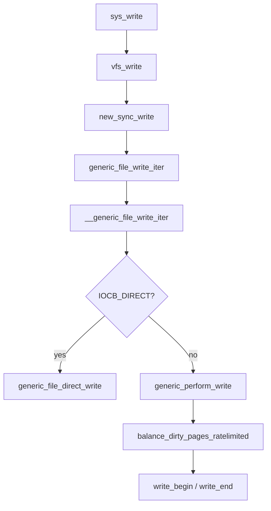

# 第12章 write 経路と generic_file_write_iter

> **本章で読むソース**
>
> - [`fs/read_write.c` L666-L695](https://github.com/gregkh/linux/blob/v6.18.38/fs/read_write.c#L666-L695)
> - [`mm/filemap.c` L4400-L4414](https://github.com/gregkh/linux/blob/v6.18.38/mm/filemap.c#L4400-L4414)
> - [`mm/filemap.c` L4353-L4383](https://github.com/gregkh/linux/blob/v6.18.38/mm/filemap.c#L4353-L4383)
> - [`mm/filemap.c` L4238-L4287](https://github.com/gregkh/linux/blob/v6.18.38/mm/filemap.c#L4238-L4287)
> - [`mm/filemap.c` L4287-L4320](https://github.com/gregkh/linux/blob/v6.18.38/mm/filemap.c#L4287-L4320)
> - [`mm/page-writeback.c` L2116-L2120](https://github.com/gregkh/linux/blob/v6.18.38/mm/page-writeback.c#L2116-L2120)
> - [`fs/read_write.c` L583-L597](https://github.com/gregkh/linux/blob/v6.18.38/fs/read_write.c#L583-L597)
> - [`include/linux/fs.h` L2276-L2278](https://github.com/gregkh/linux/blob/v6.18.38/include/linux/fs.h#L2276-L2278)

## この章の狙い

`write` システムコールから **`vfs_write`**、**`generic_file_write_iter`**、**`generic_perform_write`** までのバッファリング書き込み経路を読む。
`write_begin` / `write_end` と `balance_dirty_pages_ratelimited` との接続を押さえる。

## 前提

- [read 経路と iov_iter](11-read-path.md) を読んでいること。

## vfs_write

read と対称に、`file_start_write` / `file_end_write` で super_block 書き込みカウントを囲む。
成功時は `fsnotify_modify` を呼ぶ。

[`fs/read_write.c` L666-L695](https://github.com/gregkh/linux/blob/v6.18.38/fs/read_write.c#L666-L695)

```c
ssize_t vfs_write(struct file *file, const char __user *buf, size_t count, loff_t *pos)
{
	ssize_t ret;

	if (!(file->f_mode & FMODE_WRITE))
		return -EBADF;
	if (!(file->f_mode & FMODE_CAN_WRITE))
		return -EINVAL;
	if (unlikely(!access_ok(buf, count)))
		return -EFAULT;

	ret = rw_verify_area(WRITE, file, pos, count);
	if (ret)
		return ret;
	if (count > MAX_RW_COUNT)
		count =  MAX_RW_COUNT;
	file_start_write(file);
	if (file->f_op->write)
		ret = file->f_op->write(file, buf, count, pos);
	else if (file->f_op->write_iter)
		ret = new_sync_write(file, buf, count, pos);
	else
		ret = -EINVAL;
	if (ret > 0) {
		fsnotify_modify(file);
		add_wchar(current, ret);
	}
	inc_syscw(current);
	file_end_write(file);
	return ret;
```

`new_sync_write` は `ITER_SOURCE` の `iov_iter` で `write_iter` を呼ぶ（第11章参照）。

## generic_file_write_iter ラッパー

inode ロックの内側で `generic_write_checks` と `__generic_file_write_iter` を実行する。
`O_SYNC` の同期は呼び出し側責任とコメントされている。

[`mm/filemap.c` L4400-L4414](https://github.com/gregkh/linux/blob/v6.18.38/mm/filemap.c#L4400-L4414)

```c
ssize_t generic_file_write_iter(struct kiocb *iocb, struct iov_iter *from)
{
	struct file *file = iocb->ki_filp;
	struct inode *inode = file->f_mapping->host;
	ssize_t ret;

	inode_lock(inode);
	ret = generic_write_checks(iocb, from);
	if (ret > 0)
		ret = __generic_file_write_iter(iocb, from);
	inode_unlock(inode);

	if (ret > 0)
		ret = generic_write_sync(iocb, ret);
	return ret;
```

## DIO とバッファリングの分岐

`__generic_file_write_iter` は SUID 除去、時刻更新のあと `IOCB_DIRECT` を判定する。
DIO が部分完了した場合は `direct_write_fallback` でバッファリングに落ちうる。

[`mm/filemap.c` L4353-L4383](https://github.com/gregkh/linux/blob/v6.18.38/mm/filemap.c#L4353-L4383)

```c
ssize_t __generic_file_write_iter(struct kiocb *iocb, struct iov_iter *from)
{
	struct file *file = iocb->ki_filp;
	struct address_space *mapping = file->f_mapping;
	struct inode *inode = mapping->host;
	ssize_t ret;

	ret = file_remove_privs(file);
	if (ret)
		return ret;

	ret = file_update_time(file);
	if (ret)
		return ret;

	if (iocb->ki_flags & IOCB_DIRECT) {
		ret = generic_file_direct_write(iocb, from);
		/*
		 * If the write stopped short of completing, fall back to
		 * buffered writes.  Some filesystems do this for writes to
		 * holes, for example.  For DAX files, a buffered write will
		 * not succeed (even if it did, DAX does not handle dirty
		 * page-cache pages correctly).
		 */
		if (ret < 0 || !iov_iter_count(from) || IS_DAX(inode))
			return ret;
		return direct_write_fallback(iocb, from, ret,
				generic_perform_write(iocb, from));
	}

	return generic_perform_write(iocb, from);
```

## generic_perform_write

folio 単位で `write_begin` → ユーザー空間からコピー → `write_end` のループである。
各チャンクの前に `balance_dirty_pages_ratelimited` が dirty スロットリングを行う。

[`mm/filemap.c` L4238-L4287](https://github.com/gregkh/linux/blob/v6.18.38/mm/filemap.c#L4238-L4287)

```c
ssize_t generic_perform_write(struct kiocb *iocb, struct iov_iter *i)
{
	struct file *file = iocb->ki_filp;
	loff_t pos = iocb->ki_pos;
	struct address_space *mapping = file->f_mapping;
	const struct address_space_operations *a_ops = mapping->a_ops;
	size_t chunk = mapping_max_folio_size(mapping);
	long status = 0;
	ssize_t written = 0;

	do {
		struct folio *folio;
		size_t offset;		/* Offset into folio */
		size_t bytes;		/* Bytes to write to folio */
		size_t copied;		/* Bytes copied from user */
		void *fsdata = NULL;

		bytes = iov_iter_count(i);
retry:
		offset = pos & (chunk - 1);
		bytes = min(chunk - offset, bytes);
		balance_dirty_pages_ratelimited(mapping);

		if (fatal_signal_pending(current)) {
			status = -EINTR;
			break;
		}

		status = a_ops->write_begin(iocb, mapping, pos, bytes,
						&folio, &fsdata);
		if (unlikely(status < 0))
			break;

		offset = offset_in_folio(folio, pos);
		if (bytes > folio_size(folio) - offset)
			bytes = folio_size(folio) - offset;

		if (mapping_writably_mapped(mapping))
			flush_dcache_folio(folio);

		/*
		 * Faults here on mmap()s can recurse into arbitrary
		 * filesystem code. Lots of locks are held that can
		 * deadlock. Use an atomic copy to avoid deadlocking
		 * in page fault handling.
		 */
		copied = copy_folio_from_iter_atomic(folio, offset, bytes, i);
		flush_dcache_folio(folio);

		status = a_ops->write_end(iocb, mapping, pos, bytes, copied,
```

`copy_folio_from_iter_atomic` は mmap フォールト再入を避けるため atomic コピーを選ぶ。

## write_end とループ継続

`write_end` が短いコピーを拒否した場合は chunk を半分にして `retry` する。
成功時は `pos` と `written` を進め、残りがあればループを続ける。

[`mm/filemap.c` L4287-L4320](https://github.com/gregkh/linux/blob/v6.18.38/mm/filemap.c#L4287-L4320)

```c
		status = a_ops->write_end(iocb, mapping, pos, bytes, copied,
						folio, fsdata);
		if (unlikely(status != copied)) {
			iov_iter_revert(i, copied - max(status, 0L));
			if (unlikely(status < 0))
				break;
		}
		cond_resched();

		if (unlikely(status == 0)) {
			/*
			 * A short copy made ->write_end() reject the
			 * thing entirely.  Might be memory poisoning
			 * halfway through, might be a race with munmap,
			 * might be severe memory pressure.
			 */
			if (chunk > PAGE_SIZE)
				chunk /= 2;
			if (copied) {
				bytes = copied;
				goto retry;
			}

			/*
			 * 'folio' is now unlocked and faults on it can be
			 * handled. Ensure forward progress by trying to
			 * fault it in now.
			 */
			if (fault_in_iov_iter_readable(i, bytes) == bytes) {
				status = -EFAULT;
				break;
			}
		} else {
```

`balance_dirty_pages` の詳細は mm 分冊を参照する。
ratelimited 入口は次のとおりである。

[`mm/page-writeback.c` L2116-L2120](https://github.com/gregkh/linux/blob/v6.18.38/mm/page-writeback.c#L2116-L2120)

```c
void balance_dirty_pages_ratelimited(struct address_space *mapping)
{
	balance_dirty_pages_ratelimited_flags(mapping, 0);
}
EXPORT_SYMBOL(balance_dirty_pages_ratelimited);
```

## write_iter 宣言

[`include/linux/fs.h` L2276-L2278](https://github.com/gregkh/linux/blob/v6.18.38/include/linux/fs.h#L2276-L2278)

```c
	ssize_t (*write) (struct file *, const char __user *, size_t, loff_t *);
	ssize_t (*read_iter) (struct kiocb *, struct iov_iter *);
	ssize_t (*write_iter) (struct kiocb *, struct iov_iter *);
```

## 処理の流れ



## 高速化と最適化の工夫

`chunk = mapping_max_folio_size` は THP 対応ファイルで大きな folio を一度に書き、システムコールあたりの `write_begin` 回数を減らす。
`balance_dirty_pages_ratelimited` はプロセスごとの dirty ページ生成速度を抑え、メモリ枯渇と writeback 嵐を防ぐ。

DIO 部分書き込み後の buffered fallback はホールへの書き込み等でディスクアクセスを最小化しつつ、API 上の完全書き込みを満たす。
`file_start_write` / `file_end_write` は super_block の frozen 状態と整合し、同期中の書き込みをブロックする。

> **7.x 系での変化**
> `generic_file_write_iter` と `generic_perform_write` のループ構造は v7.1.3 でも同型である（[`mm/filemap.c` L4459-L4474](https://github.com/gregkh/linux/blob/v7.1.3/mm/filemap.c#L4459-L4474)、[`L4297-L4388`](https://github.com/gregkh/linux/blob/v7.1.3/mm/filemap.c#L4297-L4388)）。
> `balance_dirty_pages_ratelimited` による dirty 制限も維持されている。

## まとめ

バッファリング write は `generic_perform_write` のループに集約され、ページ確保と dirty 化は `address_space_operations` に委譲される。
dirty 制御は書き込み経路に ratelimit 付きで挿入され、ライトバックは非同期に追いつく（第16、17章）。

## 関連する章

- [書き込みと dirty ページ](../part04-page-cache/16-write-dirty.md)
- [メモリ管理の writeback とページキャッシュ回収](../../mm/part04-reclaim/16-writeback-reclaim.md)
