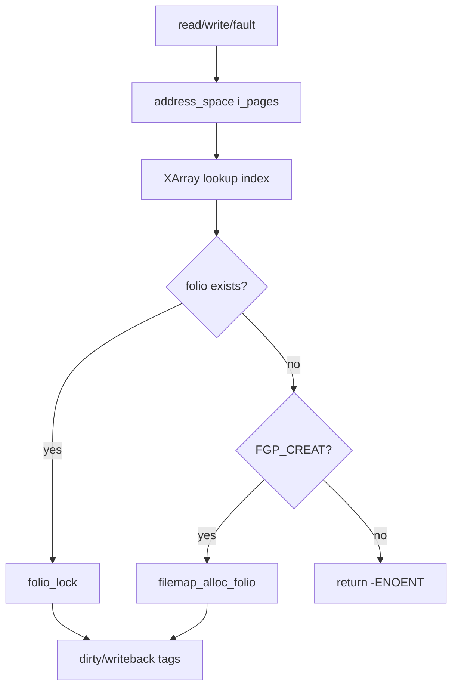

# 第13章 address_space と XArray

> **本章で読むソース**
>
> - [`include/linux/fs.h` L506-L536](https://github.com/gregkh/linux/blob/v6.18.38/include/linux/fs.h#L506-L536)
> - [`include/linux/fs.h` L533-L544](https://github.com/gregkh/linux/blob/v6.18.38/include/linux/fs.h#L533-L544)
> - [`include/linux/fs.h` L546-L574](https://github.com/gregkh/linux/blob/v6.18.38/include/linux/fs.h#L546-L574)
> - [`mm/filemap.c` L1947-L1975](https://github.com/gregkh/linux/blob/v6.18.38/mm/filemap.c#L1947-L1975)
> - [`mm/filemap.c` L1988-L1990](https://github.com/gregkh/linux/blob/v6.18.38/mm/filemap.c#L1988-L1990)
> - [`mm/filemap.c` L2058-L2059](https://github.com/gregkh/linux/blob/v6.18.38/mm/filemap.c#L2058-L2059)
> - [`include/linux/fs.h` L805-L807](https://github.com/gregkh/linux/blob/v6.18.38/include/linux/fs.h#L805-L807)
> - [`mm/filemap.c` L97-L98](https://github.com/gregkh/linux/blob/v6.18.38/mm/filemap.c#L97-L98)

## この章の狙い

**address_space** が inode のデータページを **XArray**（`i_pages`）で索引する仕組みと、dirty/writeback タグ、 mmap ロックの役割を読む。
ページキャッシュ章の前提となるデータ構造を固定する。

## 前提

- [folio とページ管理単位](../../mm/part00-foundation/02-folio-page-unit.md) を読んでいること。
- [XArray](../../foundation/part03-datastructures/11-xarray.md) の一般 API を概観していること。

## address_space の中核フィールド

[`include/linux/fs.h` L506-L536](https://github.com/gregkh/linux/blob/v6.18.38/include/linux/fs.h#L506-L536)

```c
struct address_space {
	struct inode		*host;
	struct xarray		i_pages;
	struct rw_semaphore	invalidate_lock;
	gfp_t			gfp_mask;
	atomic_t		i_mmap_writable;
#ifdef CONFIG_READ_ONLY_THP_FOR_FS
	/* number of thp, only for non-shmem files */
	atomic_t		nr_thps;
#endif
	struct rb_root_cached	i_mmap;
	unsigned long		nrpages;
	pgoff_t			writeback_index;
	const struct address_space_operations *a_ops;
	unsigned long		flags;
	errseq_t		wb_err;
	spinlock_t		i_private_lock;
	struct list_head	i_private_list;
	struct rw_semaphore	i_mmap_rwsem;
	void *			i_private_data;
} __attribute__((aligned(sizeof(long)))) __randomize_layout;
	/*
	 * On most architectures that alignment is already the case; but
	 * must be enforced here for CRIS, to let the least significant bit
	 * of struct folio's "mapping" pointer be used for FOLIO_MAPPING_ANON.
	 */

/* XArray tags, for tagging dirty and writeback pages in the pagecache. */
#define PAGECACHE_TAG_DIRTY	XA_MARK_0
#define PAGECACHE_TAG_WRITEBACK	XA_MARK_1
#define PAGECACHE_TAG_TOWRITE	XA_MARK_2
```

`i_pages` のインデックスはファイル内の folio インデックス（`pgoff_t`）である。
`nrpages` はキャッシュ内ページ数の近似カウントである。

## XArray タグと mapping_tagged

dirty と writeback 状態は folio フラグに加え、XArray のマークビットでも追跡される。
ライトバックはタグ付き folio を効率的に列挙できる。

[`include/linux/fs.h` L533-L544](https://github.com/gregkh/linux/blob/v6.18.38/include/linux/fs.h#L533-L544)

```c
/* XArray tags, for tagging dirty and writeback pages in the pagecache. */
#define PAGECACHE_TAG_DIRTY	XA_MARK_0
#define PAGECACHE_TAG_WRITEBACK	XA_MARK_1
#define PAGECACHE_TAG_TOWRITE	XA_MARK_2

/*
 * Returns true if any of the pages in the mapping are marked with the tag.
 */
static inline bool mapping_tagged(const struct address_space *mapping, xa_mark_t tag)
{
	return xa_marked(&mapping->i_pages, tag);
}
```

## i_mmap_rwsem

VMA 赤黒木 `i_mmap` への挿除と、ページキャッシュ invalidate の排他を制御する。

[`include/linux/fs.h` L546-L574](https://github.com/gregkh/linux/blob/v6.18.38/include/linux/fs.h#L546-L574)

```c
static inline void i_mmap_lock_write(struct address_space *mapping)
{
	down_write(&mapping->i_mmap_rwsem);
}

static inline int i_mmap_trylock_write(struct address_space *mapping)
{
	return down_write_trylock(&mapping->i_mmap_rwsem);
}

static inline void i_mmap_unlock_write(struct address_space *mapping)
{
	up_write(&mapping->i_mmap_rwsem);
}

static inline int i_mmap_trylock_read(struct address_space *mapping)
{
	return down_read_trylock(&mapping->i_mmap_rwsem);
}

static inline void i_mmap_lock_read(struct address_space *mapping)
{
	down_read(&mapping->i_mmap_rwsem);
}

static inline void i_mmap_unlock_read(struct address_space *mapping)
{
	up_read(&mapping->i_mmap_rwsem);
}
```

## inode との接続

通常ファイルの `i_mapping` がデータ address_space を指す。

[`include/linux/fs.h` L805-L807](https://github.com/gregkh/linux/blob/v6.18.38/include/linux/fs.h#L805-L807)

```c
	const struct inode_operations	*i_op;
	struct super_block	*i_sb;
	struct address_space	*i_mapping;
```

## __filemap_get_folio

XArray から folio を取得する代表 API である。
`FGP_CREAT` が立っているときだけ miss 時に割り当て、通常の `filemap_get_folio` は miss を `-ENOENT` で返し readahead や `read_folio` へ委ねる。

[`mm/filemap.c` L1947-L1975](https://github.com/gregkh/linux/blob/v6.18.38/mm/filemap.c#L1947-L1975)

```c
struct folio *__filemap_get_folio(struct address_space *mapping, pgoff_t index,
		fgf_t fgp_flags, gfp_t gfp)
{
	struct folio *folio;

repeat:
	folio = filemap_get_entry(mapping, index);
	if (xa_is_value(folio))
		folio = NULL;
	if (!folio)
		goto no_page;

	if (fgp_flags & FGP_LOCK) {
		if (fgp_flags & FGP_NOWAIT) {
			if (!folio_trylock(folio)) {
				folio_put(folio);
				return ERR_PTR(-EAGAIN);
			}
		} else {
			folio_lock(folio);
		}

		/* Has the page been truncated? */
		if (unlikely(folio->mapping != mapping)) {
			folio_unlock(folio);
			folio_put(folio);
			goto repeat;
		}
		VM_BUG_ON_FOLIO(!folio_contains(folio, index), folio);
```

[`mm/filemap.c` L1988-L1990](https://github.com/gregkh/linux/blob/v6.18.38/mm/filemap.c#L1988-L1990)

```c
no_page:
	if (!folio && (fgp_flags & FGP_CREAT)) {
```

[`mm/filemap.c` L2058-L2059](https://github.com/gregkh/linux/blob/v6.18.38/mm/filemap.c#L2058-L2059)

```c
	if (!folio)
		return ERR_PTR(-ENOENT);
```

## ロック順序（filemap.c コメント）

filemap.c 先頭付近は invalidate_lock と folio ロックの順序を文書化している。

[`mm/filemap.c` L97-L98](https://github.com/gregkh/linux/blob/v6.18.38/mm/filemap.c#L97-L98)

```c
 *    ->invalidate_lock		(filemap_fault)
 *      ->lock_page		(filemap_fault, access_process_vm)
```

## 処理の流れ（folio 索引）



## 高速化と最適化の工夫

XArray は radix tree 後継としてスパースな巨大ファイルでもインデックス効率を保ち、マルチレベルノードでメモリを節約する。
タグビットは folio 走査なしに dirty ページの有無を O(1) 近くで判定し、writeback のキューイングを速くする。

`invalidate_lock` と `i_mmap_rwsem` の分離は、読み取り多めのワークロードで mmap 読み取りロックを保持したままキャッシュラインを更新しうる設計と両立する。
`filemap_get_read_batch` は連続インデックスの folio を一括取得し、XArray 走査回数を減らす（第14章）。

> **7.x 系での変化**
> v7.1.3 では [`__filemap_get_folio_mpol` L1941-L2058](https://github.com/gregkh/linux/blob/v7.1.3/mm/filemap.c#L1941-L2058) に改名され、mempolicy 引数が追加された。
> [`__filemap_get_folio` L760-L764](https://github.com/gregkh/linux/blob/v7.1.3/include/linux/pagemap.h#L760-L764) はラッパーとして残る。
> 本章の `FGP_CREAT` 条件付き割り当てと miss 時の `-ENOENT` は変わらない。

## まとめ

address_space はファイルデータのページキャッシュ容器であり、XArray が folio 索引、タグが dirty 状態管理、rwsem が mmap との整合を担う。
以降の read/write/writeback はすべてこの構造を中心に回る。

## 関連する章

- [filemap_read とページ取得](14-filemap-read.md)
- [書き込みと dirty ページ](16-write-dirty.md)
- [XArray](../../foundation/part03-datastructures/11-xarray.md)
