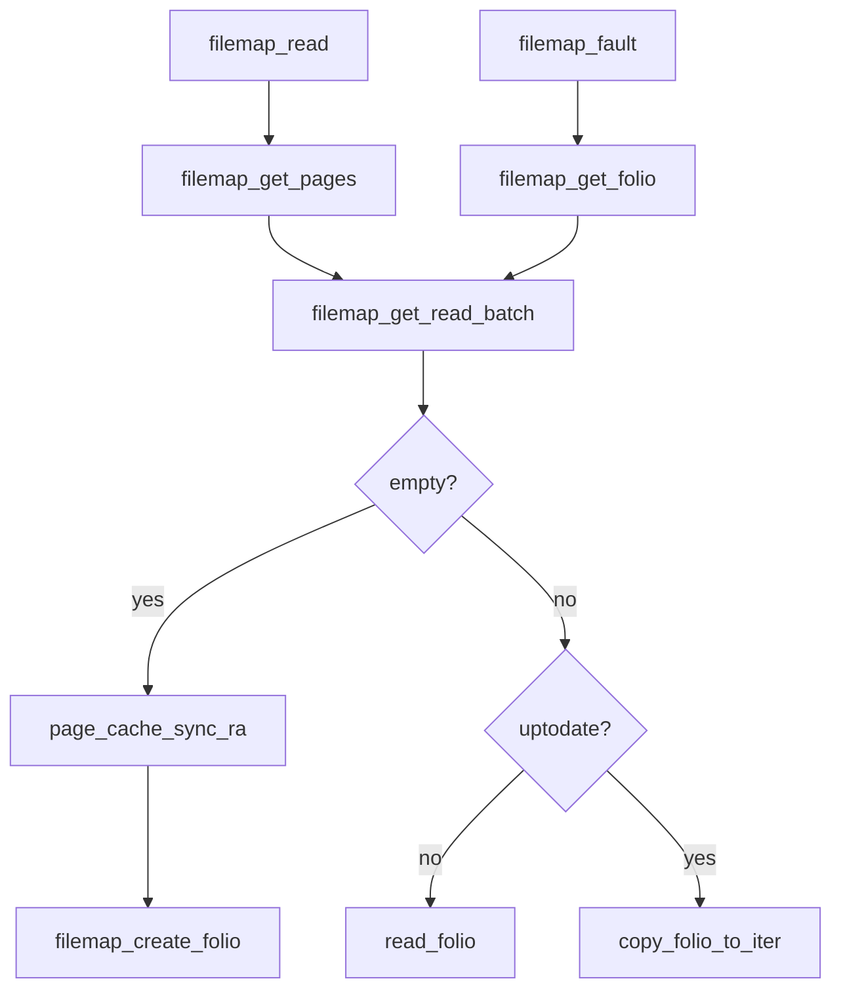

# 第14章 filemap_read とページ取得

> **本章で読むソース**
>
> - [`mm/filemap.c` L2717-L2796](https://github.com/gregkh/linux/blob/v6.18.38/mm/filemap.c#L2717-L2796)
> - [`mm/filemap.c` L2616-L2665](https://github.com/gregkh/linux/blob/v6.18.38/mm/filemap.c#L2616-L2665)
> - [`mm/filemap.c` L3453-L3487](https://github.com/gregkh/linux/blob/v6.18.38/mm/filemap.c#L3453-L3487)
> - [`mm/filemap.c` L3923-L3927](https://github.com/gregkh/linux/blob/v6.18.38/mm/filemap.c#L3923-L3927)
> - [`mm/filemap.c` L2905-L2946](https://github.com/gregkh/linux/blob/v6.18.38/mm/filemap.c#L2905-L2946)
> - [`mm/filemap.c` L1947-L1958](https://github.com/gregkh/linux/blob/v6.18.38/mm/filemap.c#L1947-L1958)

## この章の狙い

バッファリング読み出しの中心 **`filemap_read`** と、folio 取得 **`filemap_get_pages`**、mmap フォールト **`filemap_fault`** の関係を読む。
read システムコールと mmap の両方が同じページキャッシュを共有する理由を押さえる。

## 前提

- [address_space と XArray](13-address-space-xarray.md) を読んでいること。
- [read 経路と iov_iter](../part03-file-io/11-read-path.md) を読んでいること。

## filemap_read のループ

folio バッチを取得し、`copy_folio_to_iter` でユーザー空間へコピーする。
`i_size` は folio が Uptodate になったあとで検証し、部分読みのゼロ埋め誤りを防ぐ。

[`mm/filemap.c` L2717-L2796](https://github.com/gregkh/linux/blob/v6.18.38/mm/filemap.c#L2717-L2796)

```c
ssize_t filemap_read(struct kiocb *iocb, struct iov_iter *iter,
		ssize_t already_read)
{
	struct file *filp = iocb->ki_filp;
	struct file_ra_state *ra = &filp->f_ra;
	struct address_space *mapping = filp->f_mapping;
	struct inode *inode = mapping->host;
	struct folio_batch fbatch;
	int i, error = 0;
	bool writably_mapped;
	loff_t isize, end_offset;
	loff_t last_pos = ra->prev_pos;

	if (unlikely(iocb->ki_pos < 0))
		return -EINVAL;
	if (unlikely(iocb->ki_pos >= inode->i_sb->s_maxbytes))
		return 0;
	if (unlikely(!iov_iter_count(iter)))
		return 0;

	iov_iter_truncate(iter, inode->i_sb->s_maxbytes - iocb->ki_pos);
	folio_batch_init(&fbatch);

	do {
		cond_resched();

		/*
		 * If we've already successfully copied some data, then we
		 * can no longer safely return -EIOCBQUEUED. Hence mark
		 * an async read NOWAIT at that point.
		 */
		if ((iocb->ki_flags & IOCB_WAITQ) && already_read)
			iocb->ki_flags |= IOCB_NOWAIT;

		if (unlikely(iocb->ki_pos >= i_size_read(inode)))
			break;

		error = filemap_get_pages(iocb, iter->count, &fbatch, false);
		if (error < 0)
			break;

		/*
		 * i_size must be checked after we know the pages are Uptodate.
		 *
		 * Checking i_size after the check allows us to calculate
		 * the correct value for "nr", which means the zero-filled
		 * part of the page is not copied back to userspace (unless
		 * another truncate extends the file - this is desired though).
		 */
		isize = i_size_read(inode);
		if (unlikely(iocb->ki_pos >= isize))
			goto put_folios;
		end_offset = min_t(loff_t, isize, iocb->ki_pos + iter->count);

		/*
		 * Once we start copying data, we don't want to be touching any
		 * cachelines that might be contended:
		 */
		writably_mapped = mapping_writably_mapped(mapping);

		/*
		 * When a read accesses the same folio several times, only
		 * mark it as accessed the first time.
		 */
		if (!pos_same_folio(iocb->ki_pos, last_pos - 1,
				    fbatch.folios[0]))
			folio_mark_accessed(fbatch.folios[0]);

		for (i = 0; i < folio_batch_count(&fbatch); i++) {
			struct folio *folio = fbatch.folios[i];
			size_t fsize = folio_size(folio);
			size_t offset = iocb->ki_pos & (fsize - 1);
			size_t bytes = min_t(loff_t, end_offset - iocb->ki_pos,
					     fsize - offset);
			size_t copied;

			if (end_offset < folio_pos(folio))
				break;
			if (i > 0)
				folio_mark_accessed(folio);
```

`writably_mapped` が真なら共有 mmap 書き込みとキャッシュの整合のため追加処理が入る。

## filemap_get_pages

バッチ取得に失敗すれば readahead を起動し、それでも無ければ `filemap_create_folio` でページを作る。

[`mm/filemap.c` L2616-L2665](https://github.com/gregkh/linux/blob/v6.18.38/mm/filemap.c#L2616-L2665)

```c
static int filemap_get_pages(struct kiocb *iocb, size_t count,
		struct folio_batch *fbatch, bool need_uptodate)
{
	struct file *filp = iocb->ki_filp;
	struct address_space *mapping = filp->f_mapping;
	pgoff_t index = iocb->ki_pos >> PAGE_SHIFT;
	pgoff_t last_index;
	struct folio *folio;
	unsigned int flags;
	int err = 0;

	/* "last_index" is the index of the folio beyond the end of the read */
	last_index = round_up(iocb->ki_pos + count,
			mapping_min_folio_nrbytes(mapping)) >> PAGE_SHIFT;
retry:
	if (fatal_signal_pending(current))
		return -EINTR;

	filemap_get_read_batch(mapping, index, last_index - 1, fbatch);
	if (!folio_batch_count(fbatch)) {
		DEFINE_READAHEAD(ractl, filp, &filp->f_ra, mapping, index);

		if (iocb->ki_flags & IOCB_NOIO)
			return -EAGAIN;
		if (iocb->ki_flags & IOCB_NOWAIT)
			flags = memalloc_noio_save();
		if (iocb->ki_flags & IOCB_DONTCACHE)
			ractl.dropbehind = 1;
		page_cache_sync_ra(&ractl, last_index - index);
		if (iocb->ki_flags & IOCB_NOWAIT)
			memalloc_noio_restore(flags);
		filemap_get_read_batch(mapping, index, last_index - 1, fbatch);
	}
	if (!folio_batch_count(fbatch)) {
		err = filemap_create_folio(iocb, fbatch);
		if (err == AOP_TRUNCATED_PAGE)
			goto retry;
		return err;
	}

	folio = fbatch->folios[folio_batch_count(fbatch) - 1];
	if (folio_test_readahead(folio)) {
		err = filemap_readahead(iocb, filp, mapping, folio, last_index);
		if (err)
			goto err;
	}
	if (!folio_test_uptodate(folio)) {
		if (folio_batch_count(fbatch) > 1) {
			err = -EAGAIN;
			goto err;
```

`folio_test_readahead` が立っている folio に触れたとき、非同期先読みの連鎖が起動する。

## filemap_fault（mmap 読み取り）

ページフォールトでも同じ address_space から folio を引き当てる。

[`mm/filemap.c` L3453-L3487](https://github.com/gregkh/linux/blob/v6.18.38/mm/filemap.c#L3453-L3487)

```c
vm_fault_t filemap_fault(struct vm_fault *vmf)
{
	int error;
	struct file *file = vmf->vma->vm_file;
	struct file *fpin = NULL;
	struct address_space *mapping = file->f_mapping;
	struct inode *inode = mapping->host;
	pgoff_t max_idx, index = vmf->pgoff;
	struct folio *folio;
	vm_fault_t ret = 0;
	bool mapping_locked = false;

	max_idx = DIV_ROUND_UP(i_size_read(inode), PAGE_SIZE);
	if (unlikely(index >= max_idx))
		return VM_FAULT_SIGBUS;

	trace_mm_filemap_fault(mapping, index);

	/*
	 * Do we have something in the page cache already?
	 */
	folio = filemap_get_folio(mapping, index);
	if (likely(!IS_ERR(folio))) {
		/*
		 * We found the page, so try async readahead before waiting for
		 * the lock.
		 */
		if (!(vmf->flags & FAULT_FLAG_TRIED))
			fpin = do_async_mmap_readahead(vmf, folio);
		if (unlikely(!folio_test_uptodate(folio))) {
			filemap_invalidate_lock_shared(mapping);
			mapping_locked = true;
		}
	} else {
		ret = filemap_fault_recheck_pte_none(vmf);
```

## generic_file_vm_ops

mmap の fault ハンドラとして `filemap_fault` が登録される。

[`mm/filemap.c` L3923-L3927](https://github.com/gregkh/linux/blob/v6.18.38/mm/filemap.c#L3923-L3927)

```c
const struct vm_operations_struct generic_file_vm_ops = {
	.fault		= filemap_fault,
	.map_pages	= filemap_map_pages,
	.page_mkwrite	= filemap_page_mkwrite,
};
```

## generic_file_read_iter からの入口

[`mm/filemap.c` L2905-L2946](https://github.com/gregkh/linux/blob/v6.18.38/mm/filemap.c#L2905-L2946)

```c
generic_file_read_iter(struct kiocb *iocb, struct iov_iter *iter)
{
	size_t count = iov_iter_count(iter);
	ssize_t retval = 0;

	if (!count)
		return 0; /* skip atime */

	if (iocb->ki_flags & IOCB_DIRECT) {
		struct file *file = iocb->ki_filp;
		struct address_space *mapping = file->f_mapping;
		struct inode *inode = mapping->host;

		retval = kiocb_write_and_wait(iocb, count);
		if (retval < 0)
			return retval;
		file_accessed(file);

		retval = mapping->a_ops->direct_IO(iocb, iter);
		if (retval >= 0) {
			iocb->ki_pos += retval;
			count -= retval;
		}
		if (retval != -EIOCBQUEUED)
			iov_iter_revert(iter, count - iov_iter_count(iter));

		/*
		 * Btrfs can have a short DIO read if we encounter
		 * compressed extents, so if there was an error, or if
		 * we've already read everything we wanted to, or if
		 * there was a short read because we hit EOF, go ahead
		 * and return.  Otherwise fallthrough to buffered io for
		 * the rest of the read.  Buffered reads will not work for
		 * DAX files, so don't bother trying.
		 */
		if (retval < 0 || !count || IS_DAX(inode))
			return retval;
		if (iocb->ki_pos >= i_size_read(inode))
			return retval;
	}

	return filemap_read(iocb, iter, retval);
```

関数全体は第11章を参照する。
末尾が `filemap_read` 呼び出しである。

## __filemap_get_folio の入口

[`mm/filemap.c` L1947-L1958](https://github.com/gregkh/linux/blob/v6.18.38/mm/filemap.c#L1947-L1958)

```c
struct folio *__filemap_get_folio(struct address_space *mapping, pgoff_t index,
		fgf_t fgp_flags, gfp_t gfp)
{
	struct folio *folio;

repeat:
	folio = filemap_get_entry(mapping, index);
	if (xa_is_value(folio))
		folio = NULL;
	if (!folio)
		goto no_page;

```

## 処理の流れ



## 高速化と最適化の工夫

`folio_batch` と `filemap_get_read_batch` は連続 folio の一括処理で、システムコールあたりの XArray ロック回数を削る。
`folio_mark_accessed` は LRU 回収から保護し、ホットデータの再読み込み I/O を減らす。

`IOCB_DONTCACHE` と dropbehind は一度きりの読み取りでキャッシュを汚さず、ストリーミング読み出しのキャッシュ汚染を防ぐ。
mmap fault と read の統合はディスクからの二重読み込みを避け、同一 folio をプロセス間で共有する。

> **7.x 系での変化**
> `filemap_read` の folio バッチ取得とユーザー空間コピーループは v7.1.3 でも同型である（[`mm/filemap.c` L2769-L2881](https://github.com/gregkh/linux/blob/v7.1.3/mm/filemap.c#L2769-L2881)）。
> folio 取得 API の mpol 化（第13章）は本章の read ループの意味を変えない。

## まとめ

`filemap_read` はページキャッシュからユーザー空間へのコピーループであり、ミス時は readahead と `read_folio` が供給する。
`filemap_fault` は同じキャッシュを mmap 経路に接続し、read と mmap の一貫性を保つ。

## 関連する章

- [readahead と file_ra_state](15-readahead.md)
- [ページフォールトと handle_mm_fault](../../mm/part03-virtual/16-page-table-walk-missing-fault.md)
