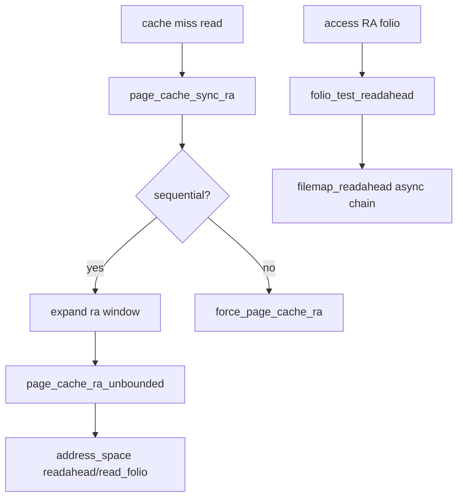

# 第15章 readahead と file_ra_state

> **本章で読むソース**
>
> - [`mm/readahead.c` L11-L34](https://github.com/gregkh/linux/blob/v6.18.38/mm/readahead.c#L11-L34)
> - [`mm/readahead.c` L554-L595](https://github.com/gregkh/linux/blob/v6.18.38/mm/readahead.c#L554-L595)
> - [`mm/readahead.c` L210-L251](https://github.com/gregkh/linux/blob/v6.18.38/mm/readahead.c#L210-L251)
> - [`mm/readahead.c` L339-L364](https://github.com/gregkh/linux/blob/v6.18.38/mm/readahead.c#L339-L364)
> - [`include/linux/fs.h` L1243-L1248](https://github.com/gregkh/linux/blob/v6.18.38/include/linux/fs.h#L1243-L1248)
> - [`mm/filemap.c` L2656-L2660](https://github.com/gregkh/linux/blob/v6.18.38/mm/filemap.c#L2656-L2660)

## この章の狙い

シーケンシャル読み出しを先取りする **readahead** のトリガー、ウィンドウサイズ、`file_ra_state` の役割を読む。
`page_cache_sync_ra` と `page_cache_ra_unbounded` の違いを押さえる。

## 前提

- [filemap_read とページ取得](14-filemap-read.md) を読んでいること。

## readahead の概要（カーネル DOC）

`readahead.c` 先頭の DOC コメントが、同期部分と async 部分、PG_readahead フラグの連鎖を説明する。

[`mm/readahead.c` L11-L34](https://github.com/gregkh/linux/blob/v6.18.38/mm/readahead.c#L11-L34)

```c
/**
 * DOC: Readahead Overview
 *
 * Readahead is used to read content into the page cache before it is
 * explicitly requested by the application.  Readahead only ever
 * attempts to read folios that are not yet in the page cache.  If a
 * folio is present but not up-to-date, readahead will not try to read
 * it. In that case a simple ->read_folio() will be requested.
 *
 * Readahead is triggered when an application read request (whether a
 * system call or a page fault) finds that the requested folio is not in
 * the page cache, or that it is in the page cache and has the
 * readahead flag set.  This flag indicates that the folio was read
 * as part of a previous readahead request and now that it has been
 * accessed, it is time for the next readahead.
 *
 * Each readahead request is partly synchronous read, and partly async
 * readahead.  This is reflected in the struct file_ra_state which
 * contains ->size being the total number of pages, and ->async_size
 * which is the number of pages in the async section.  The readahead
 * flag will be set on the first folio in this async section to trigger
 * a subsequent readahead.  Once a series of sequential reads has been
 * established, there should be no need for a synchronous component and
 * all readahead request will be fully asynchronous.
```

## page_cache_sync_ra

シーケンシャル判定に失敗した場合やランダムモードでは `force_page_cache_ra` に落ちる。
通常は `get_init_ra_size` でウィンドウを決め、async 領域サイズを設定する。

[`mm/readahead.c` L554-L595](https://github.com/gregkh/linux/blob/v6.18.38/mm/readahead.c#L554-L595)

```c
void page_cache_sync_ra(struct readahead_control *ractl,
		unsigned long req_count)
{
	pgoff_t index = readahead_index(ractl);
	bool do_forced_ra = ractl->file && (ractl->file->f_mode & FMODE_RANDOM);
	struct file_ra_state *ra = ractl->ra;
	unsigned long max_pages, contig_count;
	pgoff_t prev_index, miss;

	trace_page_cache_sync_ra(ractl->mapping->host, index, ra, req_count);
	/*
	 * Even if readahead is disabled, issue this request as readahead
	 * as we'll need it to satisfy the requested range. The forced
	 * readahead will do the right thing and limit the read to just the
	 * requested range, which we'll set to 1 page for this case.
	 */
	if (!ra->ra_pages || blk_cgroup_congested()) {
		if (!ractl->file)
			return;
		req_count = 1;
		do_forced_ra = true;
	}

	/* be dumb */
	if (do_forced_ra) {
		force_page_cache_ra(ractl, req_count);
		return;
	}

	max_pages = ractl_max_pages(ractl, req_count);
	prev_index = (unsigned long long)ra->prev_pos >> PAGE_SHIFT;
	/*
	 * A start of file, oversized read, or sequential cache miss:
	 * trivial case: (index - prev_index) == 1
	 * unaligned reads: (index - prev_index) == 0
	 */
	if (!index || req_count > max_pages || index - prev_index <= 1UL) {
		ra->start = index;
		ra->size = get_init_ra_size(req_count, max_pages);
		ra->async_size = ra->size > req_count ? ra->size - req_count :
							ra->size >> 1;
		goto readit;
```

`FMODE_RANDOM` は適応的な窓拡大を止め、要求範囲は `force_page_cache_ra` で読む。
ランダム I/O で投機的な先読みを避ける。

## page_cache_ra_unbounded

先読み folio を XArray に載せ、async 領域の先頭に readahead マークを付ける。

[`mm/readahead.c` L210-L251](https://github.com/gregkh/linux/blob/v6.18.38/mm/readahead.c#L210-L251)

```c
void page_cache_ra_unbounded(struct readahead_control *ractl,
		unsigned long nr_to_read, unsigned long lookahead_size)
{
	struct address_space *mapping = ractl->mapping;
	unsigned long index = readahead_index(ractl);
	gfp_t gfp_mask = readahead_gfp_mask(mapping);
	unsigned long mark = ULONG_MAX, i = 0;
	unsigned int min_nrpages = mapping_min_folio_nrpages(mapping);

	/*
	 * Partway through the readahead operation, we will have added
	 * locked pages to the page cache, but will not yet have submitted
	 * them for I/O.  Adding another page may need to allocate memory,
	 * which can trigger memory reclaim.  Telling the VM we're in
	 * the middle of a filesystem operation will cause it to not
	 * touch file-backed pages, preventing a deadlock.  Most (all?)
	 * filesystems already specify __GFP_NOFS in their mapping's
	 * gfp_mask, but let's be explicit here.
	 */
	unsigned int nofs = memalloc_nofs_save();

	trace_page_cache_ra_unbounded(mapping->host, index, nr_to_read,
				      lookahead_size);
	filemap_invalidate_lock_shared(mapping);
	index = mapping_align_index(mapping, index);

	/*
	 * As iterator `i` is aligned to min_nrpages, round_up the
	 * difference between nr_to_read and lookahead_size to mark the
	 * index that only has lookahead or "async_region" to set the
	 * readahead flag.
	 */
	if (lookahead_size <= nr_to_read) {
		unsigned long ra_folio_index;

		ra_folio_index = round_up(readahead_index(ractl) +
					  nr_to_read - lookahead_size,
					  min_nrpages);
		mark = ra_folio_index - index;
	}
	nr_to_read += readahead_index(ractl) - index;
	ractl->_index = index;
```

`memalloc_nofs_save` は reclaim がファイルページを回収してデッドロックするのを防ぐ。

## force_page_cache_ra

明示的な先読み要求やランダムモード向けに、チャンク単位で `do_page_cache_ra` を呼ぶ。

[`mm/readahead.c` L339-L364](https://github.com/gregkh/linux/blob/v6.18.38/mm/readahead.c#L339-L364)

```c
void force_page_cache_ra(struct readahead_control *ractl,
		unsigned long nr_to_read)
{
	struct address_space *mapping = ractl->mapping;
	struct file_ra_state *ra = ractl->ra;
	struct backing_dev_info *bdi = inode_to_bdi(mapping->host);
	unsigned long max_pages;

	if (unlikely(!mapping->a_ops->read_folio && !mapping->a_ops->readahead))
		return;

	/*
	 * If the request exceeds the readahead window, allow the read to
	 * be up to the optimal hardware IO size
	 */
	max_pages = max_t(unsigned long, bdi->io_pages, ra->ra_pages);
	nr_to_read = min_t(unsigned long, nr_to_read, max_pages);
	while (nr_to_read) {
		unsigned long this_chunk = (2 * 1024 * 1024) / PAGE_SIZE;

		if (this_chunk > nr_to_read)
			this_chunk = nr_to_read;
		do_page_cache_ra(ractl, this_chunk, 0);

		nr_to_read -= this_chunk;
	}
```

`max_pages = max(bdi->io_pages, ra->ra_pages)` により、`bdi->io_pages` は既定窓より大きい最適 I/O 単位まで上限を引き上げ得る。

## file 内の f_ra

[`include/linux/fs.h` L1243-L1248](https://github.com/gregkh/linux/blob/v6.18.38/include/linux/fs.h#L1243-L1248)

```c
	union {
		struct callback_head	f_task_work;
		struct llist_node	f_llist;
		struct file_ra_state	f_ra;
		freeptr_t		f_freeptr;
	};
```

各 open ファイルが独立した readahead 状態を持ち、並行 open でも先読み履歴が混ざらない。

## filemap_read からの連鎖

[`mm/filemap.c` L2656-L2660](https://github.com/gregkh/linux/blob/v6.18.38/mm/filemap.c#L2656-L2660)

```c
	folio = fbatch->folios[folio_batch_count(fbatch) - 1];
	if (folio_test_readahead(folio)) {
		err = filemap_readahead(iocb, filp, mapping, folio, last_index);
		if (err)
			goto err;
```

## 処理の流れ



## 高速化と最適化の工夫

シーケンシャル検出でウィンドウを指数的に拡大すると、ストリーミング読み出しのディスクシークをまとめ、スループットを上げる。
async 領域と PG_readahead フラグは、現在の read が完了する前に次の先読みをパイプライン化する。

`blk_cgroup_congested` 時は先読みを抑制し、混雑したストレージへの追加 I/O を避ける。
2MiB チャンクの `force_page_cache_ra` は大きな明示 readahead（`readahead(2)` 相当）をデバイスサイズに合わせて分割する。

> **7.x 系での変化**
> `page_cache_sync_ra` と `max(bdi->io_pages, ra->ra_pages)` の式は v7.1.3 でも同型である（[`mm/readahead.c` L557-L630](https://github.com/gregkh/linux/blob/v7.1.3/mm/readahead.c#L557-L630)）。
> 本章の FMODE_RANDOM と窓拡大の関係も維持されている。

## まとめ

readahead はミス時と PG_readahead folio 触覚時の二トリガーで動き、`file_ra_state` が履歴を保持する。
ファイルシステムは `->readahead` で複数 folio の I/O をまとめ、ブロック層への submit 回数を減らす。

## 関連する章

- [filemap_read とページ取得](14-filemap-read.md)
- [ブロック層計画分冊](../../README.md)
