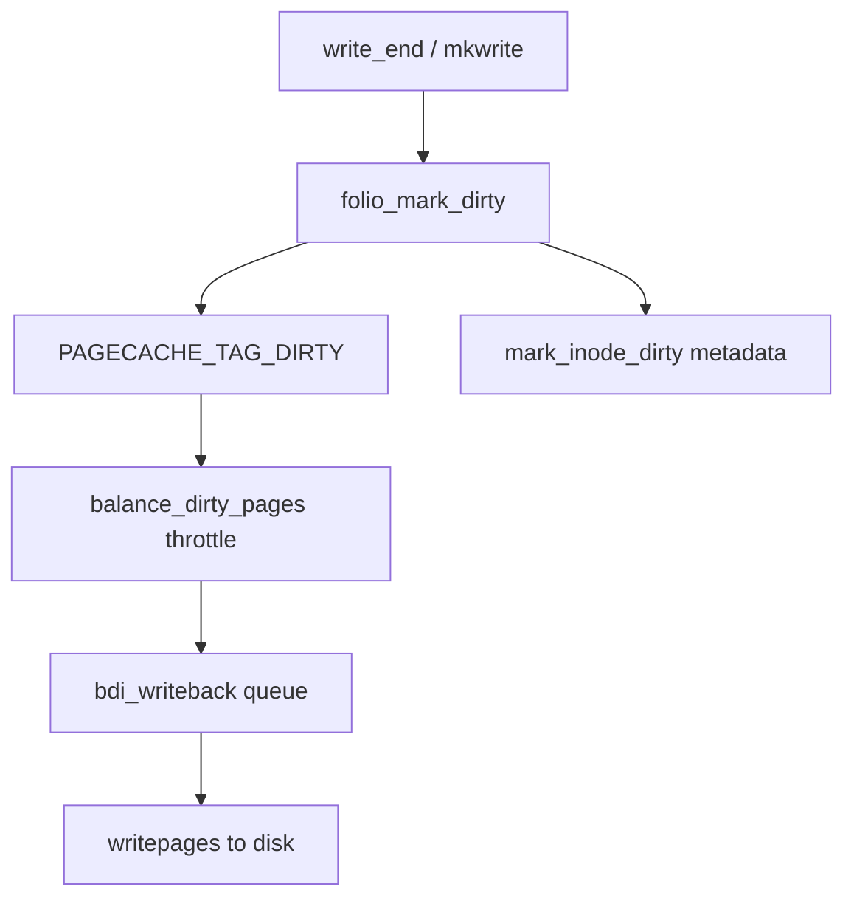

# 第16章 書き込みと dirty ページ

> **本章で読むソース**
>
> - [`mm/filemap.c` L4258-L4287](https://github.com/gregkh/linux/blob/v6.18.38/mm/filemap.c#L4258-L4287)
> - [`mm/filemap.c` L3916-L3917](https://github.com/gregkh/linux/blob/v6.18.38/mm/filemap.c#L3916-L3917)
> - [`include/linux/fs.h` L533-L536](https://github.com/gregkh/linux/blob/v6.18.38/include/linux/fs.h#L533-L536)
> - [`include/linux/fs.h` L850-L851](https://github.com/gregkh/linux/blob/v6.18.38/include/linux/fs.h#L850-L851)
> - [`mm/filemap.c` L4353-L4383](https://github.com/gregkh/linux/blob/v6.18.38/mm/filemap.c#L4353-L4383)
> - [`include/linux/mm.h` L2741-L2742](https://github.com/gregkh/linux/blob/v6.18.38/include/linux/mm.h#L2741-L2742)

## この章の狙い

バッファリング書き込みと mmap 書き込みが **dirty** ページを生成する経路を読む。
`folio_mark_dirty`、`PAGECACHE_TAG_DIRTY`、`balance_dirty_pages_ratelimited` とライトバックへの接続概観を押さえる。

## 前提

- [write 経路と generic_file_write_iter](../part03-file-io/12-write-path.md) を読んでいること。
- [address_space と XArray](13-address-space-xarray.md) を読んでいること。

## generic_perform_write と dirty 制御

各チャンクの `write_begin` 前に `balance_dirty_pages_ratelimited` が呼ばれ、プロセスの dirty 生成速度を抑える。
詳細な閾値計算は mm の `page-writeback.c` が担う（[メモリ管理の writeback とページキャッシュ回収](../../mm/part04-reclaim/16-writeback-reclaim.md) 参照）。

[`mm/filemap.c` L4258-L4287](https://github.com/gregkh/linux/blob/v6.18.38/mm/filemap.c#L4258-L4287)

```c
		bytes = min(chunk - offset, bytes);
		balance_dirty_pages_ratelimited(mapping);

		if (fatal_signal_pending(current)) {
			status = -EINTR;
			break;
		}

		status = a_ops->write_begin(iocb, mapping, pos, bytes,
						&folio, &fsdata);
		if (unlikely(status < 0))
			break;

		offset = offset_in_folio(folio, pos);
		if (bytes > folio_size(folio) - offset)
			bytes = folio_size(folio) - offset;

		if (mapping_writably_mapped(mapping))
			flush_dcache_folio(folio);

		/*
		 * Faults here on mmap()s can recurse into arbitrary
		 * filesystem code. Lots of locks are held that can
		 * deadlock. Use an atomic copy to avoid deadlocking
		 * in page fault handling.
		 */
		copied = copy_folio_from_iter_atomic(folio, offset, bytes, i);
		flush_dcache_folio(folio);

		status = a_ops->write_end(iocb, mapping, pos, bytes, copied,
```

`write_end` 内で通常 `folio_mark_dirty` が呼ばれ、ページキャッシュ上の変更がライトバック対象になる。

## mmap 書き込みでの dirty

`filemap_page_mkwrite` は共有 mmap 書き込み時に folio を dirty にする。
freeze 中の再保護のため、早い段階で dirty を立てる。

[`mm/filemap.c` L3916-L3917](https://github.com/gregkh/linux/blob/v6.18.38/mm/filemap.c#L3916-L3917)

```c
	folio_mark_dirty(folio);
	folio_wait_stable(folio);
```

## folio_mark_dirty API

[`include/linux/mm.h` L2741-L2742](https://github.com/gregkh/linux/blob/v6.18.38/include/linux/mm.h#L2741-L2742)

```c
bool folio_mark_dirty(struct folio *folio);
bool folio_mark_dirty_lock(struct folio *folio);
```

dirty 化は folio フラグに加え、address_space の XArray タグ `PAGECACHE_TAG_DIRTY` を立てる。

## XArray タグ

[`include/linux/fs.h` L533-L536](https://github.com/gregkh/linux/blob/v6.18.38/include/linux/fs.h#L533-L536)

```c
/* XArray tags, for tagging dirty and writeback pages in the pagecache. */
#define PAGECACHE_TAG_DIRTY	XA_MARK_0
#define PAGECACHE_TAG_WRITEBACK	XA_MARK_1
#define PAGECACHE_TAG_TOWRITE	XA_MARK_2
```

ライトバック進行中は WRITEBACK タグに遷移し、完了後にクリアされる。

## inode の dirty 時刻

メタデータ dirty と別に、データページ dirty のタイミング記録に `dirtied_when` が使われる。

[`include/linux/fs.h` L850-L851](https://github.com/gregkh/linux/blob/v6.18.38/include/linux/fs.h#L850-L851)

```c
	unsigned long		dirtied_when;	/* jiffies of first dirtying */
	unsigned long		dirtied_time_when;
```

`wb_writeback` は `dirty_expire_interval` と組み合わせて古い dirty inode を優先的にフラッシュする（第17章）。

## DIO 経路との違い

`IOCB_DIRECT` 書き込みはページキャッシュをバイパスし、dirty タグを経由しない。
部分完了時のみ `generic_perform_write` にフォールバックして dirty ページが生じうる。

[`mm/filemap.c` L4353-L4383](https://github.com/gregkh/linux/blob/v6.18.38/mm/filemap.c#L4353-L4383)

```c
ssize_t __generic_file_write_iter(struct kiocb *iocb, struct iov_iter *from)
{
	struct file *file = iocb->ki_filp;
	struct address_space *mapping = file->f_mapping;
	struct inode *inode = mapping->host;
	ssize_t ret;

	ret = file_remove_privs(file);
	if (ret)
		return ret;

	ret = file_update_time(file);
	if (ret)
		return ret;

	if (iocb->ki_flags & IOCB_DIRECT) {
		ret = generic_file_direct_write(iocb, from);
		/*
		 * If the write stopped short of completing, fall back to
		 * buffered writes.  Some filesystems do this for writes to
		 * holes, for example.  For DAX files, a buffered write will
		 * not succeed (even if it did, DAX does not handle dirty
		 * page-cache pages correctly).
		 */
		if (ret < 0 || !iov_iter_count(from) || IS_DAX(inode))
			return ret;
		return direct_write_fallback(iocb, from, ret,
				generic_perform_write(iocb, from));
	}

	return generic_perform_write(iocb, from);
```

## 処理の流れ（dirty から writeback へ）



## 高速化と最適化の工夫

`balance_dirty_pages_ratelimited` は sleep を挟みながら dirty 比率を sysctl 閾値内に抑え、メモリ枯渇時の回収嵐を防ぐ。
ratelimited 呼び出しは hot path で毎 folio のフルチェックを避け、コストを償却する。

XArray タグは inode 全体を走査せず dirty folio を列挙でき、writeback のキュー構築を速くする。
mmap と buffered write の両方で同一 dirty 機構を使うため、混合ワークロードでも一貫したライトバックが適用される。

> **7.x 系での変化**
> `folio_mark_dirty` と `balance_dirty_pages_ratelimited` の連携は v7.1.3 でも同型である（[`__folio_mark_dirty` L2670-L2689](https://github.com/gregkh/linux/blob/v7.1.3/mm/page-writeback.c#L2670-L2689)、[`balance_dirty_pages_ratelimited` L2111-L2114](https://github.com/gregkh/linux/blob/v7.1.3/mm/page-writeback.c#L2111-L2114)）。
> XArray タグによる dirty 列挙も維持されている。

## まとめ

dirty ページは folio フラグと XArray タグで印付けされ、inode の `dirtied_when` が期限付きフラッシュの判断材料になる。
書き込み経路は ratelimit で生成速度を抑え、超過分はライトバックと回収が追いつく。

## 関連する章

- [bdi、writeback kthread、wb_writeback](../part05-writeback/17-writeback-bdi-kthread.md)
- [メモリ管理の writeback とページキャッシュ回収](../../mm/part04-reclaim/16-writeback-reclaim.md)
