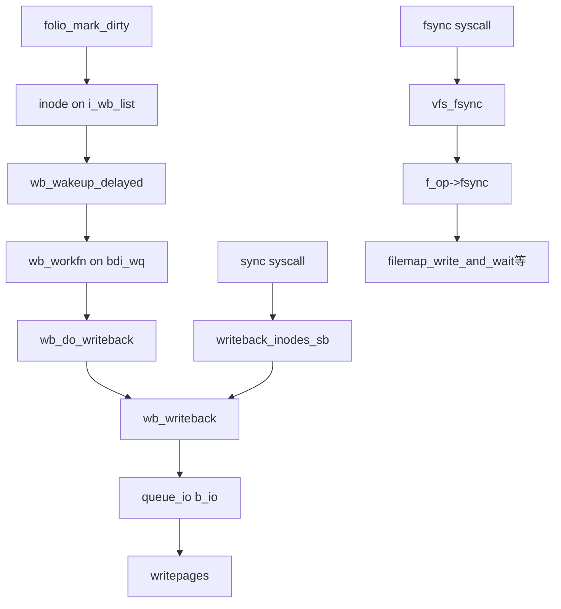

# 第17章 bdi、writeback kthread、wb_writeback

> **本章で読むソース**
>
> - [`fs/fs-writeback.c` L2140-L2199](https://github.com/gregkh/linux/blob/v6.18.38/fs/fs-writeback.c#L2140-L2199)
> - [`fs/fs-writeback.c` L2336-L2360](https://github.com/gregkh/linux/blob/v6.18.38/fs/fs-writeback.c#L2336-L2360)
> - [`fs/fs-writeback.c` L2367-L2401](https://github.com/gregkh/linux/blob/v6.18.38/fs/fs-writeback.c#L2367-L2401)
> - [`fs/fs-writeback.c` L2825-L2828](https://github.com/gregkh/linux/blob/v6.18.38/fs/fs-writeback.c#L2825-L2828)
> - [`include/linux/fs.h` L1483-L1484](https://github.com/gregkh/linux/blob/v6.18.38/include/linux/fs.h#L1483-L1484)
> - [`include/linux/fs.h` L854-L865](https://github.com/gregkh/linux/blob/v6.18.38/include/linux/fs.h#L854-L865)

## この章の狙い

**backing_dev_info**（bdi）と **bdi_writeback**、遅延ワーク `wb_workfn` が dirty ページをどうディスクへフラッシュするかを読む。
章題の「kthread」は旧来の per-bdi カーネルスレッドを指す呼称であり、v6.18.38 では **bdi_wq** 上の `delayed_work`（`wb_workfn`）が同等の役割を担う。
`wb_writeback` ループと super_block 単位の `writeback_inodes_sb` を押さえる。

## 前提

- [書き込みと dirty ページ](../part04-page-cache/16-write-dirty.md) を読んでいること。

## super_block から bdi へ

ブロックデバイス付きファイルシステムは `s_bdi` で I/O 特性と writeback キューを共有する。

[`include/linux/fs.h` L1483-L1484](https://github.com/gregkh/linux/blob/v6.18.38/include/linux/fs.h#L1483-L1484)

```c
	struct backing_dev_info *s_bdi;
	struct mtd_info		*s_mtd;
```

## inode の writeback リスト

dirty inode は `i_io_list` と `i_wb_list` で bdi_writeback に結ばれる。

[`include/linux/fs.h` L854-L865](https://github.com/gregkh/linux/blob/v6.18.38/include/linux/fs.h#L854-L865)

```c
	struct list_head	i_io_list;	/* backing dev IO list */
#ifdef CONFIG_CGROUP_WRITEBACK
	struct bdi_writeback	*i_wb;		/* the associated cgroup wb */

	/* foreign inode detection, see wbc_detach_inode() */
	int			i_wb_frn_winner;
	u16			i_wb_frn_avg_time;
	u16			i_wb_frn_history;
#endif
	struct list_head	i_lru;		/* inode LRU list */
	struct list_head	i_sb_list;
	struct list_head	i_wb_list;	/* backing dev writeback list */
```

cgroup writeback 有効時は `i_wb` が cgroup 別フラッシャへ振り分ける。

## wb_writeback メインループ

`work_list` から取り出した作業に応じて inode を `b_io` キューへ載せ、`__writeback_inodes_wb` でページを書き出す。
背景フラッシュは dirty 閾値以下になれば停止する。

[`fs/fs-writeback.c` L2140-L2199](https://github.com/gregkh/linux/blob/v6.18.38/fs/fs-writeback.c#L2140-L2199)

```c
static long wb_writeback(struct bdi_writeback *wb,
			 struct wb_writeback_work *work)
{
	long nr_pages = work->nr_pages;
	unsigned long dirtied_before = jiffies;
	struct inode *inode;
	long progress;
	struct blk_plug plug;
	bool queued = false;

	blk_start_plug(&plug);
	for (;;) {
		/*
		 * Stop writeback when nr_pages has been consumed
		 */
		if (work->nr_pages <= 0)
			break;

		/*
		 * Background writeout and kupdate-style writeback may
		 * run forever. Stop them if there is other work to do
		 * so that e.g. sync can proceed. They'll be restarted
		 * after the other works are all done.
		 */
		if ((work->for_background || work->for_kupdate) &&
		    !list_empty(&wb->work_list))
			break;

		/*
		 * For background writeout, stop when we are below the
		 * background dirty threshold
		 */
		if (work->for_background && !wb_over_bg_thresh(wb))
			break;


		spin_lock(&wb->list_lock);

		trace_writeback_start(wb, work);
		if (list_empty(&wb->b_io)) {
			/*
			 * Kupdate and background works are special and we want
			 * to include all inodes that need writing. Livelock
			 * avoidance is handled by these works yielding to any
			 * other work so we are safe.
			 */
			if (work->for_kupdate) {
				dirtied_before = jiffies -
					msecs_to_jiffies(dirty_expire_interval *
							 10);
			} else if (work->for_background)
				dirtied_before = jiffies;

			queue_io(wb, work, dirtied_before);
			queued = true;
		}
		if (work->sb)
			progress = writeback_sb_inodes(work->sb, wb, work);
		else
			progress = __writeback_inodes_wb(wb, work);
```

`blk_start_plug` は複数 inode の writeback をまとめて submit し、ディスクシークを減らす。

## wb_do_writeback

workqueue から呼ばれ、キューに溜まった作業と周期フラッシュを処理する。

[`fs/fs-writeback.c` L2336-L2360](https://github.com/gregkh/linux/blob/v6.18.38/fs/fs-writeback.c#L2336-L2360)

```c
static long wb_do_writeback(struct bdi_writeback *wb)
{
	struct wb_writeback_work *work;
	long wrote = 0;

	set_bit(WB_writeback_running, &wb->state);
	while ((work = get_next_work_item(wb)) != NULL) {
		trace_writeback_exec(wb, work);
		wrote += wb_writeback(wb, work);
		finish_writeback_work(work);
	}

	/*
	 * Check for a flush-everything request
	 */
	wrote += wb_check_start_all(wb);

	/*
	 * Check for periodic writeback, kupdated() style
	 */
	wrote += wb_check_old_data_flush(wb);
	wrote += wb_check_background_flush(wb);
	clear_bit(WB_writeback_running, &wb->state);

	return wrote;
```

`dirty_writeback_interval` が周期 wakeup の間隔を sysctl で制御する。

## wb_workfn（kthread / workqueue）

各 bdi に紐づく遅延ワークが `wb_do_writeback` をループ実行する。
rescue スレッド上では 1024 ページ上限で他作業に譲る。

[`fs/fs-writeback.c` L2367-L2401](https://github.com/gregkh/linux/blob/v6.18.38/fs/fs-writeback.c#L2367-L2401)

```c
void wb_workfn(struct work_struct *work)
{
	struct bdi_writeback *wb = container_of(to_delayed_work(work),
						struct bdi_writeback, dwork);
	long pages_written;

	set_worker_desc("flush-%s", bdi_dev_name(wb->bdi));

	if (likely(!current_is_workqueue_rescuer() ||
		   !test_bit(WB_registered, &wb->state))) {
		/*
		 * The normal path.  Keep writing back @wb until its
		 * work_list is empty.  Note that this path is also taken
		 * if @wb is shutting down even when we're running off the
		 * rescuer as work_list needs to be drained.
		 */
		do {
			pages_written = wb_do_writeback(wb);
			trace_writeback_pages_written(pages_written);
		} while (!list_empty(&wb->work_list));
	} else {
		/*
		 * bdi_wq can't get enough workers and we're running off
		 * the emergency worker.  Don't hog it.  Hopefully, 1024 is
		 * enough for efficient IO.
		 */
		pages_written = writeback_inodes_wb(wb, 1024,
						    WB_REASON_FORKER_THREAD);
		trace_writeback_pages_written(pages_written);
	}

	if (!list_empty(&wb->work_list))
		wb_wakeup(wb);
	else if (wb_has_dirty_io(wb) && dirty_writeback_interval)
		wb_wakeup_delayed(wb);
```

## writeback_inodes_sb

`sync(2)` や `sync_filesystem` から super_block 単位で writeback を起動する入口である。

[`fs/fs-writeback.c` L2825-L2828](https://github.com/gregkh/linux/blob/v6.18.38/fs/fs-writeback.c#L2825-L2828)

```c
void writeback_inodes_sb(struct super_block *sb, enum wb_reason reason)
{
	writeback_inodes_sb_nr(sb, get_nr_dirty_pages(), reason);
}
```

## 処理の流れ



## 高速化と最適化の工夫

`blk_plug` とマルチ inode バッチは、ランダム writeback をディスクの順次帯に近づける。
背景フラッシュは `wb_over_bg_thresh` で早期停止し、明示 sync を飢えさせない（`for_background` と `work_list` 非空チェック）。

周期フラッシュ（kupdate 相当）は `dirty_expire_interval` より古い dirty のみを対象にし、直近書き込みのバーストをディスクへ即反映しない。
cgroup writeback は blkcg ごとに `bdi_writeback` を分け、ノイジーな cgroup が他の I/O を押し出すのを抑える。

> **7.x 系での変化**
> `wb_workfn` の `bdi_wq` 上 `delayed_work` モデルは v7.1.3 でも同型である（[`fs/fs-writeback.c` L2411-L2446](https://github.com/gregkh/linux/blob/v7.1.3/fs/fs-writeback.c#L2411-L2446)）。
> `wb_writeback` のシグネチャは引数順が整理されたが、背景フラッシュの早期停止条件は維持されている。

## まとめ

bdi_writeback は dirty inode キューと workqueue を結び、周期と明示要求の両方でページをディスクへ送る。
`wb_writeback` が実際の inode 走査と `writepages` 呼び出しを担う中心ループである。

## 関連する章

- [fsync、sync、vfs_fsync](18-fsync-sync.md)
- [inode のライフサイクルと icache](../part02-mount-inode/09-inode-lifecycle.md)
