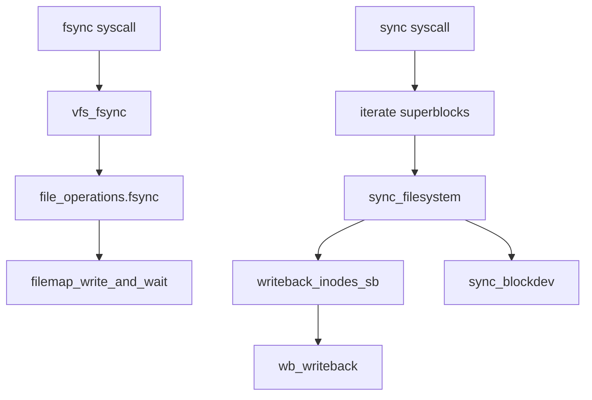

# 第18章 fsync、sync、vfs_fsync

> **本章で読むソース**
>
> - [`fs/sync.c` L30-L70](https://github.com/gregkh/linux/blob/v6.18.38/fs/sync.c#L30-L70)
> - [`fs/sync.c` L179-L202](https://github.com/gregkh/linux/blob/v6.18.38/fs/sync.c#L179-L202)
> - [`fs/sync.c` L205-L222](https://github.com/gregkh/linux/blob/v6.18.38/fs/sync.c#L205-L222)
> - [`fs/fs-writeback.c` L2825-L2828](https://github.com/gregkh/linux/blob/v6.18.38/fs/fs-writeback.c#L2825-L2828)
> - [`include/linux/fs.h` L2289](https://github.com/gregkh/linux/blob/v6.18.38/include/linux/fs.h#L2289)
> - [`mm/filemap.c` L4400-L4414](https://github.com/gregkh/linux/blob/v6.18.38/mm/filemap.c#L4400-L4414)

## この章の狙い

アプリケーションが要求する同期（**fsync**、**fdatasync**、**sync**）が VFS と writeback 層をどう叩くかを読む。
`vfs_fsync` と `sync_filesystem` の役割分担を押さえる。

## 前提

- [bdi、writeback kthread、wb_writeback](17-writeback-bdi-kthread.md) を読んでいること。

## sync_filesystem

super_block 単位で dirty inode の writeback と、ファイルシステム固有の `sync_fs`、ブロックデバイス同期を行う。
`s_umount` rwsem が保持されている前提である。

[`fs/sync.c` L30-L70](https://github.com/gregkh/linux/blob/v6.18.38/fs/sync.c#L30-L70)

```c
int sync_filesystem(struct super_block *sb)
{
	int ret = 0;

	/*
	 * We need to be protected against the filesystem going from
	 * r/o to r/w or vice versa.
	 */
	WARN_ON(!rwsem_is_locked(&sb->s_umount));

	/*
	 * No point in syncing out anything if the filesystem is read-only.
	 */
	if (sb_rdonly(sb))
		return 0;

	/*
	 * Do the filesystem syncing work.  For simple filesystems
	 * writeback_inodes_sb(sb) just dirties buffers with inodes so we have
	 * to submit I/O for these buffers via sync_blockdev().  This also
	 * speeds up the wait == 1 case since in that case write_inode()
	 * methods call sync_dirty_buffer() and thus effectively write one block
	 * at a time.
	 */
	writeback_inodes_sb(sb, WB_REASON_SYNC);
	if (sb->s_op->sync_fs) {
		ret = sb->s_op->sync_fs(sb, 0);
		if (ret)
			return ret;
	}
	ret = sync_blockdev_nowait(sb->s_bdev);
	if (ret)
		return ret;

	sync_inodes_sb(sb);
	if (sb->s_op->sync_fs) {
		ret = sb->s_op->sync_fs(sb, 1);
		if (ret)
			return ret;
	}
	return sync_blockdev(sb->s_bdev);
```

`writeback_inodes_sb` は第17章の bdi フラッシャへ仕事を投げる入口である。

## vfs_fsync_range と vfs_fsync

ファイル単位の同期は `file_operations->fsync` に委譲する。
`I_DIRTY_TIME` の lazy time メタデータは datasync でない限り先に dirty へ昇格する。

[`fs/sync.c` L179-L202](https://github.com/gregkh/linux/blob/v6.18.38/fs/sync.c#L179-L202)

```c
int vfs_fsync_range(struct file *file, loff_t start, loff_t end, int datasync)
{
	struct inode *inode = file->f_mapping->host;

	if (!file->f_op->fsync)
		return -EINVAL;
	if (!datasync && (inode->i_state & I_DIRTY_TIME))
		mark_inode_dirty_sync(inode);
	return file->f_op->fsync(file, start, end, datasync);
}
EXPORT_SYMBOL(vfs_fsync_range);

/**
 * vfs_fsync - perform a fsync or fdatasync on a file
 * @file:		file to sync
 * @datasync:		only perform a fdatasync operation
 *
 * Write back data and metadata for @file to disk.  If @datasync is
 * set only metadata needed to access modified file data is written.
 */
int vfs_fsync(struct file *file, int datasync)
{
	return vfs_fsync_range(file, 0, LLONG_MAX, datasync);
}
```

## システムコール入口

[`fs/sync.c` L205-L222](https://github.com/gregkh/linux/blob/v6.18.38/fs/sync.c#L205-L222)

```c
static int do_fsync(unsigned int fd, int datasync)
{
	CLASS(fd, f)(fd);

	if (fd_empty(f))
		return -EBADF;

	return vfs_fsync(fd_file(f), datasync);
}

SYSCALL_DEFINE1(fsync, unsigned int, fd)
{
	return do_fsync(fd, 0);
}

SYSCALL_DEFINE1(fdatasync, unsigned int, fd)
{
	return do_fsync(fd, 1);
```

## writeback_inodes_sb との接続

[`fs/fs-writeback.c` L2825-L2828](https://github.com/gregkh/linux/blob/v6.18.38/fs/fs-writeback.c#L2825-L2828)

```c
void writeback_inodes_sb(struct super_block *sb, enum wb_reason reason)
{
	writeback_inodes_sb_nr(sb, get_nr_dirty_pages(), reason);
}
```

`WB_REASON_SYNC` は sync 経路由来のフラッシュであることをトレースと優先度制御に伝える。

## file_operations の fsync

[`include/linux/fs.h` L2289](https://github.com/gregkh/linux/blob/v6.18.38/include/linux/fs.h#L2289)

```c
	int (*fsync) (struct file *, loff_t, loff_t, int datasync);
```

汎用実装は `filemap_write_and_wait_range` 等でページキャッシュをフラッシュし、ファイルシステムはジャーナル commit を追加する。

## generic_file_write_iter と O_SYNC

バッファリング write の `O_SYNC` 処理は `generic_write_sync` が担当し、`i_rwsem` 外で同期する設計である（コメント参照）。

[`mm/filemap.c` L4400-L4414](https://github.com/gregkh/linux/blob/v6.18.38/mm/filemap.c#L4400-L4414)

```c
ssize_t generic_file_write_iter(struct kiocb *iocb, struct iov_iter *from)
{
	struct file *file = iocb->ki_filp;
	struct inode *inode = file->f_mapping->host;
	ssize_t ret;

	inode_lock(inode);
	ret = generic_write_checks(iocb, from);
	if (ret > 0)
		ret = __generic_file_write_iter(iocb, from);
	inode_unlock(inode);

	if (ret > 0)
		ret = generic_write_sync(iocb, ret);
	return ret;
```

## 処理の流れ



## 高速化と最適化の工夫

`fdatasync` はデータアクセスに不要なメタデータフラッシュを省略し、ジャーナル負荷を減らす。
`sync_blockdev_nowait` と二段 `sync_fs` は、メタデータとデータの依存順序を保ちつつ並行 submit の余地を残す。

ファイル単位 fsync と系全体 sync は `wb` の work 優先度で調整され、背景 kupdate が sync を飢えさせない（第17章の `work_list` チェック）。
`generic_write_sync` を `inode_unlock` 後に呼ぶのは、同期待ちで `i_rwsem` を長時間保持しないためである。

> **7.x 系での変化**
> `vfs_fsync` → `f_op->fsync` と `sync` → `writeback_inodes_sb` の分岐は v7.1.3 でも同型である（[`vfs_fsync` L198-L201](https://github.com/gregkh/linux/blob/v7.1.3/fs/sync.c#L198-L201)、[`writeback_inodes_sb` L2877-L2880](https://github.com/gregkh/linux/blob/v7.1.3/fs/fs-writeback.c#L2877-L2880)）。
> `iterate_supers` 周辺の微修正は本章の fsync と sync の役割分担を変えない。

## まとめ

fsync 系はファイルの `->fsync` でページキャッシュとメタデータを確定し、sync 系は super_block 経由で writeback とブロックデバイス同期を行う。
いずれも第17章の bdi writeback 機構の上に載る明示的なフラッシュ要求である。

## 関連する章

- [bdi、writeback kthread、wb_writeback](17-writeback-bdi-kthread.md)
- [write 経路と generic_file_write_iter](../part03-file-io/12-write-path.md)
