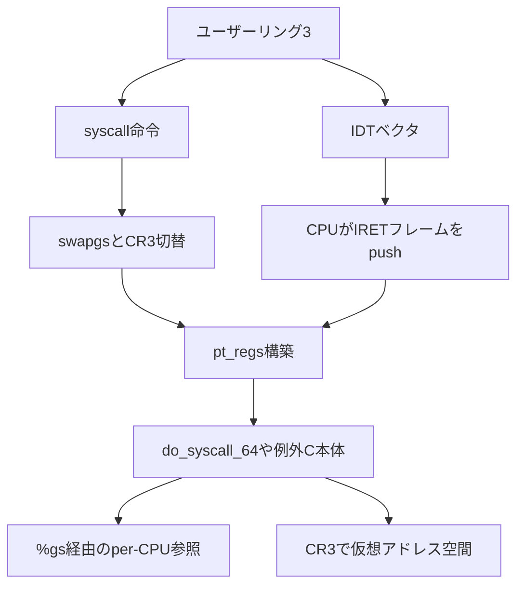

# 第1章 分冊の全体像と x86-64 実行環境

> 本章で読むソース
>
> - [`arch/x86/include/asm/ptrace.h` L103-L170](https://github.com/gregkh/linux/blob/v6.18.38/arch/x86/include/asm/ptrace.h#L103-L170)
> - [`arch/x86/include/asm/segment.h` L169-L218](https://github.com/gregkh/linux/blob/v6.18.38/arch/x86/include/asm/segment.h#L169-L218)
> - [`arch/x86/include/asm/msr-index.h` L10-L39](https://github.com/gregkh/linux/blob/v6.18.38/arch/x86/include/asm/msr-index.h#L10-L39)
> - [`arch/x86/include/asm/processor-flags.h` L14-L42](https://github.com/gregkh/linux/blob/v6.18.38/arch/x86/include/asm/processor-flags.h#L14-L42)
> - [`arch/x86/include/asm/special_insns.h` L15-L27](https://github.com/gregkh/linux/blob/v6.18.38/arch/x86/include/asm/special_insns.h#L15-L27)
> - [`arch/x86/include/asm/special_insns.h` L46-L63](https://github.com/gregkh/linux/blob/v6.18.38/arch/x86/include/asm/special_insns.h#L46-L63)
> - [`arch/x86/include/asm/processor.h` L239-L242](https://github.com/gregkh/linux/blob/v6.18.38/arch/x86/include/asm/processor.h#L239-L242)
> - [`arch/x86/entry/entry_64.S` L87-L109](https://github.com/gregkh/linux/blob/v6.18.38/arch/x86/entry/entry_64.S#L87-L109)
> - [`arch/x86/entry/calling.h` L68-L91](https://github.com/gregkh/linux/blob/v6.18.38/arch/x86/entry/calling.h#L68-L91)

## この章の狙い

本分冊が扱う x86-64 実行環境の輪郭を固定する。
ロングモードと保護リング、`CR` と `MSR`、`pt_regs` が入口アセンブリと C ハンドラをどうつなぐかを押さえ、他分冊への委譲境界を明示する。

## 前提

[全体像と横断基盤](../../foundation/README.md) のブートと `entry_64.S` の概観を読んでいること。
C とアセンブリの基礎、仮想アドレスとページテーブルの語彙があると、この章の地図がそのまま後続章の足場になる。

## 本分冊の位置づけと委譲境界

本分冊は `arch/x86/` を対象に、ハードウェアに最も近い層からソースを追う。
起動シーケンス全体と `SYSCALL_DEFINE` の一般論は [全体像と横断基盤](../../foundation/README.md) に委譲する。
汎用 IRQ 層は [割り込みと時間](../../irq-time/README.md)、`handle_mm_fault` 以降は [メモリ管理](../../mm/README.md)、スケジューラのタスク選択は [プロセスとスケジューラ](../../sched/README.md) が担う。
KVM は [仮想化（KVM）](../../kvm/README.md) が範囲外として別分冊である。

本分冊が扱うのは、入口時のレジスタとスタック、`%gs`、`CR3`、`pt_regs`、復帰命令の選択といったアーキテクチャ実装に限る。
第0部では静的構造、第1部以降でブート、CPU 初期化、例外、システムコール、APIC、コンテキストスイッチ、ページテーブル、SMP へ進む（[目次](../README.md) 参照）。

## ロングモードと保護リング

x86-64 カーネルは **ロングモード** で動作する。
32bit 互換モードは個別の入口経路として残るが、本分冊の既定読解は 64bit ロングモードとする。

特権は **保護リング** で区切られる。
リング0がカーネル、リング3がユーザー空間である。
`syscall` や例外でリング0へ入り、`sysret` や `iretq` でリング3へ戻る。

セグメンテーションはほぼ **フラット** である。
`CS`、`DS`、`ES`、`SS` ではベースとリミットが実質無視され、コードとデータは仮想アドレスとページテーブルで解決される。
ただし `FS` と `GS` の base は64bit でも linear address 計算に使われ、per-CPU アクセスや TLS に利用される。
GDT はセレクタの DPL と TSS 記述子のために残り、詳細は [第2章](02-gdt-tss-cpu-entry-area.md) で扱う。

## セグメントセレクタと GDT エントリ番号

64bit 向け GDT レイアウトは `segment.h` に固定されている。
`SYSRET` がセレクタをハードコードするため、カーネル用とユーザー用のコードセグメントは別エントリに分かれ、`__USER_DS` は 32bit と 64bit コードセレクタのあいだに置かれる。

[`arch/x86/include/asm/segment.h` L169-L218](https://github.com/gregkh/linux/blob/v6.18.38/arch/x86/include/asm/segment.h#L169-L218)

```c
#define GDT_ENTRY_KERNEL32_CS		1
#define GDT_ENTRY_KERNEL_CS		2
#define GDT_ENTRY_KERNEL_DS		3

/*
 * We cannot use the same code segment descriptor for user and kernel mode,
 * not even in long flat mode, because of different DPL.
 *
 * GDT layout to get 64-bit SYSCALL/SYSRET support right. SYSRET hardcodes
 * selectors:
 *
 *   if returning to 32-bit userspace: cs = STAR.SYSRET_CS,
 *   if returning to 64-bit userspace: cs = STAR.SYSRET_CS+16,
 *
 * ss = STAR.SYSRET_CS+8 (in either case)
 *
 * thus USER_DS should be between 32-bit and 64-bit code selectors:
 */
#define GDT_ENTRY_DEFAULT_USER32_CS	4
#define GDT_ENTRY_DEFAULT_USER_DS	5
#define GDT_ENTRY_DEFAULT_USER_CS	6

/* Needs two entries */
#define GDT_ENTRY_TSS			8
/* Needs two entries */
#define GDT_ENTRY_LDT			10

#define GDT_ENTRY_TLS_MIN		12
#define GDT_ENTRY_TLS_MAX		14

#define GDT_ENTRY_CPUNODE		15

/*
 * Number of entries in the GDT table:
 */
#define GDT_ENTRIES			16

/*
 * Segment selector values corresponding to the above entries:
 *
 * Note, selectors also need to have a correct RPL,
 * expressed with the +3 value for user-space selectors:
 */
#define __KERNEL32_CS			(GDT_ENTRY_KERNEL32_CS*8)
#define __KERNEL_CS			(GDT_ENTRY_KERNEL_CS*8)
#define __KERNEL_DS			(GDT_ENTRY_KERNEL_DS*8)
#define __USER32_CS			(GDT_ENTRY_DEFAULT_USER32_CS*8 + 3)
#define __USER_DS			(GDT_ENTRY_DEFAULT_USER_DS*8 + 3)
#define __USER_CS			(GDT_ENTRY_DEFAULT_USER_CS*8 + 3)
#define __CPUNODE_SEG			(GDT_ENTRY_CPUNODE*8 + 3)
```

`__KERNEL_CS` と `__USER_CS` はエントリ番号に8を掛けたセレクタ値である。
ユーザー側セレクタには RPL=3 を表す `+3` が付く。

## 制御レジスタ CR0、CR2、CR3、CR4

**制御レジスタ** は CPU の動作モードとメモリ管理の根を握る。
カーネルは `special_insns.h` のインライン関数で読み書きする。

[`arch/x86/include/asm/special_insns.h` L15-L27](https://github.com/gregkh/linux/blob/v6.18.38/arch/x86/include/asm/special_insns.h#L15-L27)

```c
static inline unsigned long native_read_cr0(void)
{
	unsigned long val;
	asm volatile("mov %%cr0,%0" : "=r" (val));
	return val;
}

static __always_inline unsigned long native_read_cr2(void)
{
	unsigned long val;
	asm volatile("mov %%cr2,%0" : "=r" (val));
	return val;
}
```

[`arch/x86/include/asm/special_insns.h` L46-L63](https://github.com/gregkh/linux/blob/v6.18.38/arch/x86/include/asm/special_insns.h#L46-L63)

```c
static inline unsigned long native_read_cr4(void)
{
	unsigned long val;
#ifdef CONFIG_X86_32
	/*
	 * This could fault if CR4 does not exist.  Non-existent CR4
	 * is functionally equivalent to CR4 == 0.  Keep it simple and pretend
	 * that CR4 == 0 on CPUs that don't have CR4.
	 */
	asm volatile("1: mov %%cr4, %0\n"
		     "2:\n"
		     _ASM_EXTABLE(1b, 2b)
		     : "=r" (val) : "0" (0));
#else
	/* CR4 always exists on x86_64. */
	asm volatile("mov %%cr4,%0" : "=r" (val));
#endif
	return val;
}
```

各レジスタの役割を整理する。

**CR0**：保護モード有効（`X86_CR0_PE`）とページング有効（`X86_CR0_PG`）など、CPU の基本モードを決める。
**CR2**：#PF 発生時のフォールトアドレスを保持する。
**CR3**：現在のページテーブルルートの物理アドレスを指す。
下位12bit には PCID が載り、`CR4.PCIDE` 有効時は書き込み時の bit 63 が TLB flush 抑制を指示する。
**CR4**：ページグローバル、PCID 有効、OS 拡張などの機能ビット群を載せる。

`CR3` のビットレイアウトは `processor-flags.h` にまとまっている。

[`arch/x86/include/asm/processor-flags.h` L14-L42](https://github.com/gregkh/linux/blob/v6.18.38/arch/x86/include/asm/processor-flags.h#L14-L42)

```c
/*
 * CR3's layout varies depending on several things.
 *
 * If CR4.PCIDE is set (64-bit only), then CR3[11:0] is the address space ID.
 * If PAE is enabled, then CR3[11:5] is part of the PDPT address
 * (i.e. it's 32-byte aligned, not page-aligned) and CR3[4:0] is ignored.
 * Otherwise (non-PAE, non-PCID), CR3[3] is PWT, CR3[4] is PCD, and
 * CR3[2:0] and CR3[11:5] are ignored.
 *
 * In all cases, Linux puts zeros in the low ignored bits and in PWT and PCD.
 *
 * CR3[63] is always read as zero.  If CR4.PCIDE is set, then CR3[63] may be
 * written as 1 to prevent the write to CR3 from flushing the TLB.
 *
 * On systems with SME, one bit (in a variable position!) is stolen to indicate
 * that the top-level paging structure is encrypted.
 *
 * On systemms with LAM, bits 61 and 62 are used to indicate LAM mode.
 *
 * All of the remaining bits indicate the physical address of the top-level
 * paging structure.
 *
 * CR3_ADDR_MASK is the mask used by read_cr3_pa().
 */
#ifdef CONFIG_X86_64
/* Mask off the address space ID and SME encryption bits. */
#define CR3_ADDR_MASK	__sme_clr(PHYSICAL_PAGE_MASK)
#define CR3_PCID_MASK	0xFFFull
#define CR3_NOFLUSH	BIT_ULL(63)
```

ページテーブルベースだけが欲しいときは `read_cr3_pa` が下位の PCID などをマスクする。

[`arch/x86/include/asm/processor.h` L239-L242](https://github.com/gregkh/linux/blob/v6.18.38/arch/x86/include/asm/processor.h#L239-L242)

```c
static inline unsigned long read_cr3_pa(void)
{
	return __read_cr3() & CR3_ADDR_MASK;
}
```

コンテキストスイッチや KPTI による `CR3` 切替の詳細は第7部（[第28章](../README.md)）で扱う。

## モデル固有レジスタ MSR

**MSR**（Model Specific Register）は `rdmsr` と `wrmsr` で触る CPU 固有の設定レジスタである。
システムコール入口と per-CPU アクセスに関わる代表例が `msr-index.h` に定義されている。

[`arch/x86/include/asm/msr-index.h` L10-L39](https://github.com/gregkh/linux/blob/v6.18.38/arch/x86/include/asm/msr-index.h#L10-L39)

```c
#define MSR_EFER		0xc0000080 /* extended feature register */
#define MSR_STAR		0xc0000081 /* legacy mode SYSCALL target */
#define MSR_LSTAR		0xc0000082 /* long mode SYSCALL target */
#define MSR_CSTAR		0xc0000083 /* compat mode SYSCALL target */
#define MSR_SYSCALL_MASK	0xc0000084 /* EFLAGS mask for syscall */
#define MSR_FS_BASE		0xc0000100 /* 64bit FS base */
#define MSR_GS_BASE		0xc0000101 /* 64bit GS base */
#define MSR_KERNEL_GS_BASE	0xc0000102 /* SwapGS GS shadow */
#define MSR_TSC_AUX		0xc0000103 /* Auxiliary TSC */

/* EFER bits: */
#define _EFER_SCE		0  /* SYSCALL/SYSRET */
#define _EFER_LME		8  /* Long mode enable */
#define _EFER_LMA		10 /* Long mode active (read-only) */
#define _EFER_NX		11 /* No execute enable */
#define _EFER_SVME		12 /* Enable virtualization */
#define _EFER_LMSLE		13 /* Long Mode Segment Limit Enable */
#define _EFER_FFXSR		14 /* Enable Fast FXSAVE/FXRSTOR */
#define _EFER_TCE		15 /* Enable Translation Cache Extensions */
#define _EFER_AUTOIBRS		21 /* Enable Automatic IBRS */

#define EFER_SCE		(1<<_EFER_SCE)
#define EFER_LME		(1<<_EFER_LME)
#define EFER_LMA		(1<<_EFER_LMA)
#define EFER_NX			(1<<_EFER_NX)
#define EFER_SVME		(1<<_EFER_SVME)
#define EFER_LMSLE		(1<<_EFER_LMSLE)
#define EFER_FFXSR		(1<<_EFER_FFXSR)
#define EFER_TCE		(1<<_EFER_TCE)
#define EFER_AUTOIBRS		(1<<_EFER_AUTOIBRS)
```

**MSR_LSTAR** は 64bit `syscall` の入口アドレス（`entry_SYSCALL_64`）を指す。
**MSR_STAR** は `syscall` 時にロードするカーネル CS と SS、および `sysret` 時のユーザー CS と SS のセレクタをエンコードする。
**MSR_GS_BASE** と **MSR_KERNEL_GS_BASE** は `swapgs` で入れ替わるペアであり、ユーザー実行時とカーネル入口で per-CPU 領域へのベースが切り替わる。
**MSR_EFER** の `EFER_SCE` は `syscall` 命令の有効化、`EFER_NX` は実行禁止ビットの有効化に使われる。

`MSR` の初期書き込みは第9章、per-CPU と `%gs` の関係は第8章が担当する。

## pt_regs：入口で積まれるレジスタフレーム

**pt_regs** は、例外、割り込み、システムコールの入口でスタック上に構築され、C ハンドラの第1引数になる構造体である。
64bit 版は `ptrace.h` の `struct pt_regs` で定義される（32bit 版の `L12` 付近とは別物なので混同しない）。

[`arch/x86/include/asm/ptrace.h` L103-L170](https://github.com/gregkh/linux/blob/v6.18.38/arch/x86/include/asm/ptrace.h#L103-L170)

```c
struct pt_regs {
	/*
	 * C ABI says these regs are callee-preserved. They aren't saved on
	 * kernel entry unless syscall needs a complete, fully filled
	 * "struct pt_regs".
	 */
	unsigned long r15;
	unsigned long r14;
	unsigned long r13;
	unsigned long r12;
	unsigned long bp;
	unsigned long bx;

	/* These regs are callee-clobbered. Always saved on kernel entry. */
	unsigned long r11;
	unsigned long r10;
	unsigned long r9;
	unsigned long r8;
	unsigned long ax;
	unsigned long cx;
	unsigned long dx;
	unsigned long si;
	unsigned long di;

	/*
	 * orig_ax is used on entry for:
	 * - the syscall number (syscall, sysenter, int80)
	 * - error_code stored by the CPU on traps and exceptions
	 * - the interrupt number for device interrupts
	 *
	 * A FRED stack frame starts here:
	 *   1) It _always_ includes an error code;
	 *
	 *   2) The return frame for ERET[US] starts here, but
	 *      the content of orig_ax is ignored.
	 */
	unsigned long orig_ax;

	/* The IRETQ return frame starts here */
	unsigned long ip;

	union {
		/* CS selector */
		u16		cs;
		/* The extended 64-bit data slot containing CS */
		u64		csx;
		/* The FRED CS extension */
		struct fred_cs	fred_cs;
	};

	unsigned long flags;
	unsigned long sp;

	union {
		/* SS selector */
		u16		ss;
		/* The extended 64-bit data slot containing SS */
		u64		ssx;
		/* The FRED SS extension */
		struct fred_ss	fred_ss;
	};

	/*
	 * Top of stack on IDT systems, while FRED systems have extra fields
	 * defined above for storing exception related information, e.g. CR2 or
	 * DR6.
	 */
};
```

フィールドの並びに意味がある。
`ip` より上はカーネルが `push` する汎用レジスタと `orig_ax`、その下は **IRETQ 復帰フレーム** に対応する `ip`、`cs`、`flags`、`sp`、`ss` である。

### ハードウェアが積む部分とカーネルが積む部分

**例外と割り込み**（IDT 経路）では、CPU が特権遷移時に `SS`、`RSP`、`RFLAGS`、`CS`、`RIP` をスタックへ自動 `push` する。
一部のベクタはさらに **エラーコード** を積む。
error code を積む例外では、CPU がスタックへ積んだ error code が `orig_ax` の位置に入り、`idtentry` がそれを第2引数として取り出す。
error code を持たない例外では entry stub がダミー値をその位置へ `push` して形を揃え、割り込みではベクタ番号を、syscall ではシステムコール番号を同じ位置に置く。

**システムコール**（`syscall` 命令）ではハードウェアは IRET 形式のフレームを積まない。
`entry_SYSCALL_64` がカーネルスタック上に `pt_regs` を手動構築する。

[`arch/x86/entry/entry_64.S` L87-L109](https://github.com/gregkh/linux/blob/v6.18.38/arch/x86/entry/entry_64.S#L87-L109)

```asm
SYM_CODE_START(entry_SYSCALL_64)
	UNWIND_HINT_ENTRY
	ENDBR

	swapgs
	/* tss.sp2 is scratch space. */
	movq	%rsp, PER_CPU_VAR(cpu_tss_rw + TSS_sp2)
	SWITCH_TO_KERNEL_CR3 scratch_reg=%rsp
	movq	PER_CPU_VAR(cpu_current_top_of_stack), %rsp

SYM_INNER_LABEL(entry_SYSCALL_64_safe_stack, SYM_L_GLOBAL)
	ANNOTATE_NOENDBR

	/* Construct struct pt_regs on stack */
	pushq	$__USER_DS				/* pt_regs->ss */
	pushq	PER_CPU_VAR(cpu_tss_rw + TSS_sp2)	/* pt_regs->sp */
	pushq	%r11					/* pt_regs->flags */
	pushq	$__USER_CS				/* pt_regs->cs */
	pushq	%rcx					/* pt_regs->ip */
SYM_INNER_LABEL(entry_SYSCALL_64_after_hwframe, SYM_L_GLOBAL)
	pushq	%rax					/* pt_regs->orig_ax */

	PUSH_AND_CLEAR_REGS rax=$-ENOSYS
```

`syscall` は戻り先を `%rcx`、保存した `RFLAGS` を `%r11` に残す契約があるため、上の5ワードが IRET フレームに相当する部分を模している。
続く `PUSH_AND_CLEAR_REGS` が汎用レジスタを一括 `push` する。

[`arch/x86/entry/calling.h` L68-L91](https://github.com/gregkh/linux/blob/v6.18.38/arch/x86/entry/calling.h#L68-L91)

```asm
.macro PUSH_REGS rdx=%rdx rcx=%rcx rax=%rax save_ret=0 unwind_hint=1
	.if \save_ret
	pushq	%rsi		/* pt_regs->si */
	movq	8(%rsp), %rsi	/* temporarily store the return address in %rsi */
	movq	%rdi, 8(%rsp)	/* pt_regs->di (overwriting original return address) */
	/* We just clobbered the return address - use the IRET frame for unwinding: */
	UNWIND_HINT_IRET_REGS offset=3*8
	.else
	pushq   %rdi		/* pt_regs->di */
	pushq   %rsi		/* pt_regs->si */
	.endif
	pushq	\rdx		/* pt_regs->dx */
	pushq   \rcx		/* pt_regs->cx */
	pushq   \rax		/* pt_regs->ax */
	pushq   %r8		/* pt_regs->r8 */
	pushq   %r9		/* pt_regs->r9 */
	pushq   %r10		/* pt_regs->r10 */
	pushq   %r11		/* pt_regs->r11 */
	pushq	%rbx		/* pt_regs->rbx */
	pushq	%rbp		/* pt_regs->rbp */
	pushq	%r12		/* pt_regs->r12 */
	pushq	%r13		/* pt_regs->r13 */
	pushq	%r14		/* pt_regs->r14 */
	pushq	%r15		/* pt_regs->r15 */
```

`r15` から `di` までの並びは `struct pt_regs` のフィールド順と一致する。
この対応があるから、入口アセンブリは最小限の `push` で C から一貫したフレームを参照できる。

## 処理の流れ：ユーザーからカーネル入口へ



システムコール経路では `swapgs` の直後にカーネル `CR3` へ切り替え、per-CPU のカーネルスタック頂へ `RSP` を移す。
例外経路では IST や paranoid 入口など分岐が増えるが、最終的には `pt_regs` を第1引数に C へ渡す形は共通である（第3部で詳述）。

## 高速化と最適化の工夫

`pt_regs` のフィールド順序は、スタック上の `push` 順と `struct pt_regs` のメモリレイアウトを一致させるための設計である。
`PUSH_REGS` は上から `r15` へ向かって積み、`ip` より下は IRET 復帰フレームまたはその模倣として扱う。
アセンブリはフィールドごとにオフセット計算せず、`movq %rsp, %rdi` で C に渡せる。

別の機構として、`swapgs` は1命令で `MSR_GS_BASE` と `MSR_KERNEL_GS_BASE` を入れ替える。
カーネル入口はメモリを読まずに per-CPU 変数へ `%gs` 相対アクセスへ切り替えられる。
`entry_SYSCALL_64` 先頭の `swapgs` は、この切替がシステムコール hot path の前提になっている。

## まとめ

- x86-64 カーネルはロングモードのフラットセグメンテーション上で、リング0とリング3を `CR`、`MSR`、ページテーブルで管理する。
- `pt_regs` は入口スタックフレームの C 側の型であり、IRET フレームと汎用レジスタ保存が連続レイアウトになっている。
- 本分冊は `arch/x86/` の入口実装に焦点を当て、ブート概観や汎用サブシステムは他分冊へ委譲する。

## 関連する章

- [GDT と TSS とセグメント記述子と cpu_entry_area](02-gdt-tss-cpu-entry-area.md)
- [per-CPU 領域と GS base](../part02-cpu-init/08-percpu-gs-base.md)
- [entry_SYSCALL_64 のアセンブリ経路](../part04-syscall/15-entry-syscall-64.md)
- [x86 ページフォールト入口](../part07-paging/26-page-fault-entry.md)
