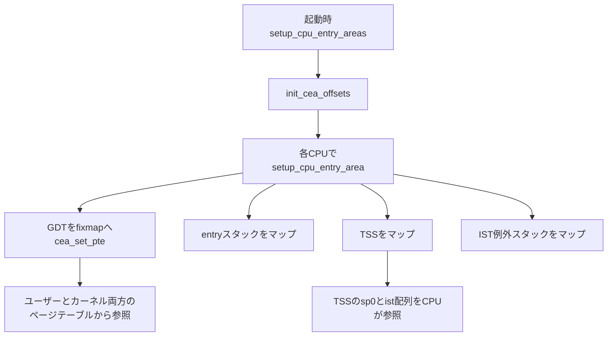

# 第2章 GDT と TSS とセグメント記述子と cpu_entry_area

> 本章で読むソース
>
> - [`arch/x86/kernel/cpu/common.c` L206-L221](https://github.com/gregkh/linux/blob/v6.18.38/arch/x86/kernel/cpu/common.c#L206-L221)
> - [`arch/x86/include/asm/desc_defs.h` L66-L71](https://github.com/gregkh/linux/blob/v6.18.38/arch/x86/include/asm/desc_defs.h#L66-L71)
> - [`arch/x86/include/asm/processor.h` L308-L327](https://github.com/gregkh/linux/blob/v6.18.38/arch/x86/include/asm/processor.h#L308-L327)
> - [`arch/x86/include/asm/processor.h` L400-L411](https://github.com/gregkh/linux/blob/v6.18.38/arch/x86/include/asm/processor.h#L400-L411)
> - [`arch/x86/include/asm/cpu_entry_area.h` L20-L33](https://github.com/gregkh/linux/blob/v6.18.38/arch/x86/include/asm/cpu_entry_area.h#L20-L33)
> - [`arch/x86/include/asm/cpu_entry_area.h` L90-L130](https://github.com/gregkh/linux/blob/v6.18.38/arch/x86/include/asm/cpu_entry_area.h#L90-L130)
> - [`arch/x86/mm/cpu_entry_area.c` L79-L96](https://github.com/gregkh/linux/blob/v6.18.38/arch/x86/mm/cpu_entry_area.c#L79-L96)
> - [`arch/x86/mm/cpu_entry_area.c` L177-L243](https://github.com/gregkh/linux/blob/v6.18.38/arch/x86/mm/cpu_entry_area.c#L177-L243)
> - [`arch/x86/mm/cpu_entry_area.c` L263-L273](https://github.com/gregkh/linux/blob/v6.18.38/arch/x86/mm/cpu_entry_area.c#L263-L273)

## この章の狙い

x86-64 で **GDT** と **TSS** がどのデータ構造として置かれ、**cpu_entry_area** が fixmap 上にどうマッピングされるかを押さえる。
本章は静的配置に限定し、GS base 設定や IST の実切替は後続章へ委譲する。

## 前提

[第1章](01-overview-execution-environment.md) でロングモード、セグメントセレクタ、`pt_regs` の入口フレームを読んでいること。

## フラットセグメンテーション下の GDT

ロングモードでは `CS`、`DS`、`ES`、`SS` のセグメントベースとリミットは実質無視され、アドレスはほぼフラットに見える。
ただし `FS` と `GS` の base は例外で、64bit でも linear address 計算に使われる。
それでも GDT は消えない。
カーネルとユーザーのコードとデータセレクタ、TSS 記述子、TLS 用エントリを保持する。

各 CPU は per-CPU 変数 `gdt_page` に GDT 実体を持つ。
64bit 向けの初期エントリは `common.c` で静的に埋め込まれる。

[`arch/x86/kernel/cpu/common.c` L206-L221](https://github.com/gregkh/linux/blob/v6.18.38/arch/x86/kernel/cpu/common.c#L206-L221)

```c
DEFINE_PER_CPU_PAGE_ALIGNED(struct gdt_page, gdt_page) = { .gdt = {
#ifdef CONFIG_X86_64
	/*
	 * We need valid kernel segments for data and code in long mode too
	 * IRET will check the segment types  kkeil 2000/10/28
	 * Also sysret mandates a special GDT layout
	 *
	 * TLS descriptors are currently at a different place compared to i386.
	 * Hopefully nobody expects them at a fixed place (Wine?)
	 */
	[GDT_ENTRY_KERNEL32_CS]		= GDT_ENTRY_INIT(DESC_CODE32, 0, 0xfffff),
	[GDT_ENTRY_KERNEL_CS]		= GDT_ENTRY_INIT(DESC_CODE64, 0, 0xfffff),
	[GDT_ENTRY_KERNEL_DS]		= GDT_ENTRY_INIT(DESC_DATA64, 0, 0xfffff),
	[GDT_ENTRY_DEFAULT_USER32_CS]	= GDT_ENTRY_INIT(DESC_CODE32 | DESC_USER, 0, 0xfffff),
	[GDT_ENTRY_DEFAULT_USER_DS]	= GDT_ENTRY_INIT(DESC_DATA64 | DESC_USER, 0, 0xfffff),
	[GDT_ENTRY_DEFAULT_USER_CS]	= GDT_ENTRY_INIT(DESC_CODE64 | DESC_USER, 0, 0xfffff),
```

`GDT_ENTRY_INIT` は `desc_defs.h` の `struct desc_struct` レイアウトに従って8バイト記述子を生成する。

## セグメント記述子 desc_struct

GDT の各エントリは **desc_struct** で表される8バイトのセグメント記述子である。
タイプ、DPL、粒度、ベース、リミットがビットフィールドに分割されている。

[`arch/x86/include/asm/desc_defs.h` L66-L71](https://github.com/gregkh/linux/blob/v6.18.38/arch/x86/include/asm/desc_defs.h#L66-L71)

```c
struct desc_struct {
	u16	limit0;
	u16	base0;
	u16	base1: 8, type: 4, s: 1, dpl: 2, p: 1;
	u16	limit1: 4, avl: 1, l: 1, d: 1, g: 1, base2: 8;
} __attribute__((packed));
```

`type` と `dpl` はセグメントの種別と特権レベルを決める。
`l` は64bit コードセグメント（`DESC_CODE64`）の識別に使われる。
ロングモードではベースはほぼ0、リミットは最大に近い値が入り、実アドレス解決はページングに委ねられる。

TSS と LDT は別型の **ldttss_desc** で表され、GDT 上では2エントリ分を消費する（`GDT_ENTRY_TSS` は8番から）。

## TSS の x86-64 での役割

歴史的な **TSS**（Task State Segment）はハードウェアタスクスイッチ用だった。
Linux はタスクスイッチに TSS を使わず、ソフトウェアでスタックとレジスタを切り替える。

現代の x86-64 では TSS が主に担うのは次の2点である。

**RSP0**：リング3からリング0へ入るとき、CPU がカーネルスタックポインタとして参照する `sp0`。
**ist[]**：IST（Interrupt Stack Table）用のスタックポインタ配列。
特定例外は IDT エントリの IST 番号に従い、ここに登録された専用スタックへ自動切替する。

ハードウェア固定部は `x86_hw_tss` に定義される。

[`arch/x86/include/asm/processor.h` L308-L327](https://github.com/gregkh/linux/blob/v6.18.38/arch/x86/include/asm/processor.h#L308-L327)

```c
struct x86_hw_tss {
	u32			reserved1;
	u64			sp0;
	u64			sp1;

	/*
	 * Since Linux does not use ring 2, the 'sp2' slot is unused by
	 * hardware.  entry_SYSCALL_64 uses it as scratch space to stash
	 * the user RSP value.
	 */
	u64			sp2;

	u64			reserved2;
	u64			ist[7];
	u32			reserved3;
	u32			reserved4;
	u16			reserved5;
	u16			io_bitmap_base;

} __attribute__((packed));
```

`sp2` はハードウェア仕様上はリング2用だが、Linux は `entry_SYSCALL_64` の一時保存に転用している（[第1章](01-overview-execution-environment.md) 参照）。

カーネルは `tss_struct` で `x86_hw_tss` をページ境界に揃えて保持する。
IO 許可ビットマップなど拡張領域が後続に続く。

[`arch/x86/include/asm/processor.h` L400-L411](https://github.com/gregkh/linux/blob/v6.18.38/arch/x86/include/asm/processor.h#L400-L411)

```c
struct tss_struct {
	/*
	 * The fixed hardware portion.  This must not cross a page boundary
	 * at risk of violating the SDM's advice and potentially triggering
	 * errata.
	 */
	struct x86_hw_tss	x86_tss;

	struct x86_io_bitmap	io_bitmap;
} __aligned(PAGE_SIZE);

DECLARE_PER_CPU_PAGE_ALIGNED(struct tss_struct, cpu_tss_rw);
```

`cpu_tss_rw` は各 CPU の読み書き可能な TSS 実体である。
GDT の TSS 記述子はこの構造体の先頭を指すようにロードされる。
ロード手順は第9章が担当する。

## cpu_entry_area の構成

**cpu_entry_area** は、CPU と入口アセンブリが直接触る per-CPU 領域の仮想レイアウトである。
実体のメモリは別に確保され、fixmap 上の `cpu_entry_area` 構造体はそれらへのエイリアスとして機能する。

[`arch/x86/include/asm/cpu_entry_area.h` L90-L130](https://github.com/gregkh/linux/blob/v6.18.38/arch/x86/include/asm/cpu_entry_area.h#L90-L130)

```c
struct cpu_entry_area {
	char gdt[PAGE_SIZE];

	/*
	 * The GDT is just below entry_stack and thus serves (on x86_64) as
	 * a read-only guard page. On 32-bit the GDT must be writeable, so
	 * it needs an extra guard page.
	 */
#ifdef CONFIG_X86_32
	char guard_entry_stack[PAGE_SIZE];
#endif
	struct entry_stack_page entry_stack_page;

#ifdef CONFIG_X86_32
	char guard_doublefault_stack[PAGE_SIZE];
	struct doublefault_stack doublefault_stack;
#endif

	/*
	 * On x86_64, the TSS is mapped RO.  On x86_32, it's mapped RW because
	 * we need task switches to work, and task switches write to the TSS.
	 */
	struct tss_struct tss;

#ifdef CONFIG_X86_64
	/*
	 * Exception stacks used for IST entries with guard pages.
	 */
	struct cea_exception_stacks estacks;
#endif
	/*
	 * Per CPU debug store for Intel performance monitoring. Wastes a
	 * full page at the moment.
	 */
	struct debug_store cpu_debug_store;
	/*
	 * The actual PEBS/BTS buffers must be mapped to user space
	 * Reserve enough fixmap PTEs.
	 */
	struct debug_store_buffers cpu_debug_buffers;
};
```

先頭の `gdt` ページは64bit では entry スタック直下の読み取り専用ガードとしても働く。
`entry_stack_page` はカーネル入口用の trampoline スタック、`tss` は TSS 実体、`estacks` は IST 専用の例外スタック群である。

IST 用スタックのメンバ順序はマクロ `ESTACKS_MEMBERS` で固定される。

[`arch/x86/include/asm/cpu_entry_area.h` L20-L33](https://github.com/gregkh/linux/blob/v6.18.38/arch/x86/include/asm/cpu_entry_area.h#L20-L33)

```c
#define ESTACKS_MEMBERS(guardsize, optional_stack_size)		\
	char	DF_stack_guard[guardsize];			\
	char	DF_stack[EXCEPTION_STKSZ];			\
	char	NMI_stack_guard[guardsize];			\
	char	NMI_stack[EXCEPTION_STKSZ];			\
	char	DB_stack_guard[guardsize];			\
	char	DB_stack[EXCEPTION_STKSZ];			\
	char	MCE_stack_guard[guardsize];			\
	char	MCE_stack[EXCEPTION_STKSZ];			\
	char	VC_stack_guard[guardsize];			\
	char	VC_stack[optional_stack_size];			\
	char	VC2_stack_guard[guardsize];			\
	char	VC2_stack[optional_stack_size];			\
	char	IST_top_guard[guardsize];			\
```

`cea_exception_stacks` は各スタックの前にガードページを挟んだマッピング用レイアウトである。
`#DF`、NMI、`#DB`、`#MC` などがここに対応し、IST 番号とスタックの対応付けは IDT 構築時に行われる（第11章、第13章）。

## fixmap へのマッピング

`setup_cpu_entry_areas` は起動時に全 possible CPU へ `setup_cpu_entry_area` を呼ぶ入口である。

[`arch/x86/mm/cpu_entry_area.c` L263-L273](https://github.com/gregkh/linux/blob/v6.18.38/arch/x86/mm/cpu_entry_area.c#L263-L273)

```c
void __init setup_cpu_entry_areas(void)
{
	unsigned int cpu;

	init_cea_offsets();

	setup_cpu_entry_area_ptes();

	for_each_possible_cpu(cpu)
		setup_cpu_entry_area(cpu);
```

各 CPU の処理本体は `setup_cpu_entry_area` である。
GDT、entry スタック、TSS を fixmap 上の `cpu_entry_area` スロットへ `cea_set_pte` と `cea_map_percpu_pages` で結び付ける。

[`arch/x86/mm/cpu_entry_area.c` L177-L243](https://github.com/gregkh/linux/blob/v6.18.38/arch/x86/mm/cpu_entry_area.c#L177-L243)

```c
static void __init setup_cpu_entry_area(unsigned int cpu)
{
	struct cpu_entry_area *cea = get_cpu_entry_area(cpu);
#ifdef CONFIG_X86_64
	/* On 64-bit systems, we use a read-only fixmap GDT and TSS. */
	pgprot_t gdt_prot = PAGE_KERNEL_RO;
	pgprot_t tss_prot = PAGE_KERNEL_RO;
#else
	/*
	 * On 32-bit systems, the GDT cannot be read-only because
	 * our double fault handler uses a task gate, and entering through
	 * a task gate needs to change an available TSS to busy.  If the
	 * GDT is read-only, that will triple fault.  The TSS cannot be
	 * read-only because the CPU writes to it on task switches.
	 */
	pgprot_t gdt_prot = PAGE_KERNEL;
	pgprot_t tss_prot = PAGE_KERNEL;
#endif

	kasan_populate_shadow_for_vaddr(cea, CPU_ENTRY_AREA_SIZE,
					early_cpu_to_node(cpu));

	cea_set_pte(&cea->gdt, get_cpu_gdt_paddr(cpu), gdt_prot);

	cea_map_percpu_pages(&cea->entry_stack_page,
			     per_cpu_ptr(&entry_stack_storage, cpu), 1,
			     PAGE_KERNEL);

	/*
	 * The Intel SDM says (Volume 3, 7.2.1):
	 *
	 *  Avoid placing a page boundary in the part of the TSS that the
	 *  processor reads during a task switch (the first 104 bytes). The
	 *  processor may not correctly perform address translations if a
	 *  boundary occurs in this area. During a task switch, the processor
	 *  reads and writes into the first 104 bytes of each TSS (using
	 *  contiguous physical addresses beginning with the physical address
	 *  of the first byte of the TSS). So, after TSS access begins, if
	 *  part of the 104 bytes is not physically contiguous, the processor
	 *  will access incorrect information without generating a page-fault
	 *  exception.
	 *
	 * There are also a lot of errata involving the TSS spanning a page
	 * boundary.  Assert that we're not doing that.
	 */
	BUILD_BUG_ON((offsetof(struct tss_struct, x86_tss) ^
		      offsetofend(struct tss_struct, x86_tss)) & PAGE_MASK);
	BUILD_BUG_ON(sizeof(struct tss_struct) % PAGE_SIZE != 0);
	/*
	 * VMX changes the host TR limit to 0x67 after a VM exit. This is
	 * okay, since 0x67 covers the size of struct x86_hw_tss. Make sure
	 * that this is correct.
	 */
	BUILD_BUG_ON(offsetof(struct tss_struct, x86_tss) != 0);
	BUILD_BUG_ON(sizeof(struct x86_hw_tss) != 0x68);

	cea_map_percpu_pages(&cea->tss, &per_cpu(cpu_tss_rw, cpu),
			     sizeof(struct tss_struct) / PAGE_SIZE, tss_prot);

#ifdef CONFIG_X86_32
	per_cpu(cpu_entry_area, cpu) = cea;
#endif

	percpu_setup_exception_stacks(cpu);

	percpu_setup_debug_store(cpu);
}
```

`cea_set_pte` は PTE を fixmap に書き込む共通関数である。
コメントが示すとおり、cpu_entry_area はユーザーページテーブルとカーネルページテーブルの両方から参照される。

[`arch/x86/mm/cpu_entry_area.c` L79-L96](https://github.com/gregkh/linux/blob/v6.18.38/arch/x86/mm/cpu_entry_area.c#L79-L96)

```c
void cea_set_pte(void *cea_vaddr, phys_addr_t pa, pgprot_t flags)
{
	unsigned long va = (unsigned long) cea_vaddr;
	pte_t pte = pfn_pte(pa >> PAGE_SHIFT, flags);

	/*
	 * The cpu_entry_area is shared between the user and kernel
	 * page tables.  All of its ptes can safely be global.
	 * _PAGE_GLOBAL gets reused to help indicate PROT_NONE for
	 * non-present PTEs, so be careful not to set it in that
	 * case to avoid confusion.
	 */
	if (boot_cpu_has(X86_FEATURE_PGE) &&
	    (pgprot_val(flags) & _PAGE_PRESENT))
		pte = pte_set_flags(pte, _PAGE_GLOBAL);

	set_pte_vaddr(va, pte);
}
```

KASLR 有効時は `init_cea_offsets` が各 CPU の fixmap スロット位置をランダム化する。
`get_cpu_entry_area` は `CPU_ENTRY_AREA_PER_CPU` ベースとオフセットから仮想アドレスを返す。

## 処理の流れ：cpu_entry_area の配置



## 本章の委譲境界

GS base の設定と per-CPU アロケータ（`per_cpu_offset`、`this_cpu` 操作）は [第8章](../part02-cpu-init/08-percpu-gs-base.md) が担当する。
CPU ごとの `cpu_init` による GDT と TSS 記述子のロード、CR と MSR の初期化は [第9章](../part02-cpu-init/09-cpu-init-cr-msr.md) が担当する。
IST の実切替、NMI、paranoid path は [第13章](../part03-exceptions/13-nmi-mce-ist-paranoid.md) が担当する。

## 高速化と最適化の工夫

cpu_entry_area は KPTI 下でもユーザーページテーブルとカーネルページテーブルの **両方** に常時マッピングされる per-CPU 領域を与える。
`cea_set_pte` のコメントが明示する共有設計により、entry trampoline は `CR3` をユーザー側へ戻す前後でも fixmap 上の GDT、TSS、entry スタックへ安全にアクセスできる。

別の機構として、TSS の `sp0` と `ist[]` はハードウェアが特権遷移時に直接参照する。
リング3からリング0、または IST 付き例外では、ソフトウェアがスタックアドレスを都度解決せず、CPU が TSS からカーネルスタックへ切り替えられる。
`setup_cpu_entry_area` の `BUILD_BUG_ON` 群は、TSS 先頭104バイトがページ境界を跨がないことをコンパイル時に保証し、このハードウェア前提を壊さない。

## まとめ

- x86-64 の GDT はフラット前提でもセレクタと TSS 記述子のために残り、`gdt_page` が per-CPU 実体を持つ。
- TSS はタスクスイッチではなく `sp0` と `ist[]` の保管庫として使われる。
- cpu_entry_area は fixmap 上の per-CPU レイアウトであり、GDT、entry スタック、TSS、IST スタックを KPTI 下でも到達可能にまとめる。

## 関連する章

- [分冊の全体像と x86-64 実行環境](01-overview-execution-environment.md)
- [per-CPU 領域と GS base](../part02-cpu-init/08-percpu-gs-base.md)
- [CPU ごとの記述子表と CR と MSR 初期化](../part02-cpu-init/09-cpu-init-cr-msr.md)
- [NMI と機械検査例外と IST と paranoid path](../part03-exceptions/13-nmi-mce-ist-paranoid.md)
