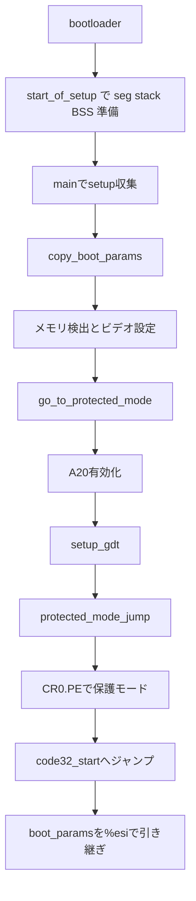

# 第3章 16ビット setup と保護モード移行

> 本章で読むソース
>
> - [`arch/x86/include/uapi/asm/bootparam.h` L116-L140](https://github.com/gregkh/linux/blob/v6.18.38/arch/x86/include/uapi/asm/bootparam.h#L116-L140)
> - [`arch/x86/boot/main.c` L18-L18](https://github.com/gregkh/linux/blob/v6.18.38/arch/x86/boot/main.c#L18-L18)
> - [`arch/x86/boot/main.c` L30-L56](https://github.com/gregkh/linux/blob/v6.18.38/arch/x86/boot/main.c#L30-L56)
> - [`arch/x86/boot/main.c` L133-L181](https://github.com/gregkh/linux/blob/v6.18.38/arch/x86/boot/main.c#L133-L181)
> - [`arch/x86/boot/pm.c` L65-L89](https://github.com/gregkh/linux/blob/v6.18.38/arch/x86/boot/pm.c#L65-L89)
> - [`arch/x86/boot/pm.c` L103-L125](https://github.com/gregkh/linux/blob/v6.18.38/arch/x86/boot/pm.c#L103-L125)
> - [`arch/x86/boot/pmjump.S` L24-L45](https://github.com/gregkh/linux/blob/v6.18.38/arch/x86/boot/pmjump.S#L24-L45)
> - [`arch/x86/boot/pmjump.S` L49-L74](https://github.com/gregkh/linux/blob/v6.18.38/arch/x86/boot/pmjump.S#L49-L74)

## この章の狙い

bootloader から渡された直後の **16ビット real-mode setup** が何を収集し、どう **32ビット保護モード** へ移行して圧縮カーネルへ制御を渡すかを追う。
`boot_params` が後段へ引き継ぐ情報の受け皿である点を押さえる。

## 前提

[第1章](../part00-foundation/01-overview-execution-environment.md) で x86-64 実行環境の語彙を読んでいること。
boot protocol の全体像は [全体像と横断基盤](../../foundation/README.md) のブート概観を参照する。

## real-mode setup の位置づけ

`vmlinuz` イメージの先頭付近には、16ビットで動く **setup コード** が載る。
bootloader はカーネルヘッダを読み、setup セクションをメモリ上の所定位置へ載せ、boot protocol の setup entry へ飛ばす。
`header.S` の short jump が `start_of_setup` へ入り、segment register とスタックと BSS を準備した後に `main` を呼ぶ。

setup の役割は、カーネル本体の前段として次を担うことである。

- bootloader が渡した **setup header** を `boot_params` へ整理してコピーする。
- コンソール、ヒープ、メモリレイアウト、ビデオなど起動に必要なハードウェア情報を収集する。
- **A20** を有効化し、最小の GDT を用意して保護モードへ移行する。
- `boot_params` ポインタとともに、圧縮カーネルの32ビット入口 `code32_start` へジャンプする。

以降の展開とロングモード移行は [第4章](04-compressed-kernel-decompression.md)、実カーネル本体の `startup_64` は [第5章](05-head-64-startup.md) が担当する。

## boot_params と setup header

**boot_params** はいわゆる zeropage 相当の4KiB構造体で、ブート各段階の共通インタフェースである。
`main.c` はグローバル実体 `boot_params` を16バイト境界に置く。

[`arch/x86/boot/main.c` L18-L18](https://github.com/gregkh/linux/blob/v6.18.38/arch/x86/boot/main.c#L18-L18)

```c
struct boot_params boot_params __attribute__((aligned(16)));
```

先頭付近のフィールドには、画面情報、ACPI RSDP、E820 エントリ数などが並ぶ。

[`arch/x86/include/uapi/asm/bootparam.h` L116-L140](https://github.com/gregkh/linux/blob/v6.18.38/arch/x86/include/uapi/asm/bootparam.h#L116-L140)

```c
struct boot_params {
	struct screen_info screen_info;			/* 0x000 */
	struct apm_bios_info apm_bios_info;		/* 0x040 */
	__u8  _pad2[4];					/* 0x054 */
	__u64  tboot_addr;				/* 0x058 */
	struct ist_info ist_info;			/* 0x060 */
	__u64 acpi_rsdp_addr;				/* 0x070 */
	__u8  _pad3[8];					/* 0x078 */
	__u8  hd0_info[16];	/* obsolete! */		/* 0x080 */
	__u8  hd1_info[16];	/* obsolete! */		/* 0x090 */
	struct sys_desc_table sys_desc_table; /* obsolete! */	/* 0x0a0 */
	struct olpc_ofw_header olpc_ofw_header;		/* 0x0b0 */
	__u32 ext_ramdisk_image;			/* 0x0c0 */
	__u32 ext_ramdisk_size;				/* 0x0c4 */
	__u32 ext_cmd_line_ptr;				/* 0x0c8 */
	__u8  _pad4[112];				/* 0x0cc */
	__u32 cc_blob_address;				/* 0x13c */
	struct edid_info edid_info;			/* 0x140 */
	struct efi_info efi_info;			/* 0x1c0 */
	__u32 alt_mem_k;				/* 0x1e0 */
	__u32 scratch;		/* Scratch field! */	/* 0x1e4 */
	__u8  e820_entries;				/* 0x1e8 */
	__u8  eddbuf_entries;				/* 0x1e9 */
	__u8  edd_mbr_sig_buf_entries;			/* 0x1ea */
	__u8  kbd_status;				/* 0x1eb */
	__u8  secure_boot;				/* 0x1ec */
	__u8  _pad5[2];					/* 0x1ed */
```

`hdr` 部分（`setup_header`）には `code32_start` など圧縮カーネル入口アドレスが入る。
bootloader は本来 `setup_header` だけをゼロページへコピーするが、カーネル側は `copy_boot_params` でヘッダ全体を `boot_params.hdr` へ複製し、旧式コマンドラインとの互換もここで吸収する。

[`arch/x86/boot/main.c` L30-L56](https://github.com/gregkh/linux/blob/v6.18.38/arch/x86/boot/main.c#L30-L56)

```c
static void copy_boot_params(void)
{
	struct old_cmdline {
		u16 cl_magic;
		u16 cl_offset;
	};
	const struct old_cmdline * const oldcmd = absolute_pointer(OLD_CL_ADDRESS);

	BUILD_BUG_ON(sizeof(boot_params) != 4096);
	memcpy(&boot_params.hdr, &hdr, sizeof(hdr));

	if (!boot_params.hdr.cmd_line_ptr && oldcmd->cl_magic == OLD_CL_MAGIC) {
		/* Old-style command line protocol */
		u16 cmdline_seg;

		/*
		 * Figure out if the command line falls in the region
		 * of memory that an old kernel would have copied up
		 * to 0x90000...
		 */
		if (oldcmd->cl_offset < boot_params.hdr.setup_move_size)
			cmdline_seg = ds();
		else
			cmdline_seg = 0x9000;

		boot_params.hdr.cmd_line_ptr = (cmdline_seg << 4) + oldcmd->cl_offset;
	}
}
```

## main：ハードウェア情報の収集

`main` は real-mode setup の C 入口である。
初期化の流れは、パラメータコピー、コンソール、ヒープ、CPU 検証、メモリ検出、周辺情報収集、ビデオ設定、保護モード移行の順になる。

[`arch/x86/boot/main.c` L133-L181](https://github.com/gregkh/linux/blob/v6.18.38/arch/x86/boot/main.c#L133-L181)

```c
void main(void)
{
	init_default_io_ops();

	/* First, copy the boot header into the "zeropage" */
	copy_boot_params();

	/* Initialize the early-boot console */
	console_init();
	if (cmdline_find_option_bool("debug"))
		puts("early console in setup code\n");

	/* End of heap check */
	init_heap();

	/* Make sure we have all the proper CPU support */
	if (validate_cpu()) {
		puts("Unable to boot - please use a kernel appropriate for your CPU.\n");
		die();
	}

	/* Tell the BIOS what CPU mode we intend to run in */
	set_bios_mode();

	/* Detect memory layout */
	detect_memory();

	/* Set keyboard repeat rate (why?) and query the lock flags */
	keyboard_init();

	/* Query Intel SpeedStep (IST) information */
	query_ist();

	/* Query APM information */
#if defined(CONFIG_APM) || defined(CONFIG_APM_MODULE)
	query_apm_bios();
#endif

	/* Query EDD information */
#if defined(CONFIG_EDD) || defined(CONFIG_EDD_MODULE)
	query_edd();
#endif

	/* Set the video mode */
	set_video();

	/* Do the last things and invoke protected mode */
	go_to_protected_mode();
}
```

`detect_memory` は E820 マップを `boot_params` に書き込み、後段の KASLR やメモリ配置の土台になる。
`set_video` は `screen_info` を埋め、圧縮カーネル段階の早期コンソール出力に使われる。

## go_to_protected_mode：A20、GDT、ジャンプ準備

保護モード移行の本体は `pm.c` の `go_to_protected_mode` である。
real-mode フックで割り込みを止めたあと、A20 を有効化し、PIC をマスクし、空の IDT とブート用 GDT をロードして `protected_mode_jump` を呼ぶ。

[`arch/x86/boot/pm.c` L103-L125](https://github.com/gregkh/linux/blob/v6.18.38/arch/x86/boot/pm.c#L103-L125)

```c
void go_to_protected_mode(void)
{
	/* Hook before leaving real mode, also disables interrupts */
	realmode_switch_hook();

	/* Enable the A20 gate */
	if (enable_a20()) {
		puts("A20 gate not responding, unable to boot...\n");
		die();
	}

	/* Reset coprocessor (IGNNE#) */
	reset_coprocessor();

	/* Mask all interrupts in the PIC */
	mask_all_interrupts();

	/* Actual transition to protected mode... */
	setup_idt();
	setup_gdt();
	protected_mode_jump(boot_params.hdr.code32_start,
			    (u32)&boot_params + (ds() << 4));
}
```

`setup_gdt` はブート専用の最小 GDT を16バイト境界に置く。
カーネルコード、データ、ダミー TSS の3エントリだけで、以降の32ビットフラット実行に足る。

[`arch/x86/boot/pm.c` L65-L89](https://github.com/gregkh/linux/blob/v6.18.38/arch/x86/boot/pm.c#L65-L89)

```c
static void setup_gdt(void)
{
	/* There are machines which are known to not boot with the GDT
	   being 8-byte unaligned.  Intel recommends 16 byte alignment. */
	static const u64 boot_gdt[] __attribute__((aligned(16))) = {
		/* CS: code, read/execute, 4 GB, base 0 */
		[GDT_ENTRY_BOOT_CS] = GDT_ENTRY(DESC_CODE32, 0, 0xfffff),
		/* DS: data, read/write, 4 GB, base 0 */
		[GDT_ENTRY_BOOT_DS] = GDT_ENTRY(DESC_DATA32, 0, 0xfffff),
		/* TSS: 32-bit tss, 104 bytes, base 4096 */
		/* We only have a TSS here to keep Intel VT happy;
		   we don't actually use it for anything. */
		[GDT_ENTRY_BOOT_TSS] = GDT_ENTRY(DESC_TSS32, 4096, 103),
	};
	/* Xen HVM incorrectly stores a pointer to the gdt_ptr, instead
	   of the gdt_ptr contents.  Thus, make it static so it will
	   stay in memory, at least long enough that we switch to the
	   proper kernel GDT. */
	static struct gdt_ptr gdt;

	gdt.len = sizeof(boot_gdt)-1;
	gdt.ptr = (u32)&boot_gdt + (ds() << 4);

	asm volatile("lgdtl %0" : : "m" (gdt));
}
```

第1引数 `code32_start` は圧縮カーネルの32ビット入口アドレスであり、既定は 0x100000 である。
relocatable kernel を別アドレスに載せた bootloader は、この値を実際の load address へ更新する。
`protected_mode_jump` はこれを EAX に受け、`jmpl` の絶対32ビット entry address として使う。
第2引数はセグメント相対アドレスに直した `boot_params` ポインタで、32ビット側へ引き継がれる。

## protected_mode_jump：CR0.PE と32ビット入口

`pmjump.S` の `protected_mode_jump` が、実際に **CR0 の PE ビット** を立てて保護モードへ入る。
`%eax` に32ビット入口、`%edx` に `boot_params` ポインタが入った状態で呼ばれる。

[`arch/x86/boot/pmjump.S` L24-L45](https://github.com/gregkh/linux/blob/v6.18.38/arch/x86/boot/pmjump.S#L24-L45)

```asm
SYM_FUNC_START_NOALIGN(protected_mode_jump)
	movl	%edx, %esi		# Pointer to boot_params table

	xorl	%ebx, %ebx
	movw	%cs, %bx
	shll	$4, %ebx
	addl	%ebx, 2f
	jmp	1f			# Short jump to serialize on 386/486
1:

	movw	$__BOOT_DS, %cx
	movw	$__BOOT_TSS, %di

	movl	%cr0, %edx
	orb	$X86_CR0_PE, %dl	# Protected mode
	movl	%edx, %cr0

	# Transition to 32-bit mode
	.byte	0x66, 0xea		# ljmpl opcode
2:	.long	.Lin_pm32		# offset
	.word	__BOOT_CS		# segment
SYM_FUNC_END(protected_mode_jump)
```

`.Lin_pm32` ではフラットなデータセグメントを設定し、レジスタをクリアしたうえで `%eax` の入口へ far jump する。
`%esi` に残した `boot_params` ポインタは、圧縮カーネル側の calling convention で `%esi` として渡される。

[`arch/x86/boot/pmjump.S` L49-L74](https://github.com/gregkh/linux/blob/v6.18.38/arch/x86/boot/pmjump.S#L49-L74)

```asm
SYM_FUNC_START_LOCAL_NOALIGN(.Lin_pm32)
	# Set up data segments for flat 32-bit mode
	movl	%ecx, %ds
	movl	%ecx, %es
	movl	%ecx, %fs
	movl	%ecx, %gs
	movl	%ecx, %ss
	# The 32-bit code sets up its own stack, but this way we do have
	# a valid stack if some debugging hack wants to use it.
	addl	%ebx, %esp

	# Set up TR to make Intel VT happy
	ltr	%di

	# Clear registers to allow for future extensions to the
	# 32-bit boot protocol
	xorl	%ecx, %ecx
	xorl	%edx, %edx
	xorl	%ebx, %ebx
	xorl	%ebp, %ebp
	xorl	%edi, %edi

	# Set up LDTR to make Intel VT happy
	lldt	%cx

	jmpl	*%eax			# Jump to the 32-bit entrypoint
SYM_FUNC_END(.Lin_pm32)
```

## 処理の流れ：bootloader から圧縮カーネルへ



## 高速化と最適化の工夫

16ビット setup は必要最小限の BIOS 問い合わせとモード切替に留め、本処理は32ビット以降の C とアセンブリへ速やかに委譲する。
real-mode ではセグメント演算や `int` 呼び出しの制約が強く、ここを厚くしない設計である。

もう一つの工夫は、`boot_params` 一つにブート情報を集約することである。
メモリマップ、画面、EFI、コマンドライン、圧縮カーネル入口アドレスが同一構造体を介して渡るため、段階をまたぐインタフェースが単純になる。
setup は収集とコピーに専念し、解釈は後段へ委ねられる。

## まとめ

- real-mode setup は `main` から `go_to_protected_mode` までが担い、ハードウェア情報を `boot_params` に集める。
- 保護モード移行は A20、ブート GDT、`CR0.PE`、far jump の短い経路で完了する。
- `protected_mode_jump` は `code32_start` と `boot_params` を圧縮カーネルへ渡し、第4章の `startup_32` へ接続する。

## 関連する章

- [分冊の全体像と x86-64 実行環境](../part00-foundation/01-overview-execution-environment.md)
- [圧縮カーネルの展開と再配置と64ビット入口](04-compressed-kernel-decompression.md)
- [head_64.S の startup_64](05-head-64-startup.md)
