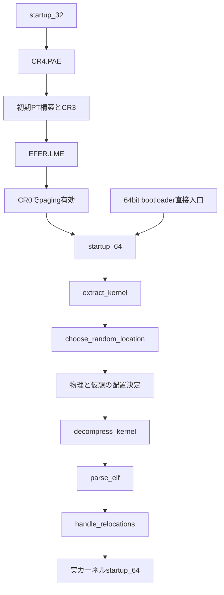

# 第4章 圧縮カーネルの展開と再配置と64ビット入口

> 本章で読むソース
>
> - [`arch/x86/boot/compressed/head_64.S` L82-L90](https://github.com/gregkh/linux/blob/v6.18.38/arch/x86/boot/compressed/head_64.S#L82-L90)
> - [`arch/x86/boot/compressed/head_64.S` L167-L273](https://github.com/gregkh/linux/blob/v6.18.38/arch/x86/boot/compressed/head_64.S#L167-L273)
> - [`arch/x86/boot/compressed/head_64.S` L278-L288](https://github.com/gregkh/linux/blob/v6.18.38/arch/x86/boot/compressed/head_64.S#L278-L288)
> - [`arch/x86/boot/compressed/head_64.S` L466-L475](https://github.com/gregkh/linux/blob/v6.18.38/arch/x86/boot/compressed/head_64.S#L466-L475)
> - [`arch/x86/boot/compressed/misc.c` L344-L361](https://github.com/gregkh/linux/blob/v6.18.38/arch/x86/boot/compressed/misc.c#L344-L361)
> - [`arch/x86/boot/compressed/misc.c` L490-L521](https://github.com/gregkh/linux/blob/v6.18.38/arch/x86/boot/compressed/misc.c#L490-L521)
> - [`arch/x86/boot/compressed/kaslr.c` L840-L855](https://github.com/gregkh/linux/blob/v6.18.38/arch/x86/boot/compressed/kaslr.c#L840-L855)
> - [`arch/x86/boot/compressed/kaslr.c` L861-L908](https://github.com/gregkh/linux/blob/v6.18.38/arch/x86/boot/compressed/kaslr.c#L861-L908)
> - [`arch/x86/boot/compressed/misc.c` L226-L227](https://github.com/gregkh/linux/blob/v6.18.38/arch/x86/boot/compressed/misc.c#L226-L227)

## この章の狙い

**圧縮カーネル**（`arch/x86/boot/compressed/`）が自己展開ローダとして、実カーネルを配置し64ビット入口へ渡す流れを追う。
`startup_32` のロングモード有効化順、`extract_kernel` の処理順、物理と仮想の両方を決める KASLR を正確に押さえる。

## 前提

[第3章](03-realmode-setup-protected-mode.md) で `code32_start` と `boot_params` の引き渡しを読んでいること。

## 圧縮カーネルは自己展開ローダである

`vmlinuz` の後段に載る圧縮カーネルは、配布時は圧縮された `vmlinux` 断片とブート用アセンブリを含む。
起動時に自身をバッファ末尾へ寄せ、展開先へ解凍し、ELF を解析して再配置し、最終的に `arch/x86/kernel/head_64.S` の実カーネル `startup_64` へジャンプする。

本章の `startup_64` は **圧縮カーネル内** のシンボルである。
実カーネル本体の同名入口は [第5章](05-head-64-startup.md) で扱う。

## startup_32：32ビット入口とロングモード有効化

`startup_32` は圧縮カーネルの32ビット入口で、オフセット0が **ABI として固定** されている。
32ビット bootloader から直接入る経路でも、第3章の `protected_mode_jump` から入る経路でも、ここから処理が始まる。

[`arch/x86/boot/compressed/head_64.S` L82-L90](https://github.com/gregkh/linux/blob/v6.18.38/arch/x86/boot/compressed/head_64.S#L82-L90)

```asm
SYM_FUNC_START(startup_32)
	/*
	 * 32bit entry is 0 and it is ABI so immutable!
	 * If we come here directly from a bootloader,
	 * kernel(text+data+bss+brk) ramdisk, zero_page, command line
	 * all need to be under the 4G limit.
	 */
	cld
	cli
```

ロングモードへ入る実装順は、コメントと命令列が示すとおり次のとおりである。

1. **CR4.PAE** を立てる。
2. 早期4GiB **ページテーブル** を構築し **CR3** へ載せる。
3. **EFER.LME** を `wrmsr` で有効化する。
4. **CR0** に `CR0_STATE` を書き、ページングを有効化する。
5. `lret` で **startup_64** へ入る。

[`arch/x86/boot/compressed/head_64.S` L167-L273](https://github.com/gregkh/linux/blob/v6.18.38/arch/x86/boot/compressed/head_64.S#L167-L273)

```asm
	/* Enable PAE mode */
	movl	%cr4, %eax
	orl	$X86_CR4_PAE, %eax
	movl	%eax, %cr4

 /*
  * Build early 4G boot pagetable
  */
	/*
	 * If SEV is active then set the encryption mask in the page tables.
	 * This will ensure that when the kernel is copied and decompressed
	 * it will be done so encrypted.
	 */
	xorl	%edx, %edx
#ifdef	CONFIG_AMD_MEM_ENCRYPT
	call	get_sev_encryption_bit
	xorl	%edx, %edx
	testl	%eax, %eax
	jz	1f
	subl	$32, %eax	/* Encryption bit is always above bit 31 */
	bts	%eax, %edx	/* Set encryption mask for page tables */
	/*
	 * Set MSR_AMD64_SEV_ENABLED_BIT in sev_status so that
	 * startup32_check_sev_cbit() will do a check. sev_enable() will
	 * initialize sev_status with all the bits reported by
	 * MSR_AMD_SEV_STATUS later, but only MSR_AMD64_SEV_ENABLED_BIT
	 * needs to be set for now.
	 */
	movl	$1, rva(sev_status)(%ebp)
1:
#endif

	/* Initialize Page tables to 0 */
	leal	rva(pgtable)(%ebx), %edi
	xorl	%eax, %eax
	movl	$(BOOT_INIT_PGT_SIZE/4), %ecx
	rep	stosl

	/* Build Level 4 */
	leal	rva(pgtable + 0)(%ebx), %edi
	leal	0x1007 (%edi), %eax
	movl	%eax, 0(%edi)
	addl	%edx, 4(%edi)

	/* Build Level 3 */
	leal	rva(pgtable + 0x1000)(%ebx), %edi
	leal	0x1007(%edi), %eax
	movl	$4, %ecx
1:	movl	%eax, 0x00(%edi)
	addl	%edx, 0x04(%edi)
	addl	$0x00001000, %eax
	addl	$8, %edi
	decl	%ecx
	jnz	1b

	/* Build Level 2 */
	leal	rva(pgtable + 0x2000)(%ebx), %edi
	movl	$0x00000183, %eax
	movl	$2048, %ecx
1:	movl	%eax, 0(%edi)
	addl	%edx, 4(%edi)
	addl	$0x00200000, %eax
	addl	$8, %edi
	decl	%ecx
	jnz	1b

	/* Enable the boot page tables */
	leal	rva(pgtable)(%ebx), %eax
	movl	%eax, %cr3

	/* Enable Long mode in EFER (Extended Feature Enable Register) */
	movl	$MSR_EFER, %ecx
	rdmsr
	btsl	$_EFER_LME, %eax
	wrmsr

	/* After gdt is loaded */
	xorl	%eax, %eax
	lldt	%ax
	movl    $__BOOT_TSS, %eax
	ltr	%ax

#ifdef CONFIG_AMD_MEM_ENCRYPT
	/* Check if the C-bit position is correct when SEV is active */
	call	startup32_check_sev_cbit
#endif

	/*
	 * Setup for the jump to 64bit mode
	 *
	 * When the jump is performed we will be in long mode but
	 * in 32bit compatibility mode with EFER.LME = 1, CS.L = 0, CS.D = 1
	 * (and in turn EFER.LMA = 1).	To jump into 64bit mode we use
	 * the new gdt/idt that has __KERNEL_CS with CS.L = 1.
	 * We place all of the values on our mini stack so lret can
	 * used to perform that far jump.
	 */
	leal	rva(startup_64)(%ebp), %eax
	pushl	$__KERNEL_CS
	pushl	%eax

	/* Enter paged protected Mode, activating Long Mode */
	movl	$CR0_STATE, %eax
	movl	%eax, %cr0

	/* Jump from 32bit compatibility mode into 64bit mode. */
	lret
SYM_FUNC_END(startup_32)
```

`CR0_STATE` を書く直前に `EFER.LME` が立っている点が重要である。
ページング有効化と同時にロングモード入りが成立し、その直後の `lret` で64ビットコードセグメントへ切り替わる。

## startup_64：64ビット bootloader 直接入口

圧縮カーネル内 `startup_64` はオフセット **0x200** に置かれ、こちらも ABI 固定である。
`startup_32` を経由せず、64ビット bootloader から直接呼ばれる入口でもある。

[`arch/x86/boot/compressed/head_64.S` L278-L288](https://github.com/gregkh/linux/blob/v6.18.38/arch/x86/boot/compressed/head_64.S#L278-L288)

```asm
SYM_CODE_START(startup_64)
	/*
	 * 64bit entry is 0x200 and it is ABI so immutable!
	 * We come here either from startup_32 or directly from a
	 * 64bit bootloader.
	 * If we come here from a bootloader, kernel(text+data+bss+brk),
	 * ramdisk, zero_page, command line could be above 4G.
	 * We depend on an identity mapped page table being provided
	 * that maps our entire kernel(text+data+bss+brk), zero page
	 * and command line.
	 */
```

64ビット直接入口では、bootloader が恒等写像ページテーブルを用意している前提になる。
`startup_32` 経路とは、4GiB 制約やページテーブル構築の責務分担が異なる。

`.Lrelocated` 到達後、`extract_kernel` を呼び、戻り値のカーネル入口へジャンプする。

[`arch/x86/boot/compressed/head_64.S` L466-L475](https://github.com/gregkh/linux/blob/v6.18.38/arch/x86/boot/compressed/head_64.S#L466-L475)

```asm
	/* pass struct boot_params pointer and output target address */
	movq	%r15, %rdi
	movq	%rbp, %rsi
	call	extract_kernel		/* returns kernel entry point in %rax */

/*
 * Jump to the decompressed kernel.
 */
	movq	%r15, %rsi
	jmp	*%rax
```

`%r15` は `boot_params` ポインタ、`%rbp` は load address と alignment から計算した初期の展開先候補（`extract_kernel` の output 引数）である。
`extract_kernel` はこれを `choose_random_location` へ渡し、物理 KASLR が成功すれば最終展開先を更新する。
`%rbp` 自体が KASLR 後の最終物理アドレスへ書き換わるわけではない。
`jmp *%rax` の先が実カーネル `startup_64` への接続点になる。

## extract_kernel の処理順

`extract_kernel` は展開パイプラインの C 本体である。
処理順を誤解しないことが重要で、流れは次のとおりである。

1. 初期化（コンソール、ヒープ、各種検出）。
2. **`choose_random_location`** で物理出力先と `virt_addr` を決定し、整合性を検証する。
3. **`decompress_kernel`** で解凍し、内部で **`parse_elf`** と **`handle_relocations`** を順に実行する。
4. エントリオフセットを返す。

[`arch/x86/boot/compressed/misc.c` L490-L521](https://github.com/gregkh/linux/blob/v6.18.38/arch/x86/boot/compressed/misc.c#L490-L521)

```c
	choose_random_location((unsigned long)input_data, input_len,
				(unsigned long *)&output,
				needed_size,
				&virt_addr);

	/* Validate memory location choices. */
	if ((unsigned long)output & (MIN_KERNEL_ALIGN - 1))
		error("Destination physical address inappropriately aligned");
	if (virt_addr & (MIN_KERNEL_ALIGN - 1))
		error("Destination virtual address inappropriately aligned");
#ifdef CONFIG_X86_64
	if (heap > 0x3fffffffffffUL)
		error("Destination address too large");
	if (virt_addr + needed_size > KERNEL_IMAGE_SIZE)
		error("Destination virtual address is beyond the kernel mapping area");
#else
	if (heap > ((-__PAGE_OFFSET-(128<<20)-1) & 0x7fffffff))
		error("Destination address too large");
#endif
#ifndef CONFIG_RELOCATABLE
	if (virt_addr != LOAD_PHYSICAL_ADDR)
		error("Destination virtual address changed when not relocatable");
#endif

	debug_putstr("\nDecompressing Linux... ");

	if (init_unaccepted_memory()) {
		debug_putstr("Accepting memory... ");
		accept_memory(__pa(output), needed_size);
	}

	entry_offset = decompress_kernel(output, virt_addr, error);
```

`choose_random_location` が先に走り、その結果の `virt_addr` が `decompress_kernel` に渡される。
`handle_relocations` はこの先に決めた仮想アドレスを使う。

[`arch/x86/boot/compressed/misc.c` L344-L361](https://github.com/gregkh/linux/blob/v6.18.38/arch/x86/boot/compressed/misc.c#L344-L361)

```c
unsigned long decompress_kernel(unsigned char *outbuf, unsigned long virt_addr,
				void (*error)(char *x))
{
	unsigned long entry;

	if (!free_mem_ptr) {
		free_mem_ptr     = (unsigned long)boot_heap;
		free_mem_end_ptr = (unsigned long)boot_heap + sizeof(boot_heap);
	}

	if (__decompress(input_data, input_len, NULL, NULL, outbuf, output_len,
			 NULL, error) < 0)
		return ULONG_MAX;

	entry = parse_elf(outbuf);
	handle_relocations(outbuf, output_len, virt_addr);

	return entry;
}
```

64ビットでは、KASLR により `virt_addr` が `LOAD_PHYSICAL_ADDR` からずれたときだけ再配置が必要になる。

[`arch/x86/boot/compressed/misc.c` L226-L227](https://github.com/gregkh/linux/blob/v6.18.38/arch/x86/boot/compressed/misc.c#L226-L227)

```c
	if (IS_ENABLED(CONFIG_X86_64))
		delta = virt_addr - LOAD_PHYSICAL_ADDR;
```

## choose_random_location：物理と仮想の KASLR

`arch/x86/boot/compressed/kaslr.c` の **choose_random_location** は、圧縮カーネル段階の KASLR である。
x86-64 では物理配置と仮想配置の **両方** を決める。

[`arch/x86/boot/compressed/kaslr.c` L861-L908](https://github.com/gregkh/linux/blob/v6.18.38/arch/x86/boot/compressed/kaslr.c#L861-L908)

```c
void choose_random_location(unsigned long input,
			    unsigned long input_size,
			    unsigned long *output,
			    unsigned long output_size,
			    unsigned long *virt_addr)
{
	unsigned long random_addr, min_addr;

	if (cmdline_find_option_bool("nokaslr")) {
		warn("KASLR disabled: 'nokaslr' on cmdline.");
		return;
	}

	boot_params_ptr->hdr.loadflags |= KASLR_FLAG;

	if (IS_ENABLED(CONFIG_X86_32))
		mem_limit = KERNEL_IMAGE_SIZE;
	else
		mem_limit = MAXMEM;

	/* Record the various known unsafe memory ranges. */
	mem_avoid_init(input, input_size, *output);

	/*
	 * Low end of the randomization range should be the
	 * smaller of 512M or the initial kernel image
	 * location:
	 */
	min_addr = min(*output, 512UL << 20);
	/* Make sure minimum is aligned. */
	min_addr = ALIGN(min_addr, CONFIG_PHYSICAL_ALIGN);

	/* Walk available memory entries to find a random address. */
	random_addr = find_random_phys_addr(min_addr, output_size);
	if (!random_addr) {
		warn("Physical KASLR disabled: no suitable memory region!");
	} else {
		/* Update the new physical address location. */
		if (*output != random_addr)
			*output = random_addr;
	}


	/* Pick random virtual address starting from LOAD_PHYSICAL_ADDR. */
	if (IS_ENABLED(CONFIG_X86_64))
		random_addr = find_random_virt_addr(LOAD_PHYSICAL_ADDR, output_size);
	*virt_addr = random_addr;
}
```

物理側は `find_random_phys_addr` が E820 由来の可用メモリからスロットを選ぶ。
仮想側は `find_random_virt_addr` が `LOAD_PHYSICAL_ADDR` から `KERNEL_IMAGE_SIZE` の範囲でスロットを選ぶ。

[`arch/x86/boot/compressed/kaslr.c` L840-L855](https://github.com/gregkh/linux/blob/v6.18.38/arch/x86/boot/compressed/kaslr.c#L840-L855)

```c
static unsigned long find_random_virt_addr(unsigned long minimum,
					   unsigned long image_size)
{
	unsigned long slots, random_addr;

	/*
	 * There are how many CONFIG_PHYSICAL_ALIGN-sized slots
	 * that can hold image_size within the range of minimum to
	 * KERNEL_IMAGE_SIZE?
	 */
	slots = 1 + (KERNEL_IMAGE_SIZE - minimum - image_size) / CONFIG_PHYSICAL_ALIGN;

	random_addr = kaslr_get_random_long("Virtual") % slots;

	return random_addr * CONFIG_PHYSICAL_ALIGN + minimum;
}
```

`mm/kaslr.c` の `kernel_randomize_memory` が direct map や vmalloc 領域をランダム化する機構は別物である。
カーネル起動後の仮想領域配置は [第24章](../part07-paging/24-virtual-address-layout-kaslr.md) へ委譲する。

## 処理の流れ：展開から実カーネルへ



## 高速化と最適化の工夫

配布イメージを圧縮することで、ディスク上のフットプリントと初期ロード量を抑える。
展開コストは起動時に一度だけ支払い、以降は通常のカーネル実行へ移る。

KASLR は `choose_random_location` で物理出力先と `virt_addr` を実行ごとに変え、`handle_relocations` が先に決めた仮想配置へ ELF 内アドレスを合わせる。
物理と仮想を独立にランダム化することで、固定リンクアドレス前提の攻撃を困難にする。

## まとめ

- 圧縮カーネルは `startup_32` または `startup_64` から入り、`extract_kernel` で実カーネルを配置する自己展開ローダである。
- ロングモード有効化は CR4.PAE、初期 PT と CR3、EFER.LME、CR0 の順である。
- `extract_kernel` は `choose_random_location` の後に `decompress_kernel` を呼び、内部で parse と再配置を行う。
- 展開後の `jmp *%rax` が実カーネル [第5章](05-head-64-startup.md) の `startup_64` へ接続する。

## 関連する章

- [16ビット setup と保護モード移行](03-realmode-setup-protected-mode.md)
- [head_64.S の startup_64](05-head-64-startup.md)
- [仮想アドレス配置と KASLR](../part07-paging/24-virtual-address-layout-kaslr.md)
