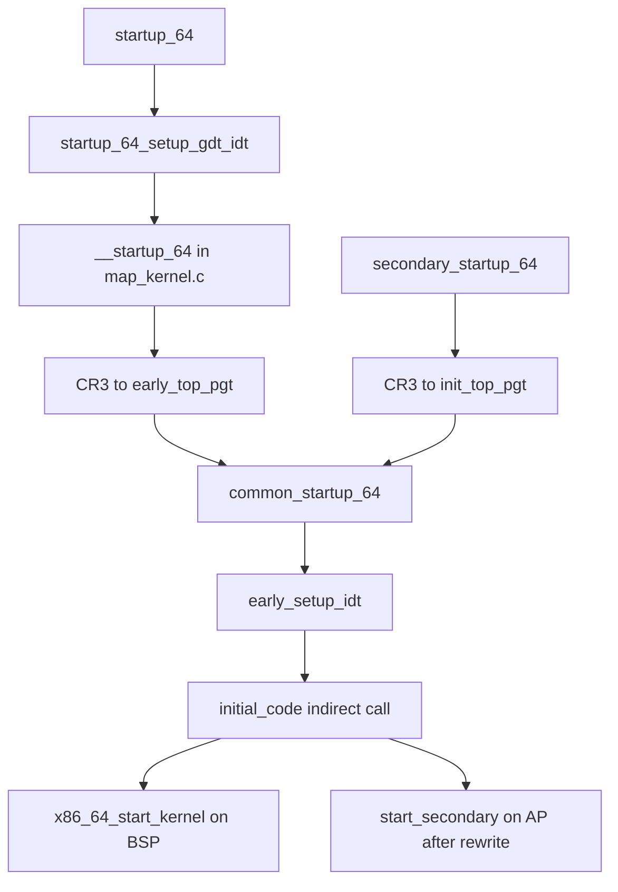

# 第5章 head_64.S の startup_64

> 本章で読むソース
>
> - [`arch/x86/kernel/head_64.S` L38-L74](https://github.com/gregkh/linux/blob/v6.18.38/arch/x86/kernel/head_64.S#L38-L74)
> - [`arch/x86/kernel/head_64.S` L100-L140](https://github.com/gregkh/linux/blob/v6.18.38/arch/x86/kernel/head_64.S#L100-L140)
> - [`arch/x86/boot/startup/map_kernel.c` L78-L127](https://github.com/gregkh/linux/blob/v6.18.38/arch/x86/boot/startup/map_kernel.c#L78-L127)
> - [`arch/x86/boot/startup/map_kernel.c` L142-L183](https://github.com/gregkh/linux/blob/v6.18.38/arch/x86/boot/startup/map_kernel.c#L142-L183)
> - [`arch/x86/kernel/head_64.S` L147-L196](https://github.com/gregkh/linux/blob/v6.18.38/arch/x86/kernel/head_64.S#L147-L196)
> - [`arch/x86/kernel/head_64.S` L198-L233](https://github.com/gregkh/linux/blob/v6.18.38/arch/x86/kernel/head_64.S#L198-L233)
> - [`arch/x86/kernel/head_64.S` L365-L419](https://github.com/gregkh/linux/blob/v6.18.38/arch/x86/kernel/head_64.S#L365-L419)
> - [`arch/x86/kernel/head_64.S` L479-L479](https://github.com/gregkh/linux/blob/v6.18.38/arch/x86/kernel/head_64.S#L479-L479)
> - [`arch/x86/kernel/head_64.S` L603-L607](https://github.com/gregkh/linux/blob/v6.18.38/arch/x86/kernel/head_64.S#L603-L607)

## この章の狙い

**実カーネル**の64ビット入口 `startup_64` が、前段から引き継いだ identity mapping 上で何を整え、`early_top_pgt` へ切り替えて `common_startup_64` へ合流するかを追う。
`map_kernel.c` の `__startup_64` が静的ページテーブルを fixup し切替用 identity mapping を足す流れを正確に押さえる。

## 前提

[第4章](04-compressed-kernel-decompression.md) で圧縮カーネルが実カーネル `startup_64` へジャンプする経路を読んでいること。
AP 起動の詳細は [第29章](../part08-smp-mitigations/29-smp-boot.md) が担当する。

## 実カーネルの64ビット入口

`arch/x86/kernel/head_64.S` の `startup_64` は、圧縮カーネル（第4章）または64ビット bootloader から渡された **実カーネル本体**の入口である。
第4章の圧縮カーネル内 `startup_64` とは別シンボルであり、ここから先はリンク済みの本番カーネルイメージが動く。

入口時点で CPU はすでに **ロングモード**であり **ページング**も有効である。
前段が与えた identity-mapped ページテーブル上で実行が始まり、カーネルページ全体、場合によってはメモリ全体が写像されている。
`%rsi` には bootloader が渡した `boot_params` の物理アドレスが入り、C 呼び出しで潰れないよう `%r15` へ退避する。

[`arch/x86/kernel/head_64.S` L38-L74](https://github.com/gregkh/linux/blob/v6.18.38/arch/x86/kernel/head_64.S#L38-L74)

```asm
SYM_CODE_START_NOALIGN(startup_64)
	UNWIND_HINT_END_OF_STACK
	/*
	 * At this point the CPU runs in 64bit mode CS.L = 1 CS.D = 0,
	 * and someone has loaded an identity mapped page table
	 * for us.  These identity mapped page tables map all of the
	 * kernel pages and possibly all of memory.
	 *
	 * %RSI holds the physical address of the boot_params structure
	 * provided by the bootloader. Preserve it in %R15 so C function calls
	 * will not clobber it.
	 *
	 * We come here either directly from a 64bit bootloader, or from
	 * arch/x86/boot/compressed/head_64.S.
	 *
	 * We only come here initially at boot nothing else comes here.
	 *
	 * Since we may be loaded at an address different from what we were
	 * compiled to run at we first fixup the physical addresses in our page
	 * tables and then reload them.
	 */
	mov	%rsi, %r15

	/* Set up the stack for verify_cpu() */
	leaq	__top_init_kernel_stack(%rip), %rsp

	/*
	 * Set up GSBASE.
	 * Note that on SMP the boot CPU uses the init data section until
	 * the per-CPU areas are set up.
	 */
	movl	$MSR_GS_BASE, %ecx
	xorl	%eax, %eax
	xorl	%edx, %edx
	wrmsr

	call	__pi_startup_64_setup_gdt_idt
```

最初に `%gs` base をゼロにし、位置独立の `startup_64_setup_gdt_idt` で GDT と bringup 用 IDT を載せる。
その後 `lretq` で `__KERNEL_CS` に切り替え、以降の処理をカーネルセグメント上で続ける。

## __startup_64 によるページテーブル fixup

リンク先アドレスと実際のロード先がずれると、静的に埋め込まれたページテーブルの物理アドレスが不正になる。
この fixup は `head64.c` ではなく `arch/x86/boot/startup/map_kernel.c` の `__startup_64` が担う。
`early_top_pgt` と下位の `level3_kernel_pgt` などはビルド時に静的に用意されており、ここで一から構築するわけではない。

`__startup_64` は PIC でコンパイルされ、identity mapping 上の RIP 相対アドレスを `rip_rel_ptr()` で解決する。
`p2v_offset` は `common_startup_64` の物理アドレスと仮想アドレスの差から求められ、`phys_base` と `load_delta` を確定する。

[`arch/x86/boot/startup/map_kernel.c` L78-L127](https://github.com/gregkh/linux/blob/v6.18.38/arch/x86/boot/startup/map_kernel.c#L78-L127)

```c
/*
 * This code is compiled using PIC codegen because it will execute from the
 * early 1:1 mapping of memory, which deviates from the mapping expected by the
 * linker. Due to this deviation, taking the address of a global variable will
 * produce an ambiguous result when using the plain & operator.  Instead,
 * rip_rel_ptr() must be used, which will return the RIP-relative address in
 * the 1:1 mapping of memory. Kernel virtual addresses can be determined by
 * subtracting p2v_offset from the RIP-relative address.
 */
unsigned long __init __startup_64(unsigned long p2v_offset,
				  struct boot_params *bp)
{
	pmd_t (*early_pgts)[PTRS_PER_PMD] = rip_rel_ptr(early_dynamic_pgts);
	unsigned long physaddr = (unsigned long)rip_rel_ptr(_text);
	unsigned long va_text, va_end;
	unsigned long pgtable_flags;
	unsigned long load_delta;
	pgdval_t *pgd;
	p4dval_t *p4d;
	pudval_t *pud;
	pmdval_t *pmd, pmd_entry;
	bool la57;
	int i;

	la57 = check_la57_support();

	/* Is the address too large? */
	if (physaddr >> MAX_PHYSMEM_BITS)
		for (;;);

	/*
	 * Compute the delta between the address I am compiled to run at
	 * and the address I am actually running at.
	 */
	phys_base = load_delta = __START_KERNEL_map + p2v_offset;

	/* Is the address not 2M aligned? */
	if (load_delta & ~PMD_MASK)
		for (;;);

	va_text = physaddr - p2v_offset;
	va_end  = (unsigned long)rip_rel_ptr(_end) - p2v_offset;

	/* Include the SME encryption mask in the fixup value */
	load_delta += sme_get_me_mask();

	/* Fixup the physical addresses in the page table */

	pgd = rip_rel_ptr(early_top_pgt);
	pgd[pgd_index(__START_KERNEL_map)] += load_delta;
```

fixup のあと、`early_dynamic_pgts` を使って **切替用 identity mapping** を追加する。
コメントが示すとおり、ここで作るエントリには global ビットを付けない。
現在実行中の低位物理アドレスが、CR3 切替後も有効なまま残るための布石である。

[`arch/x86/boot/startup/map_kernel.c` L142-L183](https://github.com/gregkh/linux/blob/v6.18.38/arch/x86/boot/startup/map_kernel.c#L142-L183)

```c
	/*
	 * Set up the identity mapping for the switchover.  These
	 * entries should *NOT* have the global bit set!  This also
	 * creates a bunch of nonsense entries but that is fine --
	 * it avoids problems around wraparound.
	 */

	pud = &early_pgts[0]->pmd;
	pmd = &early_pgts[1]->pmd;
	next_early_pgt = 2;

	pgtable_flags = _KERNPG_TABLE_NOENC + sme_get_me_mask();

	if (la57) {
		p4d = &early_pgts[next_early_pgt++]->pmd;

		i = (physaddr >> PGDIR_SHIFT) % PTRS_PER_PGD;
		pgd[i + 0] = (pgdval_t)p4d + pgtable_flags;
		pgd[i + 1] = (pgdval_t)p4d + pgtable_flags;

		i = physaddr >> P4D_SHIFT;
		p4d[(i + 0) % PTRS_PER_P4D] = (pgdval_t)pud + pgtable_flags;
		p4d[(i + 1) % PTRS_PER_P4D] = (pgdval_t)pud + pgtable_flags;
	} else {
		i = (physaddr >> PGDIR_SHIFT) % PTRS_PER_PGD;
		pgd[i + 0] = (pgdval_t)pud + pgtable_flags;
		pgd[i + 1] = (pgdval_t)pud + pgtable_flags;
	}

	i = physaddr >> PUD_SHIFT;
	pud[(i + 0) % PTRS_PER_PUD] = (pudval_t)pmd + pgtable_flags;
	pud[(i + 1) % PTRS_PER_PUD] = (pudval_t)pmd + pgtable_flags;

	pmd_entry = __PAGE_KERNEL_LARGE_EXEC & ~_PAGE_GLOBAL;
	pmd_entry += sme_get_me_mask();
	pmd_entry +=  physaddr;

	for (i = 0; i < DIV_ROUND_UP(va_end - va_text, PMD_SIZE); i++) {
		int idx = i + (physaddr >> PMD_SHIFT);

		pmd[idx % PTRS_PER_PMD] = pmd_entry + i * PMD_SIZE;
	}
```

`early_top_pgt` 自体は `head_64.S` に静的定義され、511 エントリをゼロ埋めしたうえでカーネル高位写像用の1エントリだけを持つ。

[`arch/x86/kernel/head_64.S` L603-L607](https://github.com/gregkh/linux/blob/v6.18.38/arch/x86/kernel/head_64.S#L603-L607)

```asm
SYM_DATA_START_PTI_ALIGNED(early_top_pgt)
	.fill	511,8,0
	.quad	level3_kernel_pgt - __START_KERNEL_map + _PAGE_TABLE_NOENC
	.fill	PTI_USER_PGD_FILL,8,0
SYM_DATA_END(early_top_pgt)
```

## early_top_pgt への CR3 切替

`startup_64` は `__startup_64` の戻り値（SME 暗号化マスク等）を `early_top_pgt` のアドレスに加え、それを **CR3** へ書き込む。
`__startup_64` が足した identity mapping により、切替の瞬間も現在の低位アドレスで命令が実行でき続ける。
その直後、カーネル仮想アドレスへ配置された `common_startup_64` へジャンプする。

[`arch/x86/kernel/head_64.S` L100-L140](https://github.com/gregkh/linux/blob/v6.18.38/arch/x86/kernel/head_64.S#L100-L140)

```asm
	/*
	 * Derive the kernel's physical-to-virtual offset from the physical and
	 * virtual addresses of common_startup_64().
	 */
	leaq	common_startup_64(%rip), %rdi
	subq	.Lcommon_startup_64(%rip), %rdi

	/*
	 * Perform pagetable fixups. Additionally, if SME is active, encrypt
	 * the kernel and retrieve the modifier (SME encryption mask if SME
	 * is active) to be added to the initial pgdir entry that will be
	 * programmed into CR3.
	 */
	movq	%r15, %rsi
	call	__pi___startup_64

	/* Form the CR3 value being sure to include the CR3 modifier */
	leaq	early_top_pgt(%rip), %rcx
	addq	%rcx, %rax

#ifdef CONFIG_AMD_MEM_ENCRYPT
	mov	%rax, %rdi

	/*
	 * For SEV guests: Verify that the C-bit is correct. A malicious
	 * hypervisor could lie about the C-bit position to perform a ROP
	 * attack on the guest by writing to the unencrypted stack and wait for
	 * the next RET instruction.
	 */
	call	sev_verify_cbit
#endif

	/*
	 * Switch to early_top_pgt which still has the identity mappings
	 * present.
	 */
	movq	%rax, %cr3

	/* Branch to the common startup code at its kernel virtual address */
	ANNOTATE_RETPOLINE_SAFE
	jmp	*.Lcommon_startup_64(%rip)
```

## secondary_startup_64 と common_startup_64

**BSP** は上記 `startup_64` から `common_startup_64` へ入る。
**AP** は `secondary_startup_64` から入り、先に `init_top_pgt` へ CR3 を切り替えてから同じ `common_startup_64` ラベルへ合流する。
AP 経路の trampoline や `do_boot_cpu` による書き換えは第29章へ委譲する。

[`arch/x86/kernel/head_64.S` L147-L196](https://github.com/gregkh/linux/blob/v6.18.38/arch/x86/kernel/head_64.S#L147-L196)

```asm
SYM_CODE_START(secondary_startup_64)
	UNWIND_HINT_END_OF_STACK
	ANNOTATE_NOENDBR
	/*
	 * At this point the CPU runs in 64bit mode CS.L = 1 CS.D = 0,
	 * and someone has loaded a mapped page table.
	 *
	 * We come here either from startup_64 (using physical addresses)
	 * or from trampoline.S (using virtual addresses).
	 *
	 * Using virtual addresses from trampoline.S removes the need
	 * to have any identity mapped pages in the kernel page table
	 * after the boot processor executes this code.
	 */

	/* Sanitize CPU configuration */
	call verify_cpu

	/*
	 * The secondary_startup_64_no_verify entry point is only used by
	 * SEV-ES guests. In those guests the call to verify_cpu() would cause
	 * #VC exceptions which can not be handled at this stage of secondary
	 * CPU bringup.
	 *
	 * All non SEV-ES systems, especially Intel systems, need to execute
	 * verify_cpu() above to make sure NX is enabled.
	 */
SYM_INNER_LABEL(secondary_startup_64_no_verify, SYM_L_GLOBAL)
	UNWIND_HINT_END_OF_STACK
	ANNOTATE_NOENDBR

	/* Clear %R15 which holds the boot_params pointer on the boot CPU */
	xorl	%r15d, %r15d

	/* Derive the runtime physical address of init_top_pgt[] */
	movq	phys_base(%rip), %rax
	addq	$(init_top_pgt - __START_KERNEL_map), %rax

	/*
	 * Retrieve the modifier (SME encryption mask if SME is active) to be
	 * added to the initial pgdir entry that will be programmed into CR3.
	 */
#ifdef CONFIG_AMD_MEM_ENCRYPT
	addq	sme_me_mask(%rip), %rax
#endif
	/*
	 * Switch to the init_top_pgt here, away from the trampoline_pgd and
	 * unmap the identity mapped ranges.
	 */
	movq	%rax, %cr3
```

`common_startup_64` では CR4 の PGE をいったん落として TLB の global 1:1 変換をフラッシュし、再び PGE を立てる。
parallel AP 起動（`smpboot_control` の `STARTUP_READ_APICID` が立つ場合）は Local APIC または x2APIC MSR から APIC ID を読み、`cpuid_to_apicid` を走査して CPU 番号を求める。
それ以外は `smpboot_control` の下位ビットに渡された CPU 番号を直接使い、BSP の CPU 0 もこの経路に入る。
スタックは `current_task` の `thread.sp` から復元する。

## initial_code による C 入口の分岐

`common_startup_64` の末尾で `early_setup_idt` を呼び、EFER や CR0 を整えたうえで `initial_code` 経由の間接呼び出しへ入る。
`initial_code` の静的初期値は `x86_64_start_kernel` だが、AP 起動前に `do_boot_cpu` が `start_secondary` へ書き換える。
BSP と AP は同一のアセンブリ経路を共有し、関数ポインタの差だけで C 入口を切り替える。

[`arch/x86/kernel/head_64.S` L479-L479](https://github.com/gregkh/linux/blob/v6.18.38/arch/x86/kernel/head_64.S#L479-L479)

```asm
SYM_DATA(initial_code,	.quad x86_64_start_kernel)
```

[`arch/x86/kernel/head_64.S` L365-L419](https://github.com/gregkh/linux/blob/v6.18.38/arch/x86/kernel/head_64.S#L365-L419)

```asm
	/*
	 * Set up GSBASE.
	 * Note that, on SMP, the boot cpu uses init data section until
	 * the per cpu areas are set up.
	 */
	movl	$MSR_GS_BASE,%ecx
	movl	%edx, %eax
	shrq	$32, %rdx
	wrmsr

	/* Setup and Load IDT */
	call	early_setup_idt

	/* Check if nx is implemented */
	movl	$0x80000001, %eax
	cpuid
	movl	%edx,%edi

	/* Setup EFER (Extended Feature Enable Register) */
	movl	$MSR_EFER, %ecx
	rdmsr
	/*
	 * Preserve current value of EFER for comparison and to skip
	 * EFER writes if no change was made (for TDX guest)
	 */
	movl    %eax, %edx
	btsl	$_EFER_SCE, %eax	/* Enable System Call */
	btl	$20,%edi		/* No Execute supported? */
	jnc     1f
	btsl	$_EFER_NX, %eax
	btsq	$_PAGE_BIT_NX,early_pmd_flags(%rip)

	/* Avoid writing EFER if no change was made (for TDX guest) */
1:	cmpl	%edx, %eax
	je	1f
	xor	%edx, %edx
	wrmsr				/* Make changes effective */
1:
	/* Setup cr0 */
	movl	$CR0_STATE, %eax
	/* Make changes effective */
	movq	%rax, %cr0

	/* zero EFLAGS after setting rsp */
	pushq $0
	popfq

	/* Pass the boot_params pointer as first argument */
	movq	%r15, %rdi

.Ljump_to_C_code:
	xorl	%ebp, %ebp	# clear frame pointer
	ANNOTATE_RETPOLINE_SAFE
	callq	*initial_code(%rip)
	ud2
```

CR4 まわりの初期処理は節冒頭の引用（L198-L233）が示すとおり、`common_startup_64` 入り口直後に実行される。

[`arch/x86/kernel/head_64.S` L198-L233](https://github.com/gregkh/linux/blob/v6.18.38/arch/x86/kernel/head_64.S#L198-L233)

```asm
SYM_INNER_LABEL(common_startup_64, SYM_L_LOCAL)
	UNWIND_HINT_END_OF_STACK
	ANNOTATE_NOENDBR

	/*
	 * Create a mask of CR4 bits to preserve. Omit PGE in order to flush
	 * global 1:1 translations from the TLBs.
	 *
	 * From the SDM:
	 * "If CR4.PGE is changing from 0 to 1, there were no global TLB
	 *  entries before the execution; if CR4.PGE is changing from 1 to 0,
	 *  there will be no global TLB entries after the execution."
	 */
	movl	$(X86_CR4_PAE | X86_CR4_LA57), %edx
#ifdef CONFIG_X86_MCE
	/*
	 * Preserve CR4.MCE if the kernel will enable #MC support.
	 * Clearing MCE may fault in some environments (that also force #MC
	 * support). Any machine check that occurs before #MC support is fully
	 * configured will crash the system regardless of the CR4.MCE value set
	 * here.
	 */
	orl	$X86_CR4_MCE, %edx
#endif
	movq	%cr4, %rcx
	andl	%edx, %ecx

	/* Even if ignored in long mode, set PSE uniformly on all logical CPUs. */
	btsl	$X86_CR4_PSE_BIT, %ecx
	movq	%rcx, %cr4

	/*
	 * Set CR4.PGE to re-enable global translations.
	 */
	btsl	$X86_CR4_PGE_BIT, %ecx
	movq	%rcx, %cr4
```

## 処理フロー



## 高速化と最適化の工夫

BSP と AP が `common_startup_64` で同一の初期化アセンブリを共有し、`initial_code` の書き換えだけで C 入口を切り替える。
AP ごとに別経路のアセンブリを複製せず、trampoline や SMP 起動コードの保守コストを抑える。

`__startup_64` が切替直前に identity mapping を足すことで、`early_top_pgt` への CR3 書き換えの瞬間も実行中コードの物理ページが有効なまま残る。
global ビットを付けないエントリにすることで、後段の TLB フラッシュとも整合する。

## まとめ

- 実カーネル `startup_64` はロングモードとページングが有効な identity mapping 上から始まる。
- `__startup_64` は静的 `early_top_pgt` を relocation fixup し、`early_dynamic_pgts` で切替用 identity mapping を追加する。
- CR3 を `early_top_pgt` に切り替えたあと、カーネル仮想アドレスの `common_startup_64` へ進む。
- BSP と AP は `common_startup_64` で合流し、`initial_code` の値で C 入口が分岐する。

## 関連する章

- [圧縮カーネルの展開と再配置と64ビット入口](04-compressed-kernel-decompression.md)
- [x86_64_start_kernel から start_kernel へ](06-x86-64-start-kernel.md)
- [SMP ブート BSP から AP 起動](../part08-smp-mitigations/29-smp-boot.md)
