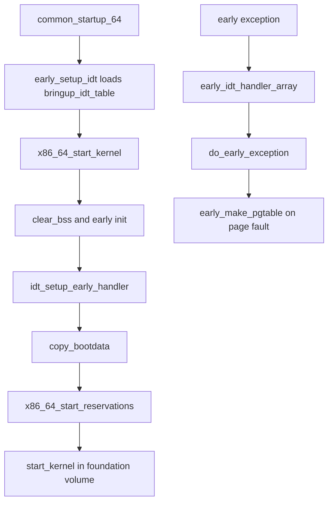

# 第6章 x86_64_start_kernel から start_kernel へ

> 本章で読むソース
>
> - [`arch/x86/boot/startup/gdt_idt.c` L12-L44](https://github.com/gregkh/linux/blob/v6.18.38/arch/x86/boot/startup/gdt_idt.c#L12-L44)
> - [`arch/x86/kernel/head64.c` L313-L323](https://github.com/gregkh/linux/blob/v6.18.38/arch/x86/kernel/head64.c#L313-L323)
> - [`arch/x86/kernel/head64.c` L222-L276](https://github.com/gregkh/linux/blob/v6.18.38/arch/x86/kernel/head64.c#L222-L276)
> - [`arch/x86/kernel/head64.c` L194-L219](https://github.com/gregkh/linux/blob/v6.18.38/arch/x86/kernel/head64.c#L194-L219)
> - [`arch/x86/kernel/idt.c` L320-L330](https://github.com/gregkh/linux/blob/v6.18.38/arch/x86/kernel/idt.c#L320-L330)
> - [`arch/x86/kernel/head_64.S` L488-L541](https://github.com/gregkh/linux/blob/v6.18.38/arch/x86/kernel/head_64.S#L488-L541)
> - [`arch/x86/kernel/head64.c` L159-L173](https://github.com/gregkh/linux/blob/v6.18.38/arch/x86/kernel/head64.c#L159-L173)
> - [`arch/x86/kernel/head64.c` L291-L310](https://github.com/gregkh/linux/blob/v6.18.38/arch/x86/kernel/head64.c#L291-L310)

## この章の狙い

**BSP** が `common_startup_64` を終えたあとに入るアーキ固有の main C 入口 `x86_64_start_kernel` が、早期状態の確定、早期 IDT の二段階設定、`start_kernel` への接続をどう行うかを追う。
`early_idt_handler_array` と `do_early_exception` が早期ページフォールトをどう扱うかも押さえる。

## 前提

[第5章](05-head-64-startup.md) で `common_startup_64` と `initial_code` による C 入口を読んでいること。
`start_kernel` 以降の汎用初期化と initcall は [foundation 分冊](../../foundation/README.md) が担当する。

## x86_64_start_kernel の位置づけ

`x86_64_start_kernel` は、BSP が共通初期化アセンブリ `common_startup_64` を終えたあとに入る **アーキ固有の main C 入口**である。
第5章のとおり、その手前で `startup_64` は `startup_64_setup_gdt_idt` や `__startup_64` を、`common_startup_64` は `early_setup_idt` をすでに呼んでいる。
したがって「アセンブリから最初に入る C 関数」とは書けない。

引数 `real_mode_data` は歴史的な名前であり、実際には前段が渡した `boot_params` の物理アドレスである。
64bit bootloader 経路では `boot_params` やコマンドラインが 4GiB より上にあってもよく、`copy_bootdata` は `__va` でカーネル仮想アドレスへ変換してから使う。
`%r15` から渡された値が `common_startup_64` 末尾の `movq %r15, %rdi` 経由で第一引数になる。

## 早期 IDT の第一段：bringup_idt_table

`common_startup_64` は C へ入る前に `early_setup_idt` を呼ぶ。
これは `startup_64_load_idt` を介して `bringup_idt_table` をロードする。
テーブルは基本的に空で、AMD メモリ暗号化有効時など必要な構成では **#VC** ハンドラだけが入る。

`gdt_idt.c` のコメントが示すとおり、bringup IDT は `idt_table` が使える状態になるまでのつなぎである。
`idt.c` のコードはトレースや KASAN で計測され得るため、TSS も未設定の極早期には使えない。

[`arch/x86/boot/startup/gdt_idt.c` L12-L44](https://github.com/gregkh/linux/blob/v6.18.38/arch/x86/boot/startup/gdt_idt.c#L12-L44)

```c
/*
 * Data structures and code used for IDT setup in head_64.S. The bringup-IDT is
 * used until the idt_table takes over. On the boot CPU this happens in
 * x86_64_start_kernel(), on secondary CPUs in start_secondary(). In both cases
 * this happens in the functions called from head_64.S.
 *
 * The idt_table can't be used that early because all the code modifying it is
 * in idt.c and can be instrumented by tracing or KASAN, which both don't work
 * during early CPU bringup. Also the idt_table has the runtime vectors
 * configured which require certain CPU state to be setup already (like TSS),
 * which also hasn't happened yet in early CPU bringup.
 */
static gate_desc bringup_idt_table[NUM_EXCEPTION_VECTORS] __page_aligned_data;

/* This may run while still in the direct mapping */
void startup_64_load_idt(void *vc_handler)
{
	struct desc_ptr desc = {
		.address = (unsigned long)rip_rel_ptr(bringup_idt_table),
		.size    = sizeof(bringup_idt_table) - 1,
	};
	struct idt_data data;
	gate_desc idt_desc;

	/* @vc_handler is set only for a VMM Communication Exception */
	if (vc_handler) {
		init_idt_data(&data, X86_TRAP_VC, vc_handler);
		idt_init_desc(&idt_desc, &data);
		native_write_idt_entry((gate_desc *)desc.address, X86_TRAP_VC, &idt_desc);
	}

	native_load_idt(&desc);
}
```

[`arch/x86/kernel/head64.c` L313-L323](https://github.com/gregkh/linux/blob/v6.18.38/arch/x86/kernel/head64.c#L313-L323)

```c
void early_setup_idt(void)
{
	void *handler = NULL;

	if (IS_ENABLED(CONFIG_AMD_MEM_ENCRYPT)) {
		setup_ghcb();
		handler = vc_boot_ghcb;
	}

	__pi_startup_64_load_idt(handler);
}
```

`early_setup_idt` が `early_idt_handler_array` を載せるわけではない。
bringup IDT から early handler IDT への **置換**は、次節の `x86_64_start_kernel` 側で行われる。

## bss クリアと boot params の取り込み

`x86_64_start_kernel` はまず `cr4_init_shadow` で CR4 の影を整え、identity-map trampoline 用の早期ページテーブルを `reset_early_page_tables` で片付ける。
5-level paging が有効なら `page_offset_base` などの定数もここで切り替える。

[`arch/x86/kernel/head64.c` L222-L276](https://github.com/gregkh/linux/blob/v6.18.38/arch/x86/kernel/head64.c#L222-L276)

```c
asmlinkage __visible void __init __noreturn x86_64_start_kernel(char * real_mode_data)
{
	/*
	 * Build-time sanity checks on the kernel image and module
	 * area mappings. (these are purely build-time and produce no code)
	 */
	BUILD_BUG_ON(MODULES_VADDR < __START_KERNEL_map);
	BUILD_BUG_ON(MODULES_VADDR - __START_KERNEL_map < KERNEL_IMAGE_SIZE);
	BUILD_BUG_ON(MODULES_LEN + KERNEL_IMAGE_SIZE > 2*PUD_SIZE);
	BUILD_BUG_ON((__START_KERNEL_map & ~PMD_MASK) != 0);
	BUILD_BUG_ON((MODULES_VADDR & ~PMD_MASK) != 0);
	BUILD_BUG_ON(!(MODULES_VADDR > __START_KERNEL));
	MAYBE_BUILD_BUG_ON(!(((MODULES_END - 1) & PGDIR_MASK) ==
				(__START_KERNEL & PGDIR_MASK)));
	BUILD_BUG_ON(__fix_to_virt(__end_of_fixed_addresses) <= MODULES_END);

	cr4_init_shadow();

	/* Kill off the identity-map trampoline */
	reset_early_page_tables();

	if (pgtable_l5_enabled()) {
		page_offset_base	= __PAGE_OFFSET_BASE_L5;
		vmalloc_base		= __VMALLOC_BASE_L5;
		vmemmap_base		= __VMEMMAP_BASE_L5;
	}

	clear_bss();

	/*
	 * This needs to happen *before* kasan_early_init() because latter maps stuff
	 * into that page.
	 */
	clear_page(init_top_pgt);

	/*
	 * SME support may update early_pmd_flags to include the memory
	 * encryption mask, so it needs to be called before anything
	 * that may generate a page fault.
	 */
	sme_early_init();

	kasan_early_init();

	/*
	 * Flush global TLB entries which could be left over from the trampoline page
	 * table.
	 *
	 * This needs to happen *after* kasan_early_init() as KASAN-enabled .configs
	 * instrument native_write_cr4() so KASAN must be initialized for that
	 * instrumentation to work.
	 */
	__native_tlb_flush_global(this_cpu_read(cpu_tlbstate.cr4));

	idt_setup_early_handler();
```

`clear_bss` のあと SME と KASAN の早期初期化を済ませ、グローバル TLB をフラッシュしてから第二段の IDT 設定へ進む。
`copy_bootdata` は `idt_setup_early_handler` の後に呼ばれ、real-mode 上の `boot_params` をカーネル側 `boot_params` へコピーする。

[`arch/x86/kernel/head64.c` L194-L219](https://github.com/gregkh/linux/blob/v6.18.38/arch/x86/kernel/head64.c#L194-L219)

```c
static void __init copy_bootdata(char *real_mode_data)
{
	char * command_line;
	unsigned long cmd_line_ptr;

	/*
	 * If SME is active, this will create decrypted mappings of the
	 * boot data in advance of the copy operations.
	 */
	sme_map_bootdata(real_mode_data);

	memcpy(&boot_params, real_mode_data, sizeof(boot_params));
	sanitize_boot_params(&boot_params);
	cmd_line_ptr = get_cmd_line_ptr();
	if (cmd_line_ptr) {
		command_line = __va(cmd_line_ptr);
		memcpy(boot_command_line, command_line, COMMAND_LINE_SIZE);
	}

	/*
	 * The old boot data is no longer needed and won't be reserved,
	 * freeing up that memory for use by the system. If SME is active,
	 * we need to remove the mappings that were created so that the
	 * memory doesn't remain mapped as decrypted.
	 */
	sme_unmap_bootdata(real_mode_data);
}
```

## 早期 IDT の第二段：early_idt_handler_array

`idt_setup_early_handler` は `idt_table` の各例外ベクタに `early_idt_handler_array` の stub を設定し、IDT をロードする。
これで bringup IDT から early handler へ置き換わる。

[`arch/x86/kernel/idt.c` L320-L330](https://github.com/gregkh/linux/blob/v6.18.38/arch/x86/kernel/idt.c#L320-L330)

```c
void __init idt_setup_early_handler(void)
{
	int i;

	for (i = 0; i < NUM_EXCEPTION_VECTORS; i++)
		set_intr_gate(i, early_idt_handler_array[i]);
#ifdef CONFIG_X86_32
	for ( ; i < NR_VECTORS; i++)
		set_intr_gate(i, early_ignore_irq);
#endif
	load_idt(&idt_descr);
```

`early_idt_handler_array` はベクタごとの stub を機械生成する。
error code を付けない例外にはダミーの error code を積み、ベクタ番号と汎用レジスタを `pt_regs` 形に整えて `do_early_exception` へ渡す。

[`arch/x86/kernel/head_64.S` L488-L541](https://github.com/gregkh/linux/blob/v6.18.38/arch/x86/kernel/head_64.S#L488-L541)

```asm
SYM_CODE_START(early_idt_handler_array)
	i = 0
	.rept NUM_EXCEPTION_VECTORS
	.if ((EXCEPTION_ERRCODE_MASK >> i) & 1) == 0
		UNWIND_HINT_IRET_REGS
		ENDBR
		pushq $0	# Dummy error code, to make stack frame uniform
	.else
		UNWIND_HINT_IRET_REGS offset=8
		ENDBR
	.endif
	pushq $i		# 72(%rsp) Vector number
	jmp early_idt_handler_common
	UNWIND_HINT_IRET_REGS
	i = i + 1
	.fill early_idt_handler_array + i*EARLY_IDT_HANDLER_SIZE - ., 1, 0xcc
	.endr
SYM_CODE_END(early_idt_handler_array)
	ANNOTATE_NOENDBR // early_idt_handler_array[NUM_EXCEPTION_VECTORS]

SYM_CODE_START_LOCAL(early_idt_handler_common)
	UNWIND_HINT_IRET_REGS offset=16
	/*
	 * The stack is the hardware frame, an error code or zero, and the
	 * vector number.
	 */
	cld

	incl early_recursion_flag(%rip)

	/* The vector number is currently in the pt_regs->di slot. */
	pushq %rsi				/* pt_regs->si */
	movq 8(%rsp), %rsi			/* RSI = vector number */
	movq %rdi, 8(%rsp)			/* pt_regs->di = RDI */
	pushq %rdx				/* pt_regs->dx */
	pushq %rcx				/* pt_regs->cx */
	pushq %rax				/* pt_regs->ax */
	pushq %r8				/* pt_regs->r8 */
	pushq %r9				/* pt_regs->r9 */
	pushq %r10				/* pt_regs->r10 */
	pushq %r11				/* pt_regs->r11 */
	pushq %rbx				/* pt_regs->bx */
	pushq %rbp				/* pt_regs->bp */
	pushq %r12				/* pt_regs->r12 */
	pushq %r13				/* pt_regs->r13 */
	pushq %r14				/* pt_regs->r14 */
	pushq %r15				/* pt_regs->r15 */
	UNWIND_HINT_REGS

	movq %rsp,%rdi		/* RDI = pt_regs; RSI is already trapnr */
	call do_early_exception

	decl early_recursion_flag(%rip)
	jmp restore_regs_and_return_to_kernel
```

## do_early_exception と早期ページフォールト

`do_early_exception` は早期ページフォールトなら `early_make_pgtable` でページテーブルを増設し復帰できる。
本格的な mm 初期化前でも、必要な mapping を **demand mapping** で遅延生成する。
それ以外は #VC、#VE、`early_fixup_exception` へ分岐する。

[`arch/x86/kernel/head64.c` L159-L173](https://github.com/gregkh/linux/blob/v6.18.38/arch/x86/kernel/head64.c#L159-L173)

```c
void __init do_early_exception(struct pt_regs *regs, int trapnr)
{
	if (trapnr == X86_TRAP_PF &&
	    early_make_pgtable(native_read_cr2()))
		return;

	if (IS_ENABLED(CONFIG_AMD_MEM_ENCRYPT) &&
	    trapnr == X86_TRAP_VC && handle_vc_boot_ghcb(regs))
		return;

	if (trapnr == X86_TRAP_VE && tdx_early_handle_ve(regs))
		return;

	early_fixup_exception(regs, trapnr);
}
```

## x86_64_start_reservations から start_kernel へ

マイクロコードの早期ロードと `init_top_pgt` への高位写像の引き継ぎを済ませたあと、`x86_64_start_reservations` へ制御を渡す。
ここでプラットフォームの早期 quirk を処理し、最終的に汎用の `start_kernel` を呼ぶ。
`start_kernel` 内部のスケジューラ初期化や initcall 連鎖は foundation 分冊へ委譲する。

[`arch/x86/kernel/head64.c` L291-L310](https://github.com/gregkh/linux/blob/v6.18.38/arch/x86/kernel/head64.c#L291-L310)

```c
	x86_64_start_reservations(real_mode_data);
}

void __init __noreturn x86_64_start_reservations(char *real_mode_data)
{
	/* version is always not zero if it is copied */
	if (!boot_params.hdr.version)
		copy_bootdata(__va(real_mode_data));

	x86_early_init_platform_quirks();

	switch (boot_params.hdr.hardware_subarch) {
	case X86_SUBARCH_INTEL_MID:
		x86_intel_mid_early_setup();
		break;
	default:
		break;
	}

	start_kernel();
}
```

## 処理フロー



## 高速化と最適化の工夫

早期 IDT を bringup（ほぼ空、#VC のみ）から early handler へ二段階で置き換える。
ページテーブルや GDT がまだ限定的な段階でも #VC など必須例外を先に扱い、その後に一般例外の診断とページフォールトの demand mapping を有効にできる。

`do_early_exception` が早期ページフォールトを `early_make_pgtable` で復帰させることで、固定の巨大早期マップを事前に張らず、fault アドレスを含む範囲に必要な上位テーブルと `__PAGE_KERNEL_LARGE` の PMD large mapping を遅延追加できる。
`early_dynamic_pgts` の枯渇時は `reset_early_page_tables` でやり直すが、通常のブート経路では必要最小限のテーブル消費に抑える。

## まとめ

- `x86_64_start_kernel` は BSP が `common_startup_64` を終えたあとのアーキ固有 main C 入口である。
- 早期 IDT は `early_setup_idt` の bringup IDT と、`idt_setup_early_handler` による early handler 置換の二段階である。
- `early_idt_handler_array` は `do_early_exception` へ渡し、早期ページフォールトは demand mapping で復帰し得る。
- `x86_64_start_reservations` を経て `start_kernel` へ接続し、以降は foundation 分冊が担当する。

## 関連する章

- [head_64.S の startup_64](05-head-64-startup.md)
- [GDT、TSS、cpu_entry_area](../part00-foundation/02-gdt-tss-cpu-entry-area.md)
- [foundation 分冊の start_kernel と initcall](../../foundation/README.md)
