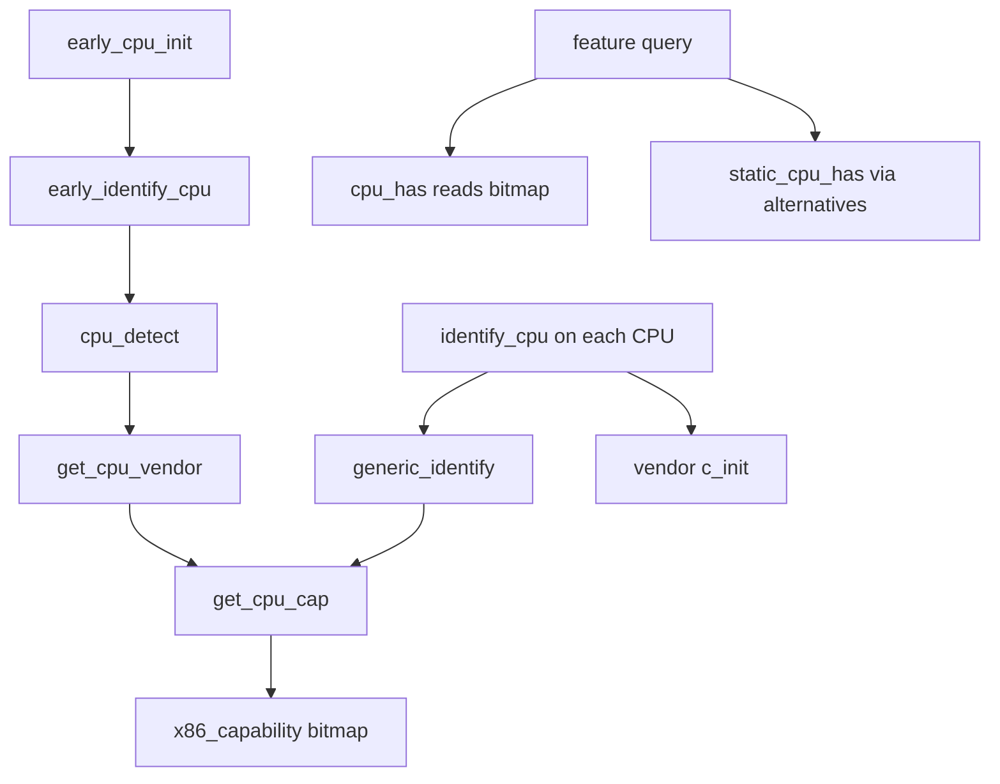

# 第7章 CPU 識別と機能フラグ

> 本章で読むソース
>
> - [`arch/x86/include/asm/processor.h` L124-L164](https://github.com/gregkh/linux/blob/v6.18.38/arch/x86/include/asm/processor.h#L124-L164)
> - [`arch/x86/include/asm/cpufeatures.h` L20-L27](https://github.com/gregkh/linux/blob/v6.18.38/arch/x86/include/asm/cpufeatures.h#L20-L27)
> - [`arch/x86/kernel/cpu/common.c` L901-L923](https://github.com/gregkh/linux/blob/v6.18.38/arch/x86/kernel/cpu/common.c#L901-L923)
> - [`arch/x86/kernel/cpu/common.c` L977-L1005](https://github.com/gregkh/linux/blob/v6.18.38/arch/x86/kernel/cpu/common.c#L977-L1005)
> - [`arch/x86/kernel/cpu/common.c` L1759-L1764](https://github.com/gregkh/linux/blob/v6.18.38/arch/x86/kernel/cpu/common.c#L1759-L1764)
> - [`arch/x86/kernel/cpu/common.c` L1833-L1854](https://github.com/gregkh/linux/blob/v6.18.38/arch/x86/kernel/cpu/common.c#L1833-L1854)
> - [`arch/x86/kernel/cpu/common.c` L1984-L2011](https://github.com/gregkh/linux/blob/v6.18.38/arch/x86/kernel/cpu/common.c#L1984-L2011)
> - [`arch/x86/include/asm/cpufeature.h` L51-L74](https://github.com/gregkh/linux/blob/v6.18.38/arch/x86/include/asm/cpufeature.h#L51-L74)
> - [`arch/x86/include/asm/cpufeature.h` L99-L123](https://github.com/gregkh/linux/blob/v6.18.38/arch/x86/include/asm/cpufeature.h#L99-L123)

## この章の狙い

x86 が **CPUID** で報告する vendor、family、model と機能ビットを、カーネルがどう検出して `cpuinfo_x86` に整理し、`x86_capability[]` 経由で照会するかを追う。
`cpu_has` と `static_cpu_has` の違い、後者が alternatives で定数分岐へ変わる点を押さえる。

## 前提

[第6章](../part01-boot/06-x86-64-start-kernel.md) で BSP の早期 C 初期化まで読んでいること。
alternatives によるパッチ機構の詳細は [第10章](10-alternatives-static-call.md) が担当する。

## CPUID と cpuinfo_x86

x86 CPU は **CPUID** 命令で自身の識別情報と機能を返す。
カーネルは結果を `struct cpuinfo_x86` に格納し、以降の初期化と hot path の分岐がこの構造体を参照する。

[`arch/x86/include/asm/processor.h` L124-L164](https://github.com/gregkh/linux/blob/v6.18.38/arch/x86/include/asm/processor.h#L124-L164)

```c
struct cpuinfo_x86 {
	union {
		/*
		 * The particular ordering (low-to-high) of (vendor,
		 * family, model) is done in case range of models, like
		 * it is usually done on AMD, need to be compared.
		 */
		struct {
			__u8	x86_model;
			/* CPU family */
			__u8	x86;
			/* CPU vendor */
			__u8	x86_vendor;
			__u8	x86_reserved;
		};
		/* combined vendor, family, model */
		__u32		x86_vfm;
	};
	__u8			x86_stepping;
#ifdef CONFIG_X86_64
	/* Number of 4K pages in DTLB/ITLB combined(in pages): */
	int			x86_tlbsize;
#endif
#ifdef CONFIG_X86_VMX_FEATURE_NAMES
	__u32			vmx_capability[NVMXINTS];
#endif
	__u8			x86_virt_bits;
	__u8			x86_phys_bits;
	/* Max extended CPUID function supported: */
	__u32			extended_cpuid_level;
	/* Maximum supported CPUID level, -1=no CPUID: */
	int			cpuid_level;
	/*
	 * Align to size of unsigned long because the x86_capability array
	 * is passed to bitops which require the alignment. Use unnamed
	 * union to enforce the array is aligned to size of unsigned long.
	 */
	union {
		__u32		x86_capability[NCAPINTS + NBUGINTS];
		unsigned long	x86_capability_alignment;
	};
```

`x86_vendor_id` や `x86_model_id` などの文字列フィールドは続くが、機能照会の中心は `x86_capability[]` である。

## X86_FEATURE の符号化

各機能は `X86_FEATURE_*` マクロで **ワード番号とビット位置** に符号化される。
`(word*32 + bit)` の形で `x86_capability[]` のインデックスとビットに対応する。

[`arch/x86/include/asm/cpufeatures.h` L20-L27](https://github.com/gregkh/linux/blob/v6.18.38/arch/x86/include/asm/cpufeatures.h#L20-L27)

```c
/* Intel-defined CPU features, CPUID level 0x00000001 (EDX), word 0 */
#define X86_FEATURE_FPU			( 0*32+ 0) /* "fpu" Onboard FPU */
#define X86_FEATURE_VME			( 0*32+ 1) /* "vme" Virtual Mode Extensions */
#define X86_FEATURE_DE			( 0*32+ 2) /* "de" Debugging Extensions */
#define X86_FEATURE_PSE			( 0*32+ 3) /* "pse" Page Size Extensions */
#define X86_FEATURE_TSC			( 0*32+ 4) /* "tsc" Time Stamp Counter */
#define X86_FEATURE_MSR			( 0*32+ 5) /* "msr" Model-Specific Registers */
#define X86_FEATURE_PAE			( 0*32+ 6) /* "pae" Physical Address Extensions */
```

例として `X86_FEATURE_FSGSBASE` は `(9*32+0)`、`X86_FEATURE_LA57` は `(16*32+16)` に割り当てられ、後続章の前提チェックに使われる。

## early_cpu_init と early_identify_cpu

`early_cpu_init` はブート初期に CPU ベンダテーブルを整え、`early_identify_cpu` で BSP の `boot_cpu_data` を確定する。

[`arch/x86/kernel/cpu/common.c` L1833-L1854](https://github.com/gregkh/linux/blob/v6.18.38/arch/x86/kernel/cpu/common.c#L1833-L1854)

```c
void __init early_cpu_init(void)
{
#ifdef CONFIG_PROCESSOR_SELECT
	unsigned int i, j;

	pr_info("KERNEL supported cpus:\n");
#endif

	init_cpu_devs();

#ifdef CONFIG_PROCESSOR_SELECT
	for (i = 0; i < X86_VENDOR_NUM && cpu_devs[i]; i++) {
		for (j = 0; j < 2; j++) {
			if (!cpu_devs[i]->c_ident[j])
				continue;
			pr_info("  %s %s\n", cpu_devs[i]->c_vendor,
				cpu_devs[i]->c_ident[j]);
		}
	}
#endif

	early_identify_cpu(&boot_cpu_data);
}
```

`early_identify_cpu` 内では `cpu_detect` で vendor 文字列と family、model を読み、`get_cpu_vendor` でベンダハンドラを選び、`get_cpu_cap` で機能ビットを `x86_capability[]` へ格納する。

[`arch/x86/kernel/cpu/common.c` L1759-L1764](https://github.com/gregkh/linux/blob/v6.18.38/arch/x86/kernel/cpu/common.c#L1759-L1764)

```c
	if (cpuid_feature()) {
		cpu_detect(c);
		get_cpu_vendor(c);
		intel_unlock_cpuid_leafs(c);
		get_cpu_cap(c);
		setup_force_cpu_cap(X86_FEATURE_CPUID);
```

## cpu_detect と get_cpu_cap

`cpu_detect` は leaf 0 で最大 leaf と vendor 文字列を取得し、leaf 1 から family、model、stepping を分解する。

[`arch/x86/kernel/cpu/common.c` L901-L923](https://github.com/gregkh/linux/blob/v6.18.38/arch/x86/kernel/cpu/common.c#L901-L923)

```c
void cpu_detect(struct cpuinfo_x86 *c)
{
	/* Get vendor name */
	cpuid(0x00000000, (unsigned int *)&c->cpuid_level,
	      (unsigned int *)&c->x86_vendor_id[0],
	      (unsigned int *)&c->x86_vendor_id[8],
	      (unsigned int *)&c->x86_vendor_id[4]);

	c->x86 = 4;
	/* Intel-defined flags: level 0x00000001 */
	if (c->cpuid_level >= 0x00000001) {
		u32 junk, tfms, cap0, misc;

		cpuid(0x00000001, &tfms, &misc, &junk, &cap0);
		c->x86		= x86_family(tfms);
		c->x86_model	= x86_model(tfms);
		c->x86_stepping	= x86_stepping(tfms);

		if (cap0 & (1<<19)) {
			c->x86_clflush_size = ((misc >> 8) & 0xff) * 8;
			c->x86_cache_alignment = c->x86_clflush_size;
		}
	}
}
```

`get_cpu_cap` は複数の CPUID leaf を順に読み、各レジスタ値を `x86_capability[CPUID_*]` スロットへ書き込む。
結果は `init_scattered_cpuid_features` や `apply_forced_caps` で補正され、カーネル起動パラメータによる強制 on/off も反映される。

[`arch/x86/kernel/cpu/common.c` L977-L1005](https://github.com/gregkh/linux/blob/v6.18.38/arch/x86/kernel/cpu/common.c#L977-L1005)

```c
void get_cpu_cap(struct cpuinfo_x86 *c)
{
	u32 eax, ebx, ecx, edx;

	/* Intel-defined flags: level 0x00000001 */
	if (c->cpuid_level >= 0x00000001) {
		cpuid(0x00000001, &eax, &ebx, &ecx, &edx);

		c->x86_capability[CPUID_1_ECX] = ecx;
		c->x86_capability[CPUID_1_EDX] = edx;
	}

	/* Thermal and Power Management Leaf: level 0x00000006 (eax) */
	if (c->cpuid_level >= 0x00000006)
		c->x86_capability[CPUID_6_EAX] = cpuid_eax(0x00000006);

	/* Additional Intel-defined flags: level 0x00000007 */
	if (c->cpuid_level >= 0x00000007) {
		cpuid_count(0x00000007, 0, &eax, &ebx, &ecx, &edx);
		c->x86_capability[CPUID_7_0_EBX] = ebx;
		c->x86_capability[CPUID_7_ECX] = ecx;
		c->x86_capability[CPUID_7_EDX] = edx;

		/* Check valid sub-leaf index before accessing it */
		if (eax >= 1) {
			cpuid_count(0x00000007, 1, &eax, &ebx, &ecx, &edx);
			c->x86_capability[CPUID_7_1_EAX] = eax;
		}
	}
```

## identify_cpu とベンダ固有初期化

本格的な CPU 初期化では `identify_cpu` が `generic_identify` を呼び、そこでも `get_cpu_cap` が実行される。
その後 `this_cpu->c_identify` と `this_cpu->c_init` でベンダ固有の補正が入り、CPUID が誤るフラグや CPUID に載らない機能が正規化される。

[`arch/x86/kernel/cpu/common.c` L1984-L2011](https://github.com/gregkh/linux/blob/v6.18.38/arch/x86/kernel/cpu/common.c#L1984-L2011)

```c
	generic_identify(c);

	cpu_parse_topology(c);

	if (this_cpu->c_identify)
		this_cpu->c_identify(c);

	/* Clear/Set all flags overridden by options, after probe */
	apply_forced_caps(c);

	/*
	 * Set default APIC and TSC_DEADLINE MSR fencing flag. AMD and
	 * Hygon will clear it in ->c_init() below.
	 */
	set_cpu_cap(c, X86_FEATURE_APIC_MSRS_FENCE);

	/*
	 * Vendor-specific initialization.  In this section we
	 * canonicalize the feature flags, meaning if there are
	 * features a certain CPU supports which CPUID doesn't
	 * tell us, CPUID claiming incorrect flags, or other bugs,
	 * we handle them here.
	 *
	 * At the end of this section, c->x86_capability better
	 * indicate the features this CPU genuinely supports!
	 */
	if (this_cpu->c_init)
		this_cpu->c_init(c);
```

SMP では各 AP の `identify_cpu` 完了後、共通機能だけが `boot_cpu_data.x86_capability` に AND され、全 CPU で使える機能集合が確定する。

## 機能フラグの照会

照会は `test_cpu_cap` が `x86_capability[]` のビットを試す基本形である。
`cpu_has` は通常 `test_cpu_cap` による実行時のビットマップ検査だが、bit がコンパイル時定数で `REQUIRED_MASK_BIT_SET` が真なら `x86_capability` を読まず 1 へ畳まれる。
`boot_cpu_has` は BSP の `boot_cpu_data` 向けラッパーである。

[`arch/x86/include/asm/cpufeature.h` L51-L74](https://github.com/gregkh/linux/blob/v6.18.38/arch/x86/include/asm/cpufeature.h#L51-L74)

```c
#define test_cpu_cap(c, bit)						\
	 arch_test_bit(bit, (unsigned long *)((c)->x86_capability))

#define cpu_has(c, bit)							\
	(__builtin_constant_p(bit) && REQUIRED_MASK_BIT_SET(bit) ? 1 :	\
	 test_cpu_cap(c, bit))

#define this_cpu_has(bit)						\
	(__builtin_constant_p(bit) && REQUIRED_MASK_BIT_SET(bit) ? 1 :	\
	 x86_this_cpu_test_bit(bit, cpu_info.x86_capability))

/*
 * This is the default CPU features testing macro to use in code.
 *
 * It is for detection of features which need kernel infrastructure to be
 * used.  It may *not* directly test the CPU itself.  Use the cpu_has() family
 * if you want true runtime testing of CPU features, like in hypervisor code
 * where you are supporting a possible guest feature where host support for it
 * is not relevant.
 */
#define cpu_feature_enabled(bit)	\
	(__builtin_constant_p(bit) && DISABLED_MASK_BIT_SET(bit) ? 0 : static_cpu_has(bit))

#define boot_cpu_has(bit)	cpu_has(&boot_cpu_data, bit)
```

`static_cpu_has` はコンパイル時定数なら `boot_cpu_has` を畳み、そうでなければ `_static_cpu_has` のインラインアセンブリへ入る。
`_static_cpu_has` は **alternatives** の `ALTERNATIVE_TERNARY` で分岐をパッチする。
適用前は `.altinstr_aux` の `testb` が `boot_cpu_data.x86_capability` を実行時に検査する fallback を通るが、適用後は feature 有効なら空命令列で `t_yes` へ fall through し、無効なら `t_no` への無条件 jump に置換され、hot path から `testb` が消えて定数分岐になる。

[`arch/x86/include/asm/cpufeature.h` L99-L123](https://github.com/gregkh/linux/blob/v6.18.38/arch/x86/include/asm/cpufeature.h#L99-L123)

```c
static __always_inline bool _static_cpu_has(u16 bit)
{
	asm goto(ALTERNATIVE_TERNARY("jmp 6f", %c[feature], "", "jmp %l[t_no]")
		".pushsection .altinstr_aux,\"ax\"\n"
		"6:\n"
		" testb %[bitnum], %a[cap_byte]\n"
		" jnz %l[t_yes]\n"
		" jmp %l[t_no]\n"
		".popsection\n"
		 : : [feature]  "i" (bit),
		     [bitnum]   "i" (1 << (bit & 7)),
		     [cap_byte] "i" (&((const char *)boot_cpu_data.x86_capability)[bit >> 3])
		 : : t_yes, t_no);
t_yes:
	return true;
t_no:
	return false;
}

#define static_cpu_has(bit)					\
(								\
	__builtin_constant_p(boot_cpu_has(bit)) ?		\
		boot_cpu_has(bit) :				\
		_static_cpu_has(bit)				\
)
```

`cpu_feature_enabled` はカーネルインフラ込みの既定照会マクロで、頻出経路では `static_cpu_has` 経由の定数分岐が選ばれる。

## 処理フロー



## 高速化と最適化の工夫

CPUID の結果を一度 `x86_capability[]` にキャッシュすれば、以降の機能照会はビットテストだけで済む。
`get_cpu_cap` は起動時と CPU 再検出時にだけ CPUID を叩き、hot path ではメモリ上のビットマップを読む。

`static_cpu_has` は alternatives により機能チェックをビルド後に定数分岐へパッチする。
パッチ後の `_static_cpu_has` は `testb` 1回と条件ジャンプだけになり、cpuid 命令や多段のマクロ展開を頻出経路から排除できる。

## まとめ

- x86 は CPUID で vendor、family、model、機能を報告し、カーネルは `cpuinfo_x86` と `x86_capability[]` に整理する。
- `early_cpu_init` と `identify_cpu` が `get_cpu_cap` を通じてビットマップを構築し、ベンダ固有コードが結果を正規化する。
- `cpu_has` と `boot_cpu_has` はビットマップ参照、`static_cpu_has` は alternatives で定数分岐へ変わる。
- 検出結果は FSGSBASE、XSAVE、PCID、x2APIC、LA57 など後続章の前提判定に使われる。

## 関連する章

- [x86_64_start_kernel から start_kernel へ](../part01-boot/06-x86-64-start-kernel.md)
- [per-CPU 領域と GS base](08-percpu-gs-base.md)
- [alternatives と static_call と text_poke](10-alternatives-static-call.md)
