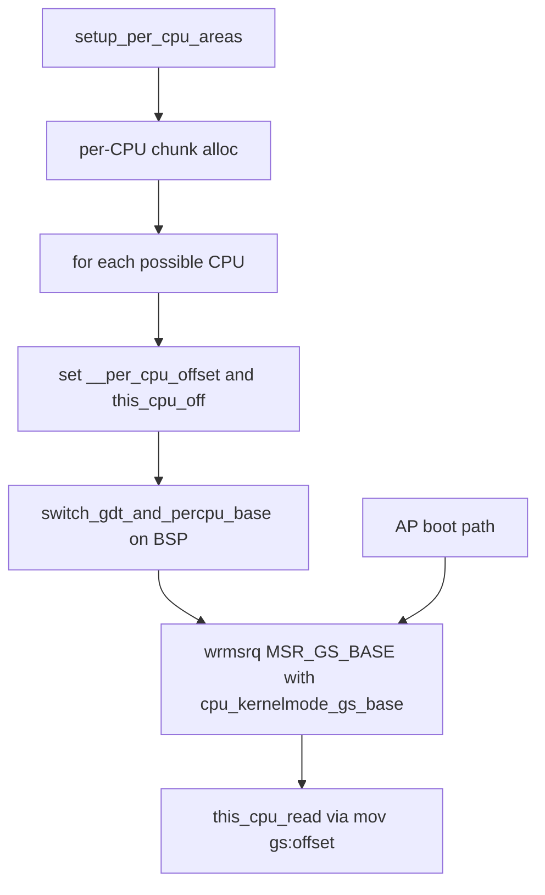

# 第8章 per-CPU 領域と GS base

> 本章で読むソース
>
> - [`arch/x86/kernel/setup_percpu.c` L29-L33](https://github.com/gregkh/linux/blob/v6.18.38/arch/x86/kernel/setup_percpu.c#L29-L33)
> - [`arch/x86/kernel/setup_percpu.c` L162-L201](https://github.com/gregkh/linux/blob/v6.18.38/arch/x86/kernel/setup_percpu.c#L162-L201)
> - [`arch/x86/include/asm/percpu.h` L5-L11](https://github.com/gregkh/linux/blob/v6.18.38/arch/x86/include/asm/percpu.h#L5-L11)
> - [`arch/x86/include/asm/percpu.h` L55](https://github.com/gregkh/linux/blob/v6.18.38/arch/x86/include/asm/percpu.h#L55)
> - [`arch/x86/include/asm/percpu.h` L151-L161](https://github.com/gregkh/linux/blob/v6.18.38/arch/x86/include/asm/percpu.h#L151-L161)
> - [`arch/x86/include/asm/processor.h` L431-L438](https://github.com/gregkh/linux/blob/v6.18.38/arch/x86/include/asm/processor.h#L431-L438)
> - [`arch/x86/kernel/cpu/common.c` L751-L770](https://github.com/gregkh/linux/blob/v6.18.38/arch/x86/kernel/cpu/common.c#L751-L770)

## この章の狙い

x86-64 で **per-CPU 変数**が `%gs` 相対アドレッシングで実装される仕組みを追う。
`setup_per_cpu_areas` が各 CPU 分の領域を確保し、`__per_cpu_offset` と `this_cpu_off` を経て **GS base** に載せる流れを押さえる。

## 前提

[第7章](07-cpu-identification-features.md) で CPU 識別と機能フラグを読んでいること。
`MSR_GS_BASE` と `swapgs` の概要は [第1章](../part00-foundation/01-overview-execution-environment.md) を参照する。
AP 起動の全体像は [第29章](../part08-smp-mitigations/29-smp-boot.md)、`cpu_init` における記述子ロードは [第9章](09-cpu-init-cr-msr.md) へ委譲する。

## per-CPU 変数と %gs 相対アドレス

x86-64 では per-CPU セグメントとして **`%gs`** が使われる。
アセンブリでは `PER_CPU_VAR` が `gs:offset` 形式になり、C では `this_cpu_read` などが `mov` と `%gs` オペランドへ展開される。

[`arch/x86/include/asm/percpu.h` L5-L11](https://github.com/gregkh/linux/blob/v6.18.38/arch/x86/include/asm/percpu.h#L5-L11)

```c
#ifdef CONFIG_X86_64
# define __percpu_seg		gs
# define __percpu_rel		(%rip)
#else
# define __percpu_seg		fs
# define __percpu_rel
#endif
```

`__my_cpu_offset` は `this_cpu_read(this_cpu_off)` で現在 CPU のオフセットを読む。
汎用の「ベース + インデックス × サイズ」より命令数が少ない。

[`arch/x86/include/asm/percpu.h` L55](https://github.com/gregkh/linux/blob/v6.18.38/arch/x86/include/asm/percpu.h#L55)

```c
#define __my_cpu_offset		this_cpu_read(this_cpu_off)
```

インラインアセンブリ経路では `__raw_cpu_read` が `mov` と `__percpu_arg`（`%gs:var`）を生成する。

[`arch/x86/include/asm/percpu.h` L151-L161](https://github.com/gregkh/linux/blob/v6.18.38/arch/x86/include/asm/percpu.h#L151-L161)

```c
#define __raw_cpu_read(size, qual, _var)				\
({									\
	__pcpu_type_##size pfo_val__;					\
									\
	asm qual (__pcpu_op_##size("mov")				\
		  __percpu_arg([var]) ", %[val]"			\
	    : [val] __pcpu_reg_##size("=", pfo_val__)			\
	    : [var] "m" (__my_cpu_var(_var)));				\
									\
	(typeof(_var))(unsigned long) pfo_val__;			\
})
```

## this_cpu_off と __per_cpu_offset

`this_cpu_off` は各 CPU の per-CPU 領域ベースへのオフセットを保持する per-CPU 変数である。
`__per_cpu_offset[]` は CPU 番号から同じオフセットを引く配列で、他 CPU の領域へアクセスするときに使う。

[`arch/x86/kernel/setup_percpu.c` L29-L33](https://github.com/gregkh/linux/blob/v6.18.38/arch/x86/kernel/setup_percpu.c#L29-L33)

```c
DEFINE_PER_CPU_CACHE_HOT(unsigned long, this_cpu_off);
EXPORT_PER_CPU_SYMBOL(this_cpu_off);

unsigned long __per_cpu_offset[NR_CPUS] __ro_after_init;
EXPORT_SYMBOL(__per_cpu_offset);
```

リンク時の per-CPU シンボルは全 CPU で同じオフセットを共有する。
実行時に CPU ごとに実体のアドレスがずれる分を `__per_cpu_offset[cpu]` で表し、`this_cpu_off` は現在 CPU 用のコピーである。

## setup_per_cpu_areas

`setup_per_cpu_areas` は per-CPU チャンクを確保し、各 CPU のオフセットを計算する。
ループ内で `per_cpu_offset(cpu)` と `per_cpu(this_cpu_off, cpu)` を揃え、BSP だけ `switch_gdt_and_percpu_base` でランタイム GDT と GS base へ切り替える。

[`arch/x86/kernel/setup_percpu.c` L162-L201](https://github.com/gregkh/linux/blob/v6.18.38/arch/x86/kernel/setup_percpu.c#L162-L201)

```c
	/* alrighty, percpu areas up and running */
	delta = (unsigned long)pcpu_base_addr - (unsigned long)__per_cpu_start;
	for_each_possible_cpu(cpu) {
		per_cpu_offset(cpu) = delta + pcpu_unit_offsets[cpu];
		per_cpu(this_cpu_off, cpu) = per_cpu_offset(cpu);
		per_cpu(cpu_number, cpu) = cpu;
		setup_percpu_segment(cpu);
		/*
		 * Copy data used in early init routines from the
		 * initial arrays to the per cpu data areas.  These
		 * arrays then become expendable and the *_early_ptr's
		 * are zeroed indicating that the static arrays are
		 * gone.
		 */
#ifdef CONFIG_X86_LOCAL_APIC
		per_cpu(x86_cpu_to_apicid, cpu) =
			early_per_cpu_map(x86_cpu_to_apicid, cpu);
		per_cpu(x86_cpu_to_acpiid, cpu) =
			early_per_cpu_map(x86_cpu_to_acpiid, cpu);
#endif
#ifdef CONFIG_NUMA
		per_cpu(x86_cpu_to_node_map, cpu) =
			early_per_cpu_map(x86_cpu_to_node_map, cpu);
		/*
		 * Ensure that the boot cpu numa_node is correct when the boot
		 * cpu is on a node that doesn't have memory installed.
		 * Also cpu_up() will call cpu_to_node() for APs when
		 * MEMORY_HOTPLUG is defined, before per_cpu(numa_node) is set
		 * up later with c_init aka intel_init/amd_init.
		 * So set them all (boot cpu and all APs).
		 */
		set_cpu_numa_node(cpu, early_cpu_to_node(cpu));
#endif
		/*
		 * Up to this point, the boot CPU has been using .init.data
		 * area.  Reload any changed state for the boot CPU.
		 */
		if (!cpu)
			switch_gdt_and_percpu_base(cpu);
	}
```

関数冒頭のチャンク確保は `pcpu_embed_first_chunk` または `pcpu_page_first_chunk` を呼び、失敗時は `panic` する。

## GS base への this_cpu_off 設定

x86-64 ではカーネルモードの GS base に `per_cpu_offset(cpu)` が入る。
`cpu_kernelmode_gs_base` は SMP 時に `per_cpu_offset(cpu)` を返し、UP では 0 を返す。

[`arch/x86/include/asm/processor.h` L431-L438](https://github.com/gregkh/linux/blob/v6.18.38/arch/x86/include/asm/processor.h#L431-L438)

```c
static inline unsigned long cpu_kernelmode_gs_base(int cpu)
{
#ifdef CONFIG_SMP
	return per_cpu_offset(cpu);
#else
	return 0;
#endif
}
```

`switch_gdt_and_percpu_base` がランタイム GDT を載せたあと、`wrmsrq(MSR_GS_BASE, ...)` で GS base を更新する。
コメントが示すとおり、wrmsrq 完了までは早期マッピング上の GS base が有効なまま残る。

[`arch/x86/kernel/cpu/common.c` L751-L770](https://github.com/gregkh/linux/blob/v6.18.38/arch/x86/kernel/cpu/common.c#L751-L770)

```c
void __init switch_gdt_and_percpu_base(int cpu)
{
	load_direct_gdt(cpu);

#ifdef CONFIG_X86_64
	/*
	 * No need to load %gs. It is already correct.
	 *
	 * Writing %gs on 64bit would zero GSBASE which would make any per
	 * CPU operation up to the point of the wrmsrq() fault.
	 *
	 * Set GSBASE to the new offset. Until the wrmsrq() happens the
	 * early mapping is still valid. That means the GSBASE update will
	 * lose any prior per CPU data which was not copied over in
	 * setup_per_cpu_areas().
	 *
	 * This works even with stackprotector enabled because the
	 * per CPU stack canary is 0 in both per CPU areas.
	 */
	wrmsrq(MSR_GS_BASE, cpu_kernelmode_gs_base(cpu));
```

ブート極早期の `head_64.S` でも `MSR_GS_BASE` へ書き込むが、そこでは per-CPU 領域確保前の暫定値である。
本章が扱うのは `setup_per_cpu_areas` 完了後のランタイム GS base である。

## BSP と AP

BSP は `setup_per_cpu_areas` のループで `switch_gdt_and_percpu_base(0)` が呼ばれ、上記 `wrmsrq` で GS base が確定する。
AP は起動経路の別段階で同関数が呼ばれ、自 CPU の `per_cpu_offset` が GS base へ載る（詳細は第29章）。
いずれも `this_cpu_off` と GS base の値は一致し、`this_cpu_*` アクセスはその CPU の per-CPU 領域へ着地する。

## SWAPGS とカーネル入口

第1章で述べたとおり、`MSR_GS_BASE` と `MSR_KERNEL_GS_BASE` は `swapgs` で入れ替わる。
ユーザー実行中は per-CPU 用ではない GS base が載り、カーネル入口の `swapgs` でカーネル用 GS base に切り替わる。
システムコールや割り込み入口では、この切替の直後に per-CPU スタックや `cpu_info` へ `%gs` 相対で到達できる。

## 処理フロー



## 高速化と最適化の工夫

per-CPU アクセスを GS base と定数オフセットの1命令で解決できる。
CPU 番号での配列インデックス計算やロックなしに、現在 CPU のデータへ到達する。

全 CPU がリンク時の同じシンボルオフセットを共有し、GS base の差し替えだけで別 CPU の領域へ切り替えられる。
`__per_cpu_offset[cpu]` は他 CPU 用ポインタ計算に使い、`this_cpu_off` は現在 CPU 専用の高速経路になる。

## まとめ

- x86-64 の per-CPU 変数は `%gs` 相対アドレッシングで実装され、`this_cpu_read` は `mov %gs:offset` へ展開される。
- `setup_per_cpu_areas` が各 CPU 分の領域を確保し、`__per_cpu_offset[cpu]` と `this_cpu_off` を設定する。
- `switch_gdt_and_percpu_base` が `MSR_GS_BASE` に `cpu_kernelmode_gs_base` を書き、ランタイム per-CPU 領域へ切り替える。
- `swapgs` によりユーザーとカーネルで GS base が入れ替わり、入口で per-CPU 領域へ即座に切り替えられる。

## 関連する章

- [CPU 識別と機能フラグ](07-cpu-identification-features.md)
- [分冊の全体像と x86-64 実行環境](../part00-foundation/01-overview-execution-environment.md)
- [CPU ごとの記述子表と CR と MSR 初期化](09-cpu-init-cr-msr.md)
- [SMP ブート BSP から AP 起動](../part08-smp-mitigations/29-smp-boot.md)
