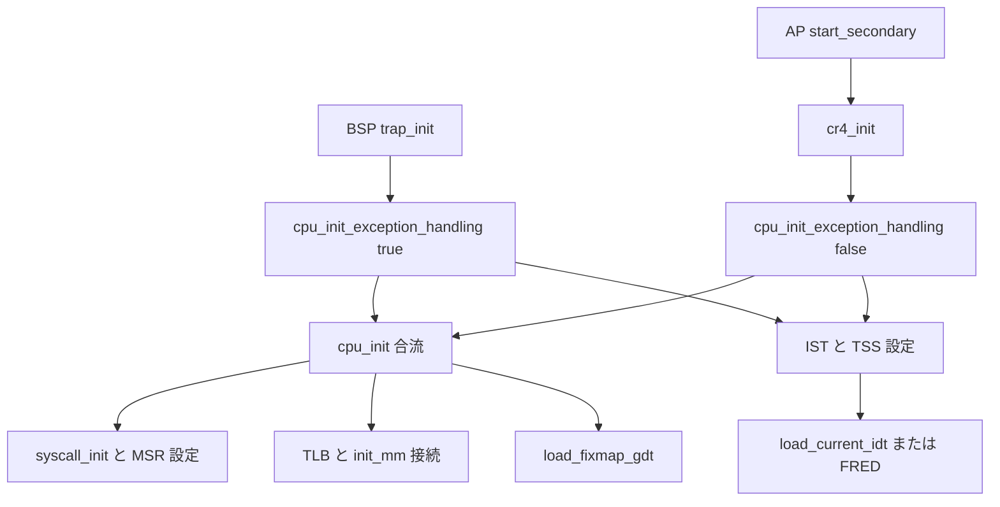

# 第9章 CPU ごとの記述子表と CR と MSR 初期化

> 本章で読むソース
>
> - [`arch/x86/kernel/cpu/common.c` L367-L382](https://github.com/gregkh/linux/blob/v6.18.38/arch/x86/kernel/cpu/common.c#L367-L382)
> - [`arch/x86/kernel/cpu/common.c` L476-L489](https://github.com/gregkh/linux/blob/v6.18.38/arch/x86/kernel/cpu/common.c#L476-L489)
> - [`arch/x86/kernel/cpu/common.c` L732-L739](https://github.com/gregkh/linux/blob/v6.18.38/arch/x86/kernel/cpu/common.c#L732-L739)
> - [`arch/x86/kernel/cpu/common.c` L2222-L2255](https://github.com/gregkh/linux/blob/v6.18.38/arch/x86/kernel/cpu/common.c#L2222-L2255)
> - [`arch/x86/kernel/cpu/common.c` L2258-L2272](https://github.com/gregkh/linux/blob/v6.18.38/arch/x86/kernel/cpu/common.c#L2258-L2272)
> - [`arch/x86/kernel/cpu/common.c` L2330-L2339](https://github.com/gregkh/linux/blob/v6.18.38/arch/x86/kernel/cpu/common.c#L2330-L2339)
> - [`arch/x86/kernel/cpu/common.c` L2364-L2404](https://github.com/gregkh/linux/blob/v6.18.38/arch/x86/kernel/cpu/common.c#L2364-L2404)
> - [`arch/x86/kernel/cpu/common.c` L2420-L2473](https://github.com/gregkh/linux/blob/v6.18.38/arch/x86/kernel/cpu/common.c#L2420-L2473)
> - [`arch/x86/kernel/smpboot.c` L232-L251](https://github.com/gregkh/linux/blob/v6.18.38/arch/x86/kernel/smpboot.c#L232-L251)

## この章の狙い

BSP と AP が共通に通る `cpu_init` を中心に、各 CPU へ **GDT**、**TSS**、**IDT** をロードし、**CR4** と syscall 用 **MSR** を確定する流れを追う。
第2章で用意した記述子表が、ここで実際のハードウェアへ載る。

## 前提

[第2章](../part00-foundation/02-gdt-tss-cpu-entry-area.md) で GDT、TSS、`cpu_entry_area` の静的構造を読んでいること。
[第7章](07-cpu-identification-features.md) の機能フラグが CR4 ビット選択に効く。
[第8章](08-percpu-gs-base.md) の GS base 設定は `cpu_init` 内の MSR 書き込みと接続する。
AP の起動経路の全体は [第29章](../part08-smp-mitigations/29-smp-boot.md) で扱う。

## cpu_init が合流点である理由

`cpu_init` は per-CPU 状態を確定する「CPU 状態の関所」として書かれている。
ブートストラップで一部は既に初期化済みでも、ここで改めてロードし直す。

[`arch/x86/kernel/cpu/common.c` L2420-L2473](https://github.com/gregkh/linux/blob/v6.18.38/arch/x86/kernel/cpu/common.c#L2420-L2473)

```c
void cpu_init(void)
{
	struct task_struct *cur = current;
	int cpu = raw_smp_processor_id();

#ifdef CONFIG_NUMA
	if (this_cpu_read(numa_node) == 0 &&
	    early_cpu_to_node(cpu) != NUMA_NO_NODE)
		set_numa_node(early_cpu_to_node(cpu));
#endif
	pr_debug("Initializing CPU#%d\n", cpu);

	if (IS_ENABLED(CONFIG_X86_64) || cpu_feature_enabled(X86_FEATURE_VME) ||
	    boot_cpu_has(X86_FEATURE_TSC) || boot_cpu_has(X86_FEATURE_DE))
		cr4_clear_bits(X86_CR4_VME|X86_CR4_PVI|X86_CR4_TSD|X86_CR4_DE);

	if (IS_ENABLED(CONFIG_X86_64)) {
		loadsegment(fs, 0);
		memset(cur->thread.tls_array, 0, GDT_ENTRY_TLS_ENTRIES * 8);
		syscall_init();

		wrmsrq(MSR_FS_BASE, 0);
		wrmsrq(MSR_KERNEL_GS_BASE, 0);
		barrier();

		x2apic_setup();

		intel_posted_msi_init();
	}

	mmgrab(&init_mm);
	cur->active_mm = &init_mm;
	BUG_ON(cur->mm);
	initialize_tlbstate_and_flush();
	enter_lazy_tlb(&init_mm, cur);

	/*
	 * sp0 points to the entry trampoline stack regardless of what task
	 * is running.
	 */
	load_sp0((unsigned long)(cpu_entry_stack(cpu) + 1));

	load_mm_ldt(&init_mm);

	initialize_debug_regs();
	dbg_restore_debug_regs();

	doublefault_init_cpu_tss();

	if (is_uv_system())
		uv_cpu_init();

	load_fixmap_gdt(cpu);
}
```

BSP は `trap_init` の末尾で `cpu_init_exception_handling` のあと `cpu_init` を呼ぶ。
AP は `start_secondary` で `cr4_init` と `cpu_init_exception_handling` を済ませてから `cpu_init` へ入る。
どちらも最終的に同じ `cpu_init` を通る。

[`arch/x86/kernel/smpboot.c` L232-L251](https://github.com/gregkh/linux/blob/v6.18.38/arch/x86/kernel/smpboot.c#L232-L251)

```c
static void notrace __noendbr start_secondary(void *unused)
{
	/*
	 * Don't put *anything* except direct CPU state initialization
	 * before cpu_init(), SMP booting is too fragile that we want to
	 * limit the things done here to the most necessary things.
	 */
	cr4_init();

	/*
	 * 32-bit specific. 64-bit reaches this code with the correct page
	 * table established. Yet another historical divergence.
	 */
	if (IS_ENABLED(CONFIG_X86_32)) {
		/* switch away from the initial page table */
		load_cr3(swapper_pg_dir);
		__flush_tlb_all();
	}

	cpu_init_exception_handling(false);
```

## GDT のロード

各 CPU の GDT は fixmap 上の読み取り専用コピーを指す。
`load_fixmap_gdt` が `get_cpu_gdt_ro` のアドレスを `load_gdt` へ渡す。

[`arch/x86/kernel/cpu/common.c` L732-L739](https://github.com/gregkh/linux/blob/v6.18.38/arch/x86/kernel/cpu/common.c#L732-L739)

```c
void load_fixmap_gdt(int cpu)
{
	struct desc_ptr gdt_descr;

	gdt_descr.address = (long)get_cpu_gdt_ro(cpu);
	gdt_descr.size = GDT_SIZE - 1;
	load_gdt(&gdt_descr);
}
```

`cpu_init` の最後で `load_fixmap_gdt(cpu)` が呼ばれ、当該 CPU の GDT が再ロードされる。
`load_fixmap_gdt` の `native_load_gdt` は `lgdt` で GDTR の base と limit を更新するだけで、セグメントレジスタの visible selector や hidden descriptor cache は再ロードしない。
セグメントレジスタ自体は `cpu_init` 冒頭の `loadsegment` などで別途更新される。

## cpu_init_exception_handling と IST

例外処理の準備は `cpu_init` より前の `cpu_init_exception_handling` で行う。
**IST** 用スタック頂点を TSS に書き、TSS 記述子を GDT へ載せ、`load_TR_desc` でタスクレジスタをロードする。
FRED 無効時は `load_current_idt` で IDT をロードする。

IST 各スロットへ `cpu_entry_area` 上のスタック頂点を割り当てる。

[`arch/x86/kernel/cpu/common.c` L2330-L2339](https://github.com/gregkh/linux/blob/v6.18.38/arch/x86/kernel/cpu/common.c#L2330-L2339)

```c
static inline void tss_setup_ist(struct tss_struct *tss)
{
	/* Set up the per-CPU TSS IST stacks */
	tss->x86_tss.ist[IST_INDEX_DF] = __this_cpu_ist_top_va(DF);
	tss->x86_tss.ist[IST_INDEX_NMI] = __this_cpu_ist_top_va(NMI);
	tss->x86_tss.ist[IST_INDEX_DB] = __this_cpu_ist_top_va(DB);
	tss->x86_tss.ist[IST_INDEX_MCE] = __this_cpu_ist_top_va(MCE);
	/* Only mapped when SEV-ES is active */
	tss->x86_tss.ist[IST_INDEX_VC] = __this_cpu_ist_top_va(VC);
}
```

[`arch/x86/kernel/cpu/common.c` L2364-L2404](https://github.com/gregkh/linux/blob/v6.18.38/arch/x86/kernel/cpu/common.c#L2364-L2404)

```c
void cpu_init_exception_handling(bool boot_cpu)
{
	struct tss_struct *tss = this_cpu_ptr(&cpu_tss_rw);
	int cpu = raw_smp_processor_id();

	/* paranoid_entry() gets the CPU number from the GDT */
	setup_getcpu(cpu);

	/* For IDT mode, IST vectors need to be set in TSS. */
	if (!cpu_feature_enabled(X86_FEATURE_FRED))
		tss_setup_ist(tss);
	tss_setup_io_bitmap(tss);
	set_tss_desc(cpu, &get_cpu_entry_area(cpu)->tss.x86_tss);

	load_TR_desc();

	/* GHCB needs to be setup to handle #VC. */
	setup_ghcb();

	/*
	 * On CPUs with FSGSBASE support, paranoid_entry() uses
	 * ALTERNATIVE-patched RDGSBASE/WRGSBASE instructions. Secondary CPUs
	 * boot after alternatives are patched globally, so early exceptions
	 * execute patched code that depends on FSGSBASE. Enable the feature
	 * before any exceptions occur.
	 */
	if (cpu_feature_enabled(X86_FEATURE_FSGSBASE)) {
		cr4_set_bits(X86_CR4_FSGSBASE);
		elf_hwcap2 |= HWCAP2_FSGSBASE;
	}

	if (cpu_feature_enabled(X86_FEATURE_FRED)) {
		/* The boot CPU has enabled FRED during early boot */
		if (!boot_cpu)
			cpu_init_fred_exceptions();

		cpu_init_fred_rsps();
	} else {
		load_current_idt();
	}
}
```

`load_sp0` は `cpu_init` 内でエントリ用スタックを RSP0 に設定する。
IST は二重フォールトや NMI など、通常スタックとは別スタックが必要な例外向けである。

## CR4 の機能ビット

CR4 関連は複数段階で設定される。
ページング初期化で PSE と PGE が有効化され、CPU 識別時に SMEP と SMAP が有効化され、各 CPU 起動時に `cr4_init` が PCIDE とシャドウを整える。

`setup_smep` と `setup_smap` は第7章の機能フラグを見て `cr4_set_bits` する。

[`arch/x86/kernel/cpu/common.c` L367-L382](https://github.com/gregkh/linux/blob/v6.18.38/arch/x86/kernel/cpu/common.c#L367-L382)

```c
static __always_inline void setup_smep(struct cpuinfo_x86 *c)
{
	if (cpu_has(c, X86_FEATURE_SMEP))
		cr4_set_bits(X86_CR4_SMEP);
}

static __always_inline void setup_smap(struct cpuinfo_x86 *c)
{
	unsigned long eflags = native_save_fl();

	/* This should have been cleared long ago */
	BUG_ON(eflags & X86_EFLAGS_AC);

	if (cpu_has(c, X86_FEATURE_SMAP))
		cr4_set_bits(X86_CR4_SMAP);
}
```

AP は `cpu_init` の前に `cr4_init` を呼ぶ。
PCIDE ビットの反映と `cpu_tlbstate.cr4` シャドウの初期化がここで行われる。

[`arch/x86/kernel/cpu/common.c` L476-L489](https://github.com/gregkh/linux/blob/v6.18.38/arch/x86/kernel/cpu/common.c#L476-L489)

```c
void cr4_init(void)
{
	unsigned long cr4 = __read_cr4();

	if (boot_cpu_has(X86_FEATURE_PCID))
		cr4 |= X86_CR4_PCIDE;
	if (static_branch_likely(&cr_pinning))
		cr4 = (cr4 & ~cr4_pinned_mask) | cr4_pinned_bits;

	__write_cr4(cr4);

	/* Initialize cr4 shadow for this CPU. */
	this_cpu_write(cpu_tlbstate.cr4, cr4);
}
```

BSP は `head64.c` の `cr4_init_shadow` でシャドウだけ先に用意し、PSE と PGE はブート早期のページング初期化で設定済みである。
`cpu_init` 冒頭では不要な CR4 ビットを `cr4_clear_bits` で落とす。

## syscall 関連 MSR

x86-64 の syscall 入口は MSR 駆動である。
`syscall_init` が `MSR_STAR` を書き、FRED 無効時は `idt_syscall_init` が残りの MSR とマスクを設定する。

[`arch/x86/kernel/cpu/common.c` L2258-L2272](https://github.com/gregkh/linux/blob/v6.18.38/arch/x86/kernel/cpu/common.c#L2258-L2272)

```c
void syscall_init(void)
{
	/* The default user and kernel segments */
	wrmsr(MSR_STAR, 0, (__USER32_CS << 16) | __KERNEL_CS);

	/*
	 * Except the IA32_STAR MSR, there is NO need to setup SYSCALL and
	 * SYSENTER MSRs for FRED, because FRED uses the ring 3 FRED
	 * entrypoint for SYSCALL and SYSENTER, and ERETU is the only legit
	 * instruction to return to ring 3 (both sysexit and sysret cause
	 * #UD when FRED is enabled).
	 */
	if (!cpu_feature_enabled(X86_FEATURE_FRED))
		idt_syscall_init();
}
```

`idt_syscall_init` は `MSR_LSTAR` に `entry_SYSCALL_64` を載せ、`MSR_SYSCALL_MASK` で syscall 時にクリアする RFLAGS を指定する。
compat 向けの `MSR_CSTAR` と SYSENTER 系 MSR もここで設定される。

[`arch/x86/kernel/cpu/common.c` L2222-L2255](https://github.com/gregkh/linux/blob/v6.18.38/arch/x86/kernel/cpu/common.c#L2222-L2255)

```c
static inline void idt_syscall_init(void)
{
	wrmsrq(MSR_LSTAR, (unsigned long)entry_SYSCALL_64);

	if (ia32_enabled()) {
		wrmsrq_cstar((unsigned long)entry_SYSCALL_compat);
		/*
		 * This only works on Intel CPUs.
		 * On AMD CPUs these MSRs are 32-bit, CPU truncates MSR_IA32_SYSENTER_EIP.
		 * This does not cause SYSENTER to jump to the wrong location, because
		 * AMD doesn't allow SYSENTER in long mode (either 32- or 64-bit).
		 */
		wrmsrq_safe(MSR_IA32_SYSENTER_CS, (u64)__KERNEL_CS);
		wrmsrq_safe(MSR_IA32_SYSENTER_ESP,
			    (unsigned long)(cpu_entry_stack(smp_processor_id()) + 1));
		wrmsrq_safe(MSR_IA32_SYSENTER_EIP, (u64)entry_SYSENTER_compat);
	} else {
		wrmsrq_cstar((unsigned long)entry_SYSCALL32_ignore);
		wrmsrq_safe(MSR_IA32_SYSENTER_CS, (u64)GDT_ENTRY_INVALID_SEG);
		wrmsrq_safe(MSR_IA32_SYSENTER_ESP, 0ULL);
		wrmsrq_safe(MSR_IA32_SYSENTER_EIP, 0ULL);
	}

	/*
	 * Flags to clear on syscall; clear as much as possible
	 * to minimize user space-kernel interference.
	 */
	wrmsrq(MSR_SYSCALL_MASK,
	       X86_EFLAGS_CF|X86_EFLAGS_PF|X86_EFLAGS_AF|
	       X86_EFLAGS_ZF|X86_EFLAGS_SF|X86_EFLAGS_TF|
	       X86_EFLAGS_IF|X86_EFLAGS_DF|X86_EFLAGS_OF|
	       X86_EFLAGS_IOPL|X86_EFLAGS_NT|X86_EFLAGS_RF|
	       X86_EFLAGS_AC|X86_EFLAGS_ID);
}
```

EFER の SCE ビットはブートアセンブリ `head_64.S` で先に立てられる。
各 CPU の `cpu_init` で MSR が再設定され、[第15章](../part04-syscall/15-entry-syscall-64.md) の syscall 入口の前提が揃う。

## 処理フロー



## 高速化と最適化の工夫

`MSR_LSTAR` に `entry_SYSCALL_64` の絶対アドレスを一度書くことで、ユーザ空間の `syscall` 命令は例外ディスパッチを介さずカーネル入口へ直接遷移できる。
省けるのは IDT のベクタ探索などであり、SYSCALL は IRET frame をハードウェアで積まないため pt_regs のソフトウェア構築は `entry_SYSCALL_64` に残る。

BSP と AP が同一の `cpu_init` を共有するため、per-CPU 初期化ロジックを重複実装せずに全 CPU で同種の状態を保てる。
SMP 起動の脆弱性を避けるため、AP 側は `cpu_init` 前の処理を `cr4_init` と例外処理準備に限定している。

## まとめ

- `cpu_init` は BSP と AP の合流点であり、GDT 再ロード、syscall MSR、TLB 状態、エントリスタックを per-CPU で確定する。
- `cpu_init_exception_handling` が IST、TSS、IDT を整え、例外入口の前提を先に揃える。
- CR4 はブート段階、CPU 識別、`cr4_init` に分かれ、PSE、PGE、SMEP、SMAP、PCIDE などが機能フラグに応じて有効化される。
- `syscall_init` と `idt_syscall_init` が `MSR_LSTAR`、`MSR_STAR`、`MSR_SYSCALL_MASK` を設定し、syscall 入口を MSR 駆動にする。

## 関連する章

- [静的構造 GDT、TSS、cpu_entry_area](../part00-foundation/02-gdt-tss-cpu-entry-area.md)
- [CPU 識別と機能フラグ](07-cpu-identification-features.md)
- [per-CPU 領域と GS base](08-percpu-gs-base.md)
- [syscall 64 ビット入口](../part04-syscall/15-entry-syscall-64.md)
- [SMP ブート BSP から AP 起動](../part08-smp-mitigations/29-smp-boot.md)
