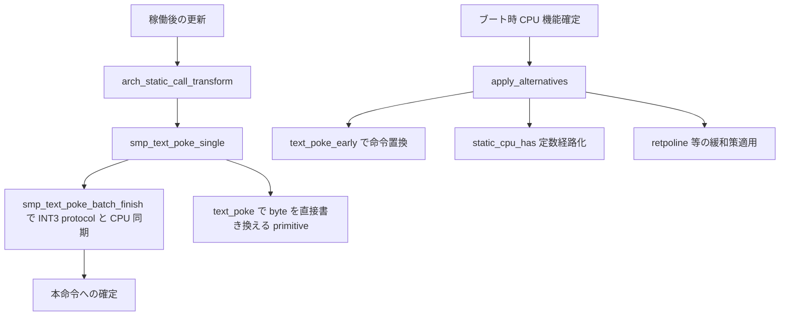

# 第10章 alternatives と static_call と text_poke

> 本章で読むソース
>
> - [`arch/x86/include/asm/alternative.h` L68-L82](https://github.com/gregkh/linux/blob/v6.18.38/arch/x86/include/asm/alternative.h#L68-L82)
> - [`arch/x86/kernel/alternative.c` L617-L675](https://github.com/gregkh/linux/blob/v6.18.38/arch/x86/kernel/alternative.c#L617-L675)
> - [`arch/x86/kernel/alternative.c` L677-L702](https://github.com/gregkh/linux/blob/v6.18.38/arch/x86/kernel/alternative.c#L677-L702)
> - [`arch/x86/kernel/alternative.c` L2458-L2482](https://github.com/gregkh/linux/blob/v6.18.38/arch/x86/kernel/alternative.c#L2458-L2482)
> - [`arch/x86/kernel/alternative.c` L2623-L2628](https://github.com/gregkh/linux/blob/v6.18.38/arch/x86/kernel/alternative.c#L2623-L2628)
> - [`arch/x86/kernel/alternative.c` L2896-L2938](https://github.com/gregkh/linux/blob/v6.18.38/arch/x86/kernel/alternative.c#L2896-L2938)
> - [`arch/x86/kernel/static_call.c` L53-L112](https://github.com/gregkh/linux/blob/v6.18.38/arch/x86/kernel/static_call.c#L53-L112)
> - [`arch/x86/kernel/static_call.c` L157-L172](https://github.com/gregkh/linux/blob/v6.18.38/arch/x86/kernel/static_call.c#L157-L172)
> - [`arch/x86/include/asm/cpufeature.h` L99-L123](https://github.com/gregkh/linux/blob/v6.18.38/arch/x86/include/asm/cpufeature.h#L99-L123)

## この章の狙い

CPU 機能やランタイム設定に応じてカーネルテキストを書き換える横断機構を追う。
**alternatives**、**static_call**、**text_poke** がどう連携し、[第7章](07-cpu-identification-features.md) の `static_cpu_has` や投機実行緩和策へつながるかを押さえる。

## 前提

[第7章](07-cpu-identification-features.md) で `boot_cpu_has` と `static_cpu_has` を読んでいること。
[第9章](09-cpu-init-cr-msr.md) で per-CPU 初期化が alternatives 適用後に例外処理へ入る順序を理解していること。
投機実行緩和の retpoline 適用は [第30章](../part08-smp-mitigations/30-speculative-mitigations.md) で扱う。

## alt_instr と apply_alternatives

ビルド時に `ALTERNATIVE` マクロが元命令と代替命令のペアを `alt_instr` として埋め込む。
`apply_alternatives` がテーブルを先頭から走査し、対象 CPU 機能の有無で置換先を選ぶ。

[`arch/x86/include/asm/alternative.h` L68-L82](https://github.com/gregkh/linux/blob/v6.18.38/arch/x86/include/asm/alternative.h#L68-L82)

```c
struct alt_instr {
	s32 instr_offset;	/* original instruction */
	s32 repl_offset;	/* offset to replacement instruction */

	union {
		struct {
			u32 cpuid: 16;	/* CPUID bit set for replacement */
			u32 flags: 16;	/* patching control flags */
		};
		u32 ft_flags;
	};

	u8  instrlen;		/* length of original instruction */
	u8  replacementlen;	/* length of new instruction */
} __packed;
```

`cpuid` フィールドは第7章の機能ビット番号に対応する。
`ALT_FLAG_NOT` が立っているときは機能が無い場合に代替列を選ぶ。

[`arch/x86/kernel/alternative.c` L617-L675](https://github.com/gregkh/linux/blob/v6.18.38/arch/x86/kernel/alternative.c#L617-L675)

```c
void __init_or_module noinline apply_alternatives(struct alt_instr *start,
						  struct alt_instr *end)
{
	u8 insn_buff[MAX_PATCH_LEN];
	u8 *instr, *replacement;
	struct alt_instr *a, *b;

	DPRINTK(ALT, "alt table %px, -> %px", start, end);

	/*
	 * KASAN_SHADOW_START is defined using
	 * cpu_feature_enabled(X86_FEATURE_LA57) and is therefore patched here.
	 * During the process, KASAN becomes confused seeing partial LA57
	 * conversion and triggers a false-positive out-of-bound report.
	 *
	 * Disable KASAN until the patching is complete.
	 */
	kasan_disable_current();

	/*
	 * The scan order should be from start to end. A later scanned
	 * alternative code can overwrite previously scanned alternative code.
	 * Some kernel functions (e.g. memcpy, memset, etc) use this order to
	 * patch code.
	 *
	 * So be careful if you want to change the scan order to any other
	 * order.
	 */
	for (a = start; a < end; a++) {
		int insn_buff_sz = 0;

		/*
		 * In case of nested ALTERNATIVE()s the outer alternative might
		 * add more padding. To ensure consistent patching find the max
		 * padding for all alt_instr entries for this site (nested
		 * alternatives result in consecutive entries).
		 */
		for (b = a+1; b < end && instr_va(b) == instr_va(a); b++) {
			u8 len = max(a->instrlen, b->instrlen);
			a->instrlen = b->instrlen = len;
		}

		instr = instr_va(a);
		replacement = (u8 *)&a->repl_offset + a->repl_offset;
		BUG_ON(a->instrlen > sizeof(insn_buff));
		BUG_ON(a->cpuid >= (NCAPINTS + NBUGINTS) * 32);

		/*
		 * Patch if either:
		 * - feature is present
		 * - feature not present but ALT_FLAG_NOT is set to mean,
		 *   patch if feature is *NOT* present.
		 */
		if (!boot_cpu_has(a->cpuid) == !(a->flags & ALT_FLAG_NOT)) {
			memcpy(insn_buff, instr, a->instrlen);
			optimize_nops(instr, insn_buff, a->instrlen);
			text_poke_early(instr, insn_buff, a->instrlen);
			continue;
		}
```

機能が存在する通常の alternative では replacement を選んでコピーし、不足分を NOP で埋める。
機能が存在しなければ original 命令を残して NOP 最適化だけを行い、`ALT_FLAG_NOT` の entry だけ条件が反転して機能が無いときに replacement を選ぶ。

[`arch/x86/kernel/alternative.c` L677-L702](https://github.com/gregkh/linux/blob/v6.18.38/arch/x86/kernel/alternative.c#L677-L702)

```c
		DPRINTK(ALT, "feat: %d*32+%d, old: (%pS (%px) len: %d), repl: (%px, len: %d) flags: 0x%x",
			a->cpuid >> 5,
			a->cpuid & 0x1f,
			instr, instr, a->instrlen,
			replacement, a->replacementlen, a->flags);

		memcpy(insn_buff, replacement, a->replacementlen);
		insn_buff_sz = a->replacementlen;

		if (a->flags & ALT_FLAG_DIRECT_CALL) {
			insn_buff_sz = alt_replace_call(instr, insn_buff, a);
			if (insn_buff_sz < 0)
				continue;
		}

		for (; insn_buff_sz < a->instrlen; insn_buff_sz++)
			insn_buff[insn_buff_sz] = 0x90;

		text_poke_apply_relocation(insn_buff, instr, a->instrlen, replacement, a->replacementlen);

		DUMP_BYTES(ALT, instr, a->instrlen, "%px:   old_insn: ", instr);
		DUMP_BYTES(ALT, replacement, a->replacementlen, "%px:   rpl_insn: ", replacement);
		DUMP_BYTES(ALT, insn_buff, insn_buff_sz, "%px: final_insn: ", instr);

		text_poke_early(instr, insn_buff, insn_buff_sz);
	}
```

ブート早期の alternatives 適用は SMP 起動前に行われ、非対称な AP 構成は想定外とコメントされている。

## static_cpu_has への接続

`static_cpu_has` のフォールバック経路はインラインアセンブリ内の `ALTERNATIVE` 分岐である。
alternatives 適用後は機能あり版の命令列だけが残り、実行時の `test` と分岐が消える。

[`arch/x86/include/asm/cpufeature.h` L99-L123](https://github.com/gregkh/linux/blob/v6.18.38/arch/x86/include/asm/cpufeature.h#L99-L123)

```c
static __always_inline bool _static_cpu_has(u16 bit)
{
	asm goto(ALTERNATIVE_TERNARY("jmp 6f", %c[feature], "", "jmp %l[t_no]")
		".pushsection .altinstr_aux,\"ax\"\n"
		"6:\n"
		" testb %[bitnum], %a[cap_byte]\n"
		" jnz %l[t_yes]\n"
		" jmp %l[t_no]\n"
		".popsection\n"
		 : : [feature]  "i" (bit),
		     [bitnum]   "i" (1 << (bit & 7)),
		     [cap_byte] "i" (&((const char *)boot_cpu_data.x86_capability)[bit >> 3])
		 : : t_yes, t_no);
t_yes:
	return true;
t_no:
	return false;
}

#define static_cpu_has(bit)					\
(								\
	__builtin_constant_p(boot_cpu_has(bit)) ?		\
		boot_cpu_has(bit) :				\
		_static_cpu_has(bit)				\
)
```

## static_call と arch_static_call_transform

**static_call** は呼び出しサイトまたはトランポリンを書き換え、間接呼び出しを直接 `call` や `jmp` に変える。
更新は `text_mutex` を取ったうえで `__static_call_transform` が命令列を生成し、ブート中は `text_poke_early`、稼働後は `smp_text_poke_single` へ渡す。

[`arch/x86/kernel/static_call.c` L53-L112](https://github.com/gregkh/linux/blob/v6.18.38/arch/x86/kernel/static_call.c#L53-L112)

```c
static void __ref __static_call_transform(void *insn, enum insn_type type,
					  void *func, bool modinit)
{
	const void *emulate = NULL;
	int size = CALL_INSN_SIZE;
	const void *code;
	u8 op, buf[6];

	if ((type == JMP || type == RET) && (op = __is_Jcc(insn)))
		type = JCC;

	switch (type) {
	case CALL:
		func = callthunks_translate_call_dest(func);
		code = text_gen_insn(CALL_INSN_OPCODE, insn, func);
		if (func == &__static_call_return0) {
			emulate = code;
			code = &xor5rax;
		}

		break;

	case NOP:
		code = x86_nops[5];
		break;

	case JMP:
		code = text_gen_insn(JMP32_INSN_OPCODE, insn, func);
		break;

	case RET:
		if (cpu_wants_rethunk_at(insn))
			code = text_gen_insn(JMP32_INSN_OPCODE, insn, x86_return_thunk);
		else
			code = &retinsn;
		break;

	case JCC:
		if (!func) {
			func = __static_call_return;
			if (cpu_wants_rethunk())
				func = x86_return_thunk;
		}

		buf[0] = 0x0f;
		__text_gen_insn(buf+1, op, insn+1, func, 5);
		code = buf;
		size = 6;

		break;
	}

	if (memcmp(insn, code, size) == 0)
		return;

	if (system_state == SYSTEM_BOOTING || modinit)
		return text_poke_early(insn, code, size);

	smp_text_poke_single(insn, code, size, emulate);
}
```

エントリ API は `arch_static_call_transform` で、インラインサイトとトランポリンの両方を扱う。

[`arch/x86/kernel/static_call.c` L157-L172](https://github.com/gregkh/linux/blob/v6.18.38/arch/x86/kernel/static_call.c#L157-L172)

```c
void arch_static_call_transform(void *site, void *tramp, void *func, bool tail)
{
	mutex_lock(&text_mutex);

	if (tramp && !site) {
		__static_call_validate(tramp, true, true);
		__static_call_transform(tramp, __sc_insn(!func, true), func, false);
	}

	if (IS_ENABLED(CONFIG_HAVE_STATIC_CALL_INLINE) && site) {
		__static_call_validate(site, tail, false);
		__static_call_transform(site, __sc_insn(!func, tail), func, false);
	}

	mutex_unlock(&text_mutex);
}
```

`static_call` は call site を target への直接 `CALL`（tail call なら直接 `JMP`、または `NOP` や `RET`）へ patch し、間接 call とその retpoline overhead を避ける。

## text_poke とブート早期の書き換え

稼働後の書き換えは `text_poke` が `text_mutex` 保持下で `__text_poke` を呼ぶ。
一時的な書き込み可能マッピング経由でカーネルテキストを更新し、TLB をフラッシュする。

[`arch/x86/kernel/alternative.c` L2623-L2628](https://github.com/gregkh/linux/blob/v6.18.38/arch/x86/kernel/alternative.c#L2623-L2628)

```c
void *text_poke(void *addr, const void *opcode, size_t len)
{
	lockdep_assert_held(&text_mutex);

	return __text_poke(text_poke_memcpy, addr, opcode, len);
}
```

ブート早期とモジュールロード前は `text_poke_early` を使う。
割り込みを抑えたうえで `memcpy` し、`sync_core` で命令キャッシュと実行の整合を取る。

[`arch/x86/kernel/alternative.c` L2458-L2482](https://github.com/gregkh/linux/blob/v6.18.38/arch/x86/kernel/alternative.c#L2458-L2482)

```c
void __init_or_module text_poke_early(void *addr, const void *opcode,
				      size_t len)
{
	unsigned long flags;

	if (boot_cpu_has(X86_FEATURE_NX) &&
	    is_module_text_address((unsigned long)addr)) {
		/*
		 * Modules text is marked initially as non-executable, so the
		 * code cannot be running and speculative code-fetches are
		 * prevented. Just change the code.
		 */
		memcpy(addr, opcode, len);
	} else {
		local_irq_save(flags);
		memcpy(addr, opcode, len);
		sync_core();
		local_irq_restore(flags);

		/*
		 * Could also do a CLFLUSH here to speed up CPU recovery; but
		 * that causes hangs on some VIA CPUs.
		 */
	}
}
```

SMP 稼働後の複数バイト命令更新は `smp_text_poke_batch_finish` が担う。
各パッチ先の先頭バイトを一時的に **INT3** に差し替え、全 CPU を同期してから残りのバイトを書き、最後に本来の先頭オペコードを戻す。
他 CPU が中途半端な命令を実行するのを防ぐ。

[`arch/x86/kernel/alternative.c` L2896-L2938](https://github.com/gregkh/linux/blob/v6.18.38/arch/x86/kernel/alternative.c#L2896-L2938)

```c
void smp_text_poke_batch_finish(void)
{
	unsigned char int3 = INT3_INSN_OPCODE;
	unsigned int i;
	int do_sync;

	if (!text_poke_array.nr_entries)
		return;

	lockdep_assert_held(&text_mutex);

	/*
	 * Corresponds to the implicit memory barrier in try_get_text_poke_array() to
	 * ensure reading a non-zero refcount provides up to date text_poke_array data.
	 */
	for_each_possible_cpu(i)
		atomic_set_release(per_cpu_ptr(&text_poke_array_refs, i), 1);

	/*
	 * Function tracing can enable thousands of places that need to be
	 * updated. This can take quite some time, and with full kernel debugging
	 * enabled, this could cause the softlockup watchdog to trigger.
	 * This function gets called every 256 entries added to be patched.
	 * Call cond_resched() here to make sure that other tasks can get scheduled
	 * while processing all the functions being patched.
	 */
	cond_resched();

	/*
	 * Corresponding read barrier in INT3 notifier for making sure the
	 * text_poke_array.nr_entries and handler are correctly ordered wrt. patching.
	 */
	smp_wmb();

	/*
	 * First step: add a INT3 trap to the address that will be patched.
	 */
	for (i = 0; i < text_poke_array.nr_entries; i++) {
		text_poke_array.vec[i].old = *(u8 *)text_poke_addr(&text_poke_array.vec[i]);
		text_poke(text_poke_addr(&text_poke_array.vec[i]), &int3, INT3_INSN_SIZE);
	}

	smp_text_poke_sync_each_cpu();
```

INT3 ハンドラは `smp_text_poke_int3_handler` がパッチ中の命令をエミュレートし、パッチ完了まで実行を安全側へ寄せる。

## 処理フロー



## 高速化と最適化の工夫

alternatives はビルド後に機能チェックを定数命令列へパッチする。
`static_cpu_has` の実行時分岐や capability バイトのテストが頻出経路から消え、命令数と分岐予測ミスが減る。

static_call は間接呼び出しを直接 `call` へ変換する。
呼び出し先が固定化されれば retpoline 付き間接分岐を避けられ、分岐予測と投機実行のコストを下げられる。

## まとめ

- `apply_alternatives` が `alt_instr` テーブルを走査し、CPU 機能に応じて命令列を置換する。
- `static_cpu_has` は alternatives でパッチされる分岐を内包し、適用後は定数経路になる。
- `arch_static_call_transform` が call site とトランポリンを書き換え、間接呼び出しを直接呼び出しへ変える。
- 稼働後の書き換えは `text_poke` と INT3 同期で安全に行い、ブート早期は `text_poke_early` を使う。

## 関連する章

- [CPU 識別と機能フラグ](07-cpu-identification-features.md)
- [CPU ごとの記述子表と CR と MSR 初期化](09-cpu-init-cr-msr.md)
- [投機実行緩和策](../part08-smp-mitigations/30-speculative-mitigations.md)
