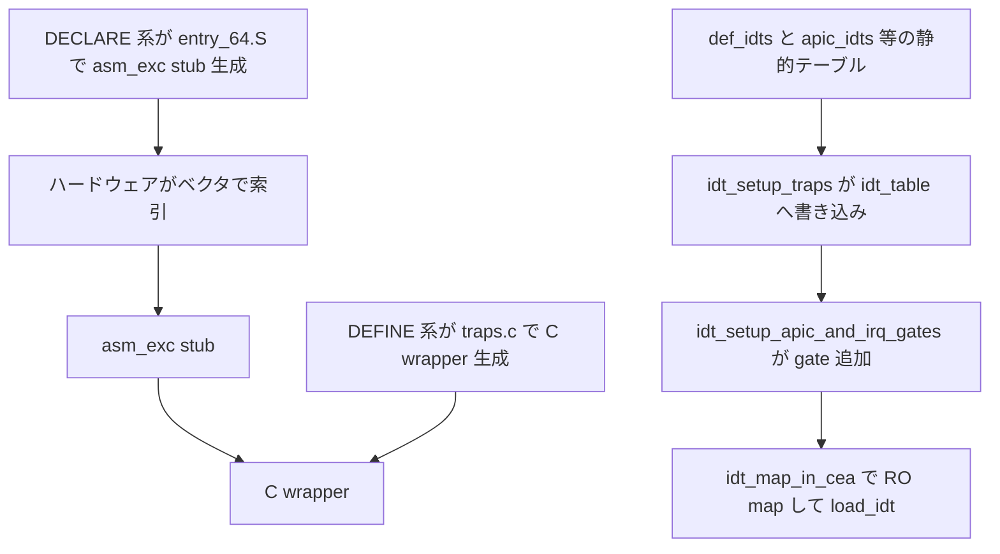

# 第11章 IDT の構築と IDTENTRY 機構

> 本章で読むソース
>
> - [`arch/x86/kernel/idt.c` L32-L46](https://github.com/gregkh/linux/blob/v6.18.38/arch/x86/kernel/idt.c#L32-L46)
> - [`arch/x86/kernel/idt.c` L84-L120](https://github.com/gregkh/linux/blob/v6.18.38/arch/x86/kernel/idt.c#L84-L120)
> - [`arch/x86/kernel/idt.c` L222-L227](https://github.com/gregkh/linux/blob/v6.18.38/arch/x86/kernel/idt.c#L222-L227)
> - [`arch/x86/kernel/idt.c` L232-L238](https://github.com/gregkh/linux/blob/v6.18.38/arch/x86/kernel/idt.c#L232-L238)
> - [`arch/x86/kernel/idt.c` L268-L315](https://github.com/gregkh/linux/blob/v6.18.38/arch/x86/kernel/idt.c#L268-L315)
> - [`arch/x86/include/asm/idtentry.h` L34-L66](https://github.com/gregkh/linux/blob/v6.18.38/arch/x86/include/asm/idtentry.h#L34-L66)
> - [`arch/x86/include/asm/idtentry.h` L477-L481](https://github.com/gregkh/linux/blob/v6.18.38/arch/x86/include/asm/idtentry.h#L477-L481)
> - [`arch/x86/include/asm/idtentry.h` L596-L613](https://github.com/gregkh/linux/blob/v6.18.38/arch/x86/include/asm/idtentry.h#L596-L613)

## この章の狙い

**IDT** がベクタ番号でハードウェアが索引する例外と割り込みの入口テーブルであることを押さえる。
`def_idts` などの静的テーブルから `idt_table` への書き込み、`IDTENTRY` マクロの asm と C の二層構造、段階的な load の担当分担を追う。

## 前提

[第6章](../part01-boot/06-x86-64-start-kernel.md) で `idt_setup_early_handler` による早期 IDT を読んでいること。
[第9章](../part02-cpu-init/09-cpu-init-cr-msr.md) で `cpu_init_exception_handling` が TSS と IST を整えたあと `load_current_idt` する流れを理解していること。

## gate 種別と def_idts

`idt.c` の `INTG`、`SYSG`、`ISTG` はいずれも `GATE_INTERRUPT` を type に設定する。
`SYSG` は DPL3 の system interrupt gate で、ソフトウェアから呼べる `#BP` や `#OF` 向けである。
`ISTG` は interrupt gate に TSS の ist index を載せ、IST の有無は gate type とは別フィールドである。

[`arch/x86/kernel/idt.c` L32-L46](https://github.com/gregkh/linux/blob/v6.18.38/arch/x86/kernel/idt.c#L32-L46)

```c
/* Interrupt gate */
#define INTG(_vector, _addr)				\
	G(_vector, _addr, DEFAULT_STACK, GATE_INTERRUPT, DPL0, __KERNEL_CS)

/* System interrupt gate */
#define SYSG(_vector, _addr)				\
	G(_vector, _addr, DEFAULT_STACK, GATE_INTERRUPT, DPL3, __KERNEL_CS)

#ifdef CONFIG_X86_64
/*
 * Interrupt gate with interrupt stack. The _ist index is the index in
 * the tss.ist[] array, but for the descriptor it needs to start at 1.
 */
#define ISTG(_vector, _addr, _ist)			\
	G(_vector, _addr, _ist + 1, GATE_INTERRUPT, DPL0, __KERNEL_CS)
```

`def_idts` は `trap_init` で `cpu_init` 前に `idt_table` へ書き込まれる既定の例外ベクタ表である。
本版では interrupt gate を使い、NMI、#DF、#DB、#MC などの gate は常に IST field を持つ（hardware は起点によらず IST stack へ切り替え、起点別の実効 stack は第13章で扱う）。

[`arch/x86/kernel/idt.c` L84-L120](https://github.com/gregkh/linux/blob/v6.18.38/arch/x86/kernel/idt.c#L84-L120)

```c
static const __initconst struct idt_data def_idts[] = {
	INTG(X86_TRAP_DE,		asm_exc_divide_error),
	ISTG(X86_TRAP_NMI,		asm_exc_nmi, IST_INDEX_NMI),
	INTG(X86_TRAP_BR,		asm_exc_bounds),
	INTG(X86_TRAP_UD,		asm_exc_invalid_op),
	INTG(X86_TRAP_NM,		asm_exc_device_not_available),
	INTG(X86_TRAP_OLD_MF,		asm_exc_coproc_segment_overrun),
	INTG(X86_TRAP_TS,		asm_exc_invalid_tss),
	INTG(X86_TRAP_NP,		asm_exc_segment_not_present),
	INTG(X86_TRAP_SS,		asm_exc_stack_segment),
	INTG(X86_TRAP_GP,		asm_exc_general_protection),
	INTG(X86_TRAP_SPURIOUS,		asm_exc_spurious_interrupt_bug),
	INTG(X86_TRAP_MF,		asm_exc_coprocessor_error),
	INTG(X86_TRAP_AC,		asm_exc_alignment_check),
	INTG(X86_TRAP_XF,		asm_exc_simd_coprocessor_error),

#ifdef CONFIG_X86_32
	TSKG(X86_TRAP_DF,		GDT_ENTRY_DOUBLEFAULT_TSS),
#else
	ISTG(X86_TRAP_DF,		asm_exc_double_fault, IST_INDEX_DF),
#endif
	ISTG(X86_TRAP_DB,		asm_exc_debug, IST_INDEX_DB),

#ifdef CONFIG_X86_MCE
	ISTG(X86_TRAP_MC,		asm_exc_machine_check, IST_INDEX_MCE),
#endif

#ifdef CONFIG_X86_CET
	INTG(X86_TRAP_CP,		asm_exc_control_protection),
#endif

#ifdef CONFIG_AMD_MEM_ENCRYPT
	ISTG(X86_TRAP_VC,		asm_exc_vmm_communication, IST_INDEX_VC),
#endif

	SYSG(X86_TRAP_OF,		asm_exc_overflow),
};
```

各エントリの `addr` は `asm_exc_*` であり、これが `entry_64.S` で生成された asm stub への入口である。

## IDT の段階的構築と load の分担

早期段階では IST を使えないため、`early_idts` を `idt_setup_early_traps` で書き込み、直後に `load_idt` する。

[`arch/x86/kernel/idt.c` L222-L227](https://github.com/gregkh/linux/blob/v6.18.38/arch/x86/kernel/idt.c#L222-L227)

```c
void __init idt_setup_early_traps(void)
{
	idt_setup_from_table(idt_table, early_idts, ARRAY_SIZE(early_idts),
			     true);
	load_idt(&idt_descr);
}
```

`trap_init` から呼ばれる `idt_setup_traps` は `def_idts` と `ia32_idt` を `idt_table` へ書くだけで、`load_idt` は呼ばない。
順序としては、`trap_init` が `setup_cpu_entry_areas` の後に `cpu_init_exception_handling(true)` を呼んで TSS の IST pointer と TSS descriptor と TR を準備し、FRED 無効時は `load_current_idt` で `idt_table` をロードする。
その後に `idt_setup_traps` が同じ `idt_table` へ in-place で書き込むため、`load_idt` がなくても新しい descriptor は hardware から参照される。

[`arch/x86/kernel/idt.c` L232-L238](https://github.com/gregkh/linux/blob/v6.18.38/arch/x86/kernel/idt.c#L232-L238)

```c
void __init idt_setup_traps(void)
{
	idt_setup_from_table(idt_table, def_idts, ARRAY_SIZE(def_idts), true);

	if (ia32_enabled())
		idt_setup_from_table(idt_table, ia32_idt, ARRAY_SIZE(ia32_idt), true);
}
```

APIC と外部 IRQ 用の gate を追加したあと、IDT を `cpu_entry_area` の read-only アドレスへ map し、再 load する。
続けて `idt_table` 自体も read-only にする。

[`arch/x86/kernel/idt.c` L268-L315](https://github.com/gregkh/linux/blob/v6.18.38/arch/x86/kernel/idt.c#L268-L315)

```c
static void __init idt_map_in_cea(void)
{
	/*
	 * Set the IDT descriptor to a fixed read-only location in the cpu
	 * entry area, so that the "sidt" instruction will not leak the
	 * location of the kernel, and to defend the IDT against arbitrary
	 * memory write vulnerabilities.
	 */
	cea_set_pte(CPU_ENTRY_AREA_RO_IDT_VADDR, __pa_symbol(idt_table),
		    PAGE_KERNEL_RO);
	idt_descr.address = CPU_ENTRY_AREA_RO_IDT;
}

/**
 * idt_setup_apic_and_irq_gates - Setup APIC/SMP and normal interrupt gates
 */
void __init idt_setup_apic_and_irq_gates(void)
{
	int i = FIRST_EXTERNAL_VECTOR;
	void *entry;

	idt_setup_from_table(idt_table, apic_idts, ARRAY_SIZE(apic_idts), true);

	for_each_clear_bit_from(i, system_vectors, FIRST_SYSTEM_VECTOR) {
		entry = irq_entries_start + IDT_ALIGN * (i - FIRST_EXTERNAL_VECTOR);
		set_intr_gate(i, entry);
	}

#ifdef CONFIG_X86_LOCAL_APIC
	for_each_clear_bit_from(i, system_vectors, NR_VECTORS) {
		/*
		 * Don't set the non assigned system vectors in the
		 * system_vectors bitmap. Otherwise they show up in
		 * /proc/interrupts.
		 */
		entry = spurious_entries_start + IDT_ALIGN * (i - FIRST_SYSTEM_VECTOR);
		set_intr_gate(i, entry);
	}
#endif
	/* Map IDT into CPU entry area and reload it. */
	idt_map_in_cea();
	load_idt(&idt_descr);

	/* Make the IDT table read only */
	set_memory_ro((unsigned long)&idt_table, 1);

	idt_setup_done = true;
}
```

## IDTENTRY の二層構造

`idtentry.h` は C コードと `entry_64.S` の両方から include される。
**DECLARE** 系は asm stub の生成、**DEFINE** 系は C 側の wrapper と内部 body の生成を担当する。
同じ `func` 名で `asm_##func` と C の `func` が接続される二層である。

C 側の `DEFINE_IDTENTRY` は `irqentry_enter`、実処理、`irqentry_exit` を包む wrapper を生成する。

[`arch/x86/include/asm/idtentry.h` L34-L66](https://github.com/gregkh/linux/blob/v6.18.38/arch/x86/include/asm/idtentry.h#L34-L66)

```c
#define DECLARE_IDTENTRY(vector, func)					\
	asmlinkage void asm_##func(void);				\
	asmlinkage void xen_asm_##func(void);				\
	void fred_##func(struct pt_regs *regs);				\
	__visible void func(struct pt_regs *regs)

/**
 * DEFINE_IDTENTRY - Emit code for simple IDT entry points
 * @func:	Function name of the entry point
 *
 * @func is called from ASM entry code with interrupts disabled.
 *
 * The macro is written so it acts as function definition. Append the
 * body with a pair of curly brackets.
 *
 * irqentry_enter() contains common code which has to be invoked before
 * arbitrary code in the body. irqentry_exit() contains common code
 * which has to run before returning to the low level assembly code.
 */
#define DEFINE_IDTENTRY(func)						\
static __always_inline void __##func(struct pt_regs *regs);		\
									\
__visible noinstr void func(struct pt_regs *regs)			\
{									\
	irqentry_state_t state = irqentry_enter(regs);			\
									\
	instrumentation_begin();					\
	__##func (regs);						\
	instrumentation_end();						\
	irqentry_exit(regs, state);					\
}									\
									\
static __always_inline void __##func(struct pt_regs *regs)
```

`entry_64.S` が assembler mode で include するとき、同じ `DECLARE_IDTENTRY` は `idtentry` マクロへ展開され `asm_exc_*` stub を生成する。

[`arch/x86/include/asm/idtentry.h` L477-L481](https://github.com/gregkh/linux/blob/v6.18.38/arch/x86/include/asm/idtentry.h#L477-L481)

```c
#define DECLARE_IDTENTRY(vector, func)					\
	idtentry vector asm_##func func has_error_code=0

#define DECLARE_IDTENTRY_ERRORCODE(vector, func)			\
	idtentry vector asm_##func func has_error_code=1
```

`idtentry.h` 末尾の `DECLARE_IDTENTRY*` 一覧が、ベクタと C ハンドラ名の対応表として機能する。
error code 付き例外は `DECLARE_IDTENTRY_ERRORCODE`、特別な前処理が要るものは `DECLARE_IDTENTRY_RAW` になる。

[`arch/x86/include/asm/idtentry.h` L596-L613](https://github.com/gregkh/linux/blob/v6.18.38/arch/x86/include/asm/idtentry.h#L596-L613)

```c
DECLARE_IDTENTRY(X86_TRAP_DE,		exc_divide_error);
DECLARE_IDTENTRY(X86_TRAP_OF,		exc_overflow);
DECLARE_IDTENTRY(X86_TRAP_BR,		exc_bounds);
DECLARE_IDTENTRY(X86_TRAP_NM,		exc_device_not_available);
DECLARE_IDTENTRY(X86_TRAP_OLD_MF,	exc_coproc_segment_overrun);
DECLARE_IDTENTRY(X86_TRAP_SPURIOUS,	exc_spurious_interrupt_bug);
DECLARE_IDTENTRY(X86_TRAP_MF,		exc_coprocessor_error);
DECLARE_IDTENTRY(X86_TRAP_XF,		exc_simd_coprocessor_error);

/* 32bit software IRET trap. Do not emit ASM code */
DECLARE_IDTENTRY_SW(X86_TRAP_IRET,	iret_error);

/* Simple exception entries with error code pushed by hardware */
DECLARE_IDTENTRY_ERRORCODE(X86_TRAP_TS,	exc_invalid_tss);
DECLARE_IDTENTRY_ERRORCODE(X86_TRAP_NP,	exc_segment_not_present);
DECLARE_IDTENTRY_ERRORCODE(X86_TRAP_SS,	exc_stack_segment);
DECLARE_IDTENTRY_ERRORCODE(X86_TRAP_GP,	exc_general_protection);
DECLARE_IDTENTRY_ERRORCODE(X86_TRAP_AC,	exc_alignment_check);
```

## 処理フロー



## 高速化と最適化の工夫

DECLARE と DEFINE の二層マクロが asm stub と C wrapper を統一生成する。
全ハンドラでレジスタ退避や `irqentry_enter` と `irqentry_exit` の定型を一箇所に集約でき、ハンドラごとの重複を避けられる。

IDT を `cpu_entry_area` の read-only 領域へ map することで、任意のメモリ書き換えから IDT を守りつつ、ハードウェアのベクタ索引による定数時間分岐を保てる。
`sidt` がカーネル内部アドレスを漏らさない効果もある。

## まとめ

- IDT はベクタ番号で索引され、`def_idts` が例外ベクタと `asm_exc_*` stub を対応づける。
- `INTG`、`SYSG`、`ISTG` はいずれも interrupt gate で、IST は別フィールドとして載る。
- `idt_setup_traps` は `idt_table` へ書くだけで load しない。
- `idt_setup_apic_and_irq_gates` が RO map 後に load する。
- DECLARE 系が asm stub、DEFINE 系が C wrapper を生成し、同じ関数名で二層接続される。

## 関連する章

- [x86_64_start_kernel から start_kernel へ](../part01-boot/06-x86-64-start-kernel.md)
- [CPU ごとの記述子表と CR と MSR 初期化](../part02-cpu-init/09-cpu-init-cr-msr.md)
- [通常例外の入口と本体](12-normal-exceptions.md)
- [NMI と機械検査例外と IST と paranoid path](13-nmi-mce-ist-paranoid.md)
