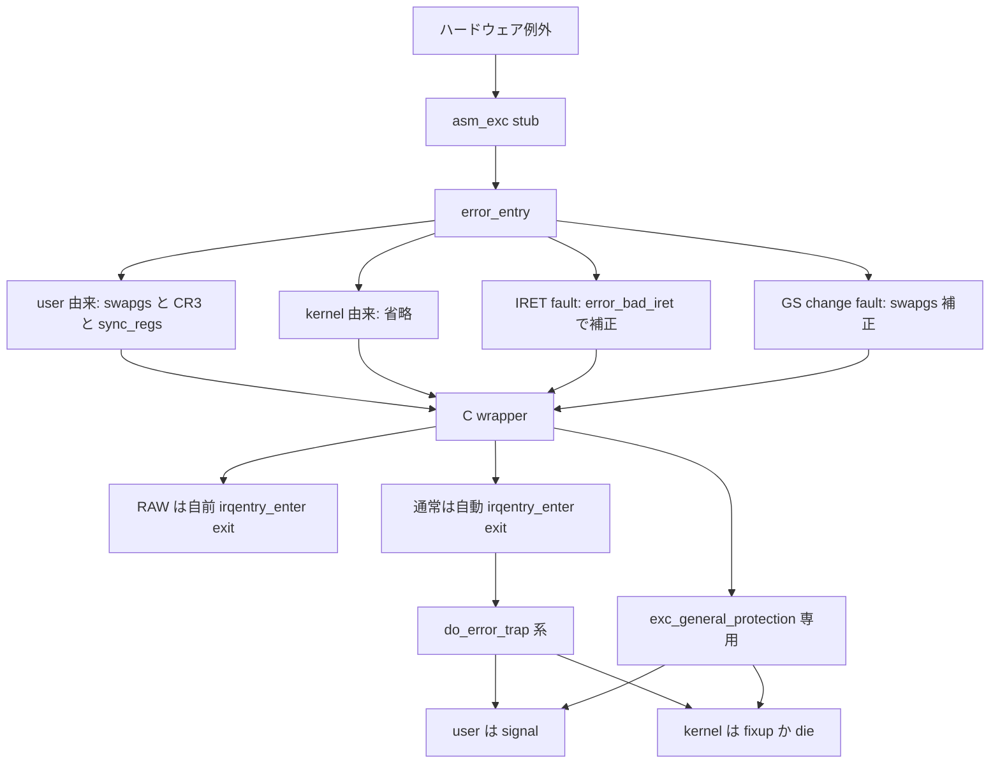

# 第12章 通常例外の入口と本体

> 本章で読むソース
>
> - [`arch/x86/entry/entry_64.S` L289-L317](https://github.com/gregkh/linux/blob/v6.18.38/arch/x86/entry/entry_64.S#L289-L317)
> - [`arch/x86/entry/entry_64.S` L329-L365](https://github.com/gregkh/linux/blob/v6.18.38/arch/x86/entry/entry_64.S#L329-L365)
> - [`arch/x86/entry/entry_64.S` L1004-L1087](https://github.com/gregkh/linux/blob/v6.18.38/arch/x86/entry/entry_64.S#L1004-L1087)
> - [`arch/x86/kernel/traps.c` L186-L225](https://github.com/gregkh/linux/blob/v6.18.38/arch/x86/kernel/traps.c#L186-L225)
> - [`arch/x86/kernel/traps.c` L259-L270](https://github.com/gregkh/linux/blob/v6.18.38/arch/x86/kernel/traps.c#L259-L270)
> - [`arch/x86/kernel/traps.c` L287-L291](https://github.com/gregkh/linux/blob/v6.18.38/arch/x86/kernel/traps.c#L287-L291)
> - [`arch/x86/kernel/traps.c` L383-L400](https://github.com/gregkh/linux/blob/v6.18.38/arch/x86/kernel/traps.c#L383-L400)
> - [`arch/x86/kernel/traps.c` L792-L851](https://github.com/gregkh/linux/blob/v6.18.38/arch/x86/kernel/traps.c#L792-L851)

## この章の狙い

IST を使わない通常例外について、ハードウェアから C ハンドラ本体までの経路を追う。
`idtentry` が生成する asm stub、`error_entry` の user と kernel 分岐と IRET fault 補正、C wrapper の RAW と通常の違い、`do_error_trap` 系の処理を押さえる。

## 前提

[第11章](11-idt-construction.md) で IDT の構築と `DECLARE` と `DEFINE` の二層構造を読んでいること。
NMI、#MC、IST を使う paranoid path は [第13章](13-nmi-mce-ist-paranoid.md) へ委譲する。

## idtentry マクロと asm stub

`idtentry` は error code の有無でスタック構築を分け、最終的に `idtentry_body` 経由で `error_entry` と C ハンドラを呼ぶ。
`has_error_code=0` のときはダミーの `ORIG_RAX` を積む。

[`arch/x86/entry/entry_64.S` L329-L365](https://github.com/gregkh/linux/blob/v6.18.38/arch/x86/entry/entry_64.S#L329-L365)

```asm
.macro idtentry vector asmsym cfunc has_error_code:req
SYM_CODE_START(\asmsym)

	.if \vector == X86_TRAP_BP
		/* #BP advances %rip to the next instruction */
		UNWIND_HINT_IRET_ENTRY offset=\has_error_code*8 signal=0
	.else
		UNWIND_HINT_IRET_ENTRY offset=\has_error_code*8
	.endif

	ENDBR
	ASM_CLAC
	cld

	.if \has_error_code == 0
		pushq	$-1			/* ORIG_RAX: no syscall to restart */
	.endif

	.if \vector == X86_TRAP_BP
		/*
		 * If coming from kernel space, create a 6-word gap to allow the
		 * int3 handler to emulate a call instruction.
		 */
		testb	$3, CS-ORIG_RAX(%rsp)
		jnz	.Lfrom_usermode_no_gap_\@
		.rept	6
		pushq	5*8(%rsp)
		.endr
		UNWIND_HINT_IRET_REGS offset=8
.Lfrom_usermode_no_gap_\@:
	.endif

	idtentry_body \cfunc \has_error_code

_ASM_NOKPROBE(\asmsym)
SYM_CODE_END(\asmsym)
.endm
```

`idtentry_body` は `error_entry` を呼び、戻り値の `pt_regs` ポインタを第1引数にして C 関数へ `call` する。
error code 付き例外では hardware が積んだ error code を第2引数へ渡す。

[`arch/x86/entry/entry_64.S` L289-L317](https://github.com/gregkh/linux/blob/v6.18.38/arch/x86/entry/entry_64.S#L289-L317)

```asm
.macro idtentry_body cfunc has_error_code:req

	/*
	 * Call error_entry() and switch to the task stack if from userspace.
	 *
	 * When in XENPV, it is already in the task stack, and it can't fault
	 * for native_iret() nor native_load_gs_index() since XENPV uses its
	 * own pvops for IRET and load_gs_index().  And it doesn't need to
	 * switch the CR3.  So it can skip invoking error_entry().
	 */
	ALTERNATIVE "call error_entry; movq %rax, %rsp", \
		    "call xen_error_entry", X86_FEATURE_XENPV

	ENCODE_FRAME_POINTER
	UNWIND_HINT_REGS

	movq	%rsp, %rdi			/* pt_regs pointer into 1st argument*/

	.if \has_error_code == 1
		movq	ORIG_RAX(%rsp), %rsi	/* get error code into 2nd argument*/
		movq	$-1, ORIG_RAX(%rsp)	/* no syscall to restart */
	.endif

	/* For some configurations \cfunc ends up being a noreturn. */
	ANNOTATE_REACHABLE
	call	\cfunc

	jmp	error_return
.endm
```

## error_entry の役割

`error_entry` は保存済み CS の RPL を検査し、user 由来なら `swapgs`、kernel CR3 への切替、`sync_regs` による task stack 移動を行う。
kernel 由来の通常経路ではこれらを省く。

ただし `native_irq_return_iret` への IRET fault は saved CS が kernel を示しても GS base と CR3 が user 状態のままである。
`.Lerror_bad_iret` で `swapgs` と CR3 切替を行い、`fixup_bad_iret` 経由で user fault として扱う。
`.Lgs_change` での fault も user GS base 補正の特例がある。

[`arch/x86/entry/entry_64.S` L1004-L1087](https://github.com/gregkh/linux/blob/v6.18.38/arch/x86/entry/entry_64.S#L1004-L1087)

```asm
SYM_CODE_START(error_entry)
	ANNOTATE_NOENDBR
	UNWIND_HINT_FUNC

	PUSH_AND_CLEAR_REGS save_ret=1
	ENCODE_FRAME_POINTER 8

	testb	$3, CS+8(%rsp)
	jz	.Lerror_kernelspace

	/*
	 * We entered from user mode or we're pretending to have entered
	 * from user mode due to an IRET fault.
	 */
	swapgs
	FENCE_SWAPGS_USER_ENTRY
	/* We have user CR3.  Change to kernel CR3. */
	SWITCH_TO_KERNEL_CR3 scratch_reg=%rax
	IBRS_ENTER
	UNTRAIN_RET_FROM_CALL

	leaq	8(%rsp), %rdi			/* arg0 = pt_regs pointer */
	/* Put us onto the real thread stack. */
	jmp	sync_regs

	/*
	 * There are two places in the kernel that can potentially fault with
	 * usergs. Handle them here.  B stepping K8s sometimes report a
	 * truncated RIP for IRET exceptions returning to compat mode. Check
	 * for these here too.
	 */
.Lerror_kernelspace:
	leaq	native_irq_return_iret(%rip), %rcx
	cmpq	%rcx, RIP+8(%rsp)
	je	.Lerror_bad_iret
	movl	%ecx, %eax			/* zero extend */
	cmpq	%rax, RIP+8(%rsp)
	je	.Lbstep_iret
	cmpq	$.Lgs_change, RIP+8(%rsp)
	jne	.Lerror_entry_done_lfence

	/*
	 * hack: .Lgs_change can fail with user gsbase.  If this happens, fix up
	 * gsbase and proceed.  We'll fix up the exception and land in
	 * .Lgs_change's error handler with kernel gsbase.
	 */
	swapgs

	/*
	 * Issue an LFENCE to prevent GS speculation, regardless of whether it is a
	 * kernel or user gsbase.
	 */
.Lerror_entry_done_lfence:
	FENCE_SWAPGS_KERNEL_ENTRY
	CALL_DEPTH_ACCOUNT
	leaq	8(%rsp), %rax			/* return pt_regs pointer */
	VALIDATE_UNRET_END
	RET

.Lbstep_iret:
	/* Fix truncated RIP */
	movq	%rcx, RIP+8(%rsp)
	/* fall through */

.Lerror_bad_iret:
	/*
	 * We came from an IRET to user mode, so we have user
	 * gsbase and CR3.  Switch to kernel gsbase and CR3:
	 */
	swapgs
	FENCE_SWAPGS_USER_ENTRY
	SWITCH_TO_KERNEL_CR3 scratch_reg=%rax
	IBRS_ENTER
	UNTRAIN_RET_FROM_CALL

	/*
	 * Pretend that the exception came from user mode: set up pt_regs
	 * as if we faulted immediately after IRET.
	 */
	leaq	8(%rsp), %rdi			/* arg0 = pt_regs pointer */
	call	fixup_bad_iret
	mov	%rax, %rdi
	jmp	sync_regs
SYM_CODE_END(error_entry)
```

kernel 空間からの通常例外で省かれるのは `swapgs` 命令と CR3 の control register write、task stack 同期である。
MSR 書き換えではない。

## C wrapper と RAW の違い

`DEFINE_IDTENTRY` は `irqentry_enter` と `irqentry_exit` を自動挿入する。
`DEFINE_IDTENTRY_RAW` はこれを挿入せず、ハンドラが自前で呼ぶ。

`exc_divide_error` は代表例で、`do_error_trap` へ委譲する。

[`arch/x86/kernel/traps.c` L259-L270](https://github.com/gregkh/linux/blob/v6.18.38/arch/x86/kernel/traps.c#L259-L270)

```c
static void do_error_trap(struct pt_regs *regs, long error_code, char *str,
	unsigned long trapnr, int signr, int sicode, void __user *addr)
{
	RCU_LOCKDEP_WARN(!rcu_is_watching(), "entry code didn't wake RCU");

	if (notify_die(DIE_TRAP, str, regs, error_code, trapnr, signr) !=
			NOTIFY_STOP) {
		cond_local_irq_enable(regs);
		do_trap(trapnr, signr, str, regs, error_code, sicode, addr);
		cond_local_irq_disable(regs);
	}
}
```

[`arch/x86/kernel/traps.c` L287-L291](https://github.com/gregkh/linux/blob/v6.18.38/arch/x86/kernel/traps.c#L287-L291)

```c
DEFINE_IDTENTRY(exc_divide_error)
{
	do_error_trap(regs, 0, "divide error", X86_TRAP_DE, SIGFPE,
		      FPE_INTDIV, error_get_trap_addr(regs));
}
```

`exc_invalid_op` は RAW で、例外入口前に `handle_bug` で WARN と BUG を処理する。
その後に自前で `irqentry_enter` と `irqentry_exit` を呼ぶ。

[`arch/x86/kernel/traps.c` L383-L400](https://github.com/gregkh/linux/blob/v6.18.38/arch/x86/kernel/traps.c#L383-L400)

```c
DEFINE_IDTENTRY_RAW(exc_invalid_op)
{
	irqentry_state_t state;

	/*
	 * We use UD2 as a short encoding for 'CALL __WARN', as such
	 * handle it before exception entry to avoid recursive WARN
	 * in case exception entry is the one triggering WARNs.
	 */
	if (!user_mode(regs) && handle_bug(regs))
		return;

	state = irqentry_enter(regs);
	instrumentation_begin();
	handle_invalid_op(regs);
	instrumentation_end();
	irqentry_exit(regs, state);
}
```

## do_trap と専用ハンドラ

`do_trap` は `do_trap_no_signal` を経て、kernel 空間なら `fixup_exception` か `die`、user 空間ならシグナル配送へ進む。

[`arch/x86/kernel/traps.c` L186-L225](https://github.com/gregkh/linux/blob/v6.18.38/arch/x86/kernel/traps.c#L186-L225)

```c
static nokprobe_inline int
do_trap_no_signal(struct task_struct *tsk, int trapnr, const char *str,
		  struct pt_regs *regs,	long error_code)
{
	if (v8086_mode(regs)) {
		/*
		 * Traps 0, 1, 3, 4, and 5 should be forwarded to vm86.
		 * On nmi (interrupt 2), do_trap should not be called.
		 */
		if (trapnr < X86_TRAP_UD) {
			if (!handle_vm86_trap((struct kernel_vm86_regs *) regs,
						error_code, trapnr))
				return 0;
		}
	} else if (!user_mode(regs)) {
		if (fixup_exception(regs, trapnr, error_code, 0))
			return 0;

		tsk->thread.error_code = error_code;
		tsk->thread.trap_nr = trapnr;
		die(str, regs, error_code);
	} else {
		if (fixup_vdso_exception(regs, trapnr, error_code, 0))
			return 0;
	}

	/*
	 * We want error_code and trap_nr set for userspace faults and
	 * kernelspace faults which result in die(), but not
	 * kernelspace faults which are fixed up.  die() gives the
	 * process no chance to handle the signal and notice the
	 * kernel fault information, so that won't result in polluting
	 * the information about previously queued, but not yet
	 * delivered, faults.  See also exc_general_protection below.
	 */
	tsk->thread.error_code = error_code;
	tsk->thread.trap_nr = trapnr;

	return -1;
}
```

`#GP` は `exc_general_protection` が専用処理を持ち、`do_error_trap` には入らない。
user 空間では各種 fixup のあと `SIGSEGV`、kernel 空間では exception table の fixup か `die_addr` へ進む。

[`arch/x86/kernel/traps.c` L792-L851](https://github.com/gregkh/linux/blob/v6.18.38/arch/x86/kernel/traps.c#L792-L851)

```c
DEFINE_IDTENTRY_ERRORCODE(exc_general_protection)
{
	char desc[sizeof(GPFSTR) + 50 + 2*sizeof(unsigned long) + 1] = GPFSTR;
	enum kernel_gp_hint hint = GP_NO_HINT;
	unsigned long gp_addr;

	if (user_mode(regs) && try_fixup_enqcmd_gp())
		return;

	cond_local_irq_enable(regs);

	if (static_cpu_has(X86_FEATURE_UMIP)) {
		if (user_mode(regs) && fixup_umip_exception(regs))
			goto exit;
	}

	if (v8086_mode(regs)) {
		local_irq_enable();
		handle_vm86_fault((struct kernel_vm86_regs *) regs, error_code);
		local_irq_disable();
		return;
	}

	if (user_mode(regs)) {
		if (fixup_iopl_exception(regs))
			goto exit;

		if (fixup_vdso_exception(regs, X86_TRAP_GP, error_code, 0))
			goto exit;

		gp_user_force_sig_segv(regs, X86_TRAP_GP, error_code, desc);
		goto exit;
	}

	if (gp_try_fixup_and_notify(regs, X86_TRAP_GP, error_code, desc, 0))
		goto exit;

	if (error_code)
		snprintf(desc, sizeof(desc), "segment-related " GPFSTR);
	else
		hint = get_kernel_gp_address(regs, &gp_addr);

	if (hint != GP_NO_HINT)
		snprintf(desc, sizeof(desc), GPFSTR ", %s 0x%lx",
			 (hint == GP_NON_CANONICAL) ? "probably for non-canonical address"
						    : "maybe for address",
			 gp_addr);

	/*
	 * KASAN is interested only in the non-canonical case, clear it
	 * otherwise.
	 */
	if (hint != GP_NON_CANONICAL)
		gp_addr = 0;

	die_addr(desc, regs, error_code, gp_addr);

exit:
	cond_local_irq_disable(regs);
}
```

## 通常経路と paranoid path の対比

通常経路は CPL と既知の entry state を前提に `error_entry` が分岐する。
syscall entry や return の途中を割り込む NMI や kernel-mode IST 例外では、saved CS が kernel を示しても CR3 や GS base が user state のままの場合がある。

paranoid path は CPL だけでは entry state を確定できないため、`paranoid_entry` が CR3、GS、`SPEC_CTRL` を保存復元する。
通常例外は IST を使わず `error_entry` を通る点が対照的である。

## 処理フロー



## 高速化と最適化の工夫

`error_entry` が保存 CS から user と kernel を判定し、kernel 空間からの通常例外では `swapgs` と CR3 write と task stack 同期を省略する。
頻出する kernel fault で不要な特権レジスタ操作とスタック切替を避けられる。

非 IST 例外が共通の `error_entry` を通ることで、GS と CR3 と stack の入口処理と IRET fault 補正を一箇所へ集約している。
ハンドラごとに入口ロジックを重複させない。

## まとめ

- `idtentry` が生成した `asm_exc_*` stub が `error_entry` を呼び、C wrapper へ `pt_regs` を渡す。
- user 由来は `swapgs`、CR3 切替、`sync_regs` を行い、kernel 由来は通常省略する。
- IRET fault と GS change fault は補正経路がある。
- `DEFINE_IDTENTRY` は `irqentry_enter` と `irqentry_exit` を自動挿入し、RAW は自前呼び出しが必要である。
- `do_error_trap` 系は user にシグナル、kernel に fixup か die。
- `#GP` は専用ハンドラが別経路を持つ。

## 関連する章

- [IDT の構築と IDTENTRY 機構](11-idt-construction.md)
- [NMI と機械検査例外と IST と paranoid path](13-nmi-mce-ist-paranoid.md)
- [ページフォールト入口](../part07-paging/26-page-fault-entry.md)
