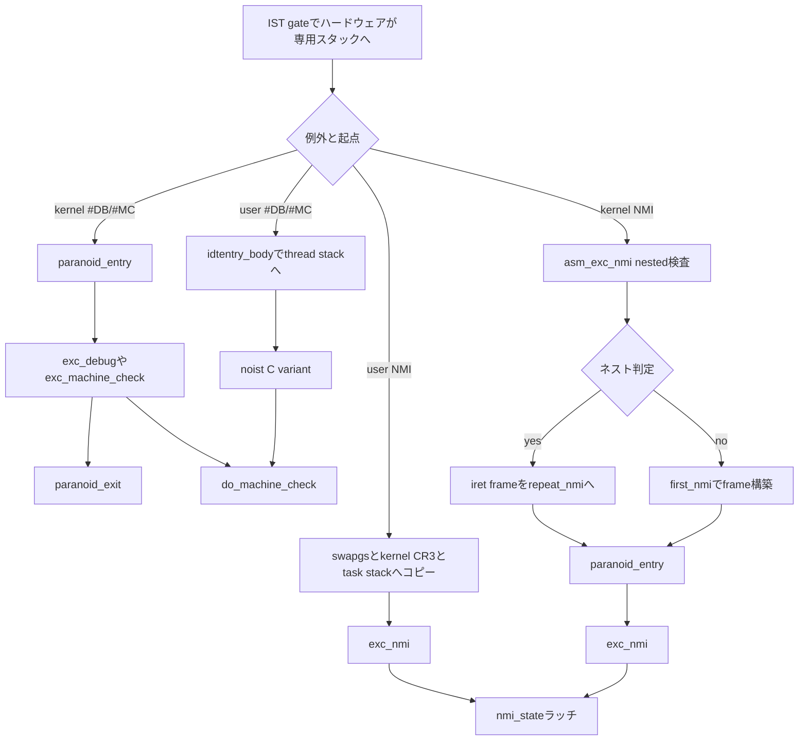

# 第13章 NMI と機械検査例外と IST と paranoid path

> 本章で読むソース
>
> - [`arch/x86/kernel/idt.c` L84-L108](https://github.com/gregkh/linux/blob/v6.18.38/arch/x86/kernel/idt.c#L84-L108)
> - [`arch/x86/entry/entry_64.S` L397-L430](https://github.com/gregkh/linux/blob/v6.18.38/arch/x86/entry/entry_64.S#L397-L430)
> - [`arch/x86/entry/entry_64.S` L868-L941](https://github.com/gregkh/linux/blob/v6.18.38/arch/x86/entry/entry_64.S#L868-L941)
> - [`arch/x86/entry/entry_64.S` L965-L999](https://github.com/gregkh/linux/blob/v6.18.38/arch/x86/entry/entry_64.S#L965-L999)
> - [`arch/x86/entry/entry_64.S` L1153-L1199](https://github.com/gregkh/linux/blob/v6.18.38/arch/x86/entry/entry_64.S#L1153-L1199)
> - [`arch/x86/entry/entry_64.S` L1267-L1311](https://github.com/gregkh/linux/blob/v6.18.38/arch/x86/entry/entry_64.S#L1267-L1311)
> - [`arch/x86/entry/entry_64.S` L1356-L1406](https://github.com/gregkh/linux/blob/v6.18.38/arch/x86/entry/entry_64.S#L1356-L1406)
> - [`arch/x86/entry/calling.h` L230-L246](https://github.com/gregkh/linux/blob/v6.18.38/arch/x86/entry/calling.h#L230-L246)
> - [`arch/x86/entry/calling.h` L305-L328](https://github.com/gregkh/linux/blob/v6.18.38/arch/x86/entry/calling.h#L305-L328)
> - [`arch/x86/kernel/nmi.c` L535-L608](https://github.com/gregkh/linux/blob/v6.18.38/arch/x86/kernel/nmi.c#L535-L608)
> - [`arch/x86/kernel/cpu/mce/core.c` L1501-L1603](https://github.com/gregkh/linux/blob/v6.18.38/arch/x86/kernel/cpu/mce/core.c#L1501-L1603)
> - [`arch/x86/kernel/cpu/mce/core.c` L2078-L2126](https://github.com/gregkh/linux/blob/v6.18.38/arch/x86/kernel/cpu/mce/core.c#L2078-L2126)

## この章の狙い

NMI、#MC、kernel-mode #DB などが通る **IST** と **paranoid path** を、第12章の通常 `error_entry` 経路と対比して追う。
アセンブリ層の NMI 再入抑制と C 層の `nmi_state` ラッチ、#MC の entry stub と wrapper による user と kernel 分岐を押さえる。

## 前提

[第11章](11-idt-construction.md) で `ISTG` が TSS の `ist[]` インデックスを gate に載せることを読んでいること。
[第12章](12-normal-exceptions.md) で非 IST 例外が `error_entry` を通り、保存 CS から user と kernel を判定することを理解していること。
IST スタックの物理配置は [第2章](../part00-foundation/02-gdt-tss-cpu-entry-area.md) で扱う。

## IST が担う役割

`def_idts` では NMI、#DF、#DB、#MC が `ISTG` で登録され、ハードウェアが TSS の `ist[]` で指定した専用スタックへ切り替える。
割り込まれたコンテキストのスタックポインタが壊れていても、handler は元のスタックを使わずに開始できる。

[`arch/x86/kernel/idt.c` L84-L108](https://github.com/gregkh/linux/blob/v6.18.38/arch/x86/kernel/idt.c#L84-L108)

```c
static const __initconst struct idt_data def_idts[] = {
	INTG(X86_TRAP_DE,		asm_exc_divide_error),
	ISTG(X86_TRAP_NMI,		asm_exc_nmi, IST_INDEX_NMI),
	INTG(X86_TRAP_BR,		asm_exc_bounds),
	INTG(X86_TRAP_UD,		asm_exc_invalid_op),
	INTG(X86_TRAP_NM,		asm_exc_device_not_available),
	INTG(X86_TRAP_OLD_MF,		asm_exc_coproc_segment_overrun),
	INTG(X86_TRAP_TS,		asm_exc_invalid_tss),
	INTG(X86_TRAP_NP,		asm_exc_segment_not_present),
	INTG(X86_TRAP_SS,		asm_exc_stack_segment),
	INTG(X86_TRAP_GP,		asm_exc_general_protection),
	INTG(X86_TRAP_SPURIOUS,		asm_exc_spurious_interrupt_bug),
	INTG(X86_TRAP_MF,		asm_exc_coprocessor_error),
	INTG(X86_TRAP_AC,		asm_exc_alignment_check),
	INTG(X86_TRAP_XF,		asm_exc_simd_coprocessor_error),

#ifdef CONFIG_X86_32
	TSKG(X86_TRAP_DF,		GDT_ENTRY_DOUBLEFAULT_TSS),
#else
	ISTG(X86_TRAP_DF,		asm_exc_double_fault, IST_INDEX_DF),
#endif
	ISTG(X86_TRAP_DB,		asm_exc_debug, IST_INDEX_DB),

#ifdef CONFIG_X86_MCE
	ISTG(X86_TRAP_MC,		asm_exc_machine_check, IST_INDEX_MCE),
#endif
```

IST 使用時はネスト制約が厳しい。
NMI は同一 IST スタック上で handler が再入するとフレームが壊れるため、アセンブリと C の二層で再入を抑える（後述）。
`#MC` はメモリ破損を伴い得るが、専用スタックだけで安全性が保証されるわけではない。

## paranoid path が必要な理由

第12章の通常経路は保存 CS の下位2ビットで user と kernel を判定し、既知の entry state を前提に `swapgs` と CR3 切替を省略できる。
kernel 由来の IST 例外は、システムコール入口や IRET 復帰の途中を割り込み得る。
このとき saved CS は kernel を示しても、CR3 や GS base が user state のまま残っている場合がある。

paranoid path は、利用可能な mitigation に応じて CR3、GS、`SPEC_CTRL` を保守的に保存復元する。
`SAVE_AND_SWITCH_TO_KERNEL_CR3` は PTI 有効時だけコードを持ち、現在 CR3 を退避し user page-table bit が立つときだけ kernel CR3 を書く。
PTI 無効時はこのマクロは空である。
FSGSBASE 有効時は `SAVE_AND_SET_GSBASE` で実際の GS base を `%rbx` に保存して kernel GS を設定する。
無効時は負の GS base が kernel である符号規約を検査し、`paranoid_exit` で `swapgs` 要否を `%ebx` の boolean で保持する。
`IBRS_ENTER` は `CONFIG_MITIGATION_IBRS_ENTRY` と `X86_FEATURE_KERNEL_IBRS` に依存する alternative で、`SPEC_CTRL` を `%r15` に退避する。

kernel 由来の #DB と #MC は `idtentry_mce_db` が `paranoid_entry` と `paranoid_exit` を通る。
user 由来の #DB と #MC は、ハードウェアが IST stack へ入ったあと stub が thread stack へ移し noist C variant を呼ぶ。
user 由来 NMI も `asm_exc_nmi` が thread stack へコピーして `exc_nmi` を直接呼び、`paranoid_entry` を使わない。
kernel 由来 NMI は nested-NMI 経路から `paranoid_entry` を使うが、`paranoid_exit` は使わない。

すべての IST 例外が paranoid path を通るわけではない。

## paranoid_entry と paranoid_exit

`SAVE_AND_SWITCH_TO_KERNEL_CR3` は PTI 有効時だけ CR3 を `%r14` に退避し、user page-table bit が立つときだけ kernel CR3 へ切り替える。
PTI 無効時はジャンプ先だけを残し、CR3 は触らない。

[`arch/x86/entry/calling.h` L230-L246](https://github.com/gregkh/linux/blob/v6.18.38/arch/x86/entry/calling.h#L230-L246)

```asm
.macro SAVE_AND_SWITCH_TO_KERNEL_CR3 scratch_reg:req save_reg:req
	ALTERNATIVE "jmp .Ldone_\@", "", X86_FEATURE_PTI
	movq	%cr3, \scratch_reg
	movq	\scratch_reg, \save_reg
	/*
	 * Test the user pagetable bit. If set, then the user page tables
	 * are active. If clear CR3 already has the kernel page table
	 * active.
	 */
	bt	$PTI_USER_PGTABLE_BIT, \scratch_reg
	jnc	.Ldone_\@

	ADJUST_KERNEL_CR3 \scratch_reg
	movq	\scratch_reg, %cr3

.Ldone_\@:
.endm
```

`IBRS_ENTER` も `CONFIG_MITIGATION_IBRS_ENTRY` と `X86_FEATURE_KERNEL_IBRS` が有効なときだけ `SPEC_CTRL` を保存する。

[`arch/x86/entry/calling.h` L305-L328](https://github.com/gregkh/linux/blob/v6.18.38/arch/x86/entry/calling.h#L305-L328)

```asm
.macro IBRS_ENTER save_reg
#ifdef CONFIG_MITIGATION_IBRS_ENTRY
	ALTERNATIVE "jmp .Lend_\@", "", X86_FEATURE_KERNEL_IBRS
	movl	$MSR_IA32_SPEC_CTRL, %ecx

.ifnb \save_reg
	rdmsr
	shl	$32, %rdx
	or	%rdx, %rax
	mov	%rax, \save_reg
	test	$SPEC_CTRL_IBRS, %eax
	jz	.Ldo_wrmsr_\@
	lfence
	jmp	.Lend_\@
.Ldo_wrmsr_\@:
.endif

	movq	PER_CPU_VAR(x86_spec_ctrl_current), %rdx
	movl	%edx, %eax
	shr	$32, %rdx
	wrmsr
.Lend_\@:
#endif
.endm
```

`paranoid_entry` 本体は、上記マクロのあと FSGSBASE の有無で GS を分岐する。
CS は iret frame にあるが、user CR3 のまま kernel に戻ろうとしているケースでは信頼できない、というコメントが理由を述べている。
FSGSBASE 有効時は `SAVE_AND_SET_GSBASE` で実際の GS base を `%rbx` に保存し kernel GS を設定する。
無効時は符号規約で kernel GS か判定し、user GS なら `swapgs` する。

[`arch/x86/entry/entry_64.S` L868-L941](https://github.com/gregkh/linux/blob/v6.18.38/arch/x86/entry/entry_64.S#L868-L941)

```asm
SYM_CODE_START(paranoid_entry)
	ANNOTATE_NOENDBR
	UNWIND_HINT_FUNC
	PUSH_AND_CLEAR_REGS save_ret=1
	ENCODE_FRAME_POINTER 8

	/*
	 * Always stash CR3 in %r14.  This value will be restored,
	 * verbatim, at exit.  Needed if paranoid_entry interrupted
	 * another entry that already switched to the user CR3 value
	 * but has not yet returned to userspace.
	 *
	 * This is also why CS (stashed in the "iret frame" by the
	 * hardware at entry) can not be used: this may be a return
	 * to kernel code, but with a user CR3 value.
	 *
	 * Switching CR3 does not depend on kernel GSBASE so it can
	 * be done before switching to the kernel GSBASE. This is
	 * required for FSGSBASE because the kernel GSBASE has to
	 * be retrieved from a kernel internal table.
	 */
	SAVE_AND_SWITCH_TO_KERNEL_CR3 scratch_reg=%rax save_reg=%r14

	/*
	 * Handling GSBASE depends on the availability of FSGSBASE.
	 *
	 * Without FSGSBASE the kernel enforces that negative GSBASE
	 * values indicate kernel GSBASE. With FSGSBASE no assumptions
	 * can be made about the GSBASE value when entering from user
	 * space.
	 */
	ALTERNATIVE "jmp .Lparanoid_entry_checkgs", "", X86_FEATURE_FSGSBASE

	/*
	 * Read the current GSBASE and store it in %rbx unconditionally,
	 * retrieve and set the current CPUs kernel GSBASE. The stored value
	 * has to be restored in paranoid_exit unconditionally.
	 *
	 * The unconditional write to GS base below ensures that no subsequent
	 * loads based on a mispredicted GS base can happen, therefore no LFENCE
	 * is needed here.
	 */
	SAVE_AND_SET_GSBASE scratch_reg=%rax save_reg=%rbx
	jmp .Lparanoid_gsbase_done

.Lparanoid_entry_checkgs:
	/* EBX = 1 -> kernel GSBASE active, no restore required */
	movl	$1, %ebx

	/*
	 * The kernel-enforced convention is a negative GSBASE indicates
	 * a kernel value. No SWAPGS needed on entry and exit.
	 */
	movl	$MSR_GS_BASE, %ecx
	rdmsr
	testl	%edx, %edx
	js	.Lparanoid_kernel_gsbase

	/* EBX = 0 -> SWAPGS required on exit */
	xorl	%ebx, %ebx
	swapgs
.Lparanoid_kernel_gsbase:
	FENCE_SWAPGS_KERNEL_ENTRY
.Lparanoid_gsbase_done:

	/*
	 * Once we have CR3 and %GS setup save and set SPEC_CTRL. Just like
	 * CR3 above, keep the old value in a callee saved register.
	 */
	IBRS_ENTER save_reg=%r15
	UNTRAIN_RET_FROM_CALL

	RET
SYM_CODE_END(paranoid_entry)
```

`paranoid_exit` は `IBRS_EXIT`、CR3 復元、GS base 復元の順で戻す。
FSGSBASE 有効時は `wrgsbase %rbx`、無効時は `%ebx` が 0 なら `swapgs` する。
user 由来の例外は `error_return` を通るため、この exit は kernel 由来の IST 例外に限定される。

[`arch/x86/entry/entry_64.S` L965-L999](https://github.com/gregkh/linux/blob/v6.18.38/arch/x86/entry/entry_64.S#L965-L999)

```asm
SYM_CODE_START_LOCAL(paranoid_exit)
	UNWIND_HINT_REGS

	/*
	 * Must restore IBRS state before both CR3 and %GS since we need access
	 * to the per-CPU x86_spec_ctrl_shadow variable.
	 */
	IBRS_EXIT save_reg=%r15

	/*
	 * The order of operations is important. PARANOID_RESTORE_CR3 requires
	 * kernel GSBASE.
	 *
	 * NB to anyone to try to optimize this code: this code does
	 * not execute at all for exceptions from user mode. Those
	 * exceptions go through error_return instead.
	 */
	PARANOID_RESTORE_CR3 scratch_reg=%rax save_reg=%r14

	/* Handle the three GSBASE cases */
	ALTERNATIVE "jmp .Lparanoid_exit_checkgs", "", X86_FEATURE_FSGSBASE

	/* With FSGSBASE enabled, unconditionally restore GSBASE */
	wrgsbase	%rbx
	jmp		restore_regs_and_return_to_kernel

.Lparanoid_exit_checkgs:
	/* On non-FSGSBASE systems, conditionally do SWAPGS */
	testl		%ebx, %ebx
	jnz		restore_regs_and_return_to_kernel

	/* We are returning to a context with user GSBASE */
	swapgs
	jmp		restore_regs_and_return_to_kernel
SYM_CODE_END(paranoid_exit)
```

## NMI の二層再入抑制

### user 起点: thread stack への直接配送

user 起点 NMI は、ハードウェアが NMI 専用 IST stack へ入ったあと `asm_exc_nmi` が CS を検査して分岐する。
`swapgs` と kernel CR3 切替のあと、iret frame を thread stack へコピーし `PUSH_AND_CLEAR_REGS` で `pt_regs` を構築する。
`paranoid_entry` は通らず、`exc_nmi` を直接呼んで `swapgs_restore_regs_and_return_to_usermode` で戻る。

[`arch/x86/entry/entry_64.S` L1153-L1199](https://github.com/gregkh/linux/blob/v6.18.38/arch/x86/entry/entry_64.S#L1153-L1199)

```asm
	testb	$3, CS-RIP+8(%rsp)
	jz	.Lnmi_from_kernel

	/*
	 * NMI from user mode.  We need to run on the thread stack, but we
	 * can't go through the normal entry paths: NMIs are masked, and
	 * we don't want to enable interrupts, because then we'll end
	 * up in an awkward situation in which IRQs are on but NMIs
	 * are off.
	 *
	 * We also must not push anything to the stack before switching
	 * stacks lest we corrupt the "NMI executing" variable.
	 */

	swapgs
	FENCE_SWAPGS_USER_ENTRY
	SWITCH_TO_KERNEL_CR3 scratch_reg=%rdx
	movq	%rsp, %rdx
	movq	PER_CPU_VAR(cpu_current_top_of_stack), %rsp
	UNWIND_HINT_IRET_REGS base=%rdx offset=8
	pushq	5*8(%rdx)	/* pt_regs->ss */
	pushq	4*8(%rdx)	/* pt_regs->rsp */
	pushq	3*8(%rdx)	/* pt_regs->flags */
	pushq	2*8(%rdx)	/* pt_regs->cs */
	pushq	1*8(%rdx)	/* pt_regs->rip */
	UNWIND_HINT_IRET_REGS
	pushq   $-1		/* pt_regs->orig_ax */
	PUSH_AND_CLEAR_REGS rdx=(%rdx)
	ENCODE_FRAME_POINTER

	IBRS_ENTER
	UNTRAIN_RET

	/*
	 * At this point we no longer need to worry about stack damage
	 * due to nesting -- we're on the normal thread stack and we're
	 * done with the NMI stack.
	 */

	movq	%rsp, %rdi
	call	exc_nmi

	/*
	 * Return back to user mode.  We must *not* do the normal exit
	 * work, because we don't want to enable interrupts.
	 */
	jmp	swapgs_restore_regs_and_return_to_usermode
```

espfix や IRET fault の都合で、user 起点は IST 入口のあと thread stack へ移す必要がある。

### kernel 起点: asm_exc_nmi

kernel 由来の NMI は NMI 専用 IST スタック上で `asm_exc_nmi` が動く。
ネスト検出は三つある。
スタック上の「NMI executing」スロットが 1 か、割り込まれた RSP が NMI スタック範囲内か、`repeat_nmi` と `end_repeat_nmi` の間かを検査する。

ネストと判定された場合、iret frame の RIP を `repeat_nmi` へ差し替えて outer NMI の `iretq` 後に一度だけ再実行させる。
これは stack frame の保護であり、内側 NMI が outer の iret frame を書き換えないようにする。

[`arch/x86/entry/entry_64.S` L1267-L1311](https://github.com/gregkh/linux/blob/v6.18.38/arch/x86/entry/entry_64.S#L1267-L1311)

```asm
	cmpl	$1, -8(%rsp)
	je	nested_nmi

	/*
	 * Now test if the previous stack was an NMI stack.  This covers
	 * the case where we interrupt an outer NMI after it clears
	 * "NMI executing" but before IRET.  We need to be careful, though:
	 * there is one case in which RSP could point to the NMI stack
	 * despite there being no NMI active: naughty userspace controls
	 * RSP at the very beginning of the SYSCALL targets.  We can
	 * pull a fast one on naughty userspace, though: we program
	 * SYSCALL to mask DF, so userspace cannot cause DF to be set
	 * if it controls the kernel's RSP.  We set DF before we clear
	 * "NMI executing".
	 */
	lea	6*8(%rsp), %rdx
	/* Compare the NMI stack (rdx) with the stack we came from (4*8(%rsp)) */
	cmpq	%rdx, 4*8(%rsp)
	/* If the stack pointer is above the NMI stack, this is a normal NMI */
	ja	first_nmi

	subq	$EXCEPTION_STKSZ, %rdx
	cmpq	%rdx, 4*8(%rsp)
	/* If it is below the NMI stack, it is a normal NMI */
	jb	first_nmi

	/* Ah, it is within the NMI stack. */

	testb	$(X86_EFLAGS_DF >> 8), (3*8 + 1)(%rsp)
	jz	first_nmi	/* RSP was user controlled. */

	/* This is a nested NMI. */

nested_nmi:
	/*
	 * Modify the "iret" frame to point to repeat_nmi, forcing another
	 * iteration of NMI handling.
	 */
	subq	$8, %rsp
	leaq	-10*8(%rsp), %rdx
	pushq	$__KERNEL_DS
	pushq	%rdx
	pushfq
	pushq	$__KERNEL_CS
	pushq	$repeat_nmi

	/* Put stack back */
	addq	$(6*8), %rsp

nested_nmi_out:
	popq	%rdx

	/* We are returning to kernel mode, so this cannot result in a fault. */
	iretq
```

初回 NMI は outermost frame と iret frame を構築し、`repeat_nmi` で「NMI executing」を 1 にしてから `paranoid_entry` 経由で `exc_nmi` を呼ぶ。
`paranoid_exit` は使わず、専用の CR3 と GS 復元後に `iretq` で戻す。

[`arch/x86/entry/entry_64.S` L1356-L1406](https://github.com/gregkh/linux/blob/v6.18.38/arch/x86/entry/entry_64.S#L1356-L1406)

```asm
repeat_nmi:
	ANNOTATE_NOENDBR // this code
	/*
	 * If there was a nested NMI, the first NMI's iret will return
	 * here. But NMIs are still enabled and we can take another
	 * nested NMI. The nested NMI checks the interrupted RIP to see
	 * if it is between repeat_nmi and end_repeat_nmi, and if so
	 * it will just return, as we are about to repeat an NMI anyway.
	 * This makes it safe to copy to the stack frame that a nested
	 * NMI will update.
	 *
	 * RSP is pointing to "outermost RIP".  gsbase is unknown, but, if
	 * we're repeating an NMI, gsbase has the same value that it had on
	 * the first iteration.  paranoid_entry will load the kernel
	 * gsbase if needed before we call exc_nmi().  "NMI executing"
	 * is zero.
	 */
	movq	$1, 10*8(%rsp)		/* Set "NMI executing". */

	/*
	 * Copy the "outermost" frame to the "iret" frame.  NMIs that nest
	 * here must not modify the "iret" frame while we're writing to
	 * it or it will end up containing garbage.
	 */
	addq	$(10*8), %rsp
	.rept 5
	pushq	-6*8(%rsp)
	.endr
	subq	$(5*8), %rsp
end_repeat_nmi:
	ANNOTATE_NOENDBR // this code

	/*
	 * Everything below this point can be preempted by a nested NMI.
	 * If this happens, then the inner NMI will change the "iret"
	 * frame to point back to repeat_nmi.
	 */
	pushq	$-1				/* ORIG_RAX: no syscall to restart */

	/*
	 * Use paranoid_entry to handle SWAPGS, but no need to use paranoid_exit
	 * as we should not be calling schedule in NMI context.
	 * Even with normal interrupts enabled. An NMI should not be
	 * setting NEED_RESCHED or anything that normal interrupts and
	 * exceptions might do.
	 */
	call	paranoid_entry
	UNWIND_HINT_REGS

	movq	%rsp, %rdi
	call	exc_nmi
```

### C 層: exc_nmi と nmi_state

`exc_nmi` は per-CPU の `nmi_state` を `NMI_NOT_RUNNING`、`NMI_EXECUTING`、`NMI_LATCHED` の三状態で管理する。
実行中に再入した NMI は `NMI_LATCHED` にして即 return し、ハンドラ本体の再入を防ぐ。
ラッチは binary で、実行中に複数 NMI が来ても再実行は一回で残りは coalesce される。

CR2 と DR7 も per-CPU に保存し、NMI 処理中のページフォールトやデバッグレジスタ汚染を隔離する。
終了時 `this_cpu_dec_return(nmi_state)` が非ゼロなら `nmi_restart` へ戻り、ラッチされた NMI を一回だけ処理する。

[`arch/x86/kernel/nmi.c` L535-L608](https://github.com/gregkh/linux/blob/v6.18.38/arch/x86/kernel/nmi.c#L535-L608)

```c
DEFINE_IDTENTRY_RAW(exc_nmi)
{
	irqentry_state_t irq_state;
	struct nmi_stats *nsp = this_cpu_ptr(&nmi_stats);

	/*
	 * Re-enable NMIs right here when running as an SEV-ES guest. This might
	 * cause nested NMIs, but those can be handled safely.
	 */
	sev_es_nmi_complete();
	if (IS_ENABLED(CONFIG_NMI_CHECK_CPU))
		raw_atomic_long_inc(&nsp->idt_calls);

	if (arch_cpu_is_offline(smp_processor_id())) {
		if (microcode_nmi_handler_enabled())
			microcode_offline_nmi_handler();
		return;
	}

	if (this_cpu_read(nmi_state) != NMI_NOT_RUNNING) {
		this_cpu_write(nmi_state, NMI_LATCHED);
		return;
	}
	this_cpu_write(nmi_state, NMI_EXECUTING);
	this_cpu_write(nmi_cr2, read_cr2());

nmi_restart:
	// ... (中略) ...

	this_cpu_write(nmi_dr7, local_db_save());

	irq_state = irqentry_nmi_enter(regs);

	inc_irq_stat(__nmi_count);

	if (IS_ENABLED(CONFIG_NMI_CHECK_CPU) && ignore_nmis) {
		WRITE_ONCE(nsp->idt_ignored, nsp->idt_ignored + 1);
	} else if (!ignore_nmis) {
		if (IS_ENABLED(CONFIG_NMI_CHECK_CPU)) {
			WRITE_ONCE(nsp->idt_nmi_seq, nsp->idt_nmi_seq + 1);
			WARN_ON_ONCE(!(nsp->idt_nmi_seq & 0x1));
		}
		default_do_nmi(regs);
		if (IS_ENABLED(CONFIG_NMI_CHECK_CPU)) {
			WRITE_ONCE(nsp->idt_nmi_seq, nsp->idt_nmi_seq + 1);
			WARN_ON_ONCE(nsp->idt_nmi_seq & 0x1);
		}
	}

	irqentry_nmi_exit(regs, irq_state);

	local_db_restore(this_cpu_read(nmi_dr7));

	sev_es_ist_exit();

	if (unlikely(this_cpu_read(nmi_cr2) != read_cr2()))
		write_cr2(this_cpu_read(nmi_cr2));
	if (IS_ENABLED(CONFIG_NMI_CHECK_CPU)) {
		WRITE_ONCE(nsp->idt_seq, nsp->idt_seq + 1);
		WARN_ON_ONCE(nsp->idt_seq & 0x1);
		WRITE_ONCE(nsp->recv_jiffies, jiffies);
	}
	if (this_cpu_dec_return(nmi_state))
		goto nmi_restart;
}
```

アセンブリ層は IST スタック上の frame 保護、C 層は handler 再入と CR2 と DR7 保護、という分担である。

## 機械検査例外の入口分岐と do_machine_check

### entry stub: idtentry_mce_db

64bit の #MC は `DECLARE_IDTENTRY_MCE` が `idtentry_mce_db` を展開する。
保存 CS の下位2ビットで user と kernel を分岐する主体はこの stub である。

kernel 由来は `paranoid_entry` を呼び、`exc_machine_check`（`DEFINE_IDTENTRY_MCE`）へ渡す。
user 由来は通常の `idtentry_body` で thread stack に切り替え、`noist_exc_machine_check`（`DEFINE_IDTENTRY_MCE_USER`）へ渡す。

[`arch/x86/entry/entry_64.S` L397-L430](https://github.com/gregkh/linux/blob/v6.18.38/arch/x86/entry/entry_64.S#L397-L430)

```asm
.macro idtentry_mce_db vector asmsym cfunc
SYM_CODE_START(\asmsym)
	UNWIND_HINT_IRET_ENTRY
	ENDBR
	ASM_CLAC
	cld

	pushq	$-1			/* ORIG_RAX: no syscall to restart */

	/*
	 * If the entry is from userspace, switch stacks and treat it as
	 * a normal entry.
	 */
	testb	$3, CS-ORIG_RAX(%rsp)
	jnz	.Lfrom_usermode_switch_stack_\@

	/* paranoid_entry returns GS information for paranoid_exit in EBX. */
	call	paranoid_entry

	UNWIND_HINT_REGS

	movq	%rsp, %rdi		/* pt_regs pointer */

	call	\cfunc

	jmp	paranoid_exit

	/* Switch to the regular task stack and use the noist entry point */
.Lfrom_usermode_switch_stack_\@:
	idtentry_body noist_\cfunc, has_error_code=0

_ASM_NOKPROBE(\asmsym)
SYM_CODE_END(\asmsym)
.endm
```

### C wrapper と do_machine_check

`exc_machine_check_kernel` は `irqentry_nmi_enter` のあと `do_machine_check` を呼ぶ。
`exc_machine_check_user` は `irqentry_enter_from_user_mode` と `irqentry_exit_to_user_mode` で囲む。
どちらの wrapper も最終的に同じ `do_machine_check` へ合流する。

`do_machine_check` 自体は `noinstr` の共通処理で、bank scan、severity 判定、CPU rendezvous、`mce_panic` または task kill を決める。
user と kernel の入口分岐はこの関数の外側にある。

[`arch/x86/kernel/cpu/mce/core.c` L2078-L2126](https://github.com/gregkh/linux/blob/v6.18.38/arch/x86/kernel/cpu/mce/core.c#L2078-L2126)

```c
static __always_inline void exc_machine_check_kernel(struct pt_regs *regs)
{
	irqentry_state_t irq_state;

	WARN_ON_ONCE(user_mode(regs));

	/*
	 * Only required when from kernel mode. See
	 * mce_check_crashing_cpu() for details.
	 */
	if (mca_cfg.initialized && mce_check_crashing_cpu())
		return;

	irq_state = irqentry_nmi_enter(regs);

	do_machine_check(regs);

	irqentry_nmi_exit(regs, irq_state);
}

static __always_inline void exc_machine_check_user(struct pt_regs *regs)
{
	irqentry_enter_from_user_mode(regs);

	do_machine_check(regs);

	irqentry_exit_to_user_mode(regs);
}

#ifdef CONFIG_X86_64
/* MCE hit kernel mode */
DEFINE_IDTENTRY_MCE(exc_machine_check)
{
	unsigned long dr7;

	dr7 = local_db_save();
	exc_machine_check_kernel(regs);
	local_db_restore(dr7);
}

/* The user mode variant. */
DEFINE_IDTENTRY_MCE_USER(exc_machine_check)
{
	unsigned long dr7;

	dr7 = local_db_save();
	exc_machine_check_user(regs);
	local_db_restore(dr7);
}
```

`do_machine_check` は MCE 情報を集め、local か broadcast かで `mce_start` と `mce_end` による rendezvous を行い、severity に応じて panic や task 終了を選ぶ。

[`arch/x86/kernel/cpu/mce/core.c` L1501-L1603](https://github.com/gregkh/linux/blob/v6.18.38/arch/x86/kernel/cpu/mce/core.c#L1501-L1603)

```c
noinstr void do_machine_check(struct pt_regs *regs)
{
	int worst = 0, order, no_way_out, kill_current_task, lmce, taint = 0;
	DECLARE_BITMAP(valid_banks, MAX_NR_BANKS) = { 0 };
	DECLARE_BITMAP(toclear, MAX_NR_BANKS) = { 0 };
	struct mce_hw_err *final;
	struct mce_hw_err err;
	char *msg = NULL;
	struct mce *m;

	if (unlikely(mce_flags.p5))
		return pentium_machine_check(regs);
	else if (unlikely(mce_flags.winchip))
		return winchip_machine_check(regs);
	else if (unlikely(!mca_cfg.initialized))
		return unexpected_machine_check(regs);

	if (mce_flags.skx_repmov_quirk && quirk_skylake_repmov())
		goto clear;

	/*
	 * Establish sequential order between the CPUs entering the machine
	 * check handler.
	 */
	order = -1;

	/*
	 * If no_way_out gets set, there is no safe way to recover from this
	 * MCE.
	 */
	no_way_out = 0;

	/*
	 * If kill_current_task is not set, there might be a way to recover from this
	 * error.
	 */
	kill_current_task = 0;

	/*
	 * MCEs are always local on AMD. Same is determined by MCG_STATUS_LMCES
	 * on Intel.
	 */
	lmce = 1;

	this_cpu_inc(mce_exception_count);

	mce_gather_info(&err, regs);
	m = &err.m;
	m->tsc = rdtsc();

	final = this_cpu_ptr(&hw_errs_seen);
	*final = err;

	no_way_out = mce_no_way_out(&err, &msg, valid_banks, regs);

	barrier();

	/*
	 * When no restart IP might need to kill or panic.
	 * Assume the worst for now, but if we find the
	 * severity is MCE_AR_SEVERITY we have other options.
	 */
	if (!(m->mcgstatus & MCG_STATUS_RIPV))
		kill_current_task = 1;
	/*
	 * Check if this MCE is signaled to only this logical processor,
	 * on Intel, Zhaoxin only.
	 */
	if (m->cpuvendor == X86_VENDOR_INTEL ||
	    m->cpuvendor == X86_VENDOR_ZHAOXIN)
		lmce = m->mcgstatus & MCG_STATUS_LMCES;

	/*
	 * Local machine check may already know that we have to panic.
	 * Broadcast machine check begins rendezvous in mce_start()
	 * Go through all banks in exclusion of the other CPUs. This way we
	 * don't report duplicated events on shared banks because the first one
	 * to see it will clear it.
	 */
	if (lmce) {
		if (no_way_out)
			mce_panic("Fatal local machine check", &err, msg);
	} else {
		order = mce_start(&no_way_out);
	}

	taint = __mc_scan_banks(&err, regs, final, toclear, valid_banks, no_way_out, &worst);

	if (!no_way_out)
		mce_clear_state(toclear);

	/*
	 * Do most of the synchronization with other CPUs.
	 * When there's any problem use only local no_way_out state.
	 */
	if (!lmce) {
		if (mce_end(order) < 0) {
			if (!no_way_out)
				no_way_out = worst >= MCE_PANIC_SEVERITY;

			if (no_way_out)
				mce_panic("Fatal machine check on current CPU", &err, msg);
		}
```

## 処理の流れ



## 高速化と最適化の工夫

IST は NMI、#DF、kernel-mode #DB、#MC に専用スタックを与え、割り込まれたスタックポインタに依存せず handler を開始できる。
スタック破損やネストで元スタックを信頼できない例外に対し、ハードウェアによるスタック切替で入口を固定化している。

加えて `paranoid_entry` は FSGSBASE 対応 CPU では実際の GS base を `RDGSBASE` で読み取り、`swapgs` の推測に頼らず不定な entry state でも kernel GS を確立できる。
PTI 有効時は user page-table bit を見てから kernel CR3 へ切り替えるため、entry state 判定前に CR3 を確保する。
第12章の通常経路が CS だけで user と kernel を分岐するのに対し、kernel 由来 IST 例外はより保守的なレジスタ保存が入口コストとなる。

## まとめ

- IST 例外は TSS の専用スタックへ切り替わり、元スタックが壊れていても handler を開始できる。
- paranoid path は mitigation に応じて CR3、GS、`SPEC_CTRL` を保存復元し、kernel 由来 #DB と #MC の entry state 不定に対応する。
- user 起点 #DB、#MC、NMI は IST 入口のあと thread stack へ移り、`paranoid_entry` を使わない。
- kernel 由来 NMI は `paranoid_entry` を使うが `paranoid_exit` は使わない。
- NMI の再入抑制は `asm_exc_nmi` の stack frame 保護と `exc_nmi` の `nmi_state` ラッチの二層である。
- #MC の user と kernel 分岐は `idtentry_mce_db` と MCE 用 wrapper が担い、`do_machine_check` は共通本体へ合流する。
- `do_machine_check` は bank scan と rendezvous と severity 判定で panic か task kill を決める。

## 関連する章

- [通常例外の入口と本体](12-normal-exceptions.md)
- [FRED のイベント配送と従来 IDT 経路との差](14-fred.md)
- [cpu_entry_area と IST スタック配置](../part00-foundation/02-gdt-tss-cpu-entry-area.md)
