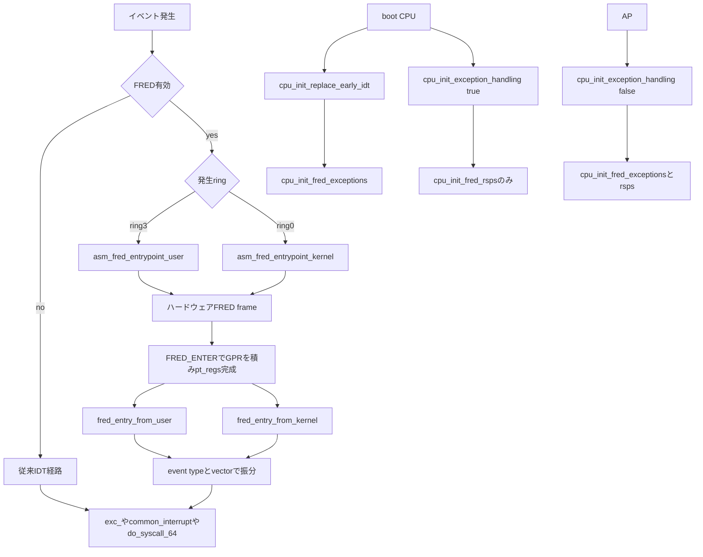

# 第14章 FRED のイベント配送と従来 IDT 経路との差

> 本章で読むソース
>
> - [`arch/x86/entry/entry_64_fred.S` L17-L57](https://github.com/gregkh/linux/blob/v6.18.38/arch/x86/entry/entry_64_fred.S#L17-L57)
> - [`arch/x86/entry/entry_fred.c` L189-L226](https://github.com/gregkh/linux/blob/v6.18.38/arch/x86/entry/entry_fred.c#L189-L226)
> - [`arch/x86/entry/entry_fred.c` L237-L267](https://github.com/gregkh/linux/blob/v6.18.38/arch/x86/entry/entry_fred.c#L237-L267)
> - [`arch/x86/entry/entry_fred.c` L269-L295](https://github.com/gregkh/linux/blob/v6.18.38/arch/x86/entry/entry_fred.c#L269-L295)
> - [`arch/x86/entry/entry_fred.c` L298-L308](https://github.com/gregkh/linux/blob/v6.18.38/arch/x86/entry/entry_fred.c#L298-L308)
> - [`arch/x86/kernel/fred.c` L28-L73](https://github.com/gregkh/linux/blob/v6.18.38/arch/x86/kernel/fred.c#L28-L73)
> - [`arch/x86/kernel/fred.c` L76-L93](https://github.com/gregkh/linux/blob/v6.18.38/arch/x86/kernel/fred.c#L76-L93)
> - [`arch/x86/include/asm/fred.h` L50-L54](https://github.com/gregkh/linux/blob/v6.18.38/arch/x86/include/asm/fred.h#L50-L54)
> - [`arch/x86/include/asm/ptrace.h` L59-L170](https://github.com/gregkh/linux/blob/v6.18.38/arch/x86/include/asm/ptrace.h#L59-L170)
> - [`arch/x86/kernel/cpu/common.c` L2395-L2412](https://github.com/gregkh/linux/blob/v6.18.38/arch/x86/kernel/cpu/common.c#L2395-L2412)

## この章の狙い

**FRED**（Flexible Return and Event Delivery）が CPU 対応かつ `CONFIG_X86_FRED` 有効時に、従来の IDT ベースのイベント配送を置き換える入口機構であることを押さえる。
ring ごとの二 entrypoint、MSR 初期化の二関数分割、従来経路と共通 C handler への合流を追う。

## 前提

[第11章](11-idt-construction.md) から [第13章](13-nmi-mce-ist-paranoid.md) で IDT 経路の asm stub、`error_entry`、IST、paranoid path を読んでいること。
FRED 無効時はこれらの経路が使われる。

## FRED とは何を置き換えるか

FRED 有効時、ハードウェアは IDT ではなく `IA32_FRED_CONFIG` に設定した entrypoint へイベントを配送する。
`CR4.FRED` 有効化後は IDT を invalidate し、以降の IDT 利用はバグ扱いである。

従来経路でも IDT gate の IST field を CPU が読み、TSS の `ist[]` で指定したスタックへハードウェアが自動切替する。
ソフトウェアが複雑になるのは、#DB と #MC の user 起点を IST stack から task stack へ移す処理、NMI の同一 IST stack 再利用に対する frame 保護、paranoid state の保存復元である。
FRED との差は hardware stack switching の有無ではなく、vector ごとの二 bit stack level、ring 3 は常に level 0、FRED frame による entry state の構造化、ring ごとの二つの fixed entrypoint にある。
復帰命令は user 向け **ERETU**、kernel 向け **ERETS** である。

FRED 無効時は第11章から第13章の IDT 経路が使われ、いずれの経路も同じ `exc_*` や `common_interrupt`、`do_syscall_64` へ合流する。

## ring ごとの二 entrypoint

FRED の入口は単一ではなく ring ごとに二つある。

`IA32_FRED_CONFIG` は 4KiB アラインの `asm_fred_entrypoint_user` を base に持つ。
ring 0 イベントはその 256 byte 後方の `asm_fred_entrypoint_kernel` へ入る。

両入口は `FRED_ENTER` で general-purpose register を `pt_regs` に積み、それぞれ `fred_entry_from_user` と `fred_entry_from_kernel` を呼ぶ。

[`arch/x86/entry/entry_64_fred.S` L17-L57](https://github.com/gregkh/linux/blob/v6.18.38/arch/x86/entry/entry_64_fred.S#L17-L57)

```asm
.macro FRED_ENTER
	UNWIND_HINT_END_OF_STACK
	ANNOTATE_NOENDBR
	PUSH_AND_CLEAR_REGS
	movq	%rsp, %rdi	/* %rdi -> pt_regs */
.endm

.macro FRED_EXIT
	UNWIND_HINT_REGS
	POP_REGS
.endm

/*
 * The new RIP value that FRED event delivery establishes is
 * IA32_FRED_CONFIG & ~FFFH for events that occur in ring 3.
 * Thus the FRED ring 3 entry point must be 4K page aligned.
 */
	.align 4096

SYM_CODE_START_NOALIGN(asm_fred_entrypoint_user)
	FRED_ENTER
	call	fred_entry_from_user
SYM_INNER_LABEL(asm_fred_exit_user, SYM_L_GLOBAL)
	FRED_EXIT
1:	ERETU

	_ASM_EXTABLE_TYPE(1b, asm_fred_entrypoint_user, EX_TYPE_ERETU)
SYM_CODE_END(asm_fred_entrypoint_user)

/*
 * The new RIP value that FRED event delivery establishes is
 * (IA32_FRED_CONFIG & ~FFFH) + 256 for events that occur in
 * ring 0, i.e., asm_fred_entrypoint_user + 256.
 */
	.org asm_fred_entrypoint_user + 256, 0xcc
SYM_CODE_START_NOALIGN(asm_fred_entrypoint_kernel)
	FRED_ENTER
	call	fred_entry_from_kernel
	FRED_EXIT
	ERETS
SYM_CODE_END(asm_fred_entrypoint_kernel)
```

`.org asm_fred_entrypoint_user + 256` で kernel entrypoint を user の直後に固定配置している。
ハードウェアが ring に応じて RIP を切り替える前提に合わせたレイアウトである。

## 構造化 FRED frame

FRED delivery では、ハードウェアが `orig_ax` から始まる構造化フレームを積む。
`orig_ax` には error code が常に入り、続いて RIP、`fred_cs`、RFLAGS、RSP、`fred_ss` が並ぶ。
`fred_cs` には stack level、`fred_ss` には event type と vector と long-mode 情報が入る。
さらに event data と reserved が `fred_info` に載り、`fred_frame` が `pt_regs` と `fred_info` の全体像になる。

[`arch/x86/include/asm/ptrace.h` L59-L170](https://github.com/gregkh/linux/blob/v6.18.38/arch/x86/include/asm/ptrace.h#L59-L170)

```c
struct fred_cs {
		/* CS selector */
	u64	cs	: 16,
		/* Stack level at event time */
		sl	:  2,
		/* IBT in WAIT_FOR_ENDBRANCH state */
		wfe	:  1,
			: 45;
};

struct fred_ss {
		/* SS selector */
	u64	ss	: 16,
		/* STI state */
		sti	:  1,
		/* Set if syscall, sysenter or INT n */
		swevent	:  1,
		/* Event is NMI type */
		nmi	:  1,
			: 13,
		/* Event vector */
		vector	:  8,
			:  8,
		/* Event type */
		type	:  4,
			:  4,
		/* Event was incident to enclave execution */
		enclave	:  1,
		/* CPU was in long mode */
		lm	:  1,
		/*
		 * Nested exception during FRED delivery, not set
		 * for #DF.
		 */
		nested	:  1,
			:  1,
		/*
		 * The length of the instruction causing the event.
		 * Only set for INTO, INT1, INT3, INT n, SYSCALL
		 * and SYSENTER.  0 otherwise.
		 */
		insnlen	:  4;
};

struct pt_regs {
	// ... (中略) ...
	/*
	 * orig_ax is used on entry for:
	 * - the syscall number (syscall, sysenter, int80)
	 * - error_code stored by the CPU on traps and exceptions
	 * - the interrupt number for device interrupts
	 *
	 * A FRED stack frame starts here:
	 *   1) It _always_ includes an error code;
	 *
	 *   2) The return frame for ERET[US] starts here, but
	 *      the content of orig_ax is ignored.
	 */
	unsigned long orig_ax;

	/* The IRETQ return frame starts here */
	unsigned long ip;

	union {
		/* CS selector */
		u16		cs;
		/* The extended 64-bit data slot containing CS */
		u64		csx;
		/* The FRED CS extension */
		struct fred_cs	fred_cs;
	};

	unsigned long flags;
	unsigned long sp;

	union {
		/* SS selector */
		u16		ss;
		/* The extended 64-bit data slot containing SS */
		u64		ssx;
		/* The FRED SS extension */
		struct fred_ss	fred_ss;
	};

	/*
	 * Top of stack on IDT systems, while FRED systems have extra fields
	 * defined above for storing exception related information, e.g. CR2 or
	 * DR6.
	 */
};
```

[`arch/x86/include/asm/fred.h` L50-L54](https://github.com/gregkh/linux/blob/v6.18.38/arch/x86/include/asm/fred.h#L50-L54)

```c
/* Full format of the FRED stack frame */
struct fred_frame {
	struct pt_regs   regs;
	struct fred_info info;
};
```

`fred_ss.type` と `fred_ss.vector` により、`fred_entry_from_user` と `fred_entry_from_kernel` は per-vector asm stub なしで dispatch できる。

`FRED_ENTER` は hardware frame の手前に `PUSH_AND_CLEAR_REGS` で general-purpose register を積み、`pt_regs` を完成させてから C を呼ぶ。
`entry_fred.c` では dispatch 前に `orig_ax` から error code を退避し、`regs->orig_ax = -1` とする。
これは `syscall_get_nr` が error code を syscall 番号と誤認しないためである。

## C ディスパッチ: event type と vector

`fred_entry_from_user` と `fred_entry_from_kernel` は `fred_ss.type` で大分類し、vector で個別 handler へ振り分ける。
`orig_ax` は error code を保持するが、ディスパッチ前に `-1` へ書き換えて `syscall_get_nr` が正しく動くようにする。

user 入口は `EVENT_TYPE_OTHER` で 64bit システムコールや 32bit sysenter も扱う。
kernel 入口は `EVENT_TYPE_OTHER` を持たず、privilege な software exception に限定される。

[`arch/x86/entry/entry_fred.c` L237-L267](https://github.com/gregkh/linux/blob/v6.18.38/arch/x86/entry/entry_fred.c#L237-L267)

```c
__visible noinstr void fred_entry_from_user(struct pt_regs *regs)
{
	unsigned long error_code = regs->orig_ax;

	/* Invalidate orig_ax so that syscall_get_nr() works correctly */
	regs->orig_ax = -1;

	switch (regs->fred_ss.type) {
	case EVENT_TYPE_EXTINT:
		return fred_extint(regs);
	case EVENT_TYPE_NMI:
		if (likely(regs->fred_ss.vector == X86_TRAP_NMI))
			return fred_exc_nmi(regs);
		break;
	case EVENT_TYPE_HWEXC:
		return fred_hwexc(regs, error_code);
	case EVENT_TYPE_SWINT:
		return fred_intx(regs);
	case EVENT_TYPE_PRIV_SWEXC:
		if (likely(regs->fred_ss.vector == X86_TRAP_DB))
			return fred_exc_debug(regs);
		break;
	case EVENT_TYPE_SWEXC:
		return fred_swexc(regs, error_code);
	case EVENT_TYPE_OTHER:
		return fred_other(regs);
	default: break;
	}

	return fred_bad_type(regs, error_code);
}
```

[`arch/x86/entry/entry_fred.c` L269-L295](https://github.com/gregkh/linux/blob/v6.18.38/arch/x86/entry/entry_fred.c#L269-L295)

```c
__visible noinstr void fred_entry_from_kernel(struct pt_regs *regs)
{
	unsigned long error_code = regs->orig_ax;

	/* Invalidate orig_ax so that syscall_get_nr() works correctly */
	regs->orig_ax = -1;

	switch (regs->fred_ss.type) {
	case EVENT_TYPE_EXTINT:
		return fred_extint(regs);
	case EVENT_TYPE_NMI:
		if (likely(regs->fred_ss.vector == X86_TRAP_NMI))
			return fred_exc_nmi(regs);
		break;
	case EVENT_TYPE_HWEXC:
		return fred_hwexc(regs, error_code);
	case EVENT_TYPE_PRIV_SWEXC:
		if (likely(regs->fred_ss.vector == X86_TRAP_DB))
			return fred_exc_debug(regs);
		break;
	case EVENT_TYPE_SWEXC:
		return fred_swexc(regs, error_code);
	default: break;
	}

	return fred_bad_type(regs, error_code);
}
```

ハードウェア例外は `fred_hwexc` が vector ごとに既存の `exc_*` へ委譲する。
`#PF` は頻出のため先頭で分岐し、`#MC` は `fred_exc_machine_check` 経由で第13章と同じ `do_machine_check` へ至る。

[`arch/x86/entry/entry_fred.c` L189-L226](https://github.com/gregkh/linux/blob/v6.18.38/arch/x86/entry/entry_fred.c#L189-L226)

```c
static noinstr void fred_hwexc(struct pt_regs *regs, unsigned long error_code)
{
	/* Optimize for #PF. That's the only exception which matters performance wise */
	if (likely(regs->fred_ss.vector == X86_TRAP_PF))
		return exc_page_fault(regs, error_code);

	switch (regs->fred_ss.vector) {
	case X86_TRAP_DE: return exc_divide_error(regs);
	case X86_TRAP_DB: return fred_exc_debug(regs);
	case X86_TRAP_BR: return exc_bounds(regs);
	case X86_TRAP_UD: return exc_invalid_op(regs);
	case X86_TRAP_NM: return exc_device_not_available(regs);
	case X86_TRAP_DF: return exc_double_fault(regs, error_code);
	case X86_TRAP_TS: return exc_invalid_tss(regs, error_code);
	case X86_TRAP_NP: return exc_segment_not_present(regs, error_code);
	case X86_TRAP_SS: return exc_stack_segment(regs, error_code);
	case X86_TRAP_GP: return exc_general_protection(regs, error_code);
	case X86_TRAP_MF: return exc_coprocessor_error(regs);
	case X86_TRAP_AC: return exc_alignment_check(regs, error_code);
	case X86_TRAP_XF: return exc_simd_coprocessor_error(regs);

#ifdef CONFIG_X86_MCE
	case X86_TRAP_MC: return fred_exc_machine_check(regs);
#endif
#ifdef CONFIG_INTEL_TDX_GUEST
	case X86_TRAP_VE: return exc_virtualization_exception(regs);
#endif
#ifdef CONFIG_X86_CET
	case X86_TRAP_CP: return exc_control_protection(regs, error_code);
#endif
#ifdef CONFIG_AMD_MEM_ENCRYPT
	case X86_TRAP_VC: return exc_vmm_communication(regs, error_code);
#endif

	default: return fred_bad_type(regs, error_code);
	}

}
```

外部割り込みは `fred_extint` が system vector テーブルか `common_interrupt` へ振り分ける。
KVM 向けには `__fred_entry_from_kvm` が IRQ と NMI だけを扱う薄い入口がある。

[`arch/x86/entry/entry_fred.c` L298-L308](https://github.com/gregkh/linux/blob/v6.18.38/arch/x86/entry/entry_fred.c#L298-L308)

```c
__visible noinstr void __fred_entry_from_kvm(struct pt_regs *regs)
{
	switch (regs->fred_ss.type) {
	case EVENT_TYPE_EXTINT:
		return fred_extint(regs);
	case EVENT_TYPE_NMI:
		return fred_exc_nmi(regs);
	default:
		WARN_ON_ONCE(1);
	}
}
```

## MSR 初期化の二関数

FRED の MSR 設定は `cpu_init_fred_exceptions` と `cpu_init_fred_rsps` に分かれる。

`cpu_init_fred_exceptions` は SS を `__KERNEL_DS` に初期化し、`IA32_FRED_CONFIG` に ring 3 entrypoint、redzone、interrupt stack level 0 を設定する。
`IA32_FRED_STKLVLS` と RSP1 から RSP3 をゼロにし、RSP0 cache を同期したうえで `CR4.FRED` を有効化し IDT を invalidate する。

[`arch/x86/kernel/fred.c` L28-L73](https://github.com/gregkh/linux/blob/v6.18.38/arch/x86/kernel/fred.c#L28-L73)

```c
void cpu_init_fred_exceptions(void)
{
	/* When FRED is enabled by default, remove this log message */
	pr_info("Initialize FRED on CPU%d\n", smp_processor_id());

	/*
	 * If a kernel event is delivered before a CPU goes to user level for
	 * the first time, its SS is NULL thus NULL is pushed into the SS field
	 * of the FRED stack frame.  But before ERETS is executed, the CPU may
	 * context switch to another task and go to user level.  Then when the
	 * CPU comes back to kernel mode, SS is changed to __KERNEL_DS.  Later
	 * when ERETS is executed to return from the kernel event handler, a #GP
	 * fault is generated because SS doesn't match the SS saved in the FRED
	 * stack frame.
	 *
	 * Initialize SS to __KERNEL_DS when enabling FRED to avoid such #GPs.
	 */
	loadsegment(ss, __KERNEL_DS);

	wrmsrq(MSR_IA32_FRED_CONFIG,
	       /* Reserve for CALL emulation */
	       FRED_CONFIG_REDZONE |
	       FRED_CONFIG_INT_STKLVL(0) |
	       FRED_CONFIG_ENTRYPOINT(asm_fred_entrypoint_user));

	wrmsrq(MSR_IA32_FRED_STKLVLS, 0);

	/*
	 * Ater a CPU offline/online cycle, the FRED RSP0 MSR should be
	 * resynchronized with its per-CPU cache.
	 */
	wrmsrq(MSR_IA32_FRED_RSP0, __this_cpu_read(fred_rsp0));

	wrmsrq(MSR_IA32_FRED_RSP1, 0);
	wrmsrq(MSR_IA32_FRED_RSP2, 0);
	wrmsrq(MSR_IA32_FRED_RSP3, 0);

	/* Enable FRED */
	cr4_set_bits(X86_CR4_FRED);
	/* Any further IDT use is a bug */
	idt_invalidate();

	/* Use int $0x80 for 32-bit system calls in FRED mode */
	setup_clear_cpu_cap(X86_FEATURE_SYSENTER32);
	setup_clear_cpu_cap(X86_FEATURE_SYSCALL32);
}
```

NMI、#DB、#MC、#DF の vector ごとの stack level と RSP1 から RSP3 の IST 相当 stack address は `cpu_init_fred_rsps` が設定する。
`setup_cpu_entry_areas` の後に呼ばれ、従来の IST スタック領域を FRED の RSP MSR へ写す。

[`arch/x86/kernel/fred.c` L76-L93](https://github.com/gregkh/linux/blob/v6.18.38/arch/x86/kernel/fred.c#L76-L93)

```c
void cpu_init_fred_rsps(void)
{
	/*
	 * The purpose of separate stacks for NMI, #DB and #MC *in the kernel*
	 * (remember that user space faults are always taken on stack level 0)
	 * is to avoid overflowing the kernel stack.
	 */
	wrmsrq(MSR_IA32_FRED_STKLVLS,
	       FRED_STKLVL(X86_TRAP_DB,  FRED_DB_STACK_LEVEL) |
	       FRED_STKLVL(X86_TRAP_NMI, FRED_NMI_STACK_LEVEL) |
	       FRED_STKLVL(X86_TRAP_MC,  FRED_MC_STACK_LEVEL) |
	       FRED_STKLVL(X86_TRAP_DF,  FRED_DF_STACK_LEVEL));

	/* The FRED equivalents to IST stacks... */
	wrmsrq(MSR_IA32_FRED_RSP1, __this_cpu_ist_top_va(DB));
	wrmsrq(MSR_IA32_FRED_RSP2, __this_cpu_ist_top_va(NMI));
	wrmsrq(MSR_IA32_FRED_RSP3, __this_cpu_ist_top_va(DF));
}
```

`cpu_init_exception_handling` は FRED 有効時に `cpu_init_fred_rsps` を必ず呼ぶ。
boot CPU は早期 boot の `cpu_init_replace_early_idt` が先に `cpu_init_fred_exceptions` で FRED を有効化するため、`cpu_init_exception_handling(true)` は `cpu_init_fred_rsps` だけを呼ぶ。
AP の `cpu_init_exception_handling(false)` は `cpu_init_fred_exceptions` と `cpu_init_fred_rsps` の両方を呼ぶ。

[`arch/x86/kernel/cpu/common.c` L2395-L2412](https://github.com/gregkh/linux/blob/v6.18.38/arch/x86/kernel/cpu/common.c#L2395-L2412)

```c
	if (cpu_feature_enabled(X86_FEATURE_FRED)) {
		/* The boot CPU has enabled FRED during early boot */
		if (!boot_cpu)
			cpu_init_fred_exceptions();

		cpu_init_fred_rsps();
	} else {
		load_current_idt();
	}
}

void __init cpu_init_replace_early_idt(void)
{
	if (cpu_feature_enabled(X86_FEATURE_FRED))
		cpu_init_fred_exceptions();
	else
		idt_setup_early_pf();
}
```

FRED 無効時は従来どおり `tss_setup_ist` と `load_current_idt` が IST と IDT を整える。

## 従来 IDT 経路との差

| 観点 | IDT 経路 | FRED 経路 |
|---|---|---|
| 入口テーブル | ベクタごとの IDT gate | `IA32_FRED_CONFIG` の固定 entrypoint 二つ |
| user と kernel の切替 | asm stub が CS を検査し `swapgs` や paranoid path | ハードウェアが ring に応じた entrypoint へ配送 |
| 専用スタック | IDT gate の IST field と TSS `ist[]` でハードウェア切替、user 起点の IST 離脱はソフトウェア | vector ごとの stack level と RSP MSR でハードウェア管理 |
| entry state | iret frame と stub による組み立て | 構造化 FRED frame と `fred_ss` による dispatch |
| 復帰 | `iretq` 系 | ERETU と ERETS |
| C handler | 同一 `exc_*` へ合流 | 同一 `exc_*` へ合流 |

FRED は per-vector stub と paranoid path の一部をハードウェアへ移し、ソフトウェアは event type と vector に応じた既存 handler へのディスパッチに集中できる。

## 処理の流れ



## 高速化と最適化の工夫

FRED は ring ごとの固定 entrypoint と構造化フレームで、ベクタごとの IDT stub と `swapgs` や paranoid path の一部を不要にする。
ハードウェアが `fred_ss` を含む entry state を提供するため、第13章の paranoid path のような不定 entry state への対処コストを入口から減らせる。

stack level もハードウェアが管理し、vector ごとに二 bit で指定できる。
ring 3 の fault は常に level 0 である。
`cpu_init_fred_rsps` は既存の `cpu_entry_area` IST スタックを RSP MSR へ再利用し、メモリレイアウトを二重に持たない。

## まとめ

- FRED は CPU 対応かつ `CONFIG_X86_FRED` 有効時に IDT 配送を置き換える入口機構である。
- 入口は ring ごとに `asm_fred_entrypoint_user` と 256 byte 後方の `asm_fred_entrypoint_kernel` の二つである。
- ハードウェア FRED frame は error code、RIP、`fred_cs`、RFLAGS、RSP、`fred_ss`、event data を持ち、`FRED_ENTER` がその手前に GPR を積んで `pt_regs` を完成させる。
- boot CPU は `cpu_init_replace_early_idt` で先に FRED を有効化し、後の `cpu_init_exception_handling(true)` は `cpu_init_fred_rsps` だけを呼ぶ。
- AP の `cpu_init_exception_handling(false)` は `cpu_init_fred_exceptions` と `cpu_init_fred_rsps` の両方を呼ぶ。
- C ディスパッチは event type と vector で従来と共通の handler へ合流する。
- FRED 無効時は第11章から第13章の IDT 経路が使われる。

## 関連する章

- [IDT の構築と IDTENTRY 機構](11-idt-construction.md)
- [通常例外の入口と本体](12-normal-exceptions.md)
- [NMI と機械検査例外と IST と paranoid path](13-nmi-mce-ist-paranoid.md)
