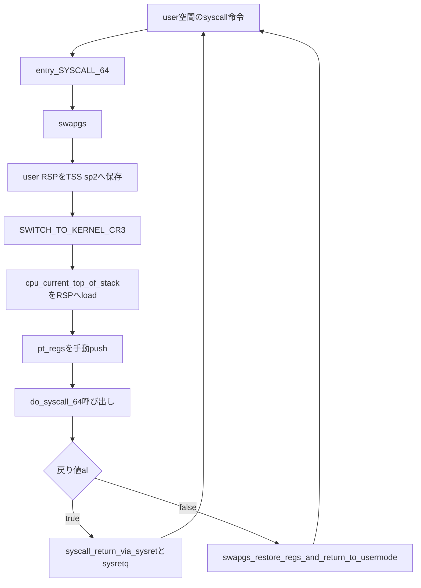

# 第15章 entry_SYSCALL_64 のアセンブリ経路

> 本章で読むソース
>
> - [`arch/x86/entry/entry_64.S` L80-L85](https://github.com/gregkh/linux/blob/v6.18.38/arch/x86/entry/entry_64.S#L80-L85)
> - [`arch/x86/entry/entry_64.S` L87-L95](https://github.com/gregkh/linux/blob/v6.18.38/arch/x86/entry/entry_64.S#L87-L95)
> - [`arch/x86/entry/entry_64.S` L100-L121](https://github.com/gregkh/linux/blob/v6.18.38/arch/x86/entry/entry_64.S#L100-L121)
> - [`arch/x86/entry/entry_64.S` L130-L136](https://github.com/gregkh/linux/blob/v6.18.38/arch/x86/entry/entry_64.S#L130-L136)
> - [`arch/x86/entry/entry_64.S` L137-L170](https://github.com/gregkh/linux/blob/v6.18.38/arch/x86/entry/entry_64.S#L137-L170)
> - [`arch/x86/kernel/cpu/common.c` L2222-L2244](https://github.com/gregkh/linux/blob/v6.18.38/arch/x86/kernel/cpu/common.c#L2222-L2244)

## この章の狙い

64bit システムコールの **アセンブリ入口** `entry_SYSCALL_64` を、ユーザー空間の `syscall` 命令から `do_syscall_64` 呼び出し、復帰まで追う。
SYSCALL が IRET frame を積まない前提で `pt_regs` を手動構築する流れと、sysret と iret の分岐入口を押さえる。

## 前提

[第9章](../part02-cpu-init/09-cpu-init-cr-msr.md) で `syscall_init` が `MSR_LSTAR` に `entry_SYSCALL_64` を設定することを読んでいること。
C 側のディスパッチと sysret 条件の詳細は [第16章](16-do-syscall-64-dispatch.md) へ委譲する。

## SYSCALL 命令と MSR_LSTAR

x86-64 の `syscall` 命令は、ハードウェアが `MSR_LSTAR` のアドレスへ直接制御を移す。
例外ゲートや IDT ベクタ探索を介さないため、`int 0x80` より入口コストが低い。

`idt_syscall_init` は boot 時に `MSR_LSTAR` へ `entry_SYSCALL_64` を書き込む。

[`arch/x86/entry/entry_64.S` L80-L85](https://github.com/gregkh/linux/blob/v6.18.38/arch/x86/entry/entry_64.S#L80-L85)

```asm
 * Only called from user space.
 *
 * When user can change pt_regs->foo always force IRET. That is because
 * it deals with uncanonical addresses better. SYSRET has trouble
 * with them due to bugs in both AMD and Intel CPUs.
 */
```

[`arch/x86/kernel/cpu/common.c` L2222-L2244](https://github.com/gregkh/linux/blob/v6.18.38/arch/x86/kernel/cpu/common.c#L2222-L2244)

```c
static inline void idt_syscall_init(void)
{
	wrmsrq(MSR_LSTAR, (unsigned long)entry_SYSCALL_64);

	if (ia32_enabled()) {
		wrmsrq_cstar((unsigned long)entry_SYSCALL_compat);
		/*
		 * This only works on Intel CPUs.
		 * On AMD CPUs these MSRs are 32-bit, CPU truncates MSR_IA32_SYSENTER_EIP.
		 * This does not cause SYSENTER to jump to the wrong location, because
		 * AMD doesn't allow SYSENTER in long mode (either 32- or 64-bit).
		 */
		wrmsrq_safe(MSR_IA32_SYSENTER_CS, (u64)__KERNEL_CS);
		wrmsrq_safe(MSR_IA32_SYSENTER_ESP,
			    (unsigned long)(cpu_entry_stack(smp_processor_id()) + 1));
		wrmsrq_safe(MSR_IA32_SYSENTER_EIP, (u64)entry_SYSENTER_compat);
	} else {
		wrmsrq_cstar((unsigned long)entry_SYSCALL32_ignore);
		wrmsrq_safe(MSR_IA32_SYSENTER_CS, (u64)GDT_ENTRY_INVALID_SEG);
		wrmsrq_safe(MSR_IA32_SYSENTER_ESP, 0ULL);
		wrmsrq_safe(MSR_IA32_SYSENTER_EIP, 0ULL);
	}
```

ハードウェアは `RCX` に戻り先 RIP、`R11` に RFLAGS を保存し、`RAX` にシステムコール番号を残す。
`SS`、`RSP`、`CS` は `syscall` 自体ではスタックへ積まれない。

## swapgs と kernel スタックへの切替

`entry_SYSCALL_64` は user 空間からのみ呼ばれる。
最初に `swapgs` で kernel GS を有効にし、GS-relative memory access で per-CPU 変数へアクセスする。

user RSP は `cpu_tss_rw.sp2` へ退避する。
`cpu_tss_rw.sp2` は TSS の scratch 領域であり、後で `pt_regs->sp` として復元する。

`SWITCH_TO_KERNEL_CR3` で user CR3 から kernel CR3 へ切り替えたあと、`cpu_current_top_of_stack` を `%rsp` へ load して kernel スタックへ移る。
CPU 番号の lookup や generic per-CPU 計算は行わず、`PER_CPU_VAR` 展開による GS-relative access で直接得る。

[`arch/x86/entry/entry_64.S` L87-L95](https://github.com/gregkh/linux/blob/v6.18.38/arch/x86/entry/entry_64.S#L87-L95)

```asm
SYM_CODE_START(entry_SYSCALL_64)
	UNWIND_HINT_ENTRY
	ENDBR

	swapgs
	/* tss.sp2 is scratch space. */
	movq	%rsp, PER_CPU_VAR(cpu_tss_rw + TSS_sp2)
	SWITCH_TO_KERNEL_CR3 scratch_reg=%rsp
	movq	PER_CPU_VAR(cpu_current_top_of_stack), %rsp
```

## pt_regs の手動構築と do_syscall_64 呼び出し

SYSCALL は IRET frame をハードウェアで積まない。
`entry_SYSCALL_64` が user SS、user RSP、RFLAGS（`R11` から）、`__USER_CS`、RIP（`RCX` から）、`orig_ax`（`RAX` から）を順に push し、そのあと `PUSH_AND_CLEAR_REGS` で残りの汎用レジスタを積む。

第1章で述べた `pt_regs` レイアウトと一致する。
`entry_SYSCALL_64_after_hwframe` は Xen PV などがハードウェアフレーム構築済みの地点から合流する内部ラベルである。

[`arch/x86/entry/entry_64.S` L100-L121](https://github.com/gregkh/linux/blob/v6.18.38/arch/x86/entry/entry_64.S#L100-L121)

```asm
	/* Construct struct pt_regs on stack */
	pushq	$__USER_DS				/* pt_regs->ss */
	pushq	PER_CPU_VAR(cpu_tss_rw + TSS_sp2)	/* pt_regs->sp */
	pushq	%r11					/* pt_regs->flags */
	pushq	$__USER_CS				/* pt_regs->cs */
	pushq	%rcx					/* pt_regs->ip */
SYM_INNER_LABEL(entry_SYSCALL_64_after_hwframe, SYM_L_GLOBAL)
	pushq	%rax					/* pt_regs->orig_ax */

	PUSH_AND_CLEAR_REGS rax=$-ENOSYS

	/* IRQs are off. */
	movq	%rsp, %rdi
	/* Sign extend the lower 32bit as syscall numbers are treated as int */
	movslq	%eax, %rsi

	/* clobbers %rax, make sure it is after saving the syscall nr */
	IBRS_ENTER
	UNTRAIN_RET
	CLEAR_BRANCH_HISTORY

	call	do_syscall_64		/* returns with IRQs disabled */
```

`%rdi` に `pt_regs` ポインタ、`%rsi` に符号拡張したシステムコール番号を渡して `do_syscall_64` を呼ぶ。

## syscall_return_via_sysret と iret への分岐

`do_syscall_64` は IRQ 無効のまま戻り、戻り値 `%al` が true なら sysret 経路、false なら iret 経路へ進む。
Xen PV では `ALTERNATIVE` により無条件で `swapgs_restore_regs_and_return_to_usermode` へ落ちる。

sysret 経路は `syscall_return_via_sysret` ラベルから始まる。
`IBRS_EXIT` と `POP_REGS` でレジスタを復元し、trampoline stack へ切り替えて user CR3 へ戻す。
最後に `swapgs` と `sysretq` で user 空間へ復帰する。

sysret に不適合な場合は `swapgs_restore_regs_and_return_to_usermode` が IRET 相当の完全復帰を行う。
判定条件の列挙は第16章の `do_syscall_64` が担う。

[`arch/x86/entry/entry_64.S` L130-L136](https://github.com/gregkh/linux/blob/v6.18.38/arch/x86/entry/entry_64.S#L130-L136)

```asm
	ALTERNATIVE "testb %al, %al; jz swapgs_restore_regs_and_return_to_usermode", \
		"jmp swapgs_restore_regs_and_return_to_usermode", X86_FEATURE_XENPV

	/*
	 * We win! This label is here just for ease of understanding
	 * perf profiles. Nothing jumps here.
	 */
```

[`arch/x86/entry/entry_64.S` L137-L170](https://github.com/gregkh/linux/blob/v6.18.38/arch/x86/entry/entry_64.S#L137-L170)

```asm
syscall_return_via_sysret:
	IBRS_EXIT
	POP_REGS pop_rdi=0

	/*
	 * Now all regs are restored except RSP and RDI.
	 * Save old stack pointer and switch to trampoline stack.
	 */
	movq	%rsp, %rdi
	movq	PER_CPU_VAR(cpu_tss_rw + TSS_sp0), %rsp
	UNWIND_HINT_END_OF_STACK

	pushq	RSP-RDI(%rdi)	/* RSP */
	pushq	(%rdi)		/* RDI */

	/*
	 * We are on the trampoline stack.  All regs except RDI are live.
	 * We can do future final exit work right here.
	 */
	STACKLEAK_ERASE_NOCLOBBER

	SWITCH_TO_USER_CR3_STACK scratch_reg=%rdi

	popq	%rdi
	popq	%rsp
SYM_INNER_LABEL(entry_SYSRETQ_unsafe_stack, SYM_L_GLOBAL)
	ANNOTATE_NOENDBR
	swapgs
	CLEAR_CPU_BUFFERS
	sysretq
SYM_INNER_LABEL(entry_SYSRETQ_end, SYM_L_GLOBAL)
	ANNOTATE_NOENDBR
	int3
SYM_CODE_END(entry_SYSCALL_64)
```

## 処理の流れ



## 高速化と最適化の工夫

SYSCALL と SYSRET は MSR 駆動で、例外ゲートや IDT ベクタ探索を介さずカーネル入口と復帰を行う。
`int 0x80` のような割り込み経由のコストを避けられる。

加えて `PER_CPU_VAR` による GS-relative memory access で `cpu_current_top_of_stack` を直接 load し、CPU 番号 lookup なしに kernel スタックへ切り替えられる。
入口アセンブリはスタック切替と `pt_regs` 構築に集中し、ディスパッチは C へ委譲する。

## まとめ

- `syscall` 命令は `MSR_LSTAR` が指す `entry_SYSCALL_64` へ直接遷移する。
- `swapgs` のあと GS-relative access で user RSP を退避し kernel スタックへ切り替える。
- SYSCALL は IRET frame を積まないため、entry が `pt_regs` を手動構築する。
- `do_syscall_64` の戻り値で sysret 経路と iret 経路が分岐する。
- sysret 経路は trampoline stack と user CR3 復元のあと `sysretq` で戻る。

## 関連する章

- [cpu_init と CR と MSR](../part02-cpu-init/09-cpu-init-cr-msr.md)
- [do_syscall_64 とディスパッチと戻り](16-do-syscall-64-dispatch.md)
- [vDSO と vsyscall](17-vdso-vsyscall.md)
