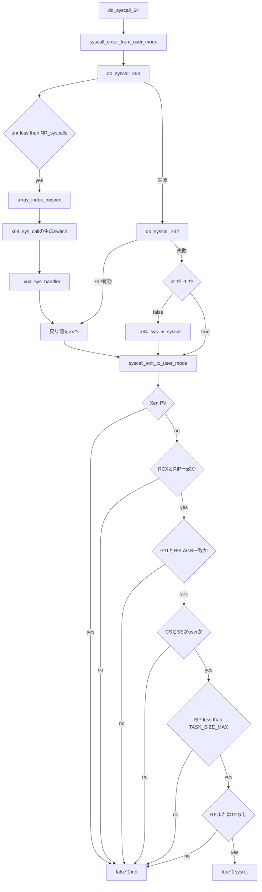

# 第16章 do_syscall_64 とディスパッチと戻り

> 本章で読むソース
>
> - [`arch/x86/entry/syscall_64.c` L23-L31](https://github.com/gregkh/linux/blob/v6.18.38/arch/x86/entry/syscall_64.c#L23-L31)
> - [`arch/x86/entry/syscall_64.c` L34-L50](https://github.com/gregkh/linux/blob/v6.18.38/arch/x86/entry/syscall_64.c#L34-L50)
> - [`arch/x86/entry/syscall_64.c` L53-L67](https://github.com/gregkh/linux/blob/v6.18.38/arch/x86/entry/syscall_64.c#L53-L67)
> - [`arch/x86/entry/syscall_64.c` L69-L84](https://github.com/gregkh/linux/blob/v6.18.38/arch/x86/entry/syscall_64.c#L69-L84)
> - [`arch/x86/entry/syscall_64.c` L87-L100](https://github.com/gregkh/linux/blob/v6.18.38/arch/x86/entry/syscall_64.c#L87-L100)
> - [`arch/x86/entry/syscall_64.c` L102-L141](https://github.com/gregkh/linux/blob/v6.18.38/arch/x86/entry/syscall_64.c#L102-L141)

## この章の狙い

`do_syscall_64` が entry から受け取った `pt_regs` とシステムコール番号を検証し、生成された switch で handler へ振り分ける C ディスパッチャであることを押さえる。
6.18.38 で `sys_call_table` が dispatch に使われない点と、sysret と iret の選択条件を正確に述べる。

## 前提

[第15章](15-entry-syscall-64.md) で `entry_SYSCALL_64` が `pt_regs` を構築して `do_syscall_64` を呼ぶ流れを読んでいること。
`syscall_exit_to_user_mode` 内部の signal や resched の汎用処理は foundation や sched 分冊の対象とし、本章では入口と出口判定に集中する。

## sys_call_table と生成 switch

6.18.38 では `sys_call_table[]` はシステムコールの dispatch には使われない。
`kernel/trace/trace_syscalls.c` がシステムコールアドレス参照のために残しているだけである。

実際の dispatch は `syscalls_64.h` から生成された `x64_sys_call` の switch 文が担う。
各 `case nr` が `__x64_sys_*` handler を直接呼ぶ。

[`arch/x86/entry/syscall_64.c` L23-L31](https://github.com/gregkh/linux/blob/v6.18.38/arch/x86/entry/syscall_64.c#L23-L31)

```c
/*
 * The sys_call_table[] is no longer used for system calls, but
 * kernel/trace/trace_syscalls.c still wants to know the system
 * call address.
 */
#define __SYSCALL(nr, sym) __x64_##sym,
const sys_call_ptr_t sys_call_table[] = {
#include <asm/syscalls_64.h>
};
#undef  __SYSCALL
```

実際の dispatch は `syscalls_64.h` から生成された `x64_sys_call` の switch 文が担う。
各 `case nr` が `__x64_sys_*` handler を直接呼ぶ。

[`arch/x86/entry/syscall_64.c` L34-L50](https://github.com/gregkh/linux/blob/v6.18.38/arch/x86/entry/syscall_64.c#L34-L50)

```c
#define __SYSCALL(nr, sym) case nr: return __x64_##sym(regs);
long x64_sys_call(const struct pt_regs *regs, unsigned int nr)
{
	switch (nr) {
	#include <asm/syscalls_64.h>
	default: return __x64_sys_ni_syscall(regs);
	}
}

#ifdef CONFIG_X86_X32_ABI
long x32_sys_call(const struct pt_regs *regs, unsigned int nr)
{
	switch (nr) {
	#include <asm/syscalls_x32.h>
	default: return __x64_sys_ni_syscall(regs);
	}
}
#endif
```

## do_syscall_x64 と x32 分岐

`do_syscall_x64` は `nr` を `unsigned int` に変換し、`NR_syscalls` 未満か検査する。
`array_index_nospec` を通したあと `x64_sys_call(regs, unr)` を呼び、戻り値を `regs->ax` へ書く。

[`arch/x86/entry/syscall_64.c` L53-L67](https://github.com/gregkh/linux/blob/v6.18.38/arch/x86/entry/syscall_64.c#L53-L67)

```c
static __always_inline bool do_syscall_x64(struct pt_regs *regs, int nr)
{
	/*
	 * Convert negative numbers to very high and thus out of range
	 * numbers for comparisons.
	 */
	unsigned int unr = nr;

	if (likely(unr < NR_syscalls)) {
		unr = array_index_nospec(unr, NR_syscalls);
		regs->ax = x64_sys_call(regs, unr);
		return true;
	}
	return false;
}
```

x32 ABI 有効時は `do_syscall_x32` が `__X32_SYSCALL_BIT` を差し引いた番号で同様に `x32_sys_call` を呼ぶ。

[`arch/x86/entry/syscall_64.c` L69-L84](https://github.com/gregkh/linux/blob/v6.18.38/arch/x86/entry/syscall_64.c#L69-L84)

```c
static __always_inline bool do_syscall_x32(struct pt_regs *regs, int nr)
{
	/*
	 * Adjust the starting offset of the table, and convert numbers
	 * < __X32_SYSCALL_BIT to very high and thus out of range
	 * numbers for comparisons.
	 */
	unsigned int xnr = nr - __X32_SYSCALL_BIT;

	if (IS_ENABLED(CONFIG_X86_X32_ABI) && likely(xnr < X32_NR_syscalls)) {
		xnr = array_index_nospec(xnr, X32_NR_syscalls);
		regs->ax = x32_sys_call(regs, xnr);
		return true;
	}
	return false;
}
```

x64 と x32 の両方が失敗し、かつ `nr` が -1 でない場合に `__x64_sys_ni_syscall` が invalid syscall として応答する。
`nr` が -1 のときは tracing や seccomp などの入口処理が本体をスキップさせた値なので、handler を呼ばずに出口へ進む。
負の番号は `unsigned int` 化で巨大な値となり、範囲外比較で自然に弾かれる。

## do_syscall_64 の本体と user 復帰

`do_syscall_64` は `syscall_enter_from_user_mode` でトレースや seccomp 等の入口処理を行い、dispatch のあと `syscall_exit_to_user_mode` で signal や resched を処理する。
戻り値が true なら entry 側が SYSRET、false なら IRET を選ぶ。

[`arch/x86/entry/syscall_64.c` L87-L100](https://github.com/gregkh/linux/blob/v6.18.38/arch/x86/entry/syscall_64.c#L87-L100)

```c
/* Returns true to return using SYSRET, or false to use IRET */
__visible noinstr bool do_syscall_64(struct pt_regs *regs, int nr)
{
	add_random_kstack_offset();
	nr = syscall_enter_from_user_mode(regs, nr);

	instrumentation_begin();

	if (!do_syscall_x64(regs, nr) && !do_syscall_x32(regs, nr) && nr != -1) {
		/* Invalid system call, but still a system call. */
		regs->ax = __x64_sys_ni_syscall(regs);
	}

	instrumentation_end();
	syscall_exit_to_user_mode(regs);
```

[`arch/x86/entry/syscall_64.c` L102-L141](https://github.com/gregkh/linux/blob/v6.18.38/arch/x86/entry/syscall_64.c#L102-L141)

```c
	/*
	 * Check that the register state is valid for using SYSRET to exit
	 * to userspace.  Otherwise use the slower but fully capable IRET
	 * exit path.
	 */

	/* XEN PV guests always use the IRET path */
	if (cpu_feature_enabled(X86_FEATURE_XENPV))
		return false;

	/* SYSRET requires RCX == RIP and R11 == EFLAGS */
	if (unlikely(regs->cx != regs->ip || regs->r11 != regs->flags))
		return false;

	/* CS and SS must match the values set in MSR_STAR */
	if (unlikely(regs->cs != __USER_CS || regs->ss != __USER_DS))
		return false;

	/*
	 * On Intel CPUs, SYSRET with non-canonical RCX/RIP will #GP
	 * in kernel space.  This essentially lets the user take over
	 * the kernel, since userspace controls RSP.
	 *
	 * TASK_SIZE_MAX covers all user-accessible addresses other than
	 * the deprecated vsyscall page.
	 */
	if (unlikely(regs->ip >= TASK_SIZE_MAX))
		return false;

	/*
	 * SYSRET cannot restore RF.  It can restore TF, but unlike IRET,
	 * restoring TF results in a trap from userspace immediately after
	 * SYSRET.
	 */
	if (unlikely(regs->flags & (X86_EFLAGS_RF | X86_EFLAGS_TF)))
		return false;

	/* Use SYSRET to exit to userspace */
	return true;
}
```

## sysret と iret の選択条件

SYSRET を使えるのは、次をすべて満たすときだけである。

1. Xen PV でない（`X86_FEATURE_XENPV` が無効）
2. `RCX == RIP` かつ `R11 == RFLAGS`（ハードウェアが SYSCALL で保存した値が `pt_regs` と一致）
3. `CS == __USER_CS` かつ `SS == __USER_DS`（`MSR_STAR` が規定する user セグメント）
4. `RIP < TASK_SIZE_MAX`（非 canonical や deprecated vsyscall page を除外）
5. `RFLAGS` に `RF` または `TF` が立っていない

いずれかが崩れていれば false を返し、[第15章](15-entry-syscall-64.md) の iret 経路へ落ちる。
ptrace や seccomp が `pt_regs` を書き換えた場合も、多くは条件 2 以降で iret が選ばれる。

## 処理の流れ



## 高速化と最適化の工夫

生成された switch と `array_index_nospec` で、番号から handler へ直接分岐しつつ投機的な範囲外索引を防ぐ。
関数ポインタテーブル経由の indirect call より分岐予測とコンパイラ最適化が効きやすい。

sysret 適合条件を満たす通常経路では iret より軽い復帰を選び、レジスタ状態が特殊なときだけ iret へ落とす。
入口で `likely` な範囲検査と、出口で `unlikely` な逸脱検査という非対称な配置になっている。

## まとめ

- `do_syscall_64` は entry から `pt_regs` と番号を受け取り検証して handler へ振り分ける C ディスパッチャである。
- 6.18.38 の dispatch は `x64_sys_call` の生成 switch が担い、`sys_call_table` は trace 参照用に残る。
- `do_syscall_x64` は番号を unsigned 化して範囲検査し、`array_index_nospec` 後に handler を呼ぶ。
- `syscall_exit_to_user_mode` のあと sysret 条件を検査し、満たすときだけ true を返す。
- Xen PV、RCX と RIP、R11 と RFLAGS、CS と SS、RIP と TASK_SIZE_MAX、RF と TF のいずれかが不適合なら iret へ落ちる。

## 関連する章

- [entry_SYSCALL_64 のアセンブリ経路](15-entry-syscall-64.md)
- [vDSO と vsyscall](17-vdso-vsyscall.md)
