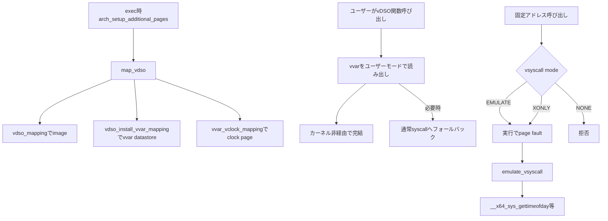

# 第17章 vDSO と vsyscall

> 本章で読むソース
>
> - [`arch/x86/entry/vdso/vma.c` L52-L63](https://github.com/gregkh/linux/blob/v6.18.38/arch/x86/entry/vdso/vma.c#L52-L63)
> - [`arch/x86/entry/vdso/vma.c` L91-L130](https://github.com/gregkh/linux/blob/v6.18.38/arch/x86/entry/vdso/vma.c#L91-L130)
> - [`arch/x86/entry/vdso/vma.c` L137-L199](https://github.com/gregkh/linux/blob/v6.18.38/arch/x86/entry/vdso/vma.c#L137-L199)
> - [`arch/x86/entry/vsyscall/vsyscall_64.c` L45-L71](https://github.com/gregkh/linux/blob/v6.18.38/arch/x86/entry/vsyscall/vsyscall_64.c#L45-L71)
> - [`arch/x86/entry/vsyscall/vsyscall_64.c` L115-L176](https://github.com/gregkh/linux/blob/v6.18.38/arch/x86/entry/vsyscall/vsyscall_64.c#L115-L176)
> - [`arch/x86/entry/vsyscall/vsyscall_64.c` L362-L379](https://github.com/gregkh/linux/blob/v6.18.38/arch/x86/entry/vsyscall/vsyscall_64.c#L362-L379)

## この章の狙い

**vDSO** がカーネル提供の共有オブジェクトとしてユーザー空間へ mapping され、一部の呼び出しをカーネルへ入らず実行できる仕組みを押さえる。
`map_vdso` が設置する三種類の special mapping と、レガシー **vsyscall** の三 mode を分けて説明する。

## 前提

[第15章](15-entry-syscall-64.md) で通常の `syscall` 経路が privilege transition を伴うことを読んでいること。
signal frame と `rt_sigreturn` は本分冊の範囲外とし、vDSO 内の sigreturn landing pad は名前参照にとどめる。

## vDSO とは何か

vDSO はカーネルがバイナリ image とデータ page を用意し、プロセス起動時にユーザー空間へ mapping する共有オブジェクトである。
`gettimeofday` などは vDSO コードが **vvar** 領域のデータをユーザーモードで読み、必要時だけシステムコールへフォールバックする。

[第15章](15-entry-syscall-64.md) の通常 syscall 経路と対比すると、vDSO fast path が省くのは ring 3 から ring 0 への privilege transition、`swapgs`、CR3 と stack の切替、`pt_regs` 構築、syscall dispatch、return path である。
通常 syscall が必ず task switch を伴うわけではない点に注意する。

## map_vdso の三種類の special mapping

`map_vdso` は一つの連続アドレス空間に三つの mapping を設置する。
役割が異なるため、fault handler も mapping ごとに分かれる。

**vDSO image** は `vdso_mapping` を使う。
`vdso_fault` が `image->data` の該当 page を供給する。

**通常の vvar** は `vdso_install_vvar_mapping` が `lib/vdso/datastore.c` の `vdso_vvar_mapping` を設置し、datastore 側の `vvar_fault` が page を挿入する。

**x86 固有の paravirtual clock と Hyper-V clock page** は `vvar_vclock_mapping` を使い、`vvar_vclock_fault` が PFN を挿入する。

「`vdso_fault` が image と vvar の page を供給する」と一括して書いてはならない。

[`arch/x86/entry/vdso/vma.c` L52-L63](https://github.com/gregkh/linux/blob/v6.18.38/arch/x86/entry/vdso/vma.c#L52-L63)

```c
static vm_fault_t vdso_fault(const struct vm_special_mapping *sm,
		      struct vm_area_struct *vma, struct vm_fault *vmf)
{
	const struct vdso_image *image = vma->vm_mm->context.vdso_image;

	if (!image || (vmf->pgoff << PAGE_SHIFT) >= image->size)
		return VM_FAULT_SIGBUS;

	vmf->page = virt_to_page(image->data + (vmf->pgoff << PAGE_SHIFT));
	get_page(vmf->page);
	return 0;
}
```

[`arch/x86/entry/vdso/vma.c` L91-L130](https://github.com/gregkh/linux/blob/v6.18.38/arch/x86/entry/vdso/vma.c#L91-L130)

```c
static vm_fault_t vvar_vclock_fault(const struct vm_special_mapping *sm,
				    struct vm_area_struct *vma, struct vm_fault *vmf)
{
	switch (vmf->pgoff) {
#ifdef CONFIG_PARAVIRT_CLOCK
	case VDSO_PAGE_PVCLOCK_OFFSET:
	{
		struct pvclock_vsyscall_time_info *pvti =
			pvclock_get_pvti_cpu0_va();

		if (pvti && vclock_was_used(VDSO_CLOCKMODE_PVCLOCK))
			return vmf_insert_pfn_prot(vma, vmf->address,
					__pa(pvti) >> PAGE_SHIFT,
					pgprot_decrypted(vma->vm_page_prot));
		break;
	}
#endif /* CONFIG_PARAVIRT_CLOCK */
#ifdef CONFIG_HYPERV_TIMER
	case VDSO_PAGE_HVCLOCK_OFFSET:
	{
		unsigned long pfn = hv_get_tsc_pfn();
		if (pfn && vclock_was_used(VDSO_CLOCKMODE_HVCLOCK))
			return vmf_insert_pfn(vma, vmf->address, pfn);
		break;
	}
#endif /* CONFIG_HYPERV_TIMER */
	}

	return VM_FAULT_SIGBUS;
}

static const struct vm_special_mapping vdso_mapping = {
	.name = "[vdso]",
	.fault = vdso_fault,
	.mremap = vdso_mremap,
};
static const struct vm_special_mapping vvar_vclock_mapping = {
	.name = "[vvar_vclock]",
	.fault = vvar_vclock_fault,
};
```

[`arch/x86/entry/vdso/vma.c` L137-L199](https://github.com/gregkh/linux/blob/v6.18.38/arch/x86/entry/vdso/vma.c#L137-L199)

```c
static int map_vdso(const struct vdso_image *image, unsigned long addr)
{
	struct mm_struct *mm = current->mm;
	struct vm_area_struct *vma;
	unsigned long text_start;
	int ret = 0;

	if (mmap_write_lock_killable(mm))
		return -EINTR;

	addr = get_unmapped_area(NULL, addr,
				 image->size + __VDSO_PAGES * PAGE_SIZE, 0, 0);
	if (IS_ERR_VALUE(addr)) {
		ret = addr;
		goto up_fail;
	}

	text_start = addr + __VDSO_PAGES * PAGE_SIZE;

	/*
	 * MAYWRITE to allow gdb to COW and set breakpoints
	 */
	vma = _install_special_mapping(mm,
				       text_start,
				       image->size,
				       VM_READ|VM_EXEC|
				       VM_MAYREAD|VM_MAYWRITE|VM_MAYEXEC|
				       VM_SEALED_SYSMAP,
				       &vdso_mapping);

	if (IS_ERR(vma)) {
		ret = PTR_ERR(vma);
		goto up_fail;
	}

	vma = vdso_install_vvar_mapping(mm, addr);
	if (IS_ERR(vma)) {
		ret = PTR_ERR(vma);
		do_munmap(mm, text_start, image->size, NULL);
		goto up_fail;
	}

	vma = _install_special_mapping(mm,
				       VDSO_VCLOCK_PAGES_START(addr),
				       VDSO_NR_VCLOCK_PAGES * PAGE_SIZE,
				       VM_READ|VM_MAYREAD|VM_IO|VM_DONTDUMP|
				       VM_PFNMAP|VM_SEALED_SYSMAP,
				       &vvar_vclock_mapping);

	if (IS_ERR(vma)) {
		ret = PTR_ERR(vma);
		do_munmap(mm, text_start, image->size, NULL);
		do_munmap(mm, addr, image->size, NULL);
		goto up_fail;
	}

	current->mm->context.vdso = (void __user *)text_start;
	current->mm->context.vdso_image = image;

up_fail:
	mmap_write_unlock(mm);
	return ret;
}
```

`arch_setup_additional_pages` が exec 時に `map_vdso(&vdso_image_64, 0)` を呼び、各プロセスへ vDSO を載せる。

## vsyscall の三 mode

vsyscall は固定アドレス `VSYSCALL_ADDR` へ call するレガシー ABI である。
ASLR と相性が悪く、新規コードは vDSO を使う前提である。

カーネルは `vsyscall` ブートパラメータと Kconfig で **EMULATE**、**XONLY**、**NONE** の三 mode を選ぶ。

**EMULATE** は実 page を readable かつ non-executable protection で map する。
実行しようとすると page fault し、`emulate_vsyscall` が handler へ変換する。

**XONLY** は backing PTE を置かず、execute-only gate VMA として見せる。
データ read は拒否し、実行は fault 経由で emulation へ向ける。

**NONE** は gate VMA 自体を無効にし、固定アドレス呼び出しを拒否する。

[`arch/x86/entry/vsyscall/vsyscall_64.c` L45-L71](https://github.com/gregkh/linux/blob/v6.18.38/arch/x86/entry/vsyscall/vsyscall_64.c#L45-L71)

```c
static enum { EMULATE, XONLY, NONE } vsyscall_mode __ro_after_init =
#ifdef CONFIG_LEGACY_VSYSCALL_NONE
	NONE;
#elif defined(CONFIG_LEGACY_VSYSCALL_XONLY)
	XONLY;
#else
	#error VSYSCALL config is broken
#endif

static int __init vsyscall_setup(char *str)
{
	if (str) {
		if (!strcmp("emulate", str))
			vsyscall_mode = EMULATE;
		else if (!strcmp("xonly", str))
			vsyscall_mode = XONLY;
		else if (!strcmp("none", str))
			vsyscall_mode = NONE;
		else
			return -EINVAL;

		return 0;
	}

	return -EINVAL;
}
early_param("vsyscall", vsyscall_setup);
```

[`arch/x86/entry/vsyscall/vsyscall_64.c` L362-L379](https://github.com/gregkh/linux/blob/v6.18.38/arch/x86/entry/vsyscall/vsyscall_64.c#L362-L379)

```c
void __init map_vsyscall(void)
{
	extern char __vsyscall_page;
	unsigned long physaddr_vsyscall = __pa_symbol(&__vsyscall_page);

	/*
	 * For full emulation, the page needs to exist for real.  In
	 * execute-only mode, there is no PTE at all backing the vsyscall
	 * page.
	 */
	if (vsyscall_mode == EMULATE) {
		__set_fixmap(VSYSCALL_PAGE, physaddr_vsyscall,
			     PAGE_KERNEL_VVAR);
		set_vsyscall_pgtable_user_bits(swapper_pg_dir);
	}

	if (vsyscall_mode == XONLY)
		vm_flags_init(&gate_vma, VM_EXEC);

	BUILD_BUG_ON((unsigned long)__fix_to_virt(VSYSCALL_PAGE) !=
		     (unsigned long)VSYSCALL_ADDR);
}
```

## emulate_vsyscall の動作

`emulate_vsyscall` は user の instruction-fetch page fault を検査する。
`address == regs->ip` でなければ data access として扱い、EMULATE 以外では拒否する。

固定 slot 0、1、2 がそれぞれ `gettimeofday`、`time`、`getcpu` に対応する。
seccomp を通したあと `__x64_sys_*` を直接呼び、戻り値を `regs->ax` へ書いて `ret` を emulated する。

[`arch/x86/entry/vsyscall/vsyscall_64.c` L115-L176](https://github.com/gregkh/linux/blob/v6.18.38/arch/x86/entry/vsyscall/vsyscall_64.c#L115-L176)

```c
bool emulate_vsyscall(unsigned long error_code,
		      struct pt_regs *regs, unsigned long address)
{
	unsigned long caller;
	int vsyscall_nr, syscall_nr, tmp;
	long ret;
	unsigned long orig_dx;

	/* Write faults or kernel-privilege faults never get fixed up. */
	if ((error_code & (X86_PF_WRITE | X86_PF_USER)) != X86_PF_USER)
		return false;

	/*
	 * Assume that faults at regs->ip are because of an
	 * instruction fetch. Return early and avoid
	 * emulation for faults during data accesses:
	 */
	if (address != regs->ip) {
		/* Failed vsyscall read */
		if (vsyscall_mode == EMULATE)
			return false;

		/*
		 * User code tried and failed to read the vsyscall page.
		 */
		warn_bad_vsyscall(KERN_INFO, regs, "vsyscall read attempt denied -- look up the vsyscall kernel parameter if you need a workaround");
		return false;
	}

	/*
	 * X86_PF_INSTR is only set when NX is supported.  When
	 * available, use it to double-check that the emulation code
	 * is only being used for instruction fetches:
	 */
	if (cpu_feature_enabled(X86_FEATURE_NX))
		WARN_ON_ONCE(!(error_code & X86_PF_INSTR));

	/*
	 * No point in checking CS -- the only way to get here is a user mode
	 * trap to a high address, which means that we're in 64-bit user code.
	 */

	if (vsyscall_mode == NONE) {
		warn_bad_vsyscall(KERN_INFO, regs,
				  "vsyscall attempted with vsyscall=none");
		return false;
	}

	vsyscall_nr = addr_to_vsyscall_nr(address);

	trace_emulate_vsyscall(vsyscall_nr);

	if (vsyscall_nr < 0) {
		warn_bad_vsyscall(KERN_WARNING, regs,
				  "misaligned vsyscall (exploit attempt or buggy program) -- look up the vsyscall kernel parameter if you need a workaround");
		goto sigsegv;
	}

	if (get_user(caller, (unsigned long __user *)regs->sp) != 0) {
		warn_bad_vsyscall(KERN_WARNING, regs,
				  "vsyscall with bad stack (exploit attempt?)");
		goto sigsegv;
	}
```

互換性維持のための機構であり、新規開発では vDSO を使う。

## 処理の流れ



## 高速化と最適化の工夫

vDSO は時刻取得などをカーネルが公開する vvar データのユーザーモード読み出しで済ませ、privilege transition と `swapgs` とスタック切替と `pt_regs` 構築を丸ごと避けられる。

vsyscall は実行可能 code page を固定配置せず、EMULATE では non-executable page の fault、XONLY では PTE なし gate として page fault emulation で提供する。
固定アドレス ABI を保ちつつ、攻撃対象となる実行可能固定ページを置かない。

## まとめ

- vDSO はカーネル提供の共有オブジェクトとしてユーザー空間へ mapping され、一部呼び出しをユーザーモードで完結させる。
- `map_vdso` は vDSO image、vvar datastore、clock page の三 mapping を別 fault handler で設置する。
- vsyscall は EMULATE、XONLY、NONE の三 mode で固定アドレス ABI を扱うレガシー機構である。
- `emulate_vsyscall` は instruction-fetch fault を固定 slot から `__x64_sys_*` へ変換する。
- vDSO fast path が省くのは privilege transition と syscall 入口出口であり、必ずしも context switch ではない。

## 関連する章

- [entry_SYSCALL_64 のアセンブリ経路](15-entry-syscall-64.md)
- [do_syscall_64 とディスパッチと戻り](16-do-syscall-64-dispatch.md)
