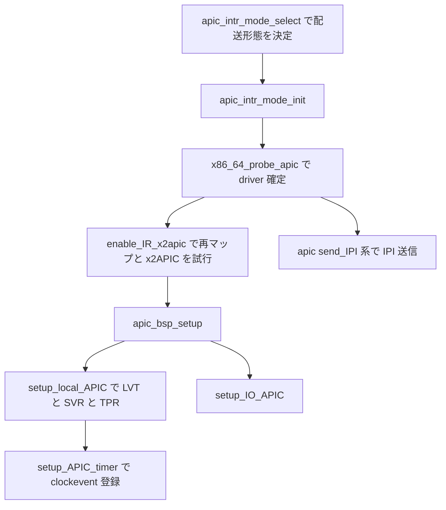

# 第18章 Local APIC の初期化と timer と IPI

> 本章で読むソース
>
> - [`arch/x86/kernel/apic/apic.c` L1242-L1301](https://github.com/gregkh/linux/blob/v6.18.38/arch/x86/kernel/apic/apic.c#L1242-L1301)
> - [`arch/x86/kernel/apic/apic.c` L1306-L1384](https://github.com/gregkh/linux/blob/v6.18.38/arch/x86/kernel/apic/apic.c#L1306-L1384)
> - [`arch/x86/kernel/apic/apic.c` L1499-L1638](https://github.com/gregkh/linux/blob/v6.18.38/arch/x86/kernel/apic/apic.c#L1499-L1638)
> - [`arch/x86/kernel/apic/apic.c` L495-L509](https://github.com/gregkh/linux/blob/v6.18.38/arch/x86/kernel/apic/apic.c#L495-L509)
> - [`arch/x86/kernel/apic/apic.c` L572-L596](https://github.com/gregkh/linux/blob/v6.18.38/arch/x86/kernel/apic/apic.c#L572-L596)
> - [`arch/x86/kernel/apic/apic.c` L1823-L1875](https://github.com/gregkh/linux/blob/v6.18.38/arch/x86/kernel/apic/apic.c#L1823-L1875)
> - [`arch/x86/kernel/apic/apic.c` L2331-L2343](https://github.com/gregkh/linux/blob/v6.18.38/arch/x86/kernel/apic/apic.c#L2331-L2343)
> - [`arch/x86/kernel/apic/probe_64.c` L17-L29](https://github.com/gregkh/linux/blob/v6.18.38/arch/x86/kernel/apic/probe_64.c#L17-L29)
> - [`arch/x86/kernel/apic/ipi.c` L189-L197](https://github.com/gregkh/linux/blob/v6.18.38/arch/x86/kernel/apic/ipi.c#L189-L197)
> - [`arch/x86/kernel/apic/x2apic_phys.c` L44-L50](https://github.com/gregkh/linux/blob/v6.18.38/arch/x86/kernel/apic/x2apic_phys.c#L44-L50)

## この章の狙い

各 CPU に付く **Local APIC** が外部割り込みの受信、IPI の送受信、APIC timer を担うことを押さえる。
`apic_intr_mode` が xAPIC と x2APIC の選択ではなく PIC、virtual wire、symmetric I/O という配送形態を表す点を区別し、初期化の入口と x2APIC 有効化の別経路を追う。

## 前提

[第11章](../part03-exceptions/11-idt-construction.md) で `idt_setup_apic_and_irq_gates` がデバイス割り込み用 gate を IDT に載せる流れを読んでいること。
[第6章](../part01-boot/06-x86-64-start-kernel.md) で `start_kernel` から APIC 初期化が呼ばれる順序を把握していること。

## Local APIC の役割

x86-64 では各論理 CPU が自前の Local APIC を持つ。
外部デバイスからの割り込みは IO-APIC や MSI 経由で Local APIC の割り込みベクタへ届き、Local APIC はその CPU 上で割り込みを受理する。
IPI は他 CPU の Local APIC へベクタ付きメッセージを送り、再スケジュールや TLB flush、関数呼び出しなど SMP 制御に使う。
APIC timer は per-CPU の clockevent として tick を供給する（タイマー一般論は irq-time 分冊へ委譲する）。

## 割り込み配送形態の選択

`apic_intr_mode` は起動時に一度だけ決まる配送形態である。
`__apic_intr_mode_select` はカーネルオプション、BIOS が APIC を無効にしていないか、MP テーブルや ACPI MADT の有無、`setup_max_cpus` などを見て `APIC_PIC`、`APIC_VIRTUAL_WIRE`、`APIC_SYMMETRIC_IO` などを返す。

[`arch/x86/kernel/apic/apic.c` L1242-L1301](https://github.com/gregkh/linux/blob/v6.18.38/arch/x86/kernel/apic/apic.c#L1242-L1301)

```c
static int __init __apic_intr_mode_select(void)
{
	/* Check kernel option */
	if (apic_is_disabled) {
		pr_info("APIC disabled via kernel command line\n");
		return APIC_PIC;
	}

	/* Check BIOS */
#ifdef CONFIG_X86_64
	/* On 64-bit, the APIC must be integrated, Check local APIC only */
	if (!boot_cpu_has(X86_FEATURE_APIC)) {
		apic_is_disabled = true;
		pr_info("APIC disabled by BIOS\n");
		return APIC_PIC;
	}
#else
	// ... (中略) ...
#endif

	/* Check MP table or ACPI MADT configuration */
	if (!smp_found_config) {
		disable_ioapic_support();
		if (!acpi_lapic) {
			pr_info("APIC: ACPI MADT or MP tables are not detected\n");
			return APIC_VIRTUAL_WIRE_NO_CONFIG;
		}
		return APIC_VIRTUAL_WIRE;
	}

#ifdef CONFIG_SMP
	/* If SMP should be disabled, then really disable it! */
	if (!setup_max_cpus) {
		pr_info("APIC: SMP mode deactivated\n");
		return APIC_SYMMETRIC_IO_NO_ROUTING;
	}
#endif

	return APIC_SYMMETRIC_IO;
}

/* Select the interrupt delivery mode for the BSP */
void __init apic_intr_mode_select(void)
{
	apic_intr_mode = __apic_intr_mode_select();
}
```

x2APIC の有効化はこの関数の外にある。
`check_x2apic` は BIOS が x2APIC を既に有効にしているか、CPU が `X86_FEATURE_X2APIC` を持つかを見て `x2apic_state` を決める。
`try_to_enable_x2apic` は割り込み再マップの結果を受けて `x2apic_enable` を呼ぶ。
`apic_intr_mode_init` は選択済みの配送形態に応じたログ出力と driver 確定、BSP セットアップへ進むだけである。

## apic_intr_mode_init と APIC driver の確定

`apic_intr_mode_init` は `apic_intr_mode` の switch で早期 return するか、symmetric I/O や virtual wire 向けのセットアップへ入る。
その中で `x86_64_probe_apic` が APIC driver を選び、最後に `apic_bsp_setup` を呼ぶ。

[`arch/x86/kernel/apic/apic.c` L1355-L1384](https://github.com/gregkh/linux/blob/v6.18.38/arch/x86/kernel/apic/apic.c#L1355-L1384)

```c
void __init apic_intr_mode_init(void)
{
	bool upmode = IS_ENABLED(CONFIG_UP_LATE_INIT);

	switch (apic_intr_mode) {
	case APIC_PIC:
		pr_info("APIC: Keep in PIC mode(8259)\n");
		return;
	case APIC_VIRTUAL_WIRE:
		pr_info("APIC: Switch to virtual wire mode setup\n");
		break;
	case APIC_VIRTUAL_WIRE_NO_CONFIG:
		pr_info("APIC: Switch to virtual wire mode setup with no configuration\n");
		upmode = true;
		break;
	case APIC_SYMMETRIC_IO:
		pr_info("APIC: Switch to symmetric I/O mode setup\n");
		break;
	case APIC_SYMMETRIC_IO_NO_ROUTING:
		pr_info("APIC: Switch to symmetric I/O mode setup in no SMP routine\n");
		break;
	}

	x86_64_probe_apic();

	if (x86_platform.apic_post_init)
		x86_platform.apic_post_init();

	apic_bsp_setup(upmode);
}
```

`x86_64_probe_apic` は先に `enable_IR_x2apic` で割り込み再マップと x2APIC を試し、その後 `__apicdrivers` を走査して最初に `probe` に成功した driver を `apic_install_driver` する。

[`arch/x86/kernel/apic/probe_64.c` L17-L29](https://github.com/gregkh/linux/blob/v6.18.38/arch/x86/kernel/apic/probe_64.c#L17-L29)

```c
void __init x86_64_probe_apic(void)
{
	struct apic **drv;

	enable_IR_x2apic();

	for (drv = __apicdrivers; drv < __apicdrivers_end; drv++) {
		if ((*drv)->probe && (*drv)->probe()) {
			apic_install_driver(*drv);
			break;
		}
	}
}
```

確定した driver の `apic` ポインタ経由で `send_IPI` や `apic_read`、 `apic_write` が xAPIC の MMIO と x2APIC の MSR のどちらを使うかが切り替わる。

## init_bsp_APIC と setup_local_APIC

`init_bsp_APIC` は BSP の一般的な Local APIC 初期化入口ではない。
MP や ACPI 構成がない場合の virtual wire 用初期設定であり、`smp_found_config` がある場合や APIC がない場合は即 return する。

[`arch/x86/kernel/apic/apic.c` L1306-L1350](https://github.com/gregkh/linux/blob/v6.18.38/arch/x86/kernel/apic/apic.c#L1306-L1350)

```c
void __init init_bsp_APIC(void)
{
	unsigned int value;

	/*
	 * Don't do the setup now if we have a SMP BIOS as the
	 * through-I/O-APIC virtual wire mode might be active.
	 */
	if (smp_found_config || !boot_cpu_has(X86_FEATURE_APIC))
		return;

	/*
	 * Do not trust the local APIC being empty at bootup.
	 */
	clear_local_APIC();

	/*
	 * Enable APIC.
	 */
	value = apic_read(APIC_SPIV);
	value &= ~APIC_VECTOR_MASK;
	value |= APIC_SPIV_APIC_ENABLED;
	// ... (中略) ...
	value |= SPURIOUS_APIC_VECTOR;
	apic_write(APIC_SPIV, value);

	/*
	 * Set up the virtual wire mode.
	 */
	apic_write(APIC_LVT0, APIC_DM_EXTINT);
	value = APIC_DM_NMI;
	// ... (中略) ...
	apic_write(APIC_LVT1, value);
}
```

各 CPU の通常設定の中心は `setup_local_APIC` である。
SPIV で APIC を有効化し、TPR でベクタ 0〜31 をマスクし、LVT0 と LVT1 で ExtINT と NMI を設定する。
BSP では `apic_bsp_setup` から、AP では `apic_ap_setup` から呼ばれる。

[`arch/x86/kernel/apic/apic.c` L1499-L1638](https://github.com/gregkh/linux/blob/v6.18.38/arch/x86/kernel/apic/apic.c#L1499-L1638)

```c
static void setup_local_APIC(void)
{
	int cpu = smp_processor_id();
	unsigned int value;

	if (apic_is_disabled) {
		disable_ioapic_support();
		return;
	}

	if (apic->setup)
		apic->setup();

	/*
	 * If this comes from kexec/kcrash the APIC might be enabled in
	 * SPIV. Soft disable it before doing further initialization.
	 */
	value = apic_read(APIC_SPIV);
	value &= ~APIC_SPIV_APIC_ENABLED;
	apic_write(APIC_SPIV, value);
	// ... (中略) ...
	/*
	 * Set Task Priority to 'accept all except vectors 0-31'.  An APIC
	 * vector in the 16-31 range could be delivered if TPR == 0, but we
	 * would think it's an exception and terrible things will happen.  We
	 * never change this later on.
	 */
	value = apic_read(APIC_TASKPRI);
	value &= ~APIC_TPRI_MASK;
	value |= 0x10;
	apic_write(APIC_TASKPRI, value);

	apic_clear_isr();
	// ... (中略) ...
	value |= SPURIOUS_APIC_VECTOR;
	apic_write(APIC_SPIV, value);
	// ... (中略) ...
	if (!cpu && (pic_mode || !value || ioapic_is_disabled)) {
		value = APIC_DM_EXTINT;
		apic_pr_verbose("Enabled ExtINT on CPU#%d\n", cpu);
	} else {
		value = APIC_DM_EXTINT | APIC_LVT_MASKED;
		apic_pr_verbose("Masked ExtINT on CPU#%d\n", cpu);
	}
	apic_write(APIC_LVT0, value);
	// ... (中略) ...
	apic_write(APIC_LVT1, value);
}
```

`apic_bsp_setup` は Local APIC 設定のあと IO-APIC 初期化と legacy ベクタ更新まで続ける。

[`arch/x86/kernel/apic/apic.c` L2331-L2343](https://github.com/gregkh/linux/blob/v6.18.38/arch/x86/kernel/apic/apic.c#L2331-L2343)

```c
static void __init apic_bsp_setup(bool upmode)
{
	connect_bsp_APIC();
	if (upmode)
		apic_bsp_up_setup();
	setup_local_APIC();

	enable_IO_APIC();
	end_local_APIC_setup();
	irq_remap_enable_fault_handling();
	setup_IO_APIC();
	lapic_update_legacy_vectors();
}
```

## APIC timer と clockevent

`lapic_clockevent` は per-CPU 領域 `lapic_events` にコピーされ、`clockevents_register_device` でフレームワークへ登録される。
`setup_APIC_timer` は各 CPU の bring-up 時に呼ばれ、TSC deadline 対応 CPU では `lapic-deadline` として別の `set_next_event` を使う。

[`arch/x86/kernel/apic/apic.c` L495-L509](https://github.com/gregkh/linux/blob/v6.18.38/arch/x86/kernel/apic/apic.c#L495-L509)

```c
static struct clock_event_device lapic_clockevent = {
	.name				= "lapic",
	.features			= CLOCK_EVT_FEAT_PERIODIC |
					  CLOCK_EVT_FEAT_ONESHOT | CLOCK_EVT_FEAT_C3STOP
					  | CLOCK_EVT_FEAT_DUMMY,
	.shift				= 32,
	.set_state_shutdown		= lapic_timer_shutdown,
	.set_state_periodic		= lapic_timer_set_periodic,
	.set_state_oneshot		= lapic_timer_set_oneshot,
	.set_state_oneshot_stopped	= lapic_timer_shutdown,
	.set_next_event			= lapic_next_event,
	.broadcast			= lapic_timer_broadcast,
	.rating				= 100,
	.irq				= -1,
};
```

[`arch/x86/kernel/apic/apic.c` L572-L596](https://github.com/gregkh/linux/blob/v6.18.38/arch/x86/kernel/apic/apic.c#L572-L596)

```c
static void setup_APIC_timer(void)
{
	struct clock_event_device *levt = this_cpu_ptr(&lapic_events);

	if (this_cpu_has(X86_FEATURE_ARAT)) {
		lapic_clockevent.features &= ~CLOCK_EVT_FEAT_C3STOP;
		/* Make LAPIC timer preferable over percpu HPET */
		lapic_clockevent.rating = 150;
	}

	memcpy(levt, &lapic_clockevent, sizeof(*levt));
	levt->cpumask = cpumask_of(smp_processor_id());

	if (this_cpu_has(X86_FEATURE_TSC_DEADLINE_TIMER)) {
		levt->name = "lapic-deadline";
		levt->features &= ~(CLOCK_EVT_FEAT_PERIODIC |
				    CLOCK_EVT_FEAT_DUMMY);
		levt->set_next_event = lapic_next_deadline;
		clockevents_config_and_register(levt,
						tsc_khz * (1000 / TSC_DIVISOR),
						0xF, ~0UL);
	} else
		clockevents_register_device(levt);

	apic_update_vector(smp_processor_id(), LOCAL_TIMER_VECTOR, true);
}
```

## IPI の送信

IPI は確定した `apic` driver の `send_IPI` 系で送る。
xAPIC では `native_apic_mem_write(APIC_ICR, ...)` による MMIO 書き込みである。

[`arch/x86/kernel/apic/ipi.c` L189-L197](https://github.com/gregkh/linux/blob/v6.18.38/arch/x86/kernel/apic/ipi.c#L189-L197)

```c
void default_send_IPI_single_phys(int cpu, int vector)
{
	unsigned long flags;

	local_irq_save(flags);
	__default_send_IPI_dest_field(per_cpu(x86_cpu_to_apicid, cpu),
				      vector, APIC_DEST_PHYSICAL);
	local_irq_restore(flags);
}
```

x2APIC では MSR 経由で ICR 相当を書き、コメントどおり `weak_wrmsr_fence` で順序を保つ。

[`arch/x86/kernel/apic/x2apic_phys.c` L44-L50](https://github.com/gregkh/linux/blob/v6.18.38/arch/x86/kernel/apic/x2apic_phys.c#L44-L50)

```c
static void x2apic_send_IPI(int cpu, int vector)
{
	u32 dest = per_cpu(x86_cpu_to_apicid, cpu);

	/* x2apic MSRs are special and need a special fence: */
	weak_wrmsr_fence();
	__x2apic_send_IPI_dest(dest, vector, APIC_DEST_PHYSICAL);
}
```

`try_to_enable_x2apic` は再マップ無効時にハイパーバイザが x2APIC を許すか、拡張宛先 ID で APIC ID 上限を引き上げる処理を挟んでから `x2apic_enable` を呼ぶ。

[`arch/x86/kernel/apic/apic.c` L1823-L1875](https://github.com/gregkh/linux/blob/v6.18.38/arch/x86/kernel/apic/apic.c#L1823-L1875)

```c
static __init void try_to_enable_x2apic(int remap_mode)
{
	if (x2apic_state == X2APIC_DISABLED)
		return;

	if (remap_mode != IRQ_REMAP_X2APIC_MODE) {
		u32 apic_limit = 255;
		// ... (中略) ...
		if (!x86_init.hyper.x2apic_available()) {
			pr_info("x2apic: IRQ remapping doesn't support X2APIC mode\n");
			x2apic_disable();
			return;
		}
		// ... (中略) ...
		x2apic_set_max_apicid(apic_limit);
		x2apic_phys = 1;
	}
	x2apic_enable();
}

void __init check_x2apic(void)
{
	if (x2apic_enabled()) {
		pr_info("x2apic: enabled by BIOS, switching to x2apic ops\n");
		x2apic_mode = 1;
		if (x2apic_hw_locked())
			x2apic_state = X2APIC_ON_LOCKED;
		else
			x2apic_state = X2APIC_ON;
		apic_read_boot_cpu_id(true);
	} else if (!boot_cpu_has(X86_FEATURE_X2APIC)) {
		x2apic_state = X2APIC_DISABLED;
	}
}
```

## 処理フロー



## 高速化と最適化の工夫

x2APIC は APIC レジスタへ MSR でアクセスし、xAPIC が要する MMIO の fixmap を避けられる。
また 8 ビット APIC ID を超える広い ID 空間を扱える。
MSR 書き込みには `weak_wrmsr_fence` が要る経路があり、単純な直列化コスト削減と断定はできない。

各 CPU が自前の Local APIC と APIC timer を持つため、割り込み受理と sched tick を CPU ローカルに扱える。
グローバルな 8259 PIC へ集約する方式と比べ、SMP 下のスケーラビリティに寄与する。

## まとめ

- Local APIC は各 CPU の割り込みコントローラであり、外部割り込み受信、IPI、APIC timer を担う。
- `apic_intr_mode` は配送形態であり、x2APIC 選択は `check_x2apic` と `try_to_enable_x2apic` の別経路である。
- `init_bsp_APIC` は MP 構成がない virtual wire 専用であり、通常の per-CPU 設定は `setup_local_APIC` が中心である。
- `apic_intr_mode_init` は `x86_64_probe_apic` と `apic_bsp_setup` で BSP の Local APIC と IO-APIC を立ち上げる。
- APIC timer は per-CPU clockevent として登録され tick を供給する。
- IPI は xAPIC では MMIO、x2APIC では MSR 経由の `send_IPI` 系で送る。

## 関連する章

- [IDT の構築と IDTENTRY 機構](../part03-exceptions/11-idt-construction.md)
- [割り込みベクタ割り当てと common_interrupt](19-vector-common-interrupt.md)
- [IO-APIC と pin から vector domain への接続](20-io-apic.md)
