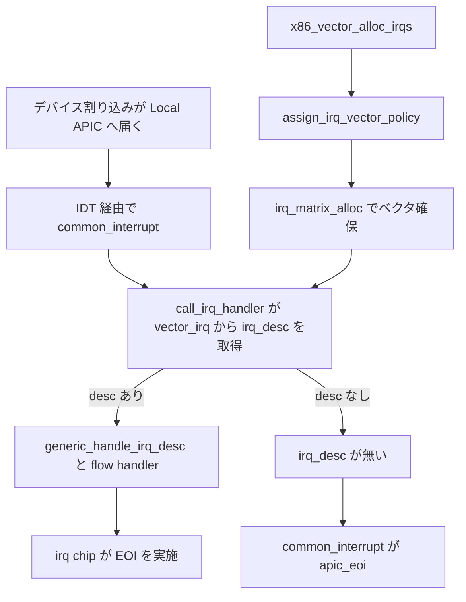

# 第19章 割り込みベクタ割り当てと common_interrupt

> 本章で読むソース
>
> - [`arch/x86/kernel/apic/vector.c` L40-L41](https://github.com/gregkh/linux/blob/v6.18.38/arch/x86/kernel/apic/vector.c#L40-L41)
> - [`arch/x86/kernel/apic/vector.c` L187-L192](https://github.com/gregkh/linux/blob/v6.18.38/arch/x86/kernel/apic/vector.c#L187-L192)
> - [`arch/x86/kernel/apic/vector.c` L239-L272](https://github.com/gregkh/linux/blob/v6.18.38/arch/x86/kernel/apic/vector.c#L239-L272)
> - [`arch/x86/kernel/apic/vector.c` L315-L327](https://github.com/gregkh/linux/blob/v6.18.38/arch/x86/kernel/apic/vector.c#L315-L327)
> - [`arch/x86/kernel/apic/vector.c` L351-L377](https://github.com/gregkh/linux/blob/v6.18.38/arch/x86/kernel/apic/vector.c#L351-L377)
> - [`arch/x86/kernel/apic/vector.c` L548-L612](https://github.com/gregkh/linux/blob/v6.18.38/arch/x86/kernel/apic/vector.c#L548-L612)
> - [`arch/x86/kernel/apic/vector.c` L799-L818](https://github.com/gregkh/linux/blob/v6.18.38/arch/x86/kernel/apic/vector.c#L799-L818)
> - [`arch/x86/kernel/irq.c` L259-L329](https://github.com/gregkh/linux/blob/v6.18.38/arch/x86/kernel/irq.c#L259-L329)
> - [`arch/x86/include/asm/idtentry.h` L206-L222](https://github.com/gregkh/linux/blob/v6.18.38/arch/x86/include/asm/idtentry.h#L206-L222)

## この章の狙い

デバイス割り込みのハードウェアベクタが Linux の IRQ 番号と `irq_desc` へどう結び付くかを追う。
`x86_vector_domain` と `common_interrupt` の役割分担、とくに EOI が IDT 入口ではなく irq chip の flow handler 側にある点を押さえる。

## 前提

[第18章](18-local-apic-timer-ipi.md) で Local APIC の初期化と配送形態を読んでいること。
[第11章](../part03-exceptions/11-idt-construction.md) で `apic_idts` がデバイス割り込みベクタを `common_interrupt` に結ぶことを把握していること。
`irq_matrix` の一般論は irq-time 分冊へ委譲する。

## x86_vector_domain とベクタ空間

`arch_early_irq_init` が `x86_vector_domain` を tree domain として作り、デフォルト domain にする。
同時に `irq_alloc_matrix` で `FIRST_EXTERNAL_VECTOR` から `FIRST_SYSTEM_VECTOR` 手前までのベクタ空間を CPU 別に管理する `vector_matrix` を確保する。

[`arch/x86/kernel/apic/vector.c` L40-L41](https://github.com/gregkh/linux/blob/v6.18.38/arch/x86/kernel/apic/vector.c#L40-L41)

```c
struct irq_domain *x86_vector_domain;
EXPORT_SYMBOL_GPL(x86_vector_domain);
```

[`arch/x86/kernel/apic/vector.c` L799-L818](https://github.com/gregkh/linux/blob/v6.18.38/arch/x86/kernel/apic/vector.c#L799-L818)

```c
int __init arch_early_irq_init(void)
{
	struct fwnode_handle *fn;

	fn = irq_domain_alloc_named_fwnode("VECTOR");
	BUG_ON(!fn);
	x86_vector_domain = irq_domain_create_tree(fn, &x86_vector_domain_ops,
						   NULL);
	BUG_ON(x86_vector_domain == NULL);
	irq_set_default_domain(x86_vector_domain);

	BUG_ON(!alloc_cpumask_var(&vector_searchmask, GFP_KERNEL));

	/*
	 * Allocate the vector matrix allocator data structure and limit the
	 * search area.
	 */
	vector_matrix = irq_alloc_matrix(NR_VECTORS, FIRST_EXTERNAL_VECTOR,
					 FIRST_SYSTEM_VECTOR);
	BUG_ON(!vector_matrix);

	return arch_early_ioapic_init();
}
```

各 IRQ は `apic_chip_data` にベクタ番号と宛先 CPU を保持する。
確定したベクタは per-CPU 配列 `vector_irq` に `irq_desc` ポインタとして登録される。

[`arch/x86/kernel/apic/vector.c` L187-L192](https://github.com/gregkh/linux/blob/v6.18.38/arch/x86/kernel/apic/vector.c#L187-L192)

```c
setnew:
	apicd->vector = newvec;
	apicd->cpu = newcpu;
	BUG_ON(!IS_ERR_OR_NULL(per_cpu(vector_irq, newcpu)[newvec]));
	per_cpu(vector_irq, newcpu)[newvec] = desc;
	apic_update_irq_cfg(irqd, newvec, newcpu);
```

## x86_vector_alloc_irqs と irq_matrix への接続

`x86_vector_alloc_irqs` は vector domain の `alloc` コールバックである。
各仮想 IRQ に `apic_chip_data` を付け、`assign_irq_vector_policy` 経由でベクタを確保する。

[`arch/x86/kernel/apic/vector.c` L548-L612](https://github.com/gregkh/linux/blob/v6.18.38/arch/x86/kernel/apic/vector.c#L548-L612)

```c
static int x86_vector_alloc_irqs(struct irq_domain *domain, unsigned int virq,
				 unsigned int nr_irqs, void *arg)
{
	struct irq_alloc_info *info = arg;
	struct apic_chip_data *apicd;
	struct irq_data *irqd;
	int i, err, node;
	// ... (中略) ...
	for (i = 0; i < nr_irqs; i++) {
		irqd = irq_domain_get_irq_data(domain, virq + i);
		// ... (中略) ...
		apicd->irq = virq + i;
		irqd->chip = &lapic_controller;
		irqd->chip_data = apicd;
		// ... (中略) ...
		if (info->flags & X86_IRQ_ALLOC_LEGACY) {
			if (!vector_configure_legacy(virq + i, irqd, apicd))
				continue;
		}

		err = assign_irq_vector_policy(irqd, info);
		trace_vector_setup(virq + i, false, err);
		if (err) {
			irqd->chip_data = NULL;
			free_apic_chip_data(apicd);
			goto error;
		}
	}

	return 0;
	// ... (中略) ...
}
```

`assign_irq_vector_policy` は managed IRQ、明示 affinity、グローバル予約の三経路に分岐する。

[`arch/x86/kernel/apic/vector.c` L315-L327](https://github.com/gregkh/linux/blob/v6.18.38/arch/x86/kernel/apic/vector.c#L315-L327)

```c
static int
assign_irq_vector_policy(struct irq_data *irqd, struct irq_alloc_info *info)
{
	if (irqd_affinity_is_managed(irqd))
		return reserve_managed_vector(irqd);
	if (info->mask)
		return assign_irq_vector(irqd, info->mask);
	/*
	 * Make only a global reservation with no guarantee. A real vector
	 * is associated at activation time.
	 */
	return reserve_irq_vector(irqd);
}
```

実ベクタの確保は `assign_vector_locked` が `irq_matrix_alloc` を呼び、空きベクタと CPU を選んで `chip_data_update` する。

[`arch/x86/kernel/apic/vector.c` L239-L272](https://github.com/gregkh/linux/blob/v6.18.38/arch/x86/kernel/apic/vector.c#L239-L272)

```c
static int
assign_vector_locked(struct irq_data *irqd, const struct cpumask *dest)
{
	struct apic_chip_data *apicd = apic_chip_data(irqd);
	bool resvd = apicd->has_reserved;
	unsigned int cpu = apicd->cpu;
	int vector = apicd->vector;

	lockdep_assert_held(&vector_lock);
	// ... (中略) ...
	if (apicd->move_in_progress || !hlist_unhashed(&apicd->clist))
		return -EBUSY;

	vector = irq_matrix_alloc(vector_matrix, dest, resvd, &cpu);
	trace_vector_alloc(irqd->irq, vector, resvd, vector);
	if (vector < 0)
		return vector;
	chip_data_update(irqd, vector, cpu);

	return 0;
}
```

`irq_matrix` は CPU ごとのベクタ namespace を管理し、同じベクタ値を異なる CPU で再利用できる。
これは観測トラフィックに基づく負荷分散ではなく、affinity 内の空きベクタを効率よく割り当てるための機構である（詳細は irq-time 分冊）。

## common_interrupt と DEFINE_IDTENTRY_IRQ

`DEFINE_IDTENTRY_IRQ` は asm 入口から `irqentry_enter`、IRQ スタック上での本体実行、`irqentry_exit` までを包む。
EOI はここでは行わない。

[`arch/x86/include/asm/idtentry.h` L206-L222](https://github.com/gregkh/linux/blob/v6.18.38/arch/x86/include/asm/idtentry.h#L206-L222)

```c
#define DEFINE_IDTENTRY_IRQ(func)					\
static void __##func(struct pt_regs *regs, u32 vector);			\
									\
__visible noinstr void func(struct pt_regs *regs,			\
			    unsigned long error_code)			\
{									\
	irqentry_state_t state = irqentry_enter(regs);			\
	u32 vector = (u32)(u8)error_code;				\
									\
	kvm_set_cpu_l1tf_flush_l1d();                                   \
	instrumentation_begin();					\
	run_irq_on_irqstack_cond(__##func, regs, vector);		\
	instrumentation_end();						\
	irqentry_exit(regs, state);					\
}									\
									\
static noinline void __##func(struct pt_regs *regs, u32 vector)
```

`common_interrupt` の本体は per-CPU `vector_irq` から `irq_desc` を引き、`call_irq_handler` で generic IRQ 層へ渡す。
ハンドラ実行と EOI は IO-APIC や MSI 側の irq chip と flow handler（`handle_fasteoi_irq` など）が担う。

[`arch/x86/kernel/irq.c` L259-L329](https://github.com/gregkh/linux/blob/v6.18.38/arch/x86/kernel/irq.c#L259-L329)

```c
static struct irq_desc *reevaluate_vector(int vector)
{
	struct irq_desc *desc = __this_cpu_read(vector_irq[vector]);

	if (!IS_ERR_OR_NULL(desc))
		return desc;

	if (desc == VECTOR_UNUSED)
		pr_emerg_ratelimited("No irq handler for %d.%u\n", smp_processor_id(), vector);
	else
		__this_cpu_write(vector_irq[vector], VECTOR_UNUSED);
	return NULL;
}

static __always_inline bool call_irq_handler(int vector, struct pt_regs *regs)
{
	struct irq_desc *desc = __this_cpu_read(vector_irq[vector]);

	if (likely(!IS_ERR_OR_NULL(desc))) {
		handle_irq(desc, regs);
		return true;
	}

	/*
	 * Reevaluate with vector_lock held to prevent a race against
	 * request_irq() setting up the vector:
	 *
	 * CPU0				CPU1
	 *				interrupt is raised in APIC IRR
	 *				but not handled
	 * free_irq()
	 *   per_cpu(vector_irq, CPU1)[vector] = VECTOR_SHUTDOWN;
	 *
	 * request_irq()		common_interrupt()
	 *				  d = this_cpu_read(vector_irq[vector]);
	 *
	 * per_cpu(vector_irq, CPU1)[vector] = desc;
	 *
	 *				  if (d == VECTOR_SHUTDOWN)
	 *				    this_cpu_write(vector_irq[vector], VECTOR_UNUSED);
	 *
	 * This requires that the same vector on the same target CPU is
	 * handed out or that a spurious interrupt hits that CPU/vector.
	 */
	lock_vector_lock();
	desc = reevaluate_vector(vector);
	unlock_vector_lock();

	if (!desc)
		return false;

	handle_irq(desc, regs);
	return true;
}

/*
 * common_interrupt() handles all normal device IRQ's (the special SMP
 * cross-CPU interrupts have their own entry points).
 */
DEFINE_IDTENTRY_IRQ(common_interrupt)
{
	struct pt_regs *old_regs = set_irq_regs(regs);

	/* entry code tells RCU that we're not quiescent.  Check it. */
	RCU_LOCKDEP_WARN(!rcu_is_watching(), "IRQ failed to wake up RCU");

	if (unlikely(!call_irq_handler(vector, regs)))
		apic_eoi();

	set_irq_regs(old_regs);
}
```

通常経路では `vector_irq` に有効な `irq_desc` があり、`call_irq_handler` が true を返すため `apic_eoi` は呼ばれない。
`call_irq_handler` が false のときだけ `common_interrupt` が Local APIC へ EOI する。

## vector_irq の shutdown race

`clear_irq_vector` はベクタ解放時に `per_cpu(vector_irq, cpu)[vector] = VECTOR_SHUTDOWN` を書く。
割り込みが飛び込んだ CPU が `reevaluate_vector` で `VECTOR_SHUTDOWN` を検出すると `VECTOR_UNUSED` に戻し、ハンドラが無ければ `call_irq_handler` は false となり EOI だけが残る。

[`arch/x86/kernel/apic/vector.c` L351-L377](https://github.com/gregkh/linux/blob/v6.18.38/arch/x86/kernel/apic/vector.c#L351-L377)

```c
static void clear_irq_vector(struct irq_data *irqd)
{
	struct apic_chip_data *apicd = apic_chip_data(irqd);
	bool managed = irqd_affinity_is_managed(irqd);
	unsigned int vector = apicd->vector;

	lockdep_assert_held(&vector_lock);

	if (!vector)
		return;
	// ... (中略) ...
	per_cpu(vector_irq, apicd->cpu)[vector] = VECTOR_SHUTDOWN;
	apic_free_vector(apicd->cpu, vector, managed);
	apicd->vector = 0;

	/* Clean up move in progress */
	vector = apicd->prev_vector;
	if (!vector)
		return;

	per_cpu(vector_irq, apicd->prev_cpu)[vector] = VECTOR_SHUTDOWN;
	apic_free_vector(apicd->prev_cpu, vector, managed);
	apicd->prev_vector = 0;
	apicd->move_in_progress = 0;
	hlist_del_init(&apicd->clist);
}
```

通常経路は `vector_lock` を取らず `vector_irq` を直接読むため高速である。
shutdown や affinity 移動の競合だけ `vector_lock` 付きの再評価へ落ちる。

## 処理フロー



## 高速化と最適化の工夫

per-CPU の `vector_irq` 配列はベクタ番号で `irq_desc` を定数時間参照できる。
`likely(!IS_ERR_OR_NULL(desc))` の分岐が通常経路を表し、解放競合時だけ `vector_lock` 付きの `reevaluate_vector` へ落ちる。

per-CPU vector namespace により、同じベクタ値を複数 CPU で再利用できる。
`irq_matrix` は CPU ごとに独立した空きビットマップを持ち、affinity 制約の下でベクタを割り当てる。
これは IRQ 到着頻度を観測して CPU 間で割り込みを散らす負荷分散ではない。

## まとめ

- `x86_vector_domain` が最下層の irq domain として外部ベクタを CPU に割り当てる。
- `x86_vector_alloc_irqs` が `assign_irq_vector_policy` と `irq_matrix_alloc` でベクタ確保と `vector_irq` 登録を行う。
- `DEFINE_IDTENTRY_IRQ` は入口処理を包むが、通常の EOI は flow handler と irq chip が担う。
- `common_interrupt` が直接 `apic_eoi` するのは `call_irq_handler` が有効な `irq_desc` を得られなかった場合だけである。
- shutdown race では `VECTOR_SHUTDOWN` 検出後に未処理なら `common_interrupt` が EOI する。

## 関連する章

- [Local APIC の初期化と timer と IPI](18-local-apic-timer-ipi.md)
- [IO-APIC と pin から vector domain への接続](20-io-apic.md)
- [IDT の構築と IDTENTRY 機構](../part03-exceptions/11-idt-construction.md)
