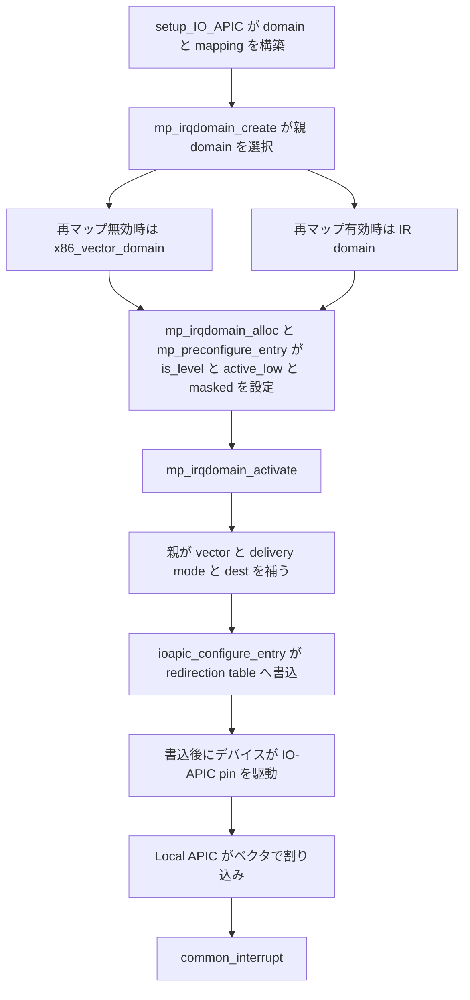

# 第20章 IO-APIC と pin から vector domain への接続

> 本章で読むソース
>
> - [`arch/x86/kernel/apic/io_apic.c` L1126-L1142](https://github.com/gregkh/linux/blob/v6.18.38/arch/x86/kernel/apic/io_apic.c#L1126-L1142)
> - [`arch/x86/kernel/apic/io_apic.c` L1753-L1795](https://github.com/gregkh/linux/blob/v6.18.38/arch/x86/kernel/apic/io_apic.c#L1753-L1795)
> - [`arch/x86/kernel/apic/io_apic.c` L2213-L2259](https://github.com/gregkh/linux/blob/v6.18.38/arch/x86/kernel/apic/io_apic.c#L2213-L2259)
> - [`arch/x86/kernel/apic/io_apic.c` L2274-L2297](https://github.com/gregkh/linux/blob/v6.18.38/arch/x86/kernel/apic/io_apic.c#L2274-L2297)
> - [`arch/x86/kernel/apic/io_apic.c` L2926-L2931](https://github.com/gregkh/linux/blob/v6.18.38/arch/x86/kernel/apic/io_apic.c#L2926-L2931)
> - [`arch/x86/kernel/apic/vector.c` L692-L704](https://github.com/gregkh/linux/blob/v6.18.38/arch/x86/kernel/apic/vector.c#L692-L704)
> - [`arch/x86/include/asm/irq_remapping.h` L62-L66](https://github.com/gregkh/linux/blob/v6.18.38/arch/x86/include/asm/irq_remapping.h#L62-L66)

## この章の狙い

**IO-APIC** が外部デバイスの pin を Local APIC のベクタへルーティングする仕組みを追う。
`setup_IO_APIC` から `mp_irqdomain_activate` が redirection table を書くまでの流れと、階層 irq domain の親が再マップ有無でどう変わるかを押さえる。
irq_domain の一般論は irq-time 分冊へ委譲する。

## 前提

[第19章](19-vector-common-interrupt.md) で `x86_vector_domain` と `common_interrupt` を読んでいること。
[第18章](18-local-apic-timer-ipi.md) で `apic_bsp_setup` が `setup_IO_APIC` を呼ぶ順序を把握していること。

## IO-APIC の役割

IO-APIC はマザーボードやチップセット上の割り込みコントローラである。
各 **pin** は GSI（Global System Interrupt）に対応し、ISA IRQ、PCI INTx、ACPI で記述された pin ベースの割り込みを扱う。
legacy PCI INTx だけに限定されない。

redirection table の各エントリは、pin に届いた割り込みを宛先 CPU の APIC ID とベクタへ変換する。
プログラム可能なルーティングにより、8259 PIC の固定配線と違い任意の CPU とベクタへ振り分けられる。

## setup_IO_APIC と irq_domain の作成

`setup_IO_APIC` は IO-APIC が有効なとき、各 IO-APIC について `mp_irqdomain_create` で階層 domain を作り、構成表を走査して pin と Linux IRQ の mapping を張る。

[`arch/x86/kernel/apic/io_apic.c` L2274-L2297](https://github.com/gregkh/linux/blob/v6.18.38/arch/x86/kernel/apic/io_apic.c#L2274-L2297)

```c
void __init setup_IO_APIC(void)
{
	int ioapic;

	if (ioapic_is_disabled || !nr_ioapics)
		return;

	io_apic_irqs = nr_legacy_irqs() ? ~PIC_IRQS : ~0UL;

	apic_pr_verbose("ENABLING IO-APIC IRQs\n");
	for_each_ioapic(ioapic)
		BUG_ON(mp_irqdomain_create(ioapic));

	/* Set up IO-APIC IRQ routing. */
	x86_init.mpparse.setup_ioapic_ids();

	sync_Arb_IDs();
	setup_IO_APIC_irqs();
	init_IO_APIC_traps();
	if (nr_legacy_irqs())
		check_timer();

	ioapic_initialized = 1;
}
```

`setup_IO_APIC_irqs` は全 IO-APIC の全 pin を走査し、MP 構成表のエントリと突き合わせて `pin_2_irq` で Linux IRQ 番号へ結ぶ。

[`arch/x86/kernel/apic/io_apic.c` L1126-L1142](https://github.com/gregkh/linux/blob/v6.18.38/arch/x86/kernel/apic/io_apic.c#L1126-L1142)

```c
static void __init setup_IO_APIC_irqs(void)
{
	unsigned int ioapic, pin;
	int idx;

	apic_pr_verbose("Init IO_APIC IRQs\n");

	for_each_ioapic_pin(ioapic, pin) {
		idx = find_irq_entry(ioapic, pin, mp_INT);
		if (idx < 0) {
			apic_pr_verbose("apic %d pin %d not connected\n",
					mpc_ioapic_id(ioapic), pin);
		} else {
			pin_2_irq(idx, ioapic, pin, ioapic ? 0 : IOAPIC_MAP_ALLOC);
		}
	}
}
```

`pin_2_irq` は GSI を求め、`mp_map_pin_to_irq` 経由で irq_domain へ IRQ を確保する。

## 階層 irq domain の親

`mp_irqdomain_create` は `DOMAIN_BUS_GENERIC_MSI` に一致する親 domain を `irq_find_matching_fwspec` で探し、その上に IO-APIC 用の子 domain を載せる。

[`arch/x86/kernel/apic/io_apic.c` L2213-L2259](https://github.com/gregkh/linux/blob/v6.18.38/arch/x86/kernel/apic/io_apic.c#L2213-L2259)

```c
static int mp_irqdomain_create(int ioapic)
{
	struct mp_ioapic_gsi *gsi_cfg = mp_ioapic_gsi_routing(ioapic);
	int hwirqs = mp_ioapic_pin_count(ioapic);
	struct ioapic *ip = &ioapics[ioapic];
	struct ioapic_domain_cfg *cfg = &ip->irqdomain_cfg;
	struct irq_domain *parent;
	struct fwnode_handle *fn;
	struct irq_fwspec fwspec;
	// ... (中略) ...
	fwspec.fwnode = fn;
	fwspec.param_count = 1;
	fwspec.param[0] = mpc_ioapic_id(ioapic);

	parent = irq_find_matching_fwspec(&fwspec, DOMAIN_BUS_GENERIC_MSI);
	if (!parent) {
		if (!cfg->dev)
			irq_domain_free_fwnode(fn);
		return -ENODEV;
	}

	ip->irqdomain = irq_domain_create_hierarchy(parent, 0, hwirqs, fn, cfg->ops,
						    (void *)(long)ioapic);
	// ... (中略) ...
	return 0;
}
```

割り込み再マップが無効な通常経路では、`x86_vector_domain` の `x86_vector_select` が IO-APIC の fwspec に一致し、親として選ばれる。

[`arch/x86/kernel/apic/vector.c` L692-L704](https://github.com/gregkh/linux/blob/v6.18.38/arch/x86/kernel/apic/vector.c#L692-L704)

```c
static int x86_vector_select(struct irq_domain *d, struct irq_fwspec *fwspec,
			     enum irq_domain_bus_token bus_token)
{
	/*
	 * HPET and I/OAPIC cannot be parented in the vector domain
	 * if IRQ remapping is enabled. APIC IDs above 15 bits are
	 * only permitted if IRQ remapping is enabled, so check that.
	 */
	if (apic_id_valid(32768))
		return 0;

	return x86_fwspec_is_ioapic(fwspec) || x86_fwspec_is_hpet(fwspec);
}
```

`apic_id_valid` は apic_id を現在の apic driver の max_apic_id と比較するだけで、再マップの有効状態を直接検査するわけではない。
この `apic_id_valid(32768)` の判定は、割り込み再マップにより 15 bit を超える APIC ID が許可された構成で vector domain の直接選択を拒むためのものである。
再マップ有効時の親選択は、Intel や AMD の各 remapping domain の select が `x86_fwspec_is_ioapic` と対象 IOMMU を検査して担い、その親が `arch_get_ir_parent_domain` で返す `x86_vector_domain` になる。

[`arch/x86/include/asm/irq_remapping.h` L62-L66](https://github.com/gregkh/linux/blob/v6.18.38/arch/x86/include/asm/irq_remapping.h#L62-L66)

```c
/* Get parent irqdomain for interrupt remapping irqdomain */
static inline struct irq_domain *arch_get_ir_parent_domain(void)
{
	return x86_vector_domain;
}
```

階層は IO-APIC domain → 再マップ domain（有効時）→ `x86_vector_domain` となり、再マップの有無は親の差し替えだけで吸収される。

## mp_irqdomain_activate と redirection table

redirection table の設定は二段階である。
割り当て時にまず `mp_irqdomain_alloc` が `mp_irqdomain_get_attr` で is_level と active_low を得て、`mp_preconfigure_entry` がエントリの is_level と active_low と masked を設定する。
その後 IRQ が activate されると `mp_irqdomain_activate` が `ioapic_configure_entry` を呼ぶ。
親 domain が `irq_chip_compose_msi_msg` で組み立てた MSI 形式の宛先とベクタを、redirection table エントリの各フィールドへ写す。

[`arch/x86/kernel/apic/io_apic.c` L2926-L2931](https://github.com/gregkh/linux/blob/v6.18.38/arch/x86/kernel/apic/io_apic.c#L2926-L2931)

```c
int mp_irqdomain_activate(struct irq_domain *domain, struct irq_data *irq_data, bool reserve)
{
	guard(raw_spinlock_irqsave)(&ioapic_lock);
	ioapic_configure_entry(irq_data);
	return 0;
}
```

[`arch/x86/kernel/apic/io_apic.c` L1753-L1795](https://github.com/gregkh/linux/blob/v6.18.38/arch/x86/kernel/apic/io_apic.c#L1753-L1795)

```c
static void ioapic_setup_msg_from_msi(struct irq_data *irq_data,
				      struct IO_APIC_route_entry *entry)
{
	struct msi_msg msg;

	/* Let the parent domain compose the MSI message */
	irq_chip_compose_msi_msg(irq_data, &msg);

	/*
	 * - Real vector
	 * - DMAR/IR: 8bit subhandle (ioapic.pin)
	 * - AMD/IR:  8bit IRTE index
	 */
	entry->vector			= msg.arch_data.vector;
	/* Delivery mode (for DMAR/IR all 0) */
	entry->delivery_mode		= msg.arch_data.delivery_mode;
	/* Destination mode or DMAR/IR index bit 15 */
	entry->dest_mode_logical	= msg.arch_addr_lo.dest_mode_logical;
	/* DMAR/IR: 1, 0 for all other modes */
	entry->ir_format		= msg.arch_addr_lo.dmar_format;
	// ... (中略) ...
	entry->ir_index_0_14		= msg.arch_addr_lo.dmar_index_0_14;
}

static void ioapic_configure_entry(struct irq_data *irqd)
{
	struct mp_chip_data *mpd = irqd->chip_data;
	struct irq_pin_list *entry;

	ioapic_setup_msg_from_msi(irqd, &mpd->entry);

	for_each_irq_pin(entry, mpd->irq_2_pin)
		__ioapic_write_entry(entry->apic, entry->pin, mpd->entry);
}
```

pin からの割り込みは、ここで書かれた redirection table により特定 CPU の特定ベクタへ届き、[第19章](19-vector-common-interrupt.md) の `common_interrupt` へ入る。
レベルトリガ pin では `mp_register_handler` が `handle_fasteoi_irq` を選び、EOI は IO-APIC chip の `irq_eoi` 経由で親へ伝播する。

## 処理フロー



## 高速化と最適化の工夫

IO-APIC の redirection table はプログラム可能なルーティングを提供する。
8259 PIC のように配線で CPU とベクタが固定されず、affinity 変更時に宛先 CPU とベクタを書き換えられる。

階層的 irq_domain により、IO-APIC 側の pin 確保と親 domain のベクタ確保を分離して合成できる。
再マップの有無は `irq_find_matching_fwspec` が返す親の差し替えで吸収され、IO-APIC 固有の `mp_irqdomain_activate` は親から受け取った MSI 形式メッセージを RTE へ写すだけに留まる。

## まとめ

- IO-APIC は pin ベースの GSI を Local APIC ベクタへルーティングする。
- `setup_IO_APIC` と `setup_IO_APIC_irqs` が構成表を走査して pin と Linux IRQ を結ぶ。
- `mp_irqdomain_activate` が親から得た vector と宛先を redirection table へ書く。
- 再マップ無効時の親は `x86_vector_domain`、有効時は再マップ domain が間に入り、その親が `x86_vector_domain` である。
- pin からの割り込みは第19章の `common_interrupt` へ届く。

## 関連する章

- [Local APIC の初期化と timer と IPI](18-local-apic-timer-ipi.md)
- [割り込みベクタ割り当てと common_interrupt](19-vector-common-interrupt.md)
