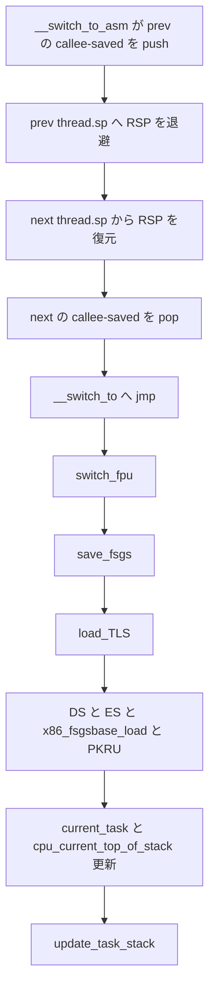

# 第21章 `__switch_to_asm` と `__switch_to`

> 本章で読むソース
>
> - [`arch/x86/entry/entry_64.S` L177-L217](https://github.com/gregkh/linux/blob/v6.18.38/arch/x86/entry/entry_64.S#L177-L217)
> - [`arch/x86/include/asm/switch_to.h` L19-L52](https://github.com/gregkh/linux/blob/v6.18.38/arch/x86/include/asm/switch_to.h#L19-L52)
> - [`arch/x86/include/asm/switch_to.h` L69-L79](https://github.com/gregkh/linux/blob/v6.18.38/arch/x86/include/asm/switch_to.h#L69-L79)
> - [`arch/x86/kernel/process_64.c` L611-L677](https://github.com/gregkh/linux/blob/v6.18.38/arch/x86/kernel/process_64.c#L611-L677)
> - [`arch/x86/include/asm/fpu/sched.h` L32-L53](https://github.com/gregkh/linux/blob/v6.18.38/arch/x86/include/asm/fpu/sched.h#L32-L53)

## この章の狙い

コンテキストスイッチの低レベル部分が `__switch_to_asm` と `__switch_to` の二段構成であることを押さえる。
次タスクの選択と scheduler locking は sched 分冊へ委譲し、ここではスタック切替、callee-saved register、per-CPU `current`、TSS sp0 の扱いを追う。

## 前提

[第2章](../part00-foundation/02-gdt-tss-cpu-entry-area.md) で TSS と `cpu_entry_area` を読んでいること。
[第22章](22-fs-gs-tls-copy-thread.md) の FS/GS/TLS、[第23章](23-fpu-xsave.md) の FPU は `__switch_to` 内で呼ばれるが、本章では呼び出し順序と位置づけにとどめる。

## 二段構成と switch_to マクロ

`switch_to` マクロは `__switch_to_asm` だけを呼ぶ。
アセンブリがスタックと callee-saved register を切り替えたあと `jmp __switch_to` で C 側へ入る。

[`arch/x86/include/asm/switch_to.h` L49-L52](https://github.com/gregkh/linux/blob/v6.18.38/arch/x86/include/asm/switch_to.h#L49-L52)

```c
#define switch_to(prev, next, last)					\
do {									\
	((last) = __switch_to_asm((prev), (next)));			\
} while (0)
```

`inactive_task_frame` のフィールド順は `__switch_to_asm` の push/pop 順と一致しなければならない。

[`arch/x86/include/asm/switch_to.h` L19-L42](https://github.com/gregkh/linux/blob/v6.18.38/arch/x86/include/asm/switch_to.h#L19-L42)

```c
/*
 * This is the structure pointed to by thread.sp for an inactive task.  The
 * order of the fields must match the code in __switch_to_asm().
 */
struct inactive_task_frame {
#ifdef CONFIG_X86_64
	unsigned long r15;
	unsigned long r14;
	unsigned long r13;
	unsigned long r12;
#else
	unsigned long flags;
	unsigned long si;
	unsigned long di;
#endif
	unsigned long bx;

	/*
	 * These two fields must be together.  They form a stack frame header,
	 * needed by get_frame_pointer().
	 */
	unsigned long bp;
	unsigned long ret_addr;
};
```

## __switch_to_asm のスタック切替

`__switch_to_asm` は RBP、RBX、R12〜R15 を prev のカーネルスタックへ push する。
RSP を `prev->thread.sp` へ書き、`next->thread.sp` から RSP を読み直して next のスタックへ移る。
next 側の callee-saved を pop したあと `jmp __switch_to` する。

[`arch/x86/entry/entry_64.S` L177-L217](https://github.com/gregkh/linux/blob/v6.18.38/arch/x86/entry/entry_64.S#L177-L217)

```asm
SYM_FUNC_START(__switch_to_asm)
	ANNOTATE_NOENDBR
	/*
	 * Save callee-saved registers
	 * This must match the order in inactive_task_frame
	 */
	pushq	%rbp
	pushq	%rbx
	pushq	%r12
	pushq	%r13
	pushq	%r14
	pushq	%r15

	/* switch stack */
	movq	%rsp, TASK_threadsp(%rdi)
	movq	TASK_threadsp(%rsi), %rsp
	// ... (中略) ...
	/* restore callee-saved registers */
	popq	%r15
	popq	%r14
	popq	%r13
	popq	%r12
	popq	%rbx
	popq	%rbp

	jmp	__switch_to
SYM_FUNC_END(__switch_to_asm)
```

x86-64 の System V ABI では RAX、RCX、RDX、RSI、RDI、R8〜R11 は caller-saved である。
`__switch_to_asm` が保存するのは callee-saved だけであり、caller-saved は C の呼び出し規約に委ねられる。

## __switch_to の処理順

`__switch_to` は FPU 保存、FS/GS 退避、TLS ロード、セグメントと FS/GS base、PKRU を済ませてから `current` と `cpu_current_top_of_stack` を更新する。
FPU や FS/GS の切替を `current` 更新の後に置かない。
先頭の `switch_fpu` は old タスクの FPU を `fpstate` へ退避し `TIF_NEED_FPU_LOAD` を立てる（詳細は第23章）。

[`arch/x86/include/asm/fpu/sched.h` L32-L53](https://github.com/gregkh/linux/blob/v6.18.38/arch/x86/include/asm/fpu/sched.h#L32-L53)

```c
static inline void switch_fpu(struct task_struct *old, int cpu)
{
	if (!test_tsk_thread_flag(old, TIF_NEED_FPU_LOAD) &&
	    cpu_feature_enabled(X86_FEATURE_FPU) &&
	    !(old->flags & (PF_KTHREAD | PF_USER_WORKER))) {
		struct fpu *old_fpu = x86_task_fpu(old);

		set_tsk_thread_flag(old, TIF_NEED_FPU_LOAD);
		save_fpregs_to_fpstate(old_fpu);
		// ... (中略) ...
		old_fpu->last_cpu = cpu;
	}
}
```

[`arch/x86/kernel/process_64.c` L611-L677](https://github.com/gregkh/linux/blob/v6.18.38/arch/x86/kernel/process_64.c#L611-L677)

```c
__switch_to(struct task_struct *prev_p, struct task_struct *next_p)
{
	struct thread_struct *prev = &prev_p->thread;
	struct thread_struct *next = &next_p->thread;
	int cpu = smp_processor_id();
	// ... (中略) ...
	switch_fpu(prev_p, cpu);

	/* We must save %fs and %gs before load_TLS() because
	 * %fs and %gs may be cleared by load_TLS().
	 *
	 * (e.g. xen_load_tls())
	 */
	save_fsgs(prev_p);

	/*
	 * Load TLS before restoring any segments so that segment loads
	 * reference the correct GDT entries.
	 */
	load_TLS(next, cpu);
	// ... (中略) ...
	savesegment(es, prev->es);
	if (unlikely(next->es | prev->es))
		loadsegment(es, next->es);

	savesegment(ds, prev->ds);
	if (unlikely(next->ds | prev->ds))
		loadsegment(ds, next->ds);

	x86_fsgsbase_load(prev, next);

	x86_pkru_load(prev, next);

	/*
	 * Switch the PDA and FPU contexts.
	 */
	raw_cpu_write(current_task, next_p);
	raw_cpu_write(cpu_current_top_of_stack, task_top_of_stack(next_p));

	/* Reload sp0. */
	update_task_stack(next_p);

	switch_to_extra(prev_p, next_p);
	// ... (中略) ...
	return prev_p;
}
```

## TSS sp0 と cpu_current_top_of_stack

x86-64 では `update_task_stack` は通常何もしない。
コメントどおり sp0 は entry trampoline stack を指す定数であり、FRED 無効かつ Xen PV のときだけ `load_sp0` で `task_top_of_stack` を設定する。
「`__switch_to` が一般に TSS sp0 を更新する」とは書けない。

[`arch/x86/include/asm/switch_to.h` L69-L79](https://github.com/gregkh/linux/blob/v6.18.38/arch/x86/include/asm/switch_to.h#L69-L79)

```c
static inline void update_task_stack(struct task_struct *task)
{
	/* sp0 always points to the entry trampoline stack, which is constant: */
#ifdef CONFIG_X86_32
	this_cpu_write(cpu_tss_rw.x86_tss.sp1, task->thread.sp0);
#else
	if (!cpu_feature_enabled(X86_FEATURE_FRED) && cpu_feature_enabled(X86_FEATURE_XENPV))
		/* Xen PV enters the kernel on the thread stack. */
		load_sp0(task_top_of_stack(task));
#endif
}
```

`cpu_current_top_of_stack` は割り込みやシステムコール入口がスタックを切り替えるときの参照先である。
`__switch_to` は `current_task` と同時にここを更新する。

## 処理フロー



## 高速化と最適化の工夫

`__switch_to_asm` は callee-saved register だけを保存し、caller-saved は C ABI に委ねる。
切替のたびに全レジスタを退避せずに済む。

RSP の付け替えを軸にスタックを切り替えるため、実行文脈の大半がスタック上のフレームと callee-saved の入れ替えだけで移る。
DS と ES の load は新旧どちらかが非ゼロのときだけ行うなど、C 側でも不要なセグメントロードを避ける分岐がある。

## まとめ

- コンテキストスイッチの低レベルは `__switch_to_asm` と `__switch_to` の二段である。
- `__switch_to_asm` は callee-saved を保存し RSP を `thread.sp` で付け替えてから `__switch_to` へ jmp する。
- `__switch_to` は switch_fpu、save_fsgs、load_TLS、セグメントと FS/GS、PKRU のあと current を更新する。
- x86-64 の `update_task_stack` は通常 sp0 を変えず、Xen PV 例外時だけ `load_sp0` する。
- `cpu_current_top_of_stack` は entry 経路のスタック先として `current` と同時に更新される。

## 関連する章

- [GDT と TSS とセグメント記述子と cpu_entry_area](../part00-foundation/02-gdt-tss-cpu-entry-area.md)
- [FS と GS と TLS と copy_thread](22-fs-gs-tls-copy-thread.md)
- [FPU と SIMD XSAVE と条件付き復元](23-fpu-xsave.md)
